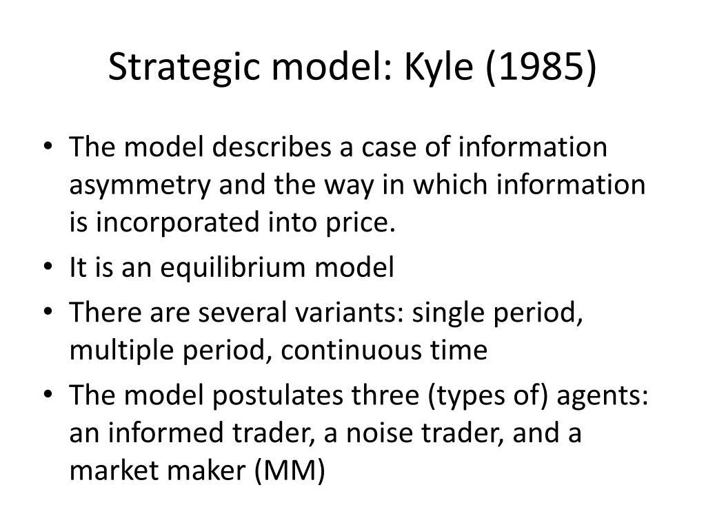

In algorithmic trading, the adoption of innovative strategies like Kyle's Lambda can lead to enhanced trading success. Named after economist Albert S. Kyle, Kyle's Lambda is a crucial metric used to quantify the market impact of sizable trades. By calculating the relationship between order sizes and resulting price changes, it provides insights into how large trades will influence market prices. Understanding this relationship enables traders to make more cost-effective decisions by anticipating the potential costs associated with market impact.

This article investigates the theoretical and practical applications of Kyle's Lambda within trading contexts, offering a comprehensive overview of its significance. Incorporating Kyle's Lambda into trading models allows traders to develop a keen sense of how trades might disturb the market, thereby optimizing execution strategies to minimize costs and maximize efficiency. Knowledge of Kyle's Lambda can offer traders a competitive advantage, enabling them to outperform by refining their strategies for trading in various market conditions.



While the use of Kyle's Lambda presents notable advantages, it also comes with inherent challenges. Estimating the metric accurately requires a thorough understanding of liquidity, market conditions, and historical data. Despite these challenges, the benefits of leveraging Kyle's Lambda in trading systems cannot be overstated. It enhances decision-making processes and contributes to more informed and successful trading strategies. By exploring Kyle's Lambda, traders can better navigate the complexities of algorithmic trading and improve their overall trading performance.

## Table of Contents

## Understanding Kyle's Lambda

Kyle's Lambda is a crucial concept in trading introduced by economist Albert S. Kyle in 1985. It serves as a metric for measuring the market impact cost associated with trade orders. This metric is essential for understanding how price movements correspond to the size of the order, which in turn helps predict market reactions to large trades. The relationship between price change ($\Delta P$) and trade size ($Q$) is expressed through the formula:

$$
\Delta P = \lambda \cdot Q
$$

Here, $\lambda$ is Kyle's Lambda, a coefficient representing the market's sensitivity to order sizes.

Institutional investors rely on Kyle's Lambda to anticipate potential market disturbances and to minimize transaction costs by understanding the implications of their large trade orders. The metric offers insights into the [liquidity](/wiki/liquidity-risk-premium) of an asset, as well as the broader market conditions, which are both pivotal in analyzing how a particular order might affect the price.

Accurately interpreting Kyle's Lambda requires a comprehensive understanding of several factors, including liquidity, order size, and prevailing market conditions. Traders and algorithm developers take these factors into account by evaluating historical market data. By doing so, they can estimate and calibrate the Lambda metric more accurately, which is crucial for devising trading strategies that are both efficient and cost-effective.

Python is often used in computational finance to work with Kyle's Lambda, as it allows for the manipulation and analysis of large datasets required for this modeling. For instance, a simple Python script might involve retrieving historical trade data, calculating the corresponding price changes, and then using these to estimate the Lambda for a given stock or asset.

By incorporating Kyle's Lambda into their analyses, traders can better manage the impact of their orders on the market, making informed decisions that reduce unnecessary costs and improve trading performance.

## The Role of Kyle's Lambda in Algorithmic Trading

Kyle's Lambda serves a pivotal role in [algorithmic trading](/wiki/algorithmic-trading) by enhancing both efficiency and minimizing costs associated with executing large trade orders. This metric is instrumental in providing real-time adjustments to trading strategies by quantifying the market impact costs, which often result from large trades affecting market prices. By integrating Kyle's Lambda into their models, traders gain valuable insights into whether to execute trades rapidly or distribute them over time to avoid incurring unnecessary costs due to price slippage.

The understanding of market microstructure—analyzing the fine details of market movements and behaviors—is crucial in honing strategies that align closely with financial goals. Traders use Kyle's Lambda to make informed decisions that align with the complexities of micro-level market interactions, ensuring that execution strategies are not only cost-effective but also in tune with the structural nuances of the market.

Sophisticated models are tailored to utilize historical trade data effectively, offering predictive insights on market dynamics through advanced statistical and econometric methods. These models employ historical datasets to calibrate and enhance the predictive power of Kyle's Lambda, thus helping traders anticipate the potential impact of large orders on the market. By including diverse market variables and conditions in these models, the reliability and accuracy of predictions concerning market impact costs are significantly improved.

Incorporating Kyle’s Lambda in algorithmic trading systems equips these systems with heightened adaptability, particularly in volatile market environments. As market conditions rapidly fluctuate, the ability to dynamically adjust trading strategies in response to real-time data ensures that execution is both timely and efficient. This adaptability is increasingly vital in a trading landscape that is not only continuously evolving but also increasingly driven by data-centric strategies.

Ultimately, Kyle's Lambda empowers traders by providing a foundational metric to guide execution decisions, optimize costs, and maintain strategic agility amidst market [volatility](/wiki/volatility-trading-strategies). Its implementation within trading models underscores the necessity of integrating market impact considerations into the core of algorithmic decision-making processes.

## Implementing Kyle's Lambda in Trading Models

Implementing Kyle's Lambda into trading models requires a detailed understanding of the relationship between order sizes and price movements. This involves several critical steps to ensure accurate representation and application within algorithmic trading systems.

Data acquisition is the foundational step in estimating Kyle's Lambda. Accurate data on past trades, including order sizes and the corresponding price changes, must be gathered to calculate this metric effectively. This data forms the backbone for understanding how varying trade sizes can influence market prices.

Preprocessing historical trade data is necessary to maintain consistency and accuracy in calculations. This involves cleaning the data to remove outliers or erroneous entries, normalizing it to ensure uniformity, and aligning it with relevant market conditions. By standardizing the input data, traders can ensure that the calculations for Kyle's Lambda reflect genuine market dynamics rather than anomalies.

Python, a versatile programming language, can be utilized to program Kyle's Lambda into an algorithmic trading system. By leveraging Python’s powerful libraries and tools, traders can implement complex computations and real-time data analysis. A sample Python implementation could involve using libraries like NumPy for mathematical operations and pandas for data manipulation. A basic snippet might look as follows:

```python
import numpy as np
import pandas as pd

# Example data structure
trade_data = pd.DataFrame({
    'order_size': [100, 150, 200],
    'price_change': [0.5, 0.75, 1.0]
})

# Calculating Kyle's Lambda
trade_data['lambda'] = trade_data['price_change'] / trade_data['order_size']
lambda_value = trade_data['lambda'].mean()

print(f"Estimated Kyle's Lambda: {lambda_value}")
```

Sophisticated modeling is also essential to mirror real-time market conditions accurately. This requires integrating live data feeds and continuously updating the model parameters to adapt to market trends. Artificial intelligence and [machine learning](/wiki/machine-learning) techniques can further enhance these models, allowing them to learn from new data and improve the accuracy of their predictions.

Trading models incorporating Kyle's Lambda often adjust to break down trades into smaller segments. This strategy aims to reduce the adverse price impacts associated with large, single trades. By spreading out a large order over a period, the model minimizes the potential market disruption and the cost associated with price slippage.

In conclusion, implementing Kyle's Lambda into trading models involves meticulous data preparation and sophisticated computational techniques. These enable algorithmic trading systems to anticipate and minimize market impacts effectively, thereby ensuring more efficient trade executions.

## Benefits and Challenges

Kyle's Lambda serves as a vital tool for traders focused on estimating and mitigating the impacts of large trade orders, thereby enhancing trading performance. By quantifying the market impact cost, it helps manage execution costs and reduce slippage, which can be significant hurdles during substantial trades. The metric improves the precision of execution strategies, enabling traders to make well-informed decisions that align more closely with desired financial outcomes.

However, accurately estimating market impacts using Kyle's Lambda presents its own challenges, mostly due to the dynamic nature of market conditions. Markets are continuously affected by a complex interplay of factors, which results in non-linear and often unpredictable price movements. Therefore, traders must employ a robust analytical framework to adapt to evolving scenarios. This framework should allow for adjustments based on new information, ensuring the trading model remains relevant and effective.

Machine learning models offer promising solutions to the issue of impact prediction accuracy. By processing large datasets and identifying patterns that may not be immediately apparent, these models can refine the accuracy of impact predictions over time. With continuous learning and adaptation, machine learning algorithms enhance the precision of Kyle's Lambda estimations, allowing for more reliable predictions of market impacts.

Incorporating Kyle's Lambda into trading systems not only enhances decision-making processes but also ensures effective execution strategies. As understanding market impact becomes increasingly critical in algorithmic trading, the ability to estimate these effects accurately gives traders a competitive edge. The emphasis on precision and adaptability in trading models is crucial for maintaining cost-effectiveness and maximizing performance in fluctuating markets.

In summary, Kyle's Lambda is invaluable for managing execution costs and reducing slippage, although it requires accurate estimation and adaptation to dynamic market environments. Leveraging advanced analytical tools and machine learning models can significantly augment its utility and effectiveness in contemporary trading systems.

## Conclusion

Kyle's Lambda is pivotal in curbing execution costs and enhancing trading performance in markets characterized by price fluctuations associated with large trade orders. By evaluating how trade sizes influence price changes, Kyle's Lambda helps traders anticipate market impacts, offering a significant competitive advantage. This advantage is particularly valuable in environments demanding precise and efficient trading strategies.

In a landscape increasingly dictated by data, models like Kyle's Lambda are indispensable. They have adapted over time, integrating new data-driven insights to improve accuracy in quantifying market impact. As trading systems become more sophisticated, the role of data processing and analysis becomes crucial. Technological advancements in data handling allow for more refined applications of Kyle's Lambda, enabling traders to reduce adverse market impacts effectively.

Traders who leverage the latest developments in algorithmic trading are well-positioned to capitalize on these evolving methodologies. Incorporating cutting-edge strategies into trading practices not only enhances decision-making processes but also ensures the effective execution of trades. Staying updated with the latest trends in algorithmic trading is essential for maintaining a competitive edge, as it allows traders to adapt to rapid changes in market dynamics and technological innovations. 

The continuous evolution of Kyle's Lambda underscores its relevance in modern trading systems, providing traders with the tools necessary to navigate complex and volatile markets efficiently.

## References & Further Reading

[1]: Kyle, A. S. (1985). ["Continuous Auctions and Insider Trading."](https://personal.utdallas.edu/~nina.baranchuk/Fin7310/papers/Kyle1985.pdf) Econometrica: Journal of the Econometric Society, 53(6), 1315-1335.

[2]: Rosenbaum, M., & Gatheral, J. (2018). ["The Volatility Surface: A Practitioner's Guide."](https://arxiv.org/abs/1410.3394) Oxford University Press.

[3]: O'Hara, M. (1995). ["Market Microstructure Theory."](https://openlibrary.org/books/OL1103097M/Market_microstructure_theory) Blackwell Publishing.

[4]: Hasbrouck, J. (2007). ["Empirical Market Microstructure: The Institutions, Economics, and Econometrics of Securities Trading."](https://academic.oup.com/book/52241) Oxford University Press.

[5]: Almgren, R., & Chriss, N. (2000). ["Optimal execution of portfolio transactions."](https://smallake.kr/wp-content/uploads/2016/03/optliq.pdf) Journal of Risk, 3(2), 5-39.

[6]: Jansen, S. (2018). ["Machine Learning for Algorithmic Trading: Predictive models to extract signals from market and alternative data for systematic trading strategies with Python."](https://github.com/stefan-jansen/machine-learning-for-trading) Packt Publishing.

[7]: Chan, E. P. (2009). ["Quantitative Trading: How to Build Your Own Algorithmic Trading Business."](https://github.com/egorpe/EPChan-QuantitativeTrading/blob/master/example7_6.m) Wiley Trading.