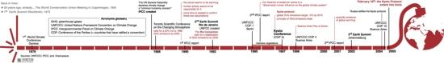

## Table of Contents

## What is the Kyoto Protocol?

The Kyoto Protocol is an international agreement that was made to help reduce greenhouse gas emissions. It was adopted in Kyoto, Japan, in 1997. The main goal of the Kyoto Protocol is to fight climate change by getting countries to lower the amount of harmful gases they release into the air. Many countries agreed to this protocol, but they had different targets for reducing their emissions based on their specific situations.

The Kyoto Protocol works by setting specific targets for industrialized countries to cut their emissions of six main greenhouse gases. These targets are measured over a period of time, usually five years. Countries that joined the agreement promised to meet these targets by using cleaner technology, improving energy efficiency, and taking other steps to reduce pollution. If a country couldn't meet its target, it could buy credits from other countries that had exceeded their targets. This system encouraged countries to do more than they had to, knowing they could sell extra credits.

The Kyoto Protocol was a big step forward in global efforts to address climate change. It showed that countries could come together and agree on ways to protect the environment. However, not all countries joined the agreement, and some felt that the targets were not strict enough. The Kyoto Protocol ended in 2020, but it led to the creation of the Paris Agreement, which is a newer and broader effort to tackle climate change.

## When was the Kyoto Protocol adopted?

The Kyoto Protocol was adopted in 1997 in Kyoto, Japan. It is an agreement between many countries to try to reduce the amount of greenhouse gases they produce. These gases can harm the environment and cause climate change.

The main goal of the Kyoto Protocol was to get countries to work together to lower their emissions. Each country had its own target to meet, based on what they could do. The agreement lasted until 2020, but it helped lead to the Paris Agreement, which is a newer plan to fight climate change.

## What are the main objectives of the Kyoto Protocol?

The main goal of the Kyoto Protocol is to help slow down climate change by reducing the amount of greenhouse gases that countries release into the air. Greenhouse gases, like carbon dioxide, trap heat in the atmosphere and can make the Earth warmer. The Kyoto Protocol was made because many countries realized that they needed to work together to lower these emissions. Each country that joined the agreement had to agree to specific targets for reducing their emissions. These targets were different for each country, depending on their situation.

The Kyoto Protocol also set up a system where countries could trade emission credits. If a country managed to reduce its emissions more than it needed to, it could sell the extra reductions to other countries that were struggling to meet their targets. This encouraged countries to do even better than they had to, knowing they could earn credits to sell. The agreement was a big step forward in getting countries to work together on climate change, even though not all countries joined and some thought the targets were not strict enough. The Kyoto Protocol ended in 2020, but it helped lead to the Paris Agreement, which is a newer plan to fight climate change.

## Which countries are parties to the Kyoto Protocol?

The Kyoto Protocol was joined by many countries around the world. Some of the countries that signed the agreement include Japan, Canada, Australia, and many countries in Europe like France, Germany, and the United Kingdom. Also, many countries in South America, Africa, and Asia joined the agreement. In total, more than 190 countries became part of the Kyoto Protocol.

However, not all countries joined the Kyoto Protocol. One big country that did not sign the agreement was the United States. Some other countries that did not join include Andorra, Brunei, and the Vatican City. Even though many countries were part of the Kyoto Protocol, the ones that did not join had a big impact on the overall effort to reduce greenhouse gas emissions.

## What are the key features of the Kyoto Protocol?

The Kyoto Protocol is an agreement that many countries made to help reduce the amount of greenhouse gases they release into the air. These gases can trap heat and cause climate change, so the goal of the Kyoto Protocol was to slow down this process. Each country that joined had to agree to specific targets for reducing their emissions. These targets were different for each country, depending on their situation. For example, some countries had to reduce their emissions by a certain percentage over a period of time, usually five years.

Another important feature of the Kyoto Protocol was the system for trading emission credits. If a country managed to reduce its emissions more than it needed to, it could sell the extra reductions to other countries that were struggling to meet their targets. This encouraged countries to do even better than they had to, knowing they could earn credits to sell. The Kyoto Protocol ended in 2020, but it helped lead to the Paris Agreement, which is a newer plan to fight climate change.

## How does the Kyoto Protocol address greenhouse gas emissions?

The Kyoto Protocol is an agreement between many countries to help reduce the amount of greenhouse gases they release into the air. These gases, like carbon dioxide, trap heat in the atmosphere and can make the Earth warmer, leading to climate change. The main way the Kyoto Protocol addresses this is by setting specific targets for each country that joined the agreement. Each country had to agree to lower their emissions by a certain amount over a period of time, usually five years. These targets were different for each country, depending on their situation.

Another important part of the Kyoto Protocol is the system for trading emission credits. If a country managed to reduce its emissions more than it needed to, it could sell the extra reductions to other countries that were struggling to meet their targets. This encouraged countries to do even better than they had to, knowing they could earn credits to sell. The Kyoto Protocol was a big step forward in getting countries to work together on climate change, even though not all countries joined and some thought the targets were not strict enough.

## What are the different commitment periods under the Kyoto Protocol?

The Kyoto Protocol had two main commitment periods. The first commitment period started in 2008 and ended in 2012. During this time, countries that joined the agreement had to work on reducing their greenhouse gas emissions. Each country had its own target to meet, based on what they could do. For example, some countries had to reduce their emissions by a certain percentage over these five years.

The second commitment period of the Kyoto Protocol started in 2013 and ended in 2020. This period was set up because the first one ended, and countries wanted to keep working on reducing emissions. Not all countries that were part of the first period joined the second one, but those that did had new targets to meet. The second commitment period helped keep the effort going until the Kyoto Protocol ended in 2020.

## How has the Kyoto Protocol evolved since its adoption?

Since its adoption in 1997, the Kyoto Protocol has gone through several changes. The first big change happened when the first commitment period started in 2008 and ended in 2012. During this time, countries that joined the agreement had to work on reducing their greenhouse gas emissions. Each country had its own target to meet, based on what they could do. For example, some countries had to reduce their emissions by a certain percentage over these five years. This period was important because it was the first time many countries worked together to fight climate change.

After the first commitment period ended, the Kyoto Protocol moved into a second commitment period from 2013 to 2020. This period was set up because the first one ended, and countries wanted to keep working on reducing emissions. Not all countries that were part of the first period joined the second one, but those that did had new targets to meet. The second commitment period helped keep the effort going until the Kyoto Protocol ended in 2020. Even though the Kyoto Protocol ended, it led to the creation of the Paris Agreement, which is a newer and broader effort to tackle climate change.

## What were the outcomes of the Kyoto Protocol's first commitment period?

The first commitment period of the Kyoto Protocol lasted from 2008 to 2012. During this time, many countries worked hard to meet their targets for reducing greenhouse gas emissions. Some countries did a good job and managed to lower their emissions by the amount they promised. For example, countries in the European Union used cleaner technology and better energy efficiency to meet their targets. However, not all countries were successful. Some countries found it hard to reduce their emissions as much as they had promised. This showed that fighting climate change is a big challenge and that countries need to keep working together.

Overall, the first commitment period of the Kyoto Protocol was important because it was the first time many countries came together to try to slow down climate change. It helped show what countries could do to reduce their emissions and what problems they might face. Even though not all countries met their targets, the effort helped lead to the second commitment period and later to the Paris Agreement. The Kyoto Protocol's first commitment period was a big step forward in global efforts to protect the environment.

## What challenges did the Kyoto Protocol face during its implementation?

The Kyoto Protocol faced many challenges during its implementation. One big challenge was that not all countries joined the agreement. For example, the United States, which is a big country with a lot of emissions, did not sign the Kyoto Protocol. This made it harder to reach the overall goal of reducing greenhouse gases because a major contributor was not part of the effort. Also, some countries that did join found it hard to meet their targets. They had to change how they used energy and technology, which was not always easy or cheap.

Another challenge was that the targets set by the Kyoto Protocol were not strict enough for some people. They thought that the agreement did not go far enough to fight climate change. There were also problems with the system for trading emission credits. Some countries used this system to meet their targets without actually reducing their emissions, which was not the main goal of the agreement. Despite these challenges, the Kyoto Protocol was important because it showed that countries could work together to try to protect the environment.

## How does the Kyoto Protocol relate to other international climate agreements?

The Kyoto Protocol is an important part of the bigger effort to fight climate change. It was the first big agreement where many countries promised to work together to lower their greenhouse gas emissions. The Kyoto Protocol helped show that countries could agree on ways to protect the environment. It set the stage for other agreements by showing what could be done and what challenges might come up. For example, the Kyoto Protocol led to the creation of the Paris Agreement, which is a newer and broader effort to tackle climate change.

The Paris Agreement, which started in 2016, built on the work of the Kyoto Protocol. While the Kyoto Protocol focused on setting specific targets for industrialized countries, the Paris Agreement includes almost every country in the world. It asks each country to set its own goals for reducing emissions and to work together to keep global warming below dangerous levels. The Kyoto Protocol ended in 2020, but its efforts and lessons helped shape the Paris Agreement, making it a key step in the ongoing fight against climate change.

## What is the current status of the Kyoto Protocol and its impact on global climate policy?

The Kyoto Protocol ended in 2020, but it had a big impact on how countries work together to fight climate change. It was the first time many countries agreed to lower their greenhouse gas emissions. Each country had its own target to meet, based on what they could do. Some countries met their targets, while others found it hard. The Kyoto Protocol showed that countries could work together to try to protect the environment, even though not all countries joined and some thought the targets were not strict enough.

Even though the Kyoto Protocol is over, its efforts helped lead to the Paris Agreement. The Paris Agreement is a newer plan that includes almost every country in the world. It asks each country to set its own goals for reducing emissions and to work together to keep global warming below dangerous levels. The Kyoto Protocol was important because it showed what could be done and what challenges might come up. It helped set the stage for the Paris Agreement, making it a key step in the ongoing fight against climate change.

## References & Further Reading

1. UNFCCC, Paris Agreement, 2015. ["Paris Agreement."](https://unfccc.int/process-and-meetings/the-paris-agreement)

2. European Commission, EU ETS. ["EU Emissions Trading System (EU ETS)."](https://climate.ec.europa.eu/eu-action/eu-emissions-trading-system-eu-ets_en)

3. Schwab, K. (2016). ["The Fourth Industrial Revolution."](https://www.weforum.org/about/the-fourth-industrial-revolution-by-klaus-schwab/) Crown Business.

4. Montini, Massimiliano (2010). ["The Kyoto Protocol: Economic Assessments, Implementation Mechanisms, and Policy Issues."](https://link.springer.com/book/9789067042284) In: Fighting Climate Change: An Human Rights Based Approach. Springer.

5. Gosh, Arunabha, and Woods, JP. (2009). ["Developing Countries and Preferential Access in Climate Policy."](https://scholar.google.com/citations?user=RjOcvKQAAAAJ) Oxford Institute for Energy Studies.

6. Buchner, Barbara K. and R. David Victora (2006). ["Environmental and Climate Change Policy in the European Union."](https://assets.cambridge.org/97805211/82621/frontmatter/9780521182621_frontmatter.pdf) Springer.

7. Steffen, W., Rockström, J., Richardson, K., Lenton, T. M., Folke, C., Liverman, D., ... & Schellnhuber, H. J. (2018). ["Trajectories of the Earth System in the Anthropocene."](https://pubmed.ncbi.nlm.nih.gov/30082409/) Proceedings of the National Academy of Sciences, 115(33), 8252-8259.

8. Agarwal, N., & Rathod, N. (2019). ["Algorithmic Trading in the Stock Market: Benefits & Challenges."](https://www.researchgate.net/publication/378548435_Algorithmic_Trading_and_AI_A_Review_of_Strategies_and_Market_Impact) International Journal of Engineering Research and Technology, 8(4).

9. Pedersen, Lasse Heje (2021). ["Efficiently Inefficient: How Smart Money Invests and Market Prices Are Determined,"](https://www.amazon.com/Efficiently-Inefficient-Invests-Market-Determined/dp/0691166196) Princeton University Press.