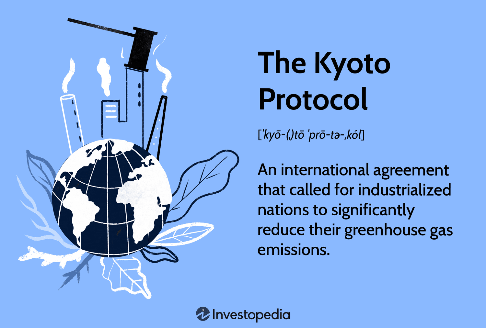

The Kyoto Protocol represents a significant milestone in the international community's response to climate change, marking a concerted effort to address the global reduction of greenhouse gas emissions. Adopted in 1997 and entering into force in 2005, the protocol set legally binding targets for developed countries to reduce their emissions. This agreement not only underscored the severity of environmental degradation but also highlighted the importance of international cooperation in formulating and implementing effective sustainability measures.

Understanding the Kyoto Protocol's impact on environmental policy offers valuable insights into the mechanisms through which nations can collectively drive sustainability efforts. The protocol paved the way for subsequent climate agreements, demonstrating the potential for international frameworks to guide ambitious emission reduction targets and foster collaborative environmental stewardship. Such frameworks have shown that when countries unite around a common goal, meaningful progress in combating climate change can be achieved.

In recent years, industries have increasingly turned to technology-driven strategies, like algorithmic trading, to enhance operational efficiency and outcomes. Traditionally associated with financial markets, algorithmic trading is now making inroads into environmental markets, particularly in optimizing carbon trading and facilitating renewable energy transactions. This convergence of environmental policy and algorithmic innovations suggests the potential for improved market efficiencies, transparency, and execution of sustainability initiatives.

This article examines the intersections among climate agreements like the Kyoto Protocol, evolving environmental policies, and the emerging role of algorithmic trading. Recognizing and leveraging the synergies between these domains are critical for advancing global sustainability efforts. By integrating innovative approaches rooted in technology with established policy frameworks, there is an opportunity to accelerate progress toward mitigating climate change. As the urgency to address environmental challenges intensifies, the solutions that combine political commitment, regulatory frameworks, and technological advancements will be pivotal in achieving long-term sustainability objectives.

## Table of Contents

## Understanding the Kyoto Protocol

The Kyoto Protocol, adopted in 1997 and entering into force in 2005, represents a landmark in international efforts to combat global warming. It was the first major international agreement to impose legally binding obligations on developed countries to reduce their emissions of greenhouse gases. Under the Protocol, industrialized nations committed to specific targets for reducing emissions of critical pollutants, including carbon dioxide (CO2), methane (CH4), and nitrous oxide (N2O), among others. By legally binding these nations to emission reduction targets, the Protocol sought to hold them accountable and ensure a collective effort towards mitigating climate change.

At its core, the Kyoto Protocol established several key frameworks that continue to underpin global climate policy. One of the most significant features is the division of countries into Annex I (developed countries) and non-Annex I (developing countries) parties, with binding commitments applying primarily to Annex I nations. This differentiation acknowledged the varying capabilities and responsibilities of countries, laying the groundwork for a principle known as "common but differentiated responsibilities," a concept later reaffirmed in subsequent agreements such as the Paris Agreement.

Another important aspect of the Kyoto Protocol is the introduction of market-based mechanisms designed to aid countries in achieving their emission reduction targets. These mechanisms include International Emissions Trading, the Clean Development Mechanism (CDM), and Joint Implementation (JI). By facilitating the trading of emissions allowances and credits, these systems aimed to provide cost-effective strategies for reducing global emissions. For example, the CDM allowed developed countries to invest in emission-reducing projects in developing nations and receive credits in return, promoting sustainable development and technology transfer.

The Protocol's impact extended beyond environmental legislation, fostering greater international cooperation and setting a precedent for future climate agreements. It spurred many countries to enact domestic policies aimed at emissions reduction, encouraged technological innovation, and laid a foundation for subsequent global initiatives. The establishment of a binding international regime helped catalyze a shift in both political and public perceptions of climate change, emphasizing the need for urgent and collective action.

As a precursor to later climate agreements, the Kyoto Protocol played a crucial role in shaping the global emission reduction efforts seen today. By compelling countries to confront their greenhouse gas emissions and adopt sustainable practices, it was instrumental in propelling the international community toward more comprehensive and ambitious climate action. Despite its limitations and challenges, the Protocol remains a significant chapter in international environmental policy, providing valuable lessons for the future of climate governance.

## Environmental Policy Developments Post-Kyoto

Since the signing of the Kyoto Protocol in 1997, international environmental policies have experienced significant developments, reflecting the urgency and complexity of managing climate change. One of the most notable advancements following the Kyoto Protocol was the adoption of the Paris Agreement in 2015. Unlike its predecessor, the Paris Agreement embraced a more inclusive and flexible approach by calling on all participating countries—not only developed nations—to commit to climate action through nationally determined contributions (NDCs). This shift marked a significant evolution in global climate governance, promoting a more cooperative and bottom-up structure to climate commitments [1].

The years following the Kyoto Protocol saw the emergence of regional initiatives aimed at bolstering global climate efforts. For instance, the European Union (EU) implemented the Emissions Trading System (ETS), intended to cap and trade carbon emissions among member states to incentivize reductions. Other regional initiatives, such as the Regional Greenhouse Gas Initiative in the Northeastern United States, have complemented the larger framework of international climate agreements by addressing specific regional needs and capacities, thereby sustaining global efforts through localized action [2].

To effectively address the multifaceted challenges posed by climate change, there has been a growing emphasis on integrating technology and data analytics in environmental policymaking. The employment of advanced technologies, including [machine learning](/wiki/machine-learning) and big data analytics, offers enhanced capabilities for climate modeling, risk assessment, and emissions tracking. This integration facilitates better-informed decision-making and enables policymakers to develop targeted interventions that can quickly respond to environmental changes. By enabling precise monitoring and predictive analytics, these technological innovations improve the efficiency and responsiveness of climate policy [3].

The shifts in environmental policy post-Kyoto highlight the ongoing evolution and continuity of global climate governance strategies. The recognition of climate change as a dynamic and complex issue necessitates policies that are adaptable and resilient. This means embracing a variety of approaches—from market-based mechanisms like carbon pricing to non-market-based strategies like technology transfer and sustainable development initiatives. These policies collectively reinforce the necessity for international cooperation that balances immediate action with long-term sustainability goals.

References:
1. UNFCCC, Paris Agreement, 2015. https://unfccc.int/sites/default/files/english_paris_agreement.pdf
2. European Commission, EU ETS. https://ec.europa.eu/clima/eu-action/eu-emissions-trading-system-eu-ets_en
3. Schwab, K., The Fourth Industrial Revolution, Crown Business, 2016.

## The Rise of Algorithmic Trading in Environmental Markets

Algorithmic trading, characterized by the use of automated strategies driven by sophisticated algorithms, has been a transformative force in the financial sector. Its adoption in environmental markets, particularly in carbon trading and renewable energy transactions, signifies a major shift toward enhancing market efficiency and sustainability.

In carbon trading markets, [algorithmic trading](/wiki/algorithmic-trading) enables the swift and efficient execution of trades, fostering [liquidity](/wiki/liquidity-risk-premium) and market stability. By automating the trading process, algorithms can quickly process vast amounts of data to predict price movements and execute trades. This rapid response capability is crucial in markets where supply and demand dynamics are constantly fluctuating due to factors like policy changes, technological advancements, and varying levels of carbon emissions.

Furthermore, algorithmic trading facilitates the optimization of renewable energy transactions. In energy markets, balancing supply and demand is critical, especially with the integration of variable renewable energy sources like wind and solar power. Algorithms can analyze weather patterns, energy consumption forecasts, and other data to make real-time decisions that ensure a stable and efficient energy supply. For instance, machine learning models can be employed to predict energy output from renewable resources and adjust trading strategies accordingly.

The adoption of algorithmic trading in these markets also promotes greater transparency and improved market performance. Automation reduces the potential for human error and subjective bias, ensuring that transactions are based on real-time data and analytics. This transparency is critical for building trust among market participants and for the accurate pricing of carbon credits and energy resources.

Moreover, stakeholders can reap significant benefits by leveraging advanced algorithms to enhance both profitability and environmental outcomes. For example, by optimizing the timing and [volume](/wiki/volume-trading-strategy) of transactions in response to market signals, traders can maximize returns while contributing to reduced carbon emissions. Consequently, algorithmic trading not only serves economic interests but also aligns with sustainability goals, creating a synergistic relationship between market efficiency and environmental responsibility.

In summary, the rise of algorithmic trading in environmental markets represents a significant innovation that holds the potential to optimize carbon trading and renewable energy transactions. By enabling rapid response to market fluctuations, enhancing transparency, and aligning profitability with environmental objectives, algorithmic trading is a powerful tool in advancing global sustainability efforts.

## Impact of Algorithmic Trading on Sustainability Efforts

Algorithmic trading, a technique that utilizes automated, data-driven strategies to make trading decisions, has emerged as a significant contributor to sustainability efforts within environmental markets. Its integration with environmental policies can greatly accelerate the transition to greener economies by optimizing resource allocation and enhancing the precision of market predictions. This capability is vital for efficiently balancing supply and demand dynamics, particularly in sectors such as renewable energy and carbon trading.

One of the primary advantages of algorithmic trading in these markets is its ability to reduce transaction costs and improve the reliability of carbon offsets. By leveraging algorithms, trading entities can execute transactions faster and with more accuracy, minimizing the potential for manual errors and enabling cost savings. This is crucial in markets where the cost and efficiency of transactions can directly impact the viability of sustainability projects.

Algorithmic trading also facilitates improved monitoring and reporting of carbon emissions. Advanced algorithms can process large datasets to provide real-time insights into emission levels, helping companies and regulators ensure compliance with environmental policies. This capability brings about greater accountability and transparency, as stakeholders can more easily track and verify emission reductions.

In addition to these benefits, algorithmic trading acts as a catalyst for fostering collaboration and efficiency. By standardizing the way trades are conducted and using data-driven decision-making, stakeholders across various sectors can streamline operations and optimize outcomes. This harmonization of efforts is essential in tackling climate change, as it requires coordinated actions across different industries and regions.

In conclusion, algorithmic trading represents a powerful tool in addressing climate change challenges. Its ability to enhance market efficiency, reduce costs, and bolster transparency aligns with the goals of modern environmental policies aimed at achieving sustainable and accountable climate solutions. As such, integrating algorithmic trading into environmental strategies holds substantial promise for advancing global sustainability initiatives.

## Challenges and Opportunities

The integration of algorithmic trading into environmental markets presents both opportunities and challenges. A primary challenge involves establishing robust regulatory frameworks to ensure market integrity and prevent manipulation. The rapid pace of algorithmic transactions necessitates stringent oversight to maintain transparency and trust among participants. Regulatory bodies need to adapt existing financial market protocols to accommodate the unique aspects of environmental assets, such as carbon credits and renewable energy certificates.

Cybersecurity and ethical concerns further complicate the landscape. The reliance on vast amounts of data for algorithmic trading raises significant privacy and security issues. Ensuring the protection and ethical use of sensitive data is critical to prevent misuse and enhance stakeholder confidence. The potential for data breaches and the manipulation of market information pose ongoing risks that require comprehensive cybersecurity measures.

Despite these challenges, there are considerable opportunities to enhance the effectiveness of environmental markets through big data and machine learning. These technologies can improve predictive capabilities, allowing for more accurate forecasting of market trends and resource demands. For instance, machine learning models can analyze historical data to identify patterns and predict fluctuations in carbon credit prices, thereby enabling more informed trading strategies.

To fully harness the potential of algorithmic trading, stakeholders must address these challenges head-on. This requires a concerted effort to develop innovative solutions that enhance risk management and compliance. Cross-sector partnerships can play a pivotal role in this respect by fostering collaboration between technology providers, environmental policymakers, and market participants. Such partnerships can facilitate the exchange of expertise and resources, leading to the development of advanced tools and strategies that optimize trading outcomes.

By overcoming regulatory, cybersecurity, and ethical hurdles, algorithmic trading can significantly contribute to efficient and effective environmental markets. The integration of cutting-edge technologies will not only streamline market operations but also enhance their contribution to sustainability goals, ultimately supporting a transition to greener economies.

## Conclusion

The Kyoto Protocol, evolving environmental policies, and the advent of algorithmic trading collectively define a transformative landscape in addressing climate change. Algorithmic trading, traditionally confined to financial markets, offers unprecedented potential in enhancing environmental market dynamics. By applying complex algorithms, stakeholders can achieve improved accuracy in market predictions and resource allocation, leading to more efficient and sustainable outcomes. This technological application can significantly reduce transaction costs and bolster the reliability of carbon offsets, aiding the transition to green economies.

A comprehensive understanding of the challenges and opportunities within this evolving intersection is essential. Algorithmic trading, while promising efficiency and transparency, also necessitates robust regulatory frameworks to tackle cybersecurity risks and ethical concerns surrounding data use. Effective strategizing must address these challenges to fully harness the benefits of algorithmic trading in environmental markets.

With the urgency of climate action escalating, such integrative solutions play a critical role in achieving global environmental targets. The synergy generated by coupling technological innovation with evolving policy frameworks can provide a resilient and impactful strategy to combat climate change. Sustained innovation and multi-sector cooperation are essential to ensure that global sustainability efforts are both resilient and effective in achieving long-term environmental goals.

## References & Further Reading

1. UNFCCC, Paris Agreement, 2015. ["Paris Agreement."](https://unfccc.int/process-and-meetings/the-paris-agreement)

2. European Commission, EU ETS. ["EU Emissions Trading System (EU ETS)."](https://climate.ec.europa.eu/eu-action/eu-emissions-trading-system-eu-ets_en)

3. Schwab, K. (2016). ["The Fourth Industrial Revolution."](https://www.weforum.org/about/the-fourth-industrial-revolution-by-klaus-schwab/) Crown Business.

4. Montini, Massimiliano (2010). ["The Kyoto Protocol: Economic Assessments, Implementation Mechanisms, and Policy Issues."](https://link.springer.com/book/9789067042284) In: Fighting Climate Change: An Human Rights Based Approach. Springer.

5. Gosh, Arunabha, and Woods, JP. (2009). ["Developing Countries and Preferential Access in Climate Policy."](https://scholar.google.com/citations?user=RjOcvKQAAAAJ) Oxford Institute for Energy Studies.

6. Buchner, Barbara K. and R. David Victora (2006). ["Environmental and Climate Change Policy in the European Union."](https://assets.cambridge.org/97805211/82621/frontmatter/9780521182621_frontmatter.pdf) Springer.

7. Steffen, W., Rockström, J., Richardson, K., Lenton, T. M., Folke, C., Liverman, D., ... & Schellnhuber, H. J. (2018). ["Trajectories of the Earth System in the Anthropocene."](https://pubmed.ncbi.nlm.nih.gov/30082409/) Proceedings of the National Academy of Sciences, 115(33), 8252-8259.

8. Agarwal, N., & Rathod, N. (2019). ["Algorithmic Trading in the Stock Market: Benefits & Challenges."](https://www.researchgate.net/publication/378548435_Algorithmic_Trading_and_AI_A_Review_of_Strategies_and_Market_Impact) International Journal of Engineering Research and Technology, 8(4).

9. Pedersen, Lasse Heje (2021). ["Efficiently Inefficient: How Smart Money Invests and Market Prices Are Determined,"](https://www.amazon.com/Efficiently-Inefficient-Invests-Market-Determined/dp/0691166196) Princeton University Press.