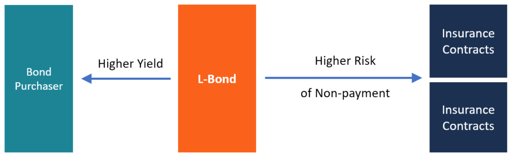

## Table of Contents

## What is an L Bond?

An L Bond is a type of investment offered by companies, often used to raise money for their business. It's called an "L Bond" because it's usually issued by a company in the form of a loan. When you buy an L Bond, you are lending money to the company, and in return, the company promises to pay you back with interest over time.

L Bonds are different from stocks because they don't give you ownership in the company. Instead, they are more like a loan agreement. This means that if the company does well, you get your interest payments, but you don't get to share in the company's profits like stockholders do. However, if the company struggles, L Bonds can be riskier because the company might not be able to pay back the loan.

## Who typically issues L Bonds?

L Bonds are usually issued by companies that need money to grow or start new projects. These companies can be big or small, but they often work in industries like real estate, energy, or technology. The main reason a company issues an L Bond is to borrow money from investors without having to go to a bank.

When a company decides to issue L Bonds, it's because they believe they can use the money to make more money in the future. They promise to pay back the investors with interest over time. This can be a good deal for the company if they can use the money well, but it's also a risk because they have to make sure they can pay back all the investors.

## What are the main characteristics of L Bonds?

L Bonds are a way for companies to borrow money from people like you and me. When you buy an L Bond, you're giving the company a loan. They promise to pay you back over time, plus some extra money called interest. This is different from buying a stock, where you own a piece of the company. With an L Bond, you don't own any part of the company; you're just their lender.

The main thing about L Bonds is that they can be a bit risky. If the company does well, you get your money back with interest, which is great. But if the company has trouble, they might not be able to pay you back. That's why it's important to think carefully before buying an L Bond. You need to believe that the company will be able to pay you back, and you should understand that you might not get your money back if things go wrong.

## How do L Bonds differ from traditional bonds?

L Bonds and traditional bonds are both ways for companies to borrow money, but they have some differences. Traditional bonds are usually issued by big companies or governments. They are often seen as safer because these organizations are less likely to go bankrupt. L Bonds, on the other hand, are usually issued by smaller or newer companies that need money to grow. Because these companies are riskier, L Bonds can also be riskier for the people who buy them.

Another difference is how they are sold. Traditional bonds can be bought and sold on big markets like the stock exchange. This makes it easier for people to buy or sell them whenever they want. L Bonds are often sold directly by the company to investors, and they might not be as easy to sell if you need your money back quickly. So, while traditional bonds might be safer and easier to trade, L Bonds can offer higher interest rates because of the extra risk.

## What are the potential benefits of investing in L Bonds?

Investing in L Bonds can offer you higher interest rates than what you might get from traditional bonds or savings accounts. Because L Bonds are often issued by smaller or newer companies that need money to grow, they have to offer better deals to attract investors. This means you could earn more money over time if the company does well and pays you back with interest.

Another benefit is that you can help a company grow by investing in their L Bonds. If you believe in what the company is doing, your money can help them start new projects or expand their business. This can be exciting because you're not just trying to make money; you're also supporting something you believe in. However, remember that L Bonds are riskier, so it's important to think carefully before you invest.

## What are the risks associated with L Bonds?

Investing in L Bonds can be risky because the companies that issue them are often smaller or newer. If the company doesn't do well, they might not be able to pay you back. This means you could lose some or all of your money. Unlike traditional bonds, which are usually backed by bigger, more stable companies or governments, L Bonds [carry](/wiki/carry-trading) a higher chance of the company going bankrupt.

Another risk is that L Bonds are not as easy to sell if you need your money back quickly. Traditional bonds can be traded on big markets, but L Bonds are often sold directly by the company. This means if you want to get out of your investment, you might have a harder time finding someone to buy your L Bond. So, you need to be ready to keep your money in the L Bond for the whole time the company says they'll pay you back.

## How can one purchase L Bonds?

To buy L Bonds, you usually go directly to the company that is issuing them. These companies often have information on their websites about how to invest in their L Bonds. You might need to fill out some forms and send them money, which can be done through a bank transfer or sometimes even by check. It's important to read all the details the company gives you so you know what you're getting into.

Once you've decided to buy an L Bond, make sure you understand how much money you're giving the company and how much interest they're promising to pay you. Keep in mind that L Bonds aren't usually sold on big markets like stocks or traditional bonds, so you'll need to work directly with the company. If you have any questions, it's a good idea to ask the company or maybe even talk to a financial advisor to make sure you're making a smart choice.

## What is the typical maturity period for L Bonds?

The typical maturity period for L Bonds can vary a lot. Usually, it's between 5 and 10 years, but it can be shorter or longer depending on what the company needs. When you buy an L Bond, the company tells you how long it will take to pay you back all your money plus the interest.

This time period is important because you need to be ready to keep your money in the L Bond until it matures. If you need your money back before the maturity date, it might be hard to sell the L Bond to someone else. So, make sure you're okay with waiting for the whole time before you decide to invest.

## How is the interest on L Bonds calculated and paid?

When you buy an L Bond, the interest is usually calculated based on a fixed rate that the company sets when they issue the bond. This means you know how much interest you will get every year. The interest rate is a percentage of the money you lend to the company. For example, if you invest $1,000 in an L Bond with a 5% interest rate, you will earn $50 in interest each year.

The company pays you the interest on a regular schedule, which could be monthly, quarterly, or yearly. This depends on what the company decides when they issue the L Bond. You will get the interest payments until the L Bond matures, which is when the company pays you back the full amount of money you lent them. It's important to check the payment schedule and the interest rate before you buy an L Bond so you know exactly what to expect.

## What role do L Bonds play in portfolio diversification?

L Bonds can help you spread out your investments, which is called diversification. When you put your money into different types of investments, you're not putting all your eggs in one basket. L Bonds are a bit riskier than traditional bonds, but they can offer higher interest rates. By adding L Bonds to your portfolio, you might be able to earn more money, but you also need to be ready for the chance that you might lose some of it if the company doesn't do well.

Including L Bonds in your mix of investments can balance out the risk and reward. If you have a lot of safe investments like savings accounts or government bonds, adding some L Bonds can give you a chance to earn more interest. But remember, because L Bonds are riskier, you should only invest money that you can afford to lose. This way, even if something goes wrong with the L Bond, the rest of your investments can help keep your money safe.

## How have L Bonds performed historically compared to other investment options?

L Bonds have had ups and downs over the years, just like many other investments. They can offer higher interest rates than traditional bonds or savings accounts because they're riskier. If the companies issuing L Bonds do well, investors can make more money from the higher interest. But if the companies struggle, investors might not get their money back. This means that L Bonds can be a good way to earn more money, but they come with a bigger chance of losing money compared to safer investments like government bonds or savings accounts.

Historically, L Bonds have been used by companies that are growing or starting new projects. These companies need money to expand, and they offer L Bonds to attract investors. Over time, some L Bonds have done very well, giving investors good returns. But others have not done so well, and investors have lost money. Compared to stocks, L Bonds don't give you ownership in the company, so you don't share in the company's profits if it does really well. But they can still be a part of a balanced investment strategy if you're willing to take on more risk for the chance of higher rewards.

## What regulatory considerations should be taken into account when investing in L Bonds?

When you're thinking about investing in L Bonds, it's important to know about the rules that govern them. L Bonds are often issued by smaller companies, and they might not be as tightly regulated as traditional bonds from big companies or governments. In the United States, for example, L Bonds might be offered under exemptions from the Securities and Exchange Commission (SEC) rules. This means the companies don't have to give as much information to investors as they would for other types of bonds. You should always read the company's offering documents carefully to understand the risks and the terms of the investment.

Another thing to consider is that L Bonds might not be registered with the SEC, which means they are not traded on big markets like stocks or traditional bonds. This can make it harder to sell your L Bond if you need your money back quickly. Some states also have their own rules about selling L Bonds, so it's a good idea to check the laws in your state before you invest. Talking to a financial advisor can help you understand all these rules and make sure you're making a smart choice with your money.

## What are the characteristics of bonds and how can we understand them?

Bonds are essential components of financial markets, serving as debt securities in which an investor lends money to an entity, typically corporate or governmental, that borrows the funds for a defined period at a fixed interest rate. Key characteristics of bonds include the principal, interest, maturity, and yield.

The principal, also known as the face value, is the amount borrowed by the bond issuer and repaid to the investor at maturity. Interest, often referred to as the coupon, is the periodic payment made to the bondholder, typically expressed as a percentage of the principal. Maturity indicates the time at which the bond’s principal is due to be repaid, ranging from short-term (a few months to a few years) to long-term (decades). Yield, the return on investment, factors in the bond's interest payments and its price fluctuations. Yield can be calculated as:

$$
\text{Yield} = \frac{\text{Coupon Payment}}{\text{Current Market Price}}
$$

The credit rating of a bond significantly influences its price and desirability in the market. This rating, assigned by agencies such as Moody's or Standard & Poor's, assesses the issuer's creditworthiness and risk of default. Higher-rated bonds typically offer lower yields due to perceived security, whereas lower-rated bonds (often called junk bonds) provide higher yields to compensate for increased risk.

Additional attributes influencing bond characteristics include callability, convertibility, and duration. Callability allows issuers to repay the bond before maturity, usually at a premium, which can impact the bond's appeal due to prepayment risk. Convertible bonds offer bondholders the option to convert the bond into a predetermined number of company shares, potentially more valuable if the company's stock price rises. Duration measures a bond's sensitivity to [interest rate](/wiki/interest-rate-trading-strategies) changes, representing the weighted average time until all payments are received; bonds with longer durations face greater price [volatility](/wiki/volatility-trading-strategies) with interest rate fluctuations.

Liquidity and marketability play vital roles in bond trading. Liquidity refers to how quickly a bond can be sold without significantly affecting its price, critical for investors needing quick cash conversion. Marketability involves the ease with which a bond can be traded, influenced by factors like the bond’s structure and market demand.

L Bonds present unique characteristics compared to traditional bonds. Issued primarily by financial firms specializing in alternative assets, L Bonds are often backed by life insurance policies or other non-traditional collateral, which can offer higher returns but also pose higher risks due to the nature of the underlying assets. Due to their specialized nature, understanding the intricate details and associated risks of L Bonds is crucial for informed investment decisions.

## References & Further Reading

[1]: Cole, C. L. (2016). ["Life Settlements and Longevity Bonds: Characteristics and Uses."](https://onlinelibrary.wiley.com/doi/book/10.1002/9781119206446) Society of Actuaries.

[2]: Aldridge, I. (2013). ["High-Frequency Trading: A Practical Guide to Algorithmic Strategies and Trading Systems"](https://www.ahmetbeyefendi.com/wp-content/uploads/2020/07/High-Frequency-Trading-Irene-Aldridge.pdf) by Irene Aldridge.

[3]: Merton, R. C. (1974). ["On the Pricing of Corporate Debt: The Risk Structure of Interest Rates."](https://onlinelibrary.wiley.com/doi/10.1111/j.1540-6261.1974.tb03058.x) The Journal of Finance, 29(2), 449–470.

[4]: Singer, R. (2020). ["Automated Trading with R: Quantitative Research and Platform Development"](https://link.springer.com/book/10.1007/978-1-4842-2178-5) by Rafael A. Irizarry.

[5]: Fabozzi, F. J., & Mann, S. V. (2012). ["Handbook of Fixed Income Securities"](https://www.mhebooklibrary.com/doi/book/10.1036/9781260473902?contentTab=true) by Frank J. Fabozzi and Steven V. Mann.