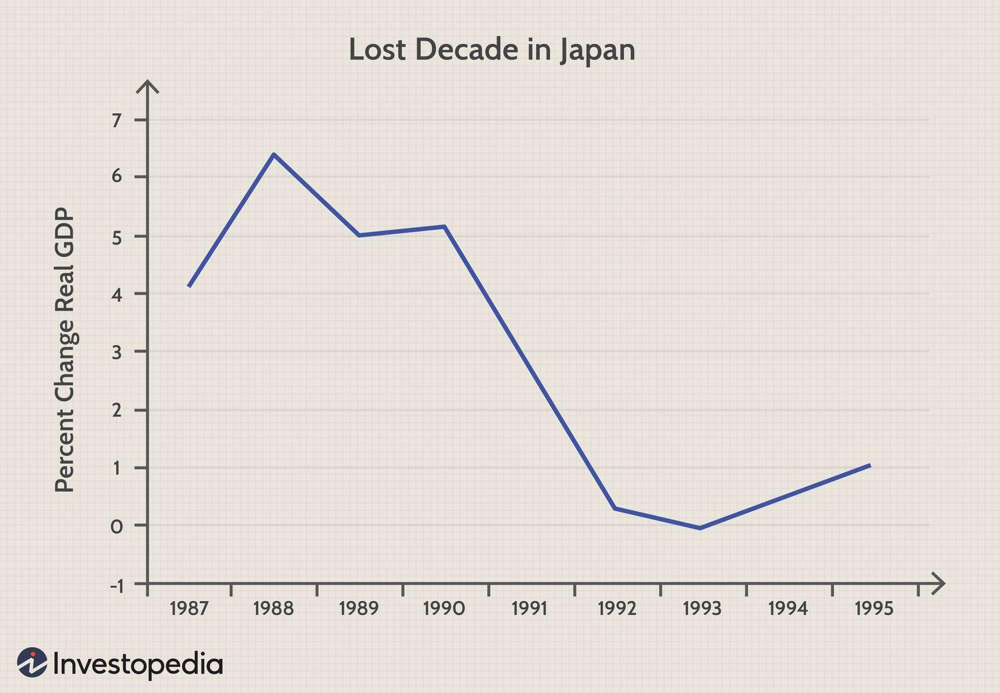

## Table of Contents

## What is an L-Shaped Economic Recovery?

An L-shaped economic recovery happens when an economy falls and stays low for a long time. It looks like the letter "L" because it drops and then stays flat at the bottom. This type of recovery is bad because it means the economy doesn't get better quickly. It can happen after a big crisis, like a financial crash or a global health emergency.

People might lose jobs and businesses might close during an L-shaped recovery. It can take many years for things to start getting better. Governments and central banks try to help by spending money and lowering interest rates, but sometimes these efforts don't work fast enough. This type of recovery is what people worry about the most because it can lead to long-term problems for everyone.

## How does an L-Shaped recovery differ from other types of economic recoveries?

An L-shaped recovery is different from other types of economic recoveries because it stays low for a long time after it falls. It looks like the letter "L" because the economy drops and then stays flat at the bottom. Other types of recoveries, like V-shaped, U-shaped, and W-shaped, have different patterns. A V-shaped recovery happens when the economy falls fast but then quickly bounces back up. A U-shaped recovery is when the economy stays low for a while but then starts to get better slowly. A W-shaped recovery, also called a double-dip recession, is when the economy falls, starts to recover, falls again, and then finally starts to get better.

The main difference between an L-shaped recovery and these other types is how long it takes for the economy to get better. In an L-shaped recovery, it can take many years for things to start improving, which can be really tough for people and businesses. In contrast, a V-shaped recovery is much quicker, with the economy getting back to normal in a short time. A U-shaped recovery takes longer than a V-shaped one but is still better than an L-shaped recovery because the economy eventually starts to improve. A W-shaped recovery is more complicated because it has two dips, but it still usually gets better faster than an L-shaped recovery. Each type of recovery shows a different way the economy can heal after a crisis.

## What are the common causes of an L-Shaped Economic Recovery?

An L-shaped economic recovery often happens after a very big and bad crisis. This could be something like a huge financial crash, where banks and businesses fail, or a global health emergency, like a pandemic. These crises can make people lose their jobs and stop spending money, which hurts the economy a lot. When the crisis is so big that it breaks important parts of the economy, like banks or big businesses, it can be hard for things to start getting better quickly.

Another reason for an L-shaped recovery is when the government and central banks can't fix the problem fast enough. They might try to help by spending more money or lowering interest rates, but sometimes these efforts don't work well. If people are scared and not spending, or if businesses are not investing, the economy can stay stuck at a low level for a long time. This can lead to long-term problems like high unemployment and businesses closing down, making it even harder for the economy to recover.

## Can you provide historical examples of L-Shaped recoveries?

One example of an L-shaped recovery happened in Japan during the 1990s. After a big bubble in real estate and stock prices burst, Japan's economy fell and stayed low for a long time. This period is called the "Lost Decade." People lost jobs, and businesses didn't invest much. Even though the government tried to help by spending money and lowering interest rates, it took many years for the economy to start getting better. This shows how hard it can be to recover from a big crisis.

Another example is the Great Depression in the United States, which started in 1929. After the stock market crashed, the economy fell and stayed down for a long time. Many people lost their jobs and businesses closed. The government tried different things to help, but it wasn't until World War II that the economy really started to get better. This shows that sometimes it can take a huge event to pull an economy out of an L-shaped recovery.

## What are the impacts of an L-Shaped recovery on employment?

An L-shaped recovery can be really tough on jobs. When the economy falls and stays low for a long time, many people lose their jobs. Businesses might close down because they're not making enough money, and they can't afford to keep everyone working. This means that unemployment stays high for a long time. People who lose their jobs might have a hard time finding new ones because there aren't many jobs available. This can make it even harder for the economy to get better because people don't have money to spend.

The long-term effects of high unemployment during an L-shaped recovery can be really bad. People might have to use up their savings or go into debt just to get by. Some might even lose their homes. When people are out of work for a long time, they might lose skills or become less confident, which makes it even harder to find a job later. This can lead to a cycle where the economy stays stuck at a low level, and it takes a long time for things to start getting better.

## How does an L-Shaped recovery affect different sectors of the economy?

An L-shaped recovery hits different parts of the economy in different ways. The service and hospitality sectors, like restaurants and hotels, often get hit the hardest. When people lose their jobs and don't have money to spend, they stop going out to eat or taking trips. This means these businesses make less money and might have to close down or lay off workers. Manufacturing and construction can also suffer because people aren't buying new things or building new homes. These sectors might see fewer orders and projects, leading to more job losses and less activity.

Other sectors like healthcare and education might not be hit as hard right away, but they can still feel the effects over time. For example, if the government has less money because of the economic downturn, it might cut funding for schools or public health programs. This can lead to fewer jobs and lower quality services. On the other hand, some sectors like technology and online services might do better. People might spend more time at home using the internet, so companies that offer online products or services could see more business. But overall, an L-shaped recovery means most parts of the economy struggle for a long time, making it hard for things to get better quickly.

## What are the policy responses typically used to mitigate an L-Shaped recovery?

Governments and central banks use different ways to try to fix an L-shaped recovery. They might spend more money on things like building roads or helping people who lost their jobs. This is called fiscal policy. By spending more, they hope to create jobs and get people to start spending money again. Central banks might also lower interest rates to make it cheaper for people to borrow money. This can help businesses grow and people buy things like houses or cars. Sometimes, they might even print more money to help the economy, but this can be risky if it makes prices go up too much.

Sometimes, these usual ways of helping don't work fast enough in an L-shaped recovery. So, governments might try other things like giving money directly to people or businesses. They might also change rules to make it easier for businesses to start or grow. For example, they might cut taxes or make it easier to get loans. All these things are done to try to get the economy moving again, but it can take a long time and a lot of effort to make a difference in an L-shaped recovery.

## How can businesses adapt to survive an L-Shaped economic recovery?

Businesses can adapt to an L-shaped economic recovery by being smart about how they spend money. They should look at their costs and see if they can save money by cutting things they don't really need. For example, they might switch to cheaper suppliers or find ways to use less energy. It's also important for businesses to keep their customers happy, even when money is tight. They might offer special deals or better service to keep people coming back. Another good idea is to try new things, like selling their products online if they haven't done that before. This can help them reach more people and make more money.

Another way businesses can survive is by being flexible and ready to change. They might need to find new ways to make money, like starting to offer services they didn't offer before. For example, a restaurant might start selling cooking kits or offering delivery if people aren't coming to eat at the restaurant. It's also a good idea for businesses to keep talking to their employees and listen to their ideas. Employees might have good thoughts on how to save money or make things better. By staying strong and adapting to the tough times, businesses can have a better chance of making it through an L-shaped recovery.

## What are the long-term economic consequences of an L-Shaped recovery?

An L-shaped recovery can lead to big problems that last a long time. When the economy stays low for many years, people lose their jobs and businesses close down. This means that unemployment stays high, and people don't have money to spend. As a result, the economy stays stuck and doesn't grow. People might use up all their savings or go into debt just to get by. This can make it even harder for them to spend money later, which keeps the economy from getting better. Governments might also have less money to spend on important things like schools and hospitals because they're not collecting as much in taxes.

Over time, an L-shaped recovery can change how the economy works. Businesses might be scared to invest in new projects or hire new workers because they're worried about the future. This can slow down growth and make it hard for new businesses to start. People might also lose trust in the economy and decide to save their money instead of spending it. This can lead to a cycle where the economy stays weak for a long time. It might take big changes, like new laws or big government spending, to finally help the economy start growing again. But even then, it can take many years for things to get back to normal.

## How do L-Shaped recoveries influence consumer behavior and spending?

During an L-shaped recovery, people often change how they spend money because they're worried about the future. When the economy falls and stays low for a long time, many people lose their jobs or see their pay go down. This makes them scared to spend money on things they don't really need. Instead, they might save more or only buy what they need to get by. Businesses feel this too, because when people aren't spending, they make less money and might have to close down or lay off workers.

This cycle can make the L-shaped recovery last even longer. When people see businesses closing and friends losing jobs, they become even more careful with their money. They might stop going out to eat, buying new clothes, or taking trips. This means less money is moving around in the economy, which makes it hard for things to get better. It can take a long time for people to start feeling confident again and spend money freely, which is why L-shaped recoveries are so tough on the economy.

## What role do global economic factors play in an L-Shaped recovery?

Global economic factors can make an L-shaped recovery even harder. When a country's economy is in an L-shaped recovery, what happens in other countries can affect it too. If big trading partners are also struggling, they might buy less from that country, which hurts businesses and leads to more job losses. Also, if global interest rates are high, it can be harder for the country to borrow money to help its economy. This can make it even tougher for the country to get out of the L-shaped recovery because it doesn't have the money it needs to spend on things that could help.

On the other hand, global factors can sometimes help. If other countries are doing well, they might buy more from the country in an L-shaped recovery, which can help its businesses and create jobs. Also, if global interest rates are low, the country might be able to borrow money more easily to spend on things like building roads or helping people who lost their jobs. But even with help from global factors, it can still take a long time for an L-shaped recovery to end because the problems are so big and deep.

## How can economic models predict or assess the likelihood of an L-Shaped recovery?

Economic models use data and math to try to guess what might happen to the economy. To predict or assess the chance of an L-shaped recovery, economists look at things like how much people are spending, how many people have jobs, and how much businesses are investing. They also look at how well the government and central banks are doing at fixing the economy. If the numbers show that the economy is falling and not getting better quickly, it might mean an L-shaped recovery is coming. These models can help economists see if the economy is stuck in a bad place and not likely to get better soon.

But, economic models are not perfect. They can't always predict everything because the economy is very complicated and can be affected by things like wars, natural disasters, or big changes in technology. Sometimes, the data that economists use can be old or not very accurate, which can make their predictions wrong. Even so, these models are still useful because they help economists and policymakers understand what might happen and plan what to do. By using these models, they can try to stop an L-shaped recovery from happening or make it less bad if it does happen.

## What are the economic impacts of L-shaped recoveries?

L-shaped recoveries can significantly impact economies, often inducing enduring structural changes. These recoveries typically affect industries unevenly, leading to a reallocation of resources and shifts in employment patterns. One of the primary economic impacts is the rise in long-term unemployment, which results in the erosion of skills among the workforce. This de-skilling effect diminishes the long-term productivity of an economy and reduces consumer spending power, as prolonged periods without income compel individuals to reduce consumption and increase savings. 

Mathematically, if we denote $C$ as consumer spending and $Y$ as income, a prolonged reduction in $Y$ leads to a decrease in $C$, affecting economic growth negatively. The marginal propensity to consume (MPC) can further illustrate this by quantifying how consumption changes in response to changes in income:

$$
\Delta C = \text{MPC} \times \Delta Y
$$

In an L-shaped recovery, the MPC can shrink as consumers become more risk-averse, opting to save rather than spend, thus exacerbating economic stagnation. 

Such stagnation can heavily influence fiscal and monetary policies. Governments may need to implement long-term corrective measures, such as counter-cyclical fiscal policies, aimed at stimulating economic activity through increased public spending or tax cuts. Central banks might engage in prolonged periods of low-interest rates or unconventional monetary policies, including quantitative easing, to encourage borrowing and investment. 

However, these interventions come with constraints. Persistent economic stagnation may limit the effectiveness of these policies, as seen in scenarios where high public debt restricts fiscal policy scope or when the zero lower bound on interest rates limits monetary policy. As a result, economies undergoing L-shaped recoveries often require comprehensive reforms beyond traditional policy measures to address underlying structural issues and facilitate a return to sustained economic growth.

## References & Further Reading

[1]: Reinhart, C. M., & Rogoff, K. S. (2009). ["This Time is Different: Eight Centuries of Financial Folly."](https://www.nber.org/system/files/working_papers/w13882/w13882.pdf) Princeton University Press.

[2]: Bernanke, B. (2015). ["The Courage to Act: A Memoir of a Crisis and its Aftermath."](https://archive.org/details/couragetoactmemo0000bern) W. W. Norton & Company.

[3]: Krugman, P. R. (2009). ["The Return of Depression Economics and the Crisis of 2008."](https://archive.org/details/returnofdepressi0000krug) W. W. Norton & Company.

[4]: Chen, J., & Lin, K. (2012). ["The Effect of Algorithmic Trading on Market Quality: Evidence from the Millennium System Upgrade."](https://www.cambridge.org/core/journals/journal-of-financial-and-quantitative-analysis/article/abs/algorithmic-trading-and-market-quality-international-evidence/4B96E916E3E13AFF1DF9B5FCC188F4E0) Journal of Financial Markets.

[5]: Shiller, R. J. (2012). ["Finance and the Good Society."](https://www.jstor.org/stable/j.ctt32bb86) Princeton University Press.

[6]: Lagarde, C. (2014). ["Economic Inclusion and Financial Integrity."](https://www.elibrary.imf.org/downloadpdf/book/9781513513751/9781513513751.pdf) International Monetary Fund.