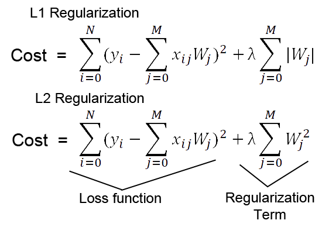

## Table of Contents

## What is regularization in machine learning?

Regularization in machine learning is a technique used to prevent overfitting, which happens when a model learns the training data too well, including its noise and outliers, and performs poorly on new, unseen data. Overfitting can make a model less generalizable, meaning it won't work as well on data it hasn't seen before. Regularization helps by adding a penalty to the model's complexity, encouraging it to be simpler and more likely to perform well on new data.

One common type of regularization is called L2 regularization, also known as ridge regression. In L2 regularization, a penalty term is added to the loss function that the model tries to minimize. This penalty term is proportional to the square of the magnitude of the model's coefficients. The formula for the L2 regularization term is $$ \lambda \sum_{i=1}^{n} w_i^2 $$, where $$ \lambda $$ is a hyperparameter that controls the strength of the regularization, and $$ w_i $$ are the model's coefficients. By adding this term, the model is encouraged to have smaller coefficient values, which leads to a simpler model that is less likely to overfit.

Another type of regularization is L1 regularization, also known as Lasso regression. L1 regularization adds a penalty term to the loss function that is proportional to the absolute value of the model's coefficients. The formula for the L1 regularization term is $$ \lambda \sum_{i=1}^{n} |w_i| $$. L1 regularization can lead to some coefficients becoming exactly zero, which means it can also be used for feature selection, helping to identify which features are most important for the model's predictions. Both L1 and L2 regularization help improve the model's performance on new data by making it more generalizable.

## What is L1 regularization and how does it differ from other types of regularization?

L1 regularization, also known as Lasso regression, is a technique used in machine learning to prevent overfitting by adding a penalty to the model's complexity. This penalty is based on the absolute value of the model's coefficients. The formula for the L1 regularization term is $$ \lambda \sum_{i=1}^{n} |w_i| $$, where $$ \lambda $$ is a hyperparameter that controls how strong the penalty is, and $$ w_i $$ are the model's coefficients. By adding this penalty, L1 regularization encourages the model to have smaller coefficients, which leads to a simpler model. A unique feature of L1 regularization is that it can make some coefficients exactly zero, which means it can also be used for feature selection, helping to identify which features are most important for the model's predictions.

L1 regularization differs from other types of regularization, like L2 regularization, in how it penalizes the model's coefficients. L2 regularization, or ridge regression, uses a penalty term based on the square of the coefficients, with the formula $$ \lambda \sum_{i=1}^{n} w_i^2 $$. This leads to smaller but non-zero coefficients, which means L2 regularization reduces the impact of all features without eliminating any. In contrast, L1 regularization can completely remove some features by setting their coefficients to zero, making it a powerful tool for feature selection. Additionally, Elastic Net regularization combines both L1 and L2 penalties, offering a balance between the feature selection of L1 and the coefficient shrinkage of L2.

## How does L1 regularization work mathematically?

L1 regularization adds a penalty to the loss function of a [machine learning](/wiki/machine-learning) model. The penalty is based on the absolute value of the model's coefficients. The formula for this penalty is $$ \lambda \sum_{i=1}^{n} |w_i| $$, where $$ \lambda $$ is a number that controls how strong the penalty is, and $$ w_i $$ are the model's coefficients. This penalty encourages the model to make the coefficients smaller, which makes the model simpler and less likely to overfit. Overfitting happens when a model learns the training data too well, including its noise and outliers, and performs poorly on new data.

A unique thing about L1 regularization is that it can make some coefficients exactly zero. This happens because the absolute value penalty can push the coefficients all the way to zero, effectively removing those features from the model. This is called feature selection, and it helps the model focus on the most important features for making predictions. For example, if you have a model with many features, L1 regularization can help you figure out which ones are really needed and which ones can be ignored.

## What is the purpose of using L1 regularization in machine learning models?

The main purpose of using L1 regularization in machine learning models is to prevent overfitting. Overfitting happens when a model learns the training data too well, including its noise and outliers, and then doesn't work well on new data. L1 regularization helps by adding a penalty to the model's complexity, which encourages the model to be simpler. This penalty is based on the absolute value of the model's coefficients, and the formula for it is $$ \lambda \sum_{i=1}^{n} |w_i| $$. Here, $$ \lambda $$ is a number that controls how strong the penalty is, and $$ w_i $$ are the model's coefficients. By making the coefficients smaller, the model becomes simpler and more likely to work well on new data.

Another important purpose of L1 regularization is feature selection. This means it helps the model figure out which features, or inputs, are most important for making predictions. L1 regularization can make some of the coefficients exactly zero, which means those features are effectively removed from the model. This is really helpful when you have a lot of features and want to know which ones really matter. By using L1 regularization, you can simplify your model and focus on the most important features, which can make your model more accurate and easier to understand.

## Can you explain the concept of sparsity in the context of L1 regularization?

Sparsity in the context of L1 regularization means that some of the model's coefficients become exactly zero. This happens because L1 regularization adds a penalty to the model's loss function that's based on the absolute value of the coefficients. The formula for this penalty is $$ \lambda \sum_{i=1}^{n} |w_i| $$. Here, $$ \lambda $$ is a number that controls how strong the penalty is, and $$ w_i $$ are the model's coefficients. When this penalty is strong enough, it can push some coefficients all the way to zero, making them sparse. This sparsity helps the model focus on the most important features and ignore the less important ones.

When a model has sparse coefficients, it means that only a few features are used to make predictions. This can make the model simpler and easier to understand because it's only using a small number of important features. It's like having a toolbox with just the essential tools instead of a cluttered one with lots of unnecessary ones. This can also help the model work better on new data because it's less likely to be confused by noise or unimportant details in the training data. So, sparsity, which L1 regularization helps create, can make a model more accurate and easier to interpret.

## How does L1 regularization affect the model's coefficients?

L1 regularization affects the model's coefficients by adding a penalty to the model's loss function. This penalty is based on the absolute value of the coefficients, and the formula for it is $$ \lambda \sum_{i=1}^{n} |w_i| $$. Here, $$ \lambda $$ is a number that controls how strong the penalty is, and $$ w_i $$ are the model's coefficients. When this penalty is applied, it encourages the model to make the coefficients smaller. This is because smaller coefficients mean a simpler model, which is less likely to overfit the training data.

A unique thing about L1 regularization is that it can make some coefficients exactly zero. This happens because the penalty based on the absolute value can push the coefficients all the way to zero. When some coefficients become zero, it means those features are no longer used in the model. This process is called feature selection, and it helps the model focus on the most important features for making predictions. By making the model sparse, L1 regularization can simplify the model and make it easier to understand and more effective on new data.

## What are the advantages of using L1 regularization over L2 regularization?

L1 regularization, also known as Lasso regression, has some advantages over L2 regularization, which is also called ridge regression. One big advantage is that L1 regularization can make some of the model's coefficients exactly zero. This is because it adds a penalty to the model's loss function based on the absolute value of the coefficients, with the formula $$ \lambda \sum_{i=1}^{n} |w_i| $$. When this penalty is strong enough, it can push some coefficients all the way to zero. This helps the model focus on the most important features and ignore the less important ones, making the model simpler and easier to understand.

Another advantage of L1 regularization is that it can be used for feature selection. When some coefficients become zero, those features are effectively removed from the model. This is helpful when you have a lot of features and want to know which ones are really needed for making good predictions. L2 regularization, on the other hand, makes all the coefficients smaller but doesn't usually make them zero, so it doesn't help with feature selection in the same way. By using L1 regularization, you can simplify your model and make it more accurate and easier to interpret.

## In what scenarios is L1 regularization particularly useful?

L1 regularization is particularly useful when you have a lot of features and want to figure out which ones are the most important. This is because L1 regularization can make some of the model's coefficients exactly zero. The formula for this penalty is $$ \lambda \sum_{i=1}^{n} |w_i| $$. When this happens, it means those features are no longer used in the model. This helps the model focus on the most important features and ignore the less important ones, making the model simpler and easier to understand. If you're trying to build a model and want to know which features really matter, L1 regularization can help you do that.

Another scenario where L1 regularization is useful is when you want to prevent your model from overfitting. Overfitting happens when a model learns the training data too well, including its noise and outliers, and then doesn't work well on new data. L1 regularization adds a penalty to the model's complexity, which encourages the model to be simpler. By making the coefficients smaller, the model becomes less likely to overfit and more likely to work well on new data. So if you're worried about your model overfitting, using L1 regularization can help make your model more accurate and reliable.

## How do you implement L1 regularization in a machine learning model?

To implement L1 regularization in a machine learning model, you need to add a penalty to the model's loss function. This penalty is based on the absolute value of the model's coefficients. The formula for the L1 regularization term is $$ \lambda \sum_{i=1}^{n} |w_i| $$, where $$ \lambda $$ is a number that controls how strong the penalty is, and $$ w_i $$ are the model's coefficients. When you add this penalty to the loss function, the model tries to minimize both the original loss and the L1 penalty. This encourages the model to make the coefficients smaller, which makes the model simpler and less likely to overfit.

In practice, you can implement L1 regularization using machine learning libraries like scikit-learn in Python. For example, if you're using a linear regression model, you can use the `Lasso` class from scikit-learn. Here's how you can do it:

```python
from sklearn.linear_model import Lasso
from sklearn.datasets import make_regression
from sklearn.model_selection import train_test_split

# Generate some data
X, y = make_regression(n_samples=100, n_features=10, noise=0.1, random_state=42)

# Split the data into training and testing sets
X_train, X_test, y_train, y_test = train_test_split(X, y, test_size=0.2, random_state=42)

# Create and fit the Lasso model
lasso = Lasso(alpha=0.1)  # alpha is the same as lambda in the formula
lasso.fit(X_train, y_train)

# Make predictions
y_pred = lasso.predict(X_test)
```

In this example, `alpha` is the same as $$ \lambda $$ in the formula. By adjusting `alpha`, you can control how strong the L1 regularization is. A higher `alpha` means stronger regularization, which will make the coefficients smaller and can lead to some of them becoming zero. This helps the model focus on the most important features and prevents overfitting.

## What are the hyperparameters associated with L1 regularization and how do you tune them?

The main hyperparameter associated with L1 regularization is called `alpha`, which is the same as $$ \lambda $$ in the formula $$ \lambda \sum_{i=1}^{n} |w_i| $$. This hyperparameter controls how strong the L1 regularization is. A higher `alpha` means stronger regularization, which pushes the model's coefficients to be smaller and can make some of them zero. This helps the model focus on the most important features and prevents overfitting. Choosing the right value for `alpha` is important because it affects how well the model works on new data.

To tune the `alpha` hyperparameter, you can use a method called cross-validation. Cross-validation helps you find the best `alpha` by trying different values and seeing which one works the best on your data. In Python, you can use a library like scikit-learn to do this. For example, you can use the `LassoCV` class, which automatically tries different values of `alpha` and picks the best one.

```python
from sklearn.linear_model import LassoCV
from sklearn.datasets import make_regression
from sklearn.model_selection import train_test_split

# Generate some data
X, y = make_regression(n_samples=100, n_features=10, noise=0.1, random_state=42)

# Split the data into training and testing sets
X_train, X_test, y_train, y_test = train_test_split(X, y, test_size=0.2, random_state=42)

# Create and fit the LassoCV model
lasso_cv = LassoCV(cv=5, random_state=42)
lasso_cv.fit(X_train, y_train)

# The best alpha value
best_alpha = lasso_cv.alpha_

# Make predictions
y_pred = lasso_cv.predict(X_test)
```

In this code, `cv=5` means the model will use 5-fold cross-validation to find the best `alpha`. By using cross-validation, you can make sure your model works well on new data and not just on the data it was trained on.

## Can you discuss the impact of L1 regularization on model interpretability?

L1 regularization helps make machine learning models easier to understand by making some of the model's coefficients exactly zero. This happens because L1 regularization adds a penalty to the model's loss function that is based on the absolute value of the coefficients. The formula for this penalty is $$ \lambda \sum_{i=1}^{n} |w_i| $$. When some coefficients become zero, it means those features are no longer used in the model. This makes the model simpler because it only uses a few important features to make predictions. A simpler model is easier to explain and understand because you can see which features really matter.

For example, if you're trying to predict house prices and you have many features like the number of bedrooms, the size of the garden, and the age of the house, L1 regularization can help you figure out which ones are most important. If the coefficient for the size of the garden becomes zero, you know that the size of the garden doesn't affect the house price in your model. This makes it easier to explain to someone why the model predicts certain prices. By focusing on the most important features, L1 regularization can make your model more interpretable and easier to use in real-world situations.

## How does L1 regularization interact with other regularization techniques in complex models?

L1 regularization can be combined with other regularization techniques to create more complex models that benefit from the strengths of each method. For example, Elastic Net regularization combines L1 and L2 regularization. L1 regularization, with the penalty term $$ \lambda_1 \sum_{i=1}^{n} |w_i| $$, encourages sparsity by making some coefficients zero, which helps with feature selection. L2 regularization, with the penalty term $$ \lambda_2 \sum_{i=1}^{n} w_i^2 $$, makes all coefficients smaller without making them zero, which helps prevent overfitting by reducing the impact of all features. By using both L1 and L2 penalties, Elastic Net can balance feature selection and overall model complexity, making it useful in situations where there are many correlated features.

In practice, implementing Elastic Net in a model can be done using libraries like scikit-learn in Python. For instance, you can use the `ElasticNet` class, which allows you to set both `alpha` (which controls the overall strength of regularization) and `l1_ratio` (which determines the balance between L1 and L2 regularization). By tuning these hyperparameters, you can adjust the model to achieve the right balance between sparsity and generalization. This can lead to a model that is both interpretable, due to the feature selection from L1 regularization, and robust, thanks to the overall complexity reduction from L2 regularization.

## References & Further Reading

[1]: Tibshirani, R. (1996). ["Regression Shrinkage and Selection via the Lasso."](https://academic.oup.com/jrsssb/article/58/1/267/7027929) Journal of the Royal Statistical Society: Series B (Methodological), 58(1), 267-288.

[2]: Zou, H., & Hastie, T. (2005). ["Regularization and Variable Selection via the Elastic Net."](https://academic.oup.com/jrsssb/article-abstract/67/2/301/7109482) Journal of the Royal Statistical Society: Series B (Statistical Methodology), 67(2), 301-320.

[3]: Hastie, T., Tibshirani, R., & Wainwright, M. (2015). ["Statistical Learning with Sparsity: The Lasso and Generalizations."](https://www.taylorfrancis.com/books/mono/10.1201/b18401/statistical-learning-sparsity-trevor-hastie-martin-wainwright-robert-tibshirani) CRC Press.

[4]: Zou, H., & Zhang, H. H. (2009). ["On the adaptive elastic net with a diverging number of parameters."](https://projecteuclid.org/journals/annals-of-statistics/volume-37/issue-4/On-the-adaptive-elastic-net-with-a-diverging-number-of/10.1214/08-AOS625.full) The Annals of Statistics, 37(4), 1733-1751.

[5]: Pedregosa, F., Varoquaux, G., Gramfort, A., Michel, V., Thirion, B., Grisel, O., ... & Duchesnay, E. (2011). ["Scikit-learn: Machine Learning in Python."](https://dl.acm.org/doi/10.5555/1953048.2078195) Journal of Machine Learning Research, 12, 2825-2830.