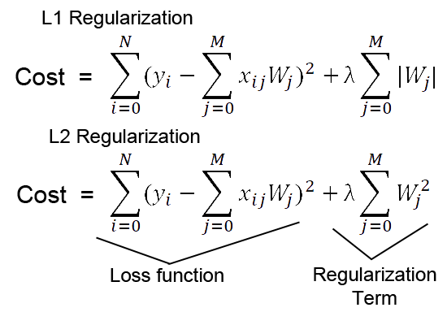

## Table of Contents

## What is L2 Loss in machine learning?

L2 Loss, also known as Mean Squared Error (MSE), is a common loss function used in machine learning, especially for regression problems. It measures the average of the squared differences between the predicted values and the actual values. The goal of using L2 Loss is to minimize these differences, which helps the model learn to make more accurate predictions. Mathematically, L2 Loss can be expressed as $$ \text{L2 Loss} = \frac{1}{n} \sum_{i=1}^{n} (y_i - \hat{y}_i)^2 $$, where $n$ is the number of samples, $y_i$ is the actual value, and $\hat{y}_i$ is the predicted value.

One of the reasons L2 Loss is popular is because it penalizes larger errors more severely than smaller ones due to the squaring of the differences. This property makes it sensitive to outliers, which can be both an advantage and a disadvantage depending on the specific problem. In practice, minimizing L2 Loss often leads to a smoother and more stable learning process, as it encourages the model to find a solution that balances the errors across all data points. This makes L2 Loss a go-to choice for many machine learning practitioners working on regression tasks.

## How is L2 Loss calculated?

L2 Loss, also known as Mean Squared Error (MSE), is a way to measure how well a machine learning model is doing. It looks at the difference between what the model predicts and what the actual answer is. To calculate L2 Loss, you take each prediction, subtract the actual value, and then square that difference. You do this for all the predictions you have, add up all those squared differences, and then divide by the total number of predictions. This gives you the average of the squared errors, which is the L2 Loss.

Mathematically, L2 Loss can be written as $$ \text{L2 Loss} = \frac{1}{n} \sum_{i=1}^{n} (y_i - \hat{y}_i)^2 $$. Here, $n$ is the number of predictions, $y_i$ is the actual value, and $\hat{y}_i$ is the predicted value. The formula shows that you're summing up the squared differences and then dividing by $n$ to get the average. This method of calculating loss is useful because it makes bigger mistakes count more than smaller ones, which helps the model learn to be more accurate overall.

## Why is L2 Loss also known as Mean Squared Error?

L2 Loss is also known as Mean Squared Error because it calculates the average of the squared differences between what a model predicts and the actual values. The term "Mean" in Mean Squared Error means that you are finding the average of these squared differences. "Squared" means that each difference is multiplied by itself before adding them up. This way, all the errors are positive, and bigger mistakes are punished more than smaller ones.

The formula for L2 Loss, or Mean Squared Error, is $$ \text{L2 Loss} = \frac{1}{n} \sum_{i=1}^{n} (y_i - \hat{y}_i)^2 $$. Here, $n$ is the number of predictions, $y_i$ is the actual value, and $\hat{y}_i$ is the predicted value. By squaring the differences and then taking the average, L2 Loss helps the model learn to make better predictions by focusing on reducing larger errors more than smaller ones.

## What are the advantages of using L2 Loss in regression problems?

L2 Loss, also known as Mean Squared Error, is really helpful in regression problems because it gives a clear way to see how well a model is doing. It does this by taking the difference between what the model predicts and the actual value, squaring that difference, and then averaging all those squared differences. This method, shown as $$ \text{L2 Loss} = \frac{1}{n} \sum_{i=1}^{n} (y_i - \hat{y}_i)^2 $$, makes sure that bigger mistakes are punished more than smaller ones. This helps the model focus on getting the big errors right, which can lead to better overall predictions.

Another advantage of using L2 Loss is that it leads to a smoother learning process. Because L2 Loss squares the errors, it makes the model try to find a solution that balances the errors across all the data points. This can be really useful because it helps the model not just focus on one or two big mistakes but instead work on getting everything a bit better. This way, the model can learn to be more accurate and reliable over time.

## How does L2 Loss affect model training?

L2 Loss, also known as Mean Squared Error, helps a model learn by making it focus on reducing the differences between its predictions and the actual values. It does this by taking each prediction, subtracting the actual value, squaring that difference, and then averaging all those squared differences. The formula for L2 Loss is $$ \text{L2 Loss} = \frac{1}{n} \sum_{i=1}^{n} (y_i - \hat{y}_i)^2 $$. Because it squares the errors, bigger mistakes are punished more than smaller ones. This means the model tries harder to fix the big errors, which can lead to better overall predictions.

Using L2 Loss during training helps the model find a good balance between all the data points. It encourages the model to make the overall error smaller, not just focus on one or two big mistakes. This can make the learning process smoother and more stable because the model works on getting a little better at predicting everything. As a result, the model can become more accurate and reliable over time.

## Can L2 Loss be used for classification problems?

L2 Loss, also known as Mean Squared Error, is mainly used for regression problems where you predict a number. But you can use it for classification problems too, though it's not the best choice. In classification, you usually want to predict which group something belongs to, like if an email is spam or not. L2 Loss can be used here by treating the class labels as numbers, like 0 for one class and 1 for another. The formula for L2 Loss is $$ \text{L2 Loss} = \frac{1}{n} \sum_{i=1}^{n} (y_i - \hat{y}_i)^2 $$, where $n$ is the number of samples, $y_i$ is the actual class label, and $\hat{y}_i$ is the predicted value.

However, using L2 Loss for classification has some problems. It can be sensitive to outliers, meaning if there are a few wrong predictions, they can make the overall error much bigger. Also, L2 Loss doesn't work well with probabilities, which are often used in classification to show how sure the model is about its predictions. There are better loss functions for classification, like Cross-Entropy Loss, which are designed to handle these issues better. So, while you can use L2 Loss for classification, it's usually not the best choice because it might not help the model learn as well as other methods.

## How does L2 Loss compare to L1 Loss?

L2 Loss and L1 Loss are both ways to measure how well a model is doing, but they do it differently. L2 Loss, also called Mean Squared Error, looks at the difference between what the model predicts and the actual value, squares that difference, and then averages all those squared differences. The formula for L2 Loss is $$ \text{L2 Loss} = \frac{1}{n} \sum_{i=1}^{n} (y_i - \hat{y}_i)^2 $$. This means L2 Loss punishes bigger mistakes more than smaller ones because of the squaring. On the other hand, L1 Loss, also called Mean Absolute Error, just takes the absolute value of the difference between the prediction and the actual value, and then averages those differences. The formula for L1 Loss is $$ \text{L1 Loss} = \frac{1}{n} \sum_{i=1}^{n} |y_i - \hat{y}_i| $$. L1 Loss treats all mistakes the same, no matter how big or small they are.

The choice between L2 Loss and L1 Loss can affect how a model learns. L2 Loss is often used because it leads to a smoother learning process. It encourages the model to find a solution that balances the errors across all the data points. This can be good for making the model more accurate overall. However, L2 Loss can be sensitive to outliers, meaning if there are a few big mistakes, they can make the overall error much bigger. L1 Loss, on the other hand, is less sensitive to outliers because it doesn't square the errors. This can be helpful if the data has a lot of unusual values. But L1 Loss might not lead to as smooth a learning process as L2 Loss because it doesn't punish bigger mistakes more. So, the choice between L2 Loss and L1 Loss depends on the specific problem and the data you're working with.

## What are the mathematical properties of L2 Loss?

L2 Loss, also known as Mean Squared Error, is a way to measure how well a model is doing by looking at the average of the squared differences between what the model predicts and the actual values. The formula for L2 Loss is $$ \text{L2 Loss} = \frac{1}{n} \sum_{i=1}^{n} (y_i - \hat{y}_i)^2 $$. Here, $n$ is the number of predictions, $y_i$ is the actual value, and $\hat{y}_i$ is the predicted value. Because the errors are squared, L2 Loss makes bigger mistakes count more than smaller ones. This means that if a model makes a big mistake, it will be punished more, which can help the model learn to be more accurate.

Another important property of L2 Loss is that it's differentiable everywhere. This means that you can use calculus to find the best way to make the model better. The derivative of L2 Loss with respect to the predicted value $\hat{y}_i$ is $$ \frac{\partial \text{L2 Loss}}{\partial \hat{y}_i} = -\frac{2}{n} (y_i - \hat{y}_i) $$. This helps in using methods like gradient descent to update the model's parameters and reduce the loss. However, L2 Loss can be sensitive to outliers. If there are a few big mistakes, they can make the overall error much bigger, which might not be good if the data has a lot of unusual values.

## How does L2 regularization interact with L2 Loss?

L2 regularization and L2 Loss work together to help make a model better. L2 Loss, also called Mean Squared Error, looks at the difference between what the model predicts and the actual value, squares that difference, and then averages all those squared differences. The formula for L2 Loss is $$ \text{L2 Loss} = \frac{1}{n} \sum_{i=1}^{n} (y_i - \hat{y}_i)^2 $$. This helps the model learn to make better predictions by focusing on reducing the errors. L2 regularization, on the other hand, adds a penalty to the model's loss based on the size of its parameters. This penalty is the sum of the squares of all the model's parameters, multiplied by a small number called the regularization strength, often written as lambda. The formula for L2 regularization is $$ \text{L2 Regularization} = \lambda \sum_{j=1}^{m} \theta_j^2 $$, where $\theta_j$ are the model's parameters and $m$ is the number of parameters.

When you use L2 regularization with L2 Loss, you add the L2 regularization term to the L2 Loss. This makes the total loss, also called the cost function, a combination of both. The new total loss is $$ \text{Total Loss} = \frac{1}{n} \sum_{i=1}^{n} (y_i - \hat{y}_i)^2 + \lambda \sum_{j=1}^{m} \theta_j^2 $$. By adding the L2 regularization term, the model is encouraged to keep its parameters small. This helps prevent the model from overfitting, which means it won't just learn the training data too well but will also work well on new data. So, using L2 regularization with L2 Loss helps the model find a good balance between fitting the data well and keeping the model simple.

## What are common optimization techniques used with L2 Loss?

When training a model using L2 Loss, also known as Mean Squared Error, common optimization techniques include gradient descent and its variants. Gradient descent works by calculating the gradient of the L2 Loss with respect to the model's parameters, which is given by $$ \frac{\partial \text{L2 Loss}}{\partial \hat{y}_i} = -\frac{2}{n} (y_i - \hat{y}_i) $$. This gradient tells us how to change the model's parameters to reduce the loss. By updating the parameters in the opposite direction of the gradient, the model slowly learns to make better predictions. Variants like stochastic gradient descent (SGD) and mini-batch gradient descent speed up this process by using subsets of the data instead of the entire dataset for each update.

Another popular technique is using adaptive learning rate methods like Adam and RMSprop. These methods adjust the learning rate for each parameter during training, which can help the model learn faster and more effectively. Adam, for example, combines the ideas of [momentum](/wiki/momentum) and adaptive learning rates to navigate the loss landscape more efficiently. These optimization techniques, when used with L2 Loss, help the model find the best parameters that minimize the average of the squared differences between predictions and actual values, leading to more accurate predictions over time.

## How can L2 Loss be implemented in popular machine learning libraries like TensorFlow or PyTorch?

L2 Loss, also called Mean Squared Error, is easy to use in popular [machine learning](/wiki/machine-learning) libraries like TensorFlow and PyTorch. In TensorFlow, you can calculate L2 Loss using the `tf.keras.losses.MeanSquaredError` function. This function takes the true values and the predicted values as inputs, and it calculates the average of the squared differences between them. The formula for L2 Loss is $$ \text{L2 Loss} = \frac{1}{n} \sum_{i=1}^{n} (y_i - \hat{y}_i)^2 $$. Here's how you might use it in TensorFlow:

```python
import tensorflow as tf

y_true = tf.constant([1, 2, 3])
y_pred = tf.constant([1.1, 1.9, 3.2])
mse = tf.keras.losses.MeanSquaredError()
loss = mse(y_true, y_pred)
print("L2 Loss:", loss.numpy())
```

In PyTorch, you can use the `nn.MSELoss` function to calculate L2 Loss. This function works the same way as in TensorFlow, taking the true values and the predicted values as inputs and calculating the average of the squared differences. You can use it like this:

```python
import torch
import torch.nn as nn

y_true = torch.tensor([1, 2, 3], dtype=torch.float32)
y_pred = torch.tensor([1.1, 1.9, 3.2], dtype=torch.float32)
mse = nn.MSELoss()
loss = mse(y_pred, y_true)
print("L2 Loss:", loss.item())
```

Both libraries make it simple to use L2 Loss to help your model learn better by measuring how far off its predictions are from the actual values.

## What are some advanced considerations or modifications to L2 Loss for specific applications?

L2 Loss, also known as Mean Squared Error, is often used in machine learning to help models learn by measuring the average of the squared differences between predictions and actual values. But sometimes, you need to change or improve L2 Loss for certain tasks. One common change is to use weighted L2 Loss. This means you give more importance to some data points than others. For example, if you have a dataset where some errors are more important than others, you can use weights to make sure the model focuses on those errors more. The formula for weighted L2 Loss is $$ \text{Weighted L2 Loss} = \frac{1}{n} \sum_{i=1}^{n} w_i (y_i - \hat{y}_i)^2 $$, where $w_i$ are the weights for each data point.

Another advanced consideration is using L2 Loss with regularization to prevent overfitting. Overfitting happens when a model learns the training data too well but doesn't work well on new data. L2 regularization adds a penalty to the model's loss based on the size of its parameters. This helps keep the model simple and prevents it from relying too much on the training data. The total loss with L2 regularization is $$ \text{Total Loss} = \frac{1}{n} \sum_{i=1}^{n} (y_i - \hat{y}_i)^2 + \lambda \sum_{j=1}^{m} \theta_j^2 $$, where $\lambda$ is the regularization strength, and $\theta_j$ are the model's parameters. This combination helps the model find a good balance between fitting the data well and keeping the model simple.

## References & Further Reading

[1]: Bishop, C. M. (2006). ["Pattern Recognition and Machine Learning."](https://www.cs.uoi.gr/~arly/courses/ml/tmp/Bishop_book.pdf) Springer.

[2]: Goodfellow, I., Bengio, Y., & Courville, A. (2016). ["Deep Learning."](https://www.deeplearningbook.org/) MIT Press.

[3]: Ng, A. Y. (2004). ["Feature selection, L1 vs. L2 regularization, and rotational invariance."](https://dl.acm.org/doi/10.1145/1015330.1015435) Proceedings of the 21st International Conference on Machine Learning.

[4]: Murphy, K. P. (2012). ["Machine Learning: A Probabilistic Perspective."](https://www.cs.ubc.ca/~murphyk/MLbook/pml-toc-1may12.pdf) MIT Press.

[5]: Hastie, T., Tibshirani, R., & Friedman, J. (2009). ["The Elements of Statistical Learning: Data Mining, Inference, and Prediction."](https://link.springer.com/book/10.1007/978-0-387-84858-7) Springer.