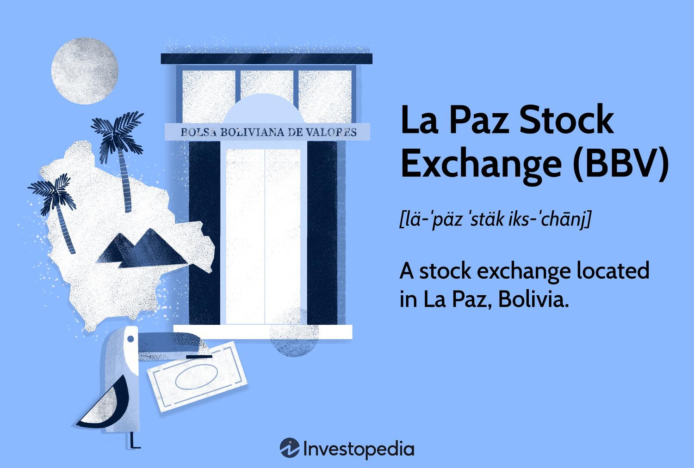

## Table of Contents

## What is the La Paz Stock Exchange?

The La Paz Stock Exchange, known as the Bolsa Boliviana de Valores (BBV), is the main stock exchange in Bolivia. It is located in La Paz, the country's capital. The BBV started in 1976 and helps companies in Bolivia to raise money by selling stocks and bonds. People can buy and sell these stocks and bonds through the exchange.

The La Paz Stock Exchange is important for Bolivia's economy. It helps businesses grow by giving them a place to get money from investors. It also helps people invest their money in different companies. The BBV works to make sure trading is fair and safe for everyone involved.

## Where is the La Paz Stock Exchange located?

The La Paz Stock Exchange is in La Paz, Bolivia. La Paz is the capital city of Bolivia. The stock exchange is called the Bolsa Boliviana de Valores, or BBV for short.

The BBV is in the center of La Paz. It's easy to find because it's in a busy part of the city. People who want to trade stocks and bonds go to this place to do their business.

## When was the La Paz Stock Exchange founded?

The La Paz Stock Exchange, also known as the Bolsa Boliviana de Valores (BBV), was founded in 1976. This was an important year because it marked the start of a place where companies in Bolivia could raise money by selling stocks and bonds.

The BBV is located in La Paz, the capital city of Bolivia. It helps the country's economy by giving businesses a way to grow and letting people invest their money in different companies. The exchange makes sure that trading is fair and safe for everyone.

## What types of securities are traded on the La Paz Stock Exchange?

The La Paz Stock Exchange, or Bolsa Boliviana de Valores (BBV), trades different types of securities. The main types are stocks and bonds. Stocks are pieces of ownership in a company. When you buy a stock, you own a small part of that company. Bonds are like loans that you give to a company or the government. They promise to pay you back with interest over time.

The BBV also trades other kinds of securities. These include mutual funds, which are collections of stocks and bonds managed by professionals. Another type is commercial paper, which is a short-term loan to a company. All these securities help companies in Bolivia get the money they need to grow and help investors make money from their investments.

## How does one invest in the La Paz Stock Exchange?

To invest in the La Paz Stock Exchange, you need to find a broker. A broker is someone who helps you buy and sell stocks and bonds. You can find brokers in Bolivia who are registered with the Bolsa Boliviana de Valores (BBV). Once you choose a broker, you'll need to open an account with them. This usually involves filling out some forms and giving them some money to start trading.

After you have an account, you can tell your broker which stocks or bonds you want to buy. They will do the trading for you on the La Paz Stock Exchange. You can also sell your investments through your broker if you decide you want your money back. It's important to keep an eye on your investments and talk to your broker about any changes you want to make.

## What are the trading hours of the La Paz Stock Exchange?

The La Paz Stock Exchange, or Bolsa Boliviana de Valores (BBV), has trading hours from 9:00 AM to 1:00 PM, local time. This means that people can buy and sell stocks and bonds during these hours on weekdays.

It's important to know the trading hours if you want to invest in the BBV. You need to make sure you can talk to your broker and make trades during this time. If you miss the trading hours, you'll have to wait until the next day to buy or sell.

## What are the main indices of the La Paz Stock Exchange?

The main index of the La Paz Stock Exchange is the Indice de la Bolsa Boliviana de Valores (IBV). This index shows how the overall stock market in Bolivia is doing. It tracks the prices of the most important stocks traded on the exchange. If the IBV goes up, it means that the stock market is doing well. If it goes down, it means the market is not doing as well.

There are no other major indices at the La Paz Stock Exchange. The IBV is the only one that people use to understand the general health of the market. It helps investors see if their investments are likely to grow or if they should be careful. By watching the IBV, people can make better choices about buying and selling stocks.

## How has the La Paz Stock Exchange performed historically?

The La Paz Stock Exchange, known as the Bolsa Boliviana de Valores (BBV), has had a varied history since it started in 1976. In the early years, the exchange was small and did not have many companies trading on it. Over time, more companies joined, and the exchange grew. The BBV has seen both good times and tough times. During good economic periods, the stock market did well, and the Indice de la Bolsa Boliviana de Valores (IBV) went up. But during economic downturns, the market struggled, and the IBV went down.

In recent years, the BBV has worked hard to improve its performance. The exchange has introduced new rules to make trading safer and more transparent. It has also tried to attract more investors, both from Bolivia and other countries. Despite these efforts, the BBV is still a small exchange compared to bigger ones in other countries. The IBV has shown steady growth in some years, but it can also be affected by Bolivia's overall economic situation. Overall, the La Paz Stock Exchange continues to play an important role in Bolivia's economy, helping companies raise money and giving people a place to invest.

## What are the regulatory bodies overseeing the La Paz Stock Exchange?

The La Paz Stock Exchange, known as the Bolsa Boliviana de Valores (BBV), is overseen by the Autoridad de Supervisión del Sistema Financiero (ASFI). The ASFI is the main regulatory body in Bolivia that makes sure the financial system, including the stock exchange, works well and is safe for everyone. They check that the BBV follows the rules and that trading is fair. The ASFI also protects investors by making sure they get correct information about the companies they invest in.

Another important regulatory body is the Superintendencia de Valores y Seguros (SVS). The SVS works closely with the ASFI to regulate the securities market. They make sure that companies follow the rules when they sell stocks and bonds on the BBV. The SVS also looks after insurance companies and other financial services. Together, the ASFI and SVS help keep the La Paz Stock Exchange running smoothly and safely.

## What are the major companies listed on the La Paz Stock Exchange?

The La Paz Stock Exchange, or Bolsa Boliviana de Valores (BBV), has several major companies listed on it. One of the biggest companies is Banco Nacional de Bolivia (BNB). BNB is a big bank that helps people save money and gives loans. Another important company is Entel, which is a telecom company. Entel helps people talk on the phone and use the internet. These companies are important because they help the economy in Bolivia grow.

Another major company on the BBV is Sociedad Boliviana de Cemento (Soboce). Soboce makes cement, which is used to build houses and roads. This company is very important for building things in Bolivia. There are also smaller companies like Farmacorp, which sells medicines. These companies help people stay healthy. Overall, the companies on the La Paz Stock Exchange are important for different parts of life in Bolivia.

## How does the La Paz Stock Exchange contribute to the Bolivian economy?

The La Paz Stock Exchange, or Bolsa Boliviana de Valores (BBV), helps the Bolivian economy by giving companies a place to get money. When companies need money to grow, they can sell stocks and bonds on the BBV. This helps them build new things, hire more people, and make more products. When companies do well, they help the whole country's economy grow. The BBV also helps people invest their money. When people buy stocks and bonds, they can make money if the companies do well. This makes more people want to save and invest, which is good for the economy.

The BBV also makes the economy more stable. It has rules to make sure trading is fair and safe. This helps people trust the market and feel safe investing their money. The BBV also helps the government by selling bonds. When the government needs money for big projects like roads and schools, it can sell bonds on the BBV. This helps the government do important work without raising taxes. Overall, the La Paz Stock Exchange plays a big role in making Bolivia's economy stronger and more stable.

## What are the future prospects and developments planned for the La Paz Stock Exchange?

The La Paz Stock Exchange, or Bolsa Boliviana de Valores (BBV), is looking to grow and improve in the future. They want to attract more companies to list their stocks and bonds on the exchange. This will give investors more choices and help the economy grow. The BBV also wants to use new technology to make trading easier and faster. They are working on making their website better so people can trade online from anywhere. This can help more people in Bolivia and other countries invest in the BBV.

Another important plan for the BBV is to make the market safer and more transparent. They want to keep improving their rules to make sure trading is fair for everyone. This will help build trust in the market and attract more investors. The BBV is also thinking about working with other stock exchanges in South America. By working together, they can share information and help each other grow. These plans show that the La Paz Stock Exchange is working hard to be a big part of Bolivia's future economy.

## References & Further Reading

[1]: Bergstra, J., Bardenet, R., Bengio, Y., & Kégl, B. (2011). ["Algorithms for Hyper-Parameter Optimization."](https://dl.acm.org/doi/10.5555/2986459.2986743) Advances in Neural Information Processing Systems 24.

[2]: ["Advances in Financial Machine Learning"](https://www.amazon.com/Advances-Financial-Machine-Learning-Marcos/dp/1119482089) by Marcos Lopez de Prado

[3]: ["Evidence-Based Technical Analysis: Applying the Scientific Method and Statistical Inference to Trading Signals"](https://www.amazon.com/Evidence-Based-Technical-Analysis-Scientific-Statistical/dp/0470008741) by David Aronson

[4]: ["Machine Learning for Algorithmic Trading"](https://github.com/stefan-jansen/machine-learning-for-trading) by Stefan Jansen

[5]: ["Quantitative Trading: How to Build Your Own Algorithmic Trading Business"](https://github.com/LucindaYa/quant-resources/blob/master/Quantitative%20Trading%20How%20to%20Build%20Your%20Own%20Algorithmic%20Trading%20Business.pdf) by Ernest P. Chan