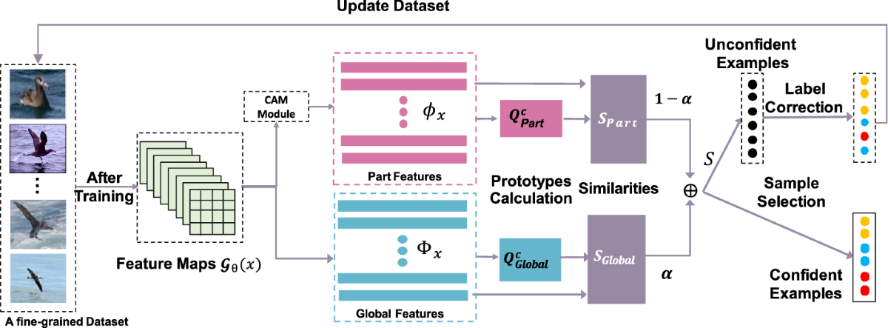

## Table of Contents

## What is label correction in machine learning?

Label correction in machine learning is the process of fixing or improving the labels of data used to train machine learning models. Labels are the correct answers or categories that the model is trying to learn. Sometimes, these labels can be wrong or not very clear. This can happen because of mistakes made by people who labeled the data, or because the data itself is hard to understand. When the labels are wrong, it can make the model learn the wrong things, which leads to bad results.

To fix this problem, people use different methods to check and correct the labels. One way is to have more than one person label the data and then compare their answers. If the labels are different, they can talk about it and decide on the best label. Another way is to use a computer program that can look at the data and suggest if a label might be wrong. After the labels are corrected, the model can be trained again with the better labels. This usually helps the model perform better and give more accurate results.

## Why is label correction important for improving model performance?

Label correction is important for improving model performance because it helps the machine learning model learn from more accurate data. When the labels are wrong, the model can learn incorrect patterns or relationships, which leads to poor predictions or classifications. By correcting the labels, we make sure that the model is trained on data that truly represents what we want it to learn. This can significantly improve the model's accuracy and reliability.

For example, if a model is being trained to identify pictures of cats and dogs, but some of the pictures labeled as "cat" are actually dogs, the model might get confused. It might start thinking that certain features of dogs are actually features of cats. By correcting these labels, we help the model understand the difference between cats and dogs more clearly. As a result, the model will be better at identifying the correct animal in new pictures it sees.

## What are common sources of label errors in datasets?

Label errors in datasets often come from human mistakes. When people label data, they can get tired or distracted, which can lead to mistakes. Sometimes the data is hard to understand, so even careful people can get it wrong. For example, if someone is labeling pictures of animals, they might not know the difference between two similar animals and label them incorrectly. Also, if the instructions for labeling are not clear, people might label things differently from what was intended.

Another source of label errors is automated labeling tools. These tools use other [machine learning](/wiki/machine-learning) models to label data quickly, but they are not perfect. They can make mistakes, especially with data that is new or different from what they were trained on. For example, an automated tool might label a picture of a rare bird as a common bird because it has not seen many pictures of the rare bird before. These automated errors can spread through a dataset if they are not checked and corrected.

Lastly, errors can happen when data is collected from different places or over time. If different people or groups collect the data, they might use different rules for labeling, which can lead to inconsistencies. Also, if the meaning of labels changes over time, old labels might not match new ones. For example, if a label for "smartphone" used to include only phones with touchscreens but now includes foldable phones, older data might be labeled incorrectly by today's standards.

## How does the Label Quality Model help in identifying label errors?

The Label Quality Model helps in identifying label errors by using a mathematical approach to measure how good the labels are in a dataset. It looks at the data and the labels to find patterns that might show mistakes. For example, if a lot of data points with the same features have different labels, the model might think there's an error. It uses a score called the "label quality score" to tell us how likely it is that a label is wrong. This score helps us know which labels to check and fix first.

The model works by comparing the labels to what the data actually shows. If a label seems to be different from what the data suggests, the model will give it a low label quality score. This means the label might be wrong and needs to be checked. By using this method, people can find and fix label errors faster and easier. This helps make the machine learning model better because it learns from more correct data.

## What is the LAEM (Label Aggregation and Error Modeling) approach?

The LAEM (Label Aggregation and Error Modeling) approach is a method used to improve the quality of labels in a dataset. It combines the work of multiple people who label the same data to find the best label. When different people label the same thing, they might not always agree. LAEM looks at these different labels and uses a smart way to decide which label is probably the right one. It also tries to understand why mistakes happen by looking at patterns in the errors. This helps to fix the labels and make the dataset better for training machine learning models.

LAEM uses a mathematical model to figure out the best label. It considers how often each person makes mistakes and how confident they are in their labels. By doing this, LAEM can give a more accurate label than just [picking](/wiki/asset-class-picking) one person's answer. For example, if three people label a picture as a cat, a dog, and a cat, LAEM might decide that "cat" is the best label because two out of three people chose it. It also looks at how often the person who labeled it as a dog makes mistakes, which helps to understand if that label might be wrong. This way, LAEM helps to clean up the dataset and make the machine learning model work better.

## Can you explain the process of implementing label correction in a machine learning pipeline?

Implementing label correction in a machine learning pipeline involves several steps that help improve the accuracy of the model. First, you start by identifying potential label errors. This can be done by using methods like the Label Quality Model or LAEM, which look at the data and the labels to find patterns that suggest mistakes. For example, if many similar data points have different labels, there might be an error. You can also have multiple people label the same data and compare their answers to see where they disagree. Once you've found where the errors might be, you need to check those labels carefully. You can do this by looking at the data again, maybe with different people or tools, to decide what the correct label should be.

After you've corrected the labels, you need to update your dataset with the new, correct labels. This means going back to your data and changing the wrong labels to the right ones. Once your dataset is updated, you can retrain your machine learning model with the new labels. This should help the model learn better because it's now working with more accurate data. Finally, you test the model again to see if its performance has improved. If it has, then the label correction was successful. If not, you might need to go back and check for more errors or use different methods to find and fix them. This process can take some time, but it's important for making sure your model works well.

## What are the different techniques used for label correction?

There are several techniques used for label correction in machine learning. One common method is to have multiple people label the same data and then compare their results. If there are disagreements, they can discuss and decide on the correct label. This is called label aggregation. Another technique is to use a computer program to check the labels. The program can look for patterns in the data that suggest a label might be wrong. For example, if many similar data points have different labels, the program can flag those labels for review. This method is often used with the Label Quality Model, which gives a score to each label to show how likely it is to be wrong.

Another technique is the LAEM approach, which stands for Label Aggregation and Error Modeling. LAEM uses both the labels from multiple people and a mathematical model to find the best label. It looks at how often each person makes mistakes and how confident they are in their labels. By considering all this information, LAEM can decide which label is probably right. This method helps to clean up the dataset and make the machine learning model work better. For example, if three people label a picture as a cat, a dog, and a cat, LAEM might decide that "cat" is the best label because two out of three people chose it.

Finally, there are also automated tools that can help with label correction. These tools use machine learning models to label data quickly, but they can make mistakes. To fix these mistakes, you can use other models to check the labels and suggest corrections. For instance, if an automated tool labels a picture of a rare bird as a common bird, another model might recognize the mistake and suggest the correct label. After using these techniques to correct the labels, you need to update your dataset and retrain your machine learning model. This should help the model perform better because it's now working with more accurate data.

## How do you measure the effectiveness of label correction methods?

To measure the effectiveness of label correction methods, you can look at how much the machine learning model's performance improves after you fix the labels. One way to do this is to use a test set of data that you know is labeled correctly. You train the model with the original dataset and then again with the corrected dataset. By comparing the model's accuracy, precision, recall, or other performance metrics on the test set before and after label correction, you can see if the correction helped. For example, if the model's accuracy goes up from 80% to 90% after label correction, that's a good sign that the method worked well.

Another way to measure the effectiveness is to look at the label quality scores before and after correction. If you are using a method like the Label Quality Model, you can compare the average label quality score of the dataset before and after you fix the labels. If the average score goes up, it means the labels are more likely to be correct. You can also look at how many labels were changed and how confident you are in those changes. If a lot of labels were corrected and you are sure those corrections are right, it's a good indication that the method was effective.

## What are the challenges faced when applying label correction in large datasets?

When applying label correction to large datasets, one of the main challenges is the sheer amount of data that needs to be checked and corrected. It can take a long time for people to go through all the data and fix the labels, especially if the dataset is very big. This can slow down the whole machine learning project. Also, if you are using multiple people to label the data, you need to make sure they all understand the task the same way. If they don't, you might end up with more errors instead of fixing them. Another challenge is that automated tools used for label correction can also make mistakes, especially with rare or unusual data. This means you still need to check the results of these tools carefully, which adds more work.

Another challenge is keeping track of all the changes made to the labels. When you have a large dataset, it can be hard to remember which labels were changed and why. You need a good system to keep track of these changes so you can go back and check them if needed. Also, if the data is coming from different sources or was collected over a long time, the labels might not be consistent. This can make it hard to know which labels are right and which need to be fixed. Overall, label correction in large datasets requires a lot of time, careful planning, and good tools to make sure it's done right and helps improve the machine learning model.

## How does label correction impact the training and validation of machine learning models?

Label correction helps make machine learning models work better by fixing wrong labels in the training data. When the labels are right, the model can learn the correct patterns and relationships in the data. This leads to more accurate predictions or classifications. For example, if a model is learning to tell cats from dogs, and some pictures labeled as cats are actually dogs, the model might get confused. By fixing these labels, the model can learn the difference between cats and dogs more clearly, which makes it better at identifying them in new pictures.

Label correction also affects how we check if the model is working well, which is called validation. When we use a test set with correct labels to see how good the model is, the results will be more reliable if the training data's labels are fixed. If the training data has wrong labels, the model might seem to do well on the test set but actually be learning the wrong things. By correcting the labels, we make sure the model is learning the right things, and the validation results will show how well it can really perform. This helps us trust the model more and use it with confidence.

## What advanced algorithms or models can be used for more sophisticated label correction?

For more sophisticated label correction, advanced algorithms like the Label Quality Model and LAEM (Label Aggregation and Error Modeling) can be used. The Label Quality Model uses a mathematical approach to measure how good the labels are in a dataset. It looks at the data and the labels to find patterns that might show mistakes. For example, if a lot of data points with the same features have different labels, the model might think there's an error. It uses a score called the "label quality score" to tell us how likely it is that a label is wrong. This score helps us know which labels to check and fix first.

Another advanced method is LAEM, which combines the work of multiple people who label the same data to find the best label. When different people label the same thing, they might not always agree. LAEM looks at these different labels and uses a smart way to decide which label is probably the right one. It also tries to understand why mistakes happen by looking at patterns in the errors. This helps to fix the labels and make the dataset better for training machine learning models. For example, if three people label a picture as a cat, a dog, and a cat, LAEM might decide that "cat" is the best label because two out of three people chose it. It also looks at how often the person who labeled it as a dog makes mistakes, which helps to understand if that label might be wrong.

## How can label correction be integrated with active learning to further enhance model accuracy?

Label correction and active learning can work together to make machine learning models more accurate. In active learning, the model picks the data it wants to learn from next. It chooses the data it's not sure about, so it can get better faster. If you use label correction with active learning, you can fix the labels of the data the model is most interested in. This means the model learns from the right data, which helps it get better and give more accurate results.

For example, if the model is unsure about a picture of an animal, it might ask for that picture's label to be checked. If the label was wrong and gets fixed, the model can learn the right thing from that picture. This way, the model keeps getting better because it's learning from more and more correct data. By combining label correction with active learning, you can make sure the model is always learning from the best possible data, which leads to better performance.

## References & Further Reading

[1]: Frenay, B., & Verleysen, M. (2014). ["Classification in the Presence of Label Noise: A Survey."](https://ieeexplore.ieee.org/document/6685834) IEEE Transactions on Neural Networks and Learning Systems.

[2]: Zhu, X., & Wu, X. (2004). ["Class Noise vs. Attribute Noise: A Quantitative Study."](https://link.springer.com/article/10.1007/s10462-004-0751-8) Artificial Intelligence Review.

[3]: Northcutt, C. G., Jiang, L., & Chuang, I. L. (2021). ["Confident Learning: Estimating Uncertainty in Dataset Labels."](https://arxiv.org/abs/1911.00068) NeurIPS.

[4]: Guan, M. Y., Gulshan, V., Dai, A. M., & Hinton, G. E. (2018). ["Who Said What: Modeling Individual Labelers Improves Classification."](https://arxiv.org/abs/1703.08774) Proceedings of the AAAI Conference on Artificial Intelligence.

[5]: Song, H. O., Kim, M., Hyun, D. J., Lee, S. J., & Lee, J. (2022). ["Learning from Noisy Labels with Deep Neural Networks: A Survey."](https://arxiv.org/abs/2007.08199) arXiv preprint arXiv:2206.00122.