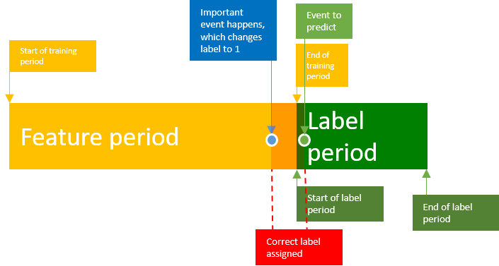

## Table of Contents

## What is label leakage in machine learning?

Label leakage in machine learning happens when information that would not be available at the time of prediction is used to train a model. This can make the model perform well during training and testing but poorly in real-world situations because it has learned from data it shouldn't have access to. For example, if you're trying to predict whether a loan will be repaid, and you include data about future payments in your training set, your model might seem accurate but won't work well when making new predictions.

This problem can be hard to spot because it often leads to models that look very good on paper. To avoid label leakage, it's important to carefully think about what data is available at the time a prediction needs to be made. You should only use data that would be available in real-time when the model is used. By keeping training data separate from future information, you can build more reliable models that work well in the real world.

## How does label leakage affect the performance of a machine learning model?

Label leakage can make a machine learning model look really good when it's being tested, but it can fail badly when used in the real world. This happens because the model learns from information it shouldn't have, like future data or data that's directly related to the thing it's trying to predict. For example, if you're trying to predict if someone will buy a product, and you include data about whether they actually bought it in your training set, your model will seem very accurate. But in real life, you won't know if someone will buy something until after they've made the decision, so your model won't work well.

To avoid label leakage, you need to be careful about what data you use to train your model. Only use information that would be available at the time you need to make a prediction. If you include data that comes after the prediction time, or data that directly tells the model the answer, you'll end up with a model that doesn't work well in real situations. Keeping your training data clean and relevant to what you can know at prediction time helps build models that are more reliable and useful in the real world.

## What are some common causes of label leakage?

Label leakage often happens when data that would not be available at the time of making a prediction is accidentally included in the training set. For example, if you're trying to predict whether a loan will be repaid, and you include data about future loan payments in your training data, your model will learn from information it shouldn't have. This can make the model seem very accurate during testing, but it won't work well in real life because it relied on future data that won't be available when making new predictions.

Another common cause of label leakage is when features in the dataset are directly related to the target variable. For instance, if you're predicting whether a patient will be diagnosed with a disease, and you include test results that were used to make the diagnosis in your training data, your model will perform well on the test set but fail in real-world scenarios. This is because the model learned from the test results, which directly indicate the disease, rather than from other, more relevant data that would be available at the time of prediction.

To prevent label leakage, it's important to carefully review your data and think about what information would be available at the time you need to make a prediction. Only use data that you would have access to in real-time when the model is used. By keeping your training data separate from future or directly related information, you can build models that are more reliable and perform better in real-world situations.

## Can you provide examples of label leakage in real-world scenarios?

Imagine you're trying to predict if a customer will churn from a service. You have data about their account activity, customer service interactions, and whether they churned or not. If you include data about customer service interactions that happened after the customer decided to churn, your model might look very good during testing. But in real life, you won't know about those interactions until after the customer has already left. This means your model won't be useful for predicting churn before it happens.

Another example is predicting if a patient will be diagnosed with a disease. If you include the results of medical tests that were used to make the diagnosis in your training data, your model will seem very accurate. But those test results directly tell you if the patient has the disease. In real life, you need to predict the disease before those tests are done. So, using the test results in your training data means your model won't work well when you need it to predict the disease before the tests are available.

## How can label leakage be detected in a dataset?

To detect label leakage in a dataset, you need to carefully look at what information you have and when it would be available in real life. Start by understanding the timeline of your data. For example, if you're predicting whether a customer will churn, think about what data you would have before they decide to leave. Check if any of the data you're using comes from after the time you need to make your prediction. If it does, that's a sign of label leakage.

Another way to spot label leakage is to look for features that are directly related to the thing you're trying to predict. If you're predicting a disease, check if any of your data includes test results that were used to diagnose the disease. Those results would directly tell you if the patient has the disease, which is something you wouldn't know before the diagnosis. By carefully reviewing your data and understanding what information would be available at the time of prediction, you can find and fix label leakage before it affects your model's performance.

## What are the best practices to prevent label leakage during data preprocessing?

To prevent label leakage during data preprocessing, it's important to understand the timeline of your data. Think about what information you would have at the time you need to make a prediction. Only include data that would be available before the event you're trying to predict happens. For example, if you're predicting whether a customer will churn, don't use data about customer service interactions that happened after they decided to leave. By keeping your training data separate from future information, you can build a model that works well in real life.

Another key practice is to carefully check your features for any that are directly related to the target variable. If you're predicting a disease, don't include test results that were used to diagnose it in your training data. Those results would directly tell you if the patient has the disease, which you wouldn't know before the diagnosis. By reviewing your data and removing any features that could lead to leakage, you can make sure your model learns from the right information and performs well in real-world scenarios.

## How does feature selection impact the risk of label leakage?

Feature selection plays a big role in preventing label leakage. When you choose which features to use in your model, you need to make sure you're only picking ones that would be available at the time you need to make a prediction. If you include features that come after the prediction time or are directly related to the target variable, you're at risk of label leakage. For example, if you're trying to predict whether a loan will be repaid, don't use data about future loan payments in your feature set. By carefully selecting features that are relevant and available before the event you're predicting, you can build a model that works well in real life.

Another way feature selection impacts label leakage is by helping you avoid including features that might seem useful but actually give away the answer. For instance, if you're predicting whether a patient will be diagnosed with a disease, you shouldn't include test results that were used to make the diagnosis. Those test results directly tell you if the patient has the disease, which you wouldn't know before the diagnosis. By reviewing your features and removing any that could lead to leakage, you can make sure your model learns from the right information and performs well in real-world scenarios.

## What role does cross-validation play in mitigating label leakage?

Cross-validation helps to spot label leakage by checking how well a model works on different parts of the data. When you use cross-validation, you split your data into several pieces and train your model on some pieces while testing it on others. This way, you can see if your model is learning from information it shouldn't have. If your model performs much better during cross-validation than it does in real life, it might be because of label leakage. By using cross-validation, you can make sure your model is learning from the right data and not from future information or data that directly tells the answer.

For example, if you're trying to predict if a customer will churn, you can use cross-validation to test your model on different groups of customers. If your model seems very accurate during cross-validation but fails when you use it in real life, it could be because you included data about customer service interactions that happened after the customer decided to leave. By carefully checking your model's performance with cross-validation, you can find and fix label leakage before it affects your model's real-world performance.

## How can time-series data lead to label leakage, and what are the solutions?

Time-series data can lead to label leakage when you accidentally use future information to predict past events. For example, if you're trying to predict tomorrow's stock price, and you include data about stock prices from next week in your model, your model will seem very accurate. But in real life, you won't know next week's prices when you're trying to predict tomorrow's price. This makes your model useless because it learned from information it shouldn't have.

To avoid label leakage in time-series data, you need to be careful about what data you use. Only use data that would be available at the time you need to make your prediction. For instance, if you're predicting tomorrow's stock price, only use data up to today. By keeping your training data separate from future information, you can build a model that works well in the real world. It's also helpful to use techniques like time-based cross-validation, where you train your model on earlier data and test it on later data, to make sure your model is learning from the right information.

## What are the ethical implications of label leakage in machine learning applications?

Label leakage in machine learning can have serious ethical implications. If a model seems to work well because of label leakage, people might trust it too much. They might use it to make important decisions, like approving loans or diagnosing diseases, without knowing it's not reliable. This can lead to unfair outcomes and harm people who depend on these decisions. For example, if a model predicts loan repayment using future payment data, it might approve loans for people who won't actually repay them, leading to financial problems for both the lender and the borrower.

To avoid these ethical issues, it's important to be careful about the data used to train models. Only use information that would be available at the time of prediction. This helps build models that are fair and reliable. By understanding and preventing label leakage, we can make sure machine learning is used in a way that helps people and doesn't cause harm. It's about being responsible and making sure our technology works for everyone in the right way.

## How do advanced techniques like feature engineering influence the occurrence of label leakage?

Feature engineering can sometimes make label leakage more likely if you're not careful. When you create new features from your data, you might accidentally include information that you wouldn't have at the time you need to make a prediction. For example, if you're trying to predict if a customer will buy a product, and you create a feature that shows how much they spent after they bought the product, your model will seem very accurate. But in real life, you won't know how much they spent until after they've made the decision to buy, so your model won't work well.

To prevent label leakage when doing feature engineering, you need to think carefully about what data you're using. Only create features from information that would be available before the event you're trying to predict. For instance, if you're predicting whether a loan will be repaid, don't use data about future loan payments to create new features. By keeping your feature engineering focused on what you can know at prediction time, you can build models that are more reliable and useful in the real world.

## What are the latest research findings on detecting and preventing label leakage in complex models?

Recent research on detecting and preventing label leakage in complex models has focused on developing new methods to identify and mitigate this issue. One key finding is the use of time-aware cross-validation techniques, which help ensure that models are trained and tested on data in a way that respects the chronological order of events. Researchers have found that by splitting data into time-based folds, it's easier to spot when future information is leaking into the model. This approach helps in building models that are more reliable in real-world scenarios because they don't rely on information that wouldn't be available at prediction time.

Another important area of research is the development of automated tools to detect label leakage. These tools analyze the features used in a model and check for any that might be directly related to the target variable or come from a future time period. By using machine learning algorithms to scan the data, these tools can flag potential issues and suggest ways to fix them. This makes it easier for data scientists to build models that are free from label leakage, improving the overall performance and ethical use of machine learning models in practical applications.