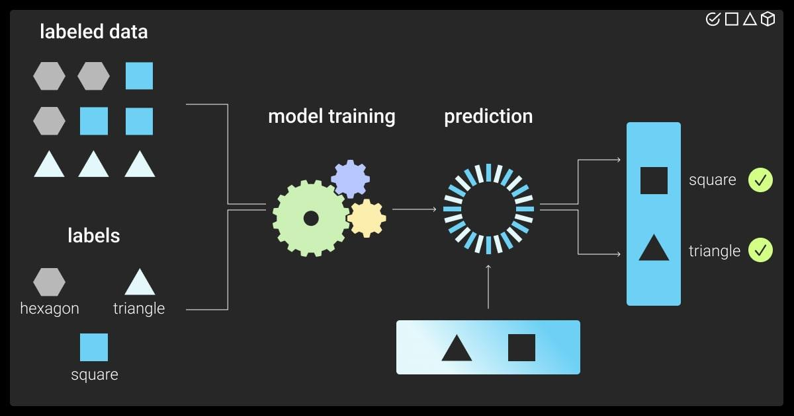

## Table of Contents

## What is a label in the context of machine learning?

In machine learning, a label is a piece of information that tells us what something is. Imagine you have a bunch of pictures, and you want a computer to learn to tell dogs from cats. You would label each picture as either "dog" or "cat." These labels help the computer understand and learn from the examples you give it.

Labels are very important because they are what the machine learning model tries to predict. When the model is being trained, it looks at the features of the data—like the shape of a dog's ears or the color of a cat's fur—and tries to match these features to the correct label. The more accurate and consistent the labels are, the better the model can learn and make correct predictions in the future.

## Why are labels important in supervised learning?

In supervised learning, labels are super important because they act like the answers to a test. When you're teaching a computer to recognize things, like telling apart apples from oranges, you show it many pictures and tell it which ones are apples and which ones are oranges. These labels help the computer learn the difference by giving it the right answers to learn from.

Without labels, the computer wouldn't know if it's getting things right or wrong. It's like trying to learn math without knowing if your answers are correct. The computer uses these labels to adjust its guesses and get better over time. The more accurate and clear the labels are, the better the computer can learn and make good predictions later on.

## How are labels used in the training process of a machine learning model?

Labels are used in the training process of a [machine learning](/wiki/machine-learning) model by providing the correct answers that the model needs to learn from. When you train a model, you feed it lots of examples, each with a label that tells the model what the correct answer should be. For instance, if you're training a model to recognize handwritten digits, each image of a digit comes with a label like "3" or "7." The model looks at the features of the image—like the curves and lines—and tries to match them to the label. This process is repeated many times with different examples, helping the model to understand the patterns and make accurate predictions.

During training, the model makes predictions based on the input data and then compares these predictions to the actual labels. If the prediction is wrong, the model adjusts its internal parameters to get closer to the correct answer next time. This adjustment is done using an optimization algorithm, which minimizes the difference between the model's predictions and the true labels. Over many iterations, the model learns to make better and better predictions, effectively "learning" from the labeled data. The accuracy and consistency of the labels are crucial because they directly influence how well the model can learn and perform on new, unseen data.

## What is the difference between labeled and unlabeled data?

Labeled data is information that comes with a clear tag or answer. Imagine you're showing a computer pictures of animals, and you tell it which ones are cats and which ones are dogs. Those tags, like "cat" or "dog," are the labels. In machine learning, labeled data is used to train models because it gives the computer the right answers to learn from. The more accurate and clear these labels are, the better the model can learn and make predictions.

Unlabeled data, on the other hand, is information without these tags. It's like showing the computer those same pictures of animals but not telling it which ones are cats and which ones are dogs. The computer has to figure things out on its own, which can be harder. Unlabeled data is often used in unsupervised learning, where the goal is to find patterns or groupings in the data without knowing the correct answers ahead of time. While labeled data is great for training models with supervision, unlabeled data can still be useful for discovering new insights or for pre-training models before fine-tuning them with labeled data.

## How can one obtain labels for a dataset?

Getting labels for a dataset can be done in a few ways. One common way is to have people manually label the data. This means you show the data to people and ask them to tag it with the right answers. For example, if you have pictures of animals, you might ask people to look at each picture and say if it's a cat or a dog. This can be time-consuming and expensive, but it's often very accurate because humans are good at understanding and labeling things. Another way is to use existing labeled data from other sources. Sometimes, other datasets or even other machine learning models can provide labels for your data, which can save time and effort.

Another method to obtain labels is through automated or semi-automated processes. This can involve using pre-trained models to predict labels for new data. For instance, if you have a model that's already good at recognizing cats and dogs, you can use it to label new pictures. This approach can be faster than manual labeling but might not be as accurate if the model makes mistakes. Additionally, there are techniques like active learning, where a model asks for human input on the most uncertain examples, combining the strengths of both manual and automated labeling. By choosing the right method or a combination of methods, you can effectively label your dataset and prepare it for machine learning tasks.

## What are the challenges associated with labeling data?

Labeling data can be tricky because it takes a lot of time and effort. If you're doing it by hand, you need people to look at each piece of data and tag it correctly. This means you might need to pay them, and it can take a long time, especially if you have a lot of data. Plus, people can make mistakes or disagree on what the right label should be, which can make the data less reliable. For example, if you're labeling pictures of animals, one person might think a certain picture is a dog while another thinks it's a wolf.

Another challenge is making sure the labels are consistent and accurate. If different people are labeling the data, they might use different standards or make different judgments, which can confuse the machine learning model. Also, some types of data are harder to label than others. For instance, labeling emotions from text or images can be really subjective, and what one person thinks is "happy" might not be the same for someone else. Using automated methods to label data can speed things up, but these methods can also make mistakes, especially if the model used for labeling isn't very good or if the data is different from what the model was trained on.

To overcome these challenges, you might use a mix of manual and automated labeling. For example, you could start with a small set of data labeled by hand and then use a machine learning model to label the rest, checking the results to make sure they're right. This can help save time and money while still keeping the labels accurate. But it's always a balance between speed, cost, and quality when it comes to labeling data.

## What is the impact of noisy or incorrect labels on model performance?

Noisy or incorrect labels can really mess up how well a machine learning model works. When the labels are wrong, the model learns from these mistakes, thinking it's getting things right when it's not. This can lead to the model making more mistakes when it tries to guess new data. Imagine if you're teaching a kid to tell apples from oranges, but you keep calling apples "oranges." The kid will get confused and start calling apples "oranges" too. The same thing happens with models; they learn the wrong patterns and their predictions become less accurate.

Fixing the problem of noisy labels can be tough. You might need to go back and check all the labels again, which takes a lot of time and effort. Or, you could use special techniques that help the model learn even when some labels are wrong. These methods can make the model better at figuring out the right answers despite the noisy labels. But even with these techniques, having too many wrong labels can still make it hard for the model to learn well and perform accurately on new data.

## How does the quality of labels affect the accuracy of machine learning models?

The quality of labels has a big impact on how accurate a machine learning model can be. When labels are correct and consistent, the model learns the right patterns and makes better predictions. For example, if you're teaching a model to tell dogs from cats, and all the pictures are labeled correctly, the model will learn what features make a dog a dog and a cat a cat. This helps the model guess right when it sees new pictures. But if the labels are wrong or all over the place, the model gets confused. It might learn the wrong things and start making mistakes, like thinking a dog is a cat because the labels said so.

Fixing bad labels can be hard work. You might have to go back and check all the labels again, which takes a lot of time. Or you could use special tricks to help the model learn even when some labels are wrong. These tricks can make the model better at figuring out the right answers. But even with these tricks, having too many wrong labels can still make it hard for the model to learn well and guess right on new data. So, making sure the labels are good is really important for making a model that works well.

## What are some techniques for improving label quality?

One way to improve label quality is by using multiple people to label the same data. When different people look at the data and agree on the labels, you can be more sure that the labels are right. If they disagree, you can talk it out or have another person check to make sure the label is correct. This can take more time, but it helps make the labels more accurate. Another way is to use clear rules or guidelines for labeling. If everyone follows the same rules, the labels will be more consistent and less likely to be wrong.

Another technique is to use machine learning models to help with labeling. You can start by having a small set of data labeled by hand, then use a model to label the rest. After that, you can check the labels the model gave and fix any mistakes. This can save a lot of time and still keep the labels pretty good. Also, there are special methods like active learning, where the model picks the data it's not sure about and asks a human to label it. This way, the model learns from the most important examples and the labels get better over time.

## How do you handle imbalanced datasets where some labels are underrepresented?

When you have an imbalanced dataset, it means some labels show up a lot more than others. This can make it hard for a machine learning model to learn well because it might focus too much on the common labels and ignore the rare ones. For example, if you're trying to predict if an email is spam or not, and most emails are not spam, the model might just guess "not spam" all the time and still be right a lot. But this isn't helpful because it misses the important spam emails. To fix this, you can use techniques like oversampling, where you make more copies of the rare labels, or undersampling, where you remove some of the common labels. Another way is to use special algorithms that are good at handling imbalanced data, like Random Forests or Support Vector Machines with class weights.

Another approach to dealing with imbalanced datasets is to change how the model learns from the data. You can use something called "cost-sensitive learning," where you tell the model to care more about getting the rare labels right. This means the model gets a bigger "penalty" for guessing wrong on the rare labels. You can also try using different evaluation metrics that focus on how well the model does with the rare labels, like precision, recall, or the F1 score. These metrics help you see if the model is doing a good job on the underrepresented classes, even if it's not perfect on the common ones. By using these techniques, you can make your model better at handling imbalanced data and make more accurate predictions for all labels.

## What are semi-supervised learning and how does it utilize labels?

Semi-supervised learning is a way to train machine learning models that uses both labeled and unlabeled data. Imagine you're teaching a computer to tell cats from dogs. You have some pictures with labels saying "cat" or "dog," but you also have a lot more pictures without labels. In semi-supervised learning, the computer uses the labeled pictures to learn the difference between cats and dogs and then tries to figure out the labels for the unlabeled pictures. This method can be really helpful because getting labels can be expensive and time-consuming, so using both types of data helps make the most of what you have.

The way semi-supervised learning uses labels is by starting with the labeled data to train the model. Once the model has a basic understanding from the labeled data, it then looks at the unlabeled data to improve its guesses. The model might use what it learned from the labeled data to predict labels for the unlabeled data, and then use those predictions to refine its understanding even more. This back-and-forth process helps the model get better at making accurate predictions, even when there are fewer labeled examples than you might need for fully supervised learning.

## What advanced methods exist for label propagation in graph-based learning?

Label propagation in graph-based learning is a cool way to guess labels for data that doesn't have them yet. Imagine you have a bunch of pictures of animals, and some are labeled as "cat" or "dog," but others aren't. You can think of these pictures as connected in a big web, where similar pictures are close to each other. In label propagation, you start with the labeled pictures and let the labels "spread" to the unlabeled ones based on how connected they are. The idea is that if a picture is close to a bunch of "cat" pictures, it's probably a cat too. This method can help you label a lot of data without having to do it all by hand.

There are a few smart ways to do label propagation in graphs. One popular method is called "Label Propagation Algorithm" (LPA). In LPA, you start by giving each node (which is like a picture in our example) a label. Then, you keep updating the labels of the nodes based on what their neighbors are labeled. Over time, the labels spread out and become more stable. Another method is "Label Spreading," which is similar but uses a different way to update the labels, making sure the process is smoother and less likely to get stuck. Both methods help you use the labeled data you have to figure out the labels for the rest, making your machine learning model better at guessing what things are.

## References & Further Reading

[1]: Krizhevsky, A., Sutskever, I., & Hinton, G. E. (2012). ["ImageNet Classification with Deep Convolutional Neural Networks."](https://dl.acm.org/doi/10.1145/3065386) Advances in Neural Information Processing Systems 25.

[2]: Chapelle, O., Scholkopf, B., & Zien, A. (2006). ["Semi-Supervised Learning."](https://ieeexplore.ieee.org/abstract/document/4787647) MIT Press.

[3]: Zhu, X. (2005). ["Semi-supervised learning literature survey."](https://www.minds.wisconsin.edu/handle/1793/60444) Computer Sciences Technical Report 1530, University of Wisconsin-Madison.

[4]: Weiss, G. M. (2004). ["Mining with Rarity: A Unifying Framework."](https://dl.acm.org/doi/10.1145/1007730.1007734) SIGKDD Explorations.

[5]: Van Engelen, J. E., & Hoos, H. H. (2020). ["A survey on semi-supervised learning."](https://link.springer.com/article/10.1007/s10994-019-05855-6) Machine Learning, 109(2), 373-440.

[6]: Wang, S., & Manning, C. (2014). ["Fast dropout training."](https://nlp.stanford.edu/pubs/sidaw13fast.pdf) Journal of Machine Learning Research, 15, 1181-1206.

[7]: Settles, B. (2009). ["Active learning literature survey."](https://burrsettles.com/pub/settles.activelearning.pdf) Computer Sciences Technical Report 1648, University of Wisconsin-Madison.