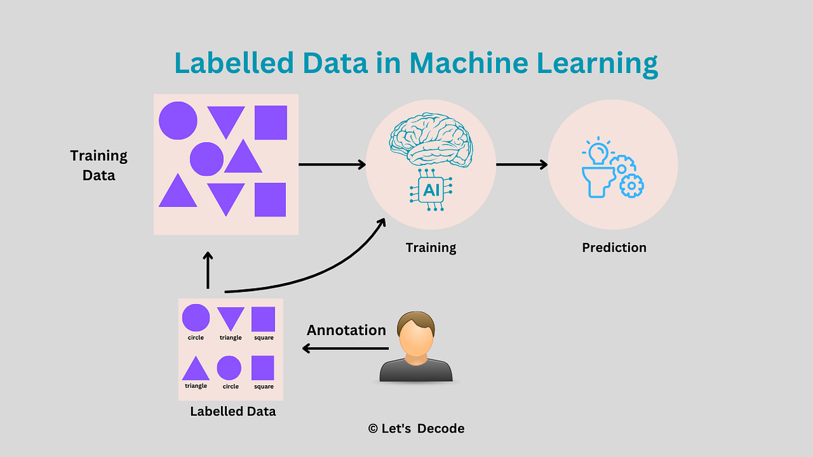

## Table of Contents

## What is a labeled example in machine learning?

A labeled example in machine learning is a piece of data that has been tagged with the correct answer or category. Imagine you're teaching a computer to recognize different types of fruits. You would show it a picture of an apple and label it as "apple". This labeled example helps the computer learn what an apple looks like so it can identify apples in new pictures later.

In technical terms, a labeled example is often represented as a pair $$(x, y)$$, where $$x$$ is the input data (like the picture of the fruit) and $$y$$ is the correct label (like "apple"). These labeled examples are crucial for supervised learning, where the machine learning model is trained using these examples to make predictions or decisions. By providing the model with many labeled examples, it can learn patterns and make accurate predictions on new, unseen data.

## Why are labeled examples important in supervised learning?

Labeled examples are the backbone of supervised learning. They act like a teacher showing the computer what the right answer is for different pieces of data. When you have a lot of labeled examples, the computer can study them and learn to spot patterns. For instance, if you're teaching a computer to tell cats from dogs, you'd show it many pictures of cats labeled as "cat" and dogs labeled as "dog". The more examples the computer sees, the better it gets at telling them apart.

These examples help the computer make good guesses on new data it hasn't seen before. In supervised learning, the goal is to make a model that can predict the right label for new data. The model does this by learning from the labeled examples during training. If the model sees a new picture and it's really good at recognizing patterns from its training, it can say with confidence whether the picture is of a cat or a dog. So, labeled examples are crucial because they guide the learning process and help the model become accurate and reliable.

## How are labeled examples created?

Labeled examples are made by people who go through data and add the right labels to it. For instance, if you want to teach a computer to recognize different animals, you would look at a bunch of pictures and label each one as "dog", "cat", "bird", and so on. This process can take a lot of time and effort, especially if you have a lot of data to label. Sometimes, people use special tools or software to help them label data more quickly and accurately.

In some cases, labeled examples can be created automatically or semi-automatically. For example, if you're working with text data, you might use existing databases or online resources to automatically label some of the data. Another way is to use a small set of labeled examples to train a preliminary model, which can then help label more data. This method is called "active learning" and can speed up the process of creating labeled examples. Even though these methods help, human oversight is usually needed to make sure the labels are correct and useful for training the final model.

## What is the difference between labeled and unlabeled data?

Labeled data is information that has been given a tag or label to show what it is. For example, if you have a picture of a dog and you label it as "dog", that's labeled data. In [machine learning](/wiki/machine-learning), labeled data is used to train models in supervised learning. The model learns from these examples to make predictions on new data. Labeled data is often written as a pair $$(x, y)$$, where $$x$$ is the data and $$y$$ is the label.

Unlabeled data, on the other hand, is information that doesn't have any tags or labels. It's just raw data without any extra information about what it represents. For example, a picture of a dog without the "dog" label is unlabeled data. Unlabeled data is used in unsupervised learning, where the model tries to find patterns or groups in the data without any guidance. It's also used in semi-supervised learning, where a small amount of labeled data is combined with a lot of unlabeled data to train a model.

## Can you explain the role of labeled examples in training a model?

Labeled examples are like the teacher's notes in a classroom. When you train a machine learning model, you show it a bunch of these labeled examples. Each example has some data, like a picture or a sound, and a label that tells the model what the data is. For example, if you're teaching a computer to tell cats from dogs, you'd show it pictures of cats labeled as "cat" and pictures of dogs labeled as "dog". The model looks at these examples and tries to figure out what makes a cat a cat and a dog a dog. This process helps the model learn patterns and make good guesses on new data it hasn't seen before.

Once the model has seen enough labeled examples, it can start making predictions. If you show it a new picture, the model uses what it learned from the labeled examples to decide if it's a cat or a dog. The more labeled examples the model sees, the better it gets at making the right guesses. This is why labeled examples are so important in supervised learning. They guide the model's learning and help it become accurate and reliable. Without labeled examples, the model wouldn't know what to look for and wouldn't be able to learn how to make predictions.

## What are some common sources of labeled data?

Labeled data often comes from people who look at the data and add labels to it. For example, if you want to teach a computer to recognize different types of flowers, you might hire people to look at pictures of flowers and label them as "rose", "tulip", or "daisy". This can be done using special software that makes it easier to label lots of pictures quickly. Another common source of labeled data is existing databases or online resources. For instance, if you're working with text data, you might use a dictionary or encyclopedia to automatically label some of the data.

Sometimes, labeled data can also be created using other machine learning models. This is called "active learning". In active learning, you start with a small set of labeled data to train a preliminary model. This model then helps label more data, which can speed up the process. Even though these methods help, people still need to check the labels to make sure they're correct. This is important because the quality of the labeled data directly affects how well the final model will work.

## How does the quality of labeled examples affect model performance?

The quality of labeled examples is really important for how well a machine learning model works. If the labels are wrong or not clear, the model can get confused and learn the wrong things. For example, if you label a picture of a cat as a "dog", the model might start thinking that cats are dogs. This can make the model give wrong answers when it sees new pictures. So, it's important to make sure the labels are right and clear so the model can learn the right patterns.

Good quality labels help the model learn better and make better guesses on new data. If the labels are accurate and consistent, the model can see the right patterns and learn from them. This makes the model more reliable and useful. For example, if every picture of a cat is labeled as "cat" correctly, the model will learn what a cat looks like and be able to tell cats from other animals. So, spending time and effort to make sure the labels are good is worth it because it helps the model perform better.

## What are the challenges associated with labeling data?

Labeling data can be really hard and take a lot of time. It's because people have to look at each piece of data and decide what label to put on it. If you have a lot of data, this can take forever. Plus, it can be boring and tiring, so people might make mistakes or not do a good job. It's also tough to make sure everyone labels the data the same way, especially if different people are doing the labeling. If the labels aren't the same, it can mess up the model's learning.

Another challenge is making sure the labels are right. Sometimes, the data can be tricky to label, like if a picture is not clear or if the thing you're trying to label is hard to see. Also, some data might need special knowledge to label correctly. For example, if you're labeling medical images, you might need a doctor to do it right. All these things make labeling data a big challenge, but it's really important to get it right so the model can learn well and make good guesses on new data.

## How can you evaluate the effectiveness of labeled examples?

You can evaluate the effectiveness of labeled examples by looking at how well the model performs after it's been trained with them. If the model can make good guesses on new data that it hasn't seen before, that means the labeled examples were helpful. You can measure this by using things like accuracy, which is how often the model gets the right answer, or precision and recall, which look at how well the model finds the right things and avoids wrong ones. If these numbers are high, it's a sign that the labeled examples were good and helped the model learn well.

Another way to check the effectiveness of labeled examples is to see how the model does when you use different sets of labeled data. You can split your data into a training set and a test set. The training set is used to teach the model, and the test set is used to see how well it learned. If the model does well on the test set, it means the labeled examples in the training set were useful. You can also try using different ways of labeling the same data and see which way helps the model perform better. This can show you if the way you labeled the data matters and how you can make it better.

## What techniques are used to improve the efficiency of labeling data?

One way to make labeling data more efficient is by using special tools and software. These tools can help people label data faster and with fewer mistakes. For example, they might let you label lots of pictures at once or use shortcuts to make the process quicker. Another technique is called active learning, where you start with a small set of labeled data to train a preliminary model. This model then helps label more data, which speeds up the process. Even though these methods help, it's still important for people to check the labels to make sure they're right.

Another technique is to use crowdsourcing, where lots of people help label the data. This can make the process go faster because many people are working on it at the same time. But it's important to make sure everyone is labeling the data the same way, so you might need to give them clear instructions or check their work. Also, using pre-existing labeled datasets can save time. If you can find a dataset that's already labeled and fits your needs, you can use it to train your model without having to label everything from scratch.

## How do semi-supervised and active learning approaches utilize labeled examples?

Semi-supervised learning uses both labeled and unlabeled data to train a model. It starts with a small set of labeled examples, which helps the model learn some basic patterns. Then, it uses a lot more unlabeled data to help the model learn even more. The idea is that the model can use what it learned from the labeled examples to make guesses about the unlabeled data. If the model is confident about its guesses, those guesses can be used as new labeled examples. This way, semi-supervised learning can make the most out of a small number of labeled examples and still train a good model.

Active learning is a bit different. It starts with a small set of labeled examples too, but then it picks the most helpful unlabeled examples to be labeled next. The model looks at the unlabeled data and decides which examples it's not sure about. Those examples are then given to a person to label. By choosing the most important examples to label, active learning can make the model learn faster and better, even with fewer labeled examples. This approach can save a lot of time and effort because you only need to label the data that really helps the model improve.

## What are the advanced methods for generating synthetic labeled examples?

One advanced method for generating synthetic labeled examples is using generative models like Generative Adversarial Networks (GANs). GANs can create new data that looks a lot like the real data you already have. For example, if you have pictures of cats and dogs, a GAN can make new pictures of cats and dogs that look real. You can then label these new pictures with the right labels, like "cat" or "dog". This way, you can get more labeled examples without having to collect and label new real data. This can be really helpful if getting more real data is hard or expensive.

Another method is [data augmentation](/wiki/data-augmentation), which changes the existing labeled data a bit to make new examples. For example, if you have a picture of a cat, you can flip it, rotate it, or change its color a little bit. Each of these changes makes a new picture that you can label as "cat". This gives you more labeled examples to train your model with. Data augmentation can help the model learn better because it sees the same thing in different ways. Both GANs and data augmentation are smart ways to make more labeled examples and help your model learn well, even if you don't have a lot of real data to start with.