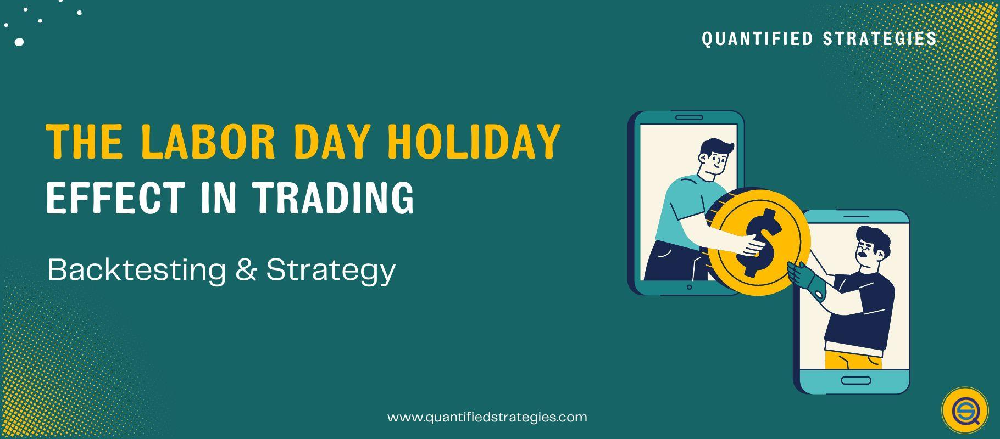

## Table of Contents

## What is the Labor Day Effect in trading?

The Labor Day Effect is a pattern that some traders and investors believe happens in the stock market around the time of Labor Day, which is in early September in the United States. People who follow this effect think that the stock market often goes up right after Labor Day. They believe this happens because many people come back from their summer vacations and start trading again, which can make the market more active and push stock prices higher.

However, not everyone agrees that the Labor Day Effect is real. Some people say it's just a coincidence and that the market can go up or down for many different reasons. It's important for traders to remember that past patterns don't always predict what will happen in the future. So, while some might use the Labor Day Effect to help make trading decisions, it's always a good idea to look at a lot of different information before making choices about buying or selling stocks.

## How does the Labor Day Effect impact stock market performance?

The Labor Day Effect suggests that the stock market tends to perform better right after Labor Day in early September. Some traders believe this happens because many people return from their summer vacations around this time. When people come back, they start trading again, which can make the market more active. This increased activity might push stock prices up as more people buy and sell stocks.

However, not everyone agrees that the Labor Day Effect really impacts the stock market. Some people think it's just a coincidence and that the market can go up or down for many different reasons, not just because of Labor Day. It's important for traders to remember that past patterns don't always predict what will happen in the future. So, while some might consider the Labor Day Effect when making trading decisions, it's smart to look at a lot of different information before deciding to buy or sell stocks.

## What historical data supports the existence of the Labor Day Effect?

Some people believe in the Labor Day Effect because they have seen the stock market go up after Labor Day in the past. They look at old stock market numbers and see that sometimes, the market does better in the first few days or weeks after Labor Day. For example, they might notice that the stock market has gone up more often than it has gone down right after Labor Day over many years.

However, not everyone agrees that this pattern is real. Some people say that the stock market can go up or down for many different reasons, and it's hard to say that Labor Day is the main reason. They think that looking at the stock market over a short time, like just after Labor Day, might not show the whole picture. So, while some traders use the Labor Day Effect to help them make decisions, others think it's not a strong enough reason to change their trading plans.

## Are there specific sectors or stocks more affected by the Labor Day Effect?

Some people think that certain sectors or stocks might be more affected by the Labor Day Effect, but there's no clear agreement on which ones. Sectors like retail and travel might see more activity after Labor Day because people are back from vacation and might start spending money again. Stocks in these sectors could go up if more people are buying things.

However, there isn't strong evidence to say for sure which sectors or stocks are more affected. The stock market can change for many reasons, and it's hard to say that Labor Day makes a big difference for any specific sector or stock. Traders who believe in the Labor Day Effect might look at past data to see if certain stocks went up more often after Labor Day, but they should also think about other things that could affect the market.

## How can traders prepare for the Labor Day Effect?

Traders who believe in the Labor Day Effect might want to get ready by looking at past stock market numbers. They can see if the market usually goes up after Labor Day and if certain stocks or sectors do better. This can help them decide which stocks to buy or sell after the holiday. It's also a good idea to keep an eye on the news and other things that might affect the market, like big events or changes in the economy.

Even though some people think the Labor Day Effect is real, it's important not to rely on it too much. The stock market can change for many reasons, and past patterns don't always predict the future. So, traders should use the Labor Day Effect as just one part of their plan. They should also look at a lot of different information and think carefully before making any trading decisions.

## What are the psychological factors contributing to the Labor Day Effect?

People think the Labor Day Effect happens because of how people feel and act after the holiday. When Labor Day is over, a lot of people come back from their summer vacations. They start thinking about work and money again. This can make them want to start trading stocks, which can make the market busier. When more people are buying and selling, it can push stock prices up.

But not everyone agrees that the way people feel after Labor Day makes a big difference. Some say that the stock market can go up or down for many other reasons, and it's hard to say that feelings after a holiday are the main cause. Even if people feel more ready to trade after Labor Day, other big things happening in the world or the economy can change the market more. So, while some traders might think about how people feel after Labor Day, it's just one small part of what can affect the stock market.

## Can the Labor Day Effect be observed in markets outside the United States?

The Labor Day Effect is mainly talked about in the United States because Labor Day is a big holiday there. But some people wonder if the same thing happens in other countries after their big holidays. In other places, people might also come back from vacation and start trading again, which could make the market busier. But since Labor Day is specific to the U.S., it's hard to say if the same effect happens in other countries after their own holidays.

There isn't a lot of clear evidence that the Labor Day Effect happens in markets outside the United States. Each country has its own holidays and ways of doing things, so what happens in the U.S. might not happen the same way somewhere else. If people in other countries see their stock market go up after a big holiday, it could be for different reasons, not just because people are back from vacation. So, while the idea of the Labor Day Effect might be interesting to think about in other markets, it's not something that's proven to happen everywhere.

## How reliable is the Labor Day Effect as a trading strategy?

The Labor Day Effect is not very reliable as a trading strategy. Some people think that the stock market goes up after Labor Day because people come back from vacation and start trading again. But this idea is not backed up by strong evidence. The stock market can change for many reasons, like big news or changes in the economy. Just because the market went up after Labor Day in the past doesn't mean it will happen every year.

It's better for traders to look at a lot of different information before making trading decisions. While the Labor Day Effect might be interesting to think about, it's just one small part of what can affect the market. Traders should not rely on it too much. Instead, they should use it along with other data and be ready for the market to do something different than what the Labor Day Effect suggests.

## What are the differences between the Labor Day Effect and other seasonal market patterns?

The Labor Day Effect is a pattern some people think happens in the stock market right after Labor Day in the United States. They believe that when people come back from their summer vacations, they start trading again, which makes the market busier and can push stock prices up. But this idea is not very strong because the market can change for many reasons, and it's hard to say that Labor Day is the main reason for these changes. Other seasonal market patterns, like the January Effect or the Santa Claus Rally, are also based on the idea that certain times of the year can affect the stock market.

The January Effect is when some people think the stock market goes up in January because people sell stocks at the end of the year to save on taxes and then buy them back in January. The Santa Claus Rally is another pattern where some believe the market goes up in the last week of December and the first two trading days of January, maybe because people feel happy around the holidays and want to buy stocks. Unlike the Labor Day Effect, these other patterns have been studied more and some people think they might be a bit more reliable, but they still aren't perfect predictors of what the market will do.

In the end, all these seasonal patterns, including the Labor Day Effect, should be used carefully. They are just small parts of what can affect the stock market. Traders should look at a lot of different information and not rely too much on any one pattern because the market can change for many reasons that have nothing to do with holidays or the time of year.

## How do algorithmic traders exploit the Labor Day Effect?

Algorithmic traders might try to use the Labor Day Effect by making their computer programs look at past stock market numbers. They see if the market usually goes up after Labor Day and then set their programs to buy stocks right after the holiday. These programs can trade very fast and can buy a lot of stocks in a short time, hoping to make money if the market goes up like it did in the past.

But, the Labor Day Effect is not a sure thing. The stock market can change for many reasons, and just because it went up after Labor Day before doesn't mean it will happen every year. So, algorithmic traders need to be careful and not rely only on this pattern. They should also look at other things that might affect the market, like big news or changes in the economy, to make better trading decisions.

## What are the potential risks associated with trading based on the Labor Day Effect?

Trading based on the Labor Day Effect can be risky because it's not a sure thing. The stock market can go up or down for many reasons, and just because it went up after Labor Day in the past doesn't mean it will happen every year. If traders put too much faith in this pattern and the market doesn't go up, they could lose money. They might buy stocks thinking the market will go up, but if it goes down instead, they could end up selling at a loss.

Another risk is that traders might focus too much on the Labor Day Effect and ignore other important things that can affect the market. Big news or changes in the economy can have a bigger impact on stock prices than a holiday. If traders don't pay attention to these other factors, they might make bad trading decisions. It's important to look at a lot of different information and not rely too much on any one pattern like the Labor Day Effect.

## How has the Labor Day Effect evolved over the years, and what might influence its future trends?

Over the years, the Labor Day Effect has not shown a clear pattern that everyone agrees on. Some years, the stock market goes up right after Labor Day, but other years, it doesn't. This makes it hard to say if the Labor Day Effect is real or just a coincidence. People used to think that when everyone came back from their summer vacations, they started trading again, which made the market busier and pushed stock prices up. But as more people use computers and the internet for trading, and as the world changes, it's harder to see this effect happening the same way every year.

In the future, many things could change how the Labor Day Effect works. Big events like changes in the economy, new laws, or even big news stories can affect the stock market more than a holiday. Also, more people are trading all the time, not just after holidays, which might make the Labor Day Effect less important. Traders need to keep an eye on all these things and not just focus on one pattern like the Labor Day Effect. The best way to trade is to look at a lot of different information and be ready for the market to do something different than what the Labor Day Effect suggests.

## References & Further Reading

[1]: ["Advances in Financial Machine Learning"](https://www.amazon.com/Advances-Financial-Machine-Learning-Marcos/dp/1119482089) by Marcos Lopez de Prado

[2]: ["Evidence-Based Technical Analysis: Applying the Scientific Method and Statistical Inference to Trading Signals"](https://www.amazon.com/Evidence-Based-Technical-Analysis-Scientific-Statistical/dp/0470008741) by David Aronson

[3]: ["Machine Learning for Algorithmic Trading"](https://github.com/PacktPublishing/Machine-Learning-for-Algorithmic-Trading-Second-Edition) by Stefan Jansen

[4]: ["Quantitative Trading: How to Build Your Own Algorithmic Trading Business"](https://books.google.com/books/about/Quantitative_Trading.html?id=j70yEAAAQBAJ) by Ernest P. Chan

[5]: Bergstra, J., Bardenet, R., Bengio, Y., & Kégl, B. (2011). ["Algorithms for Hyper-Parameter Optimization."](https://proceedings.neurips.cc/paper/2011/file/86e8f7ab32cfd12577bc2619bc635690-Paper.pdf) Advances in Neural Information Processing Systems 24.