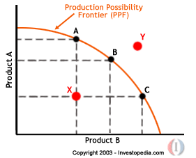

Every year, Labor Day signals the unofficial end of summer, offering a period of respite for numerous professionals, including stock market traders. As a pivotal moment in the annual calendar, it prompts reflection on its potential implications for the stock market, particularly through the rapidly evolving practice of algorithmic trading. This article seeks to explore this impact, focusing on how specific trading algorithms react during this period and the broader effects on market dynamics.

Algorithmic trading, which involves using automated systems and complex algorithms to execute trades at optimal speeds and prices, has revolutionized how many investors approach the stock market. With its data-driven approach, algorithmic trading thrives on recognizing and capitalizing on patterns, including those created by market holidays. Understanding the impact of Labor Day on stock market behavior and how it influences algorithmic strategies is crucial for traders aiming to optimize their approaches.



Analyzing historical data provides insights into how Labor Day might affect trading strategies. Market dynamics around holidays like Labor Day can differ due to reduced trading volumes, altered investor behaviors, and potential volatility. These factors offer both opportunities and challenges, making it significant for traders, especially those employing algorithms, to comprehend how such a holiday impacts market activities.

By examining historical trends and algorithmic strategies around this period, investors can gain a nuanced understanding of the holiday's influence. This knowledge can guide decision-making processes, aiding in the optimization of algorithmic trading strategies. Thus, analyzing the interplay between Labor Day, stock market dynamics, and algorithmic trading offers valuable insights for both current and future trading environments.

## Table of Contents

## Understanding Labor Day and the Stock Market

Labor Day, observed on the first Monday in September, is a significant federal holiday in the United States that honors the contributions of workers to the nation's strength and prosperity. This holiday encapsulates a break for many industries, including the financial markets, where trading activities come to a complete halt. This cessation is defined by the closure of stock exchanges, such as the New York Stock Exchange (NYSE) and the NASDAQ, which do not operate during federal holidays.

The closure induced by Labor Day offers a distinctive scenario for stock market participants. Primarily, traders and investors use this opportunity to pause and reflect on their strategies, aiming to optimize their portfolio performance for the remainder of the year. The interruption is especially noteworthy for algorithmic traders, who rely heavily on continuous data feeds to calibrate their strategies.

Algorithmic trading systems, which process vast quantities of historical and real-time data, must adjust to the pause in financial data streams. As such, Labor Day can act as a natural marker for recalibration, prompting algorithm developers to adjust their models for the fluctuations expected in market behavior post-holiday.

Furthermore, the anticipation of Labor Day's closure might lead to varied trading behaviors in the days leading up to the holiday. Some traders might choose to close positions to avoid uncertainties, while others could strategically hold assets, foreseeing a profitable market movement once trading resumes. The pause not only impacts individual trading tactics but also allows market analysts to reassess broader market trends, [volatility](/wiki/volatility-trading-strategies) patterns, and [liquidity](/wiki/liquidity-risk-premium) changes.

The strategic implications of Labor Day extend beyond immediate trading decisions. It also affects long-term financial planning as investors reassess quarterly performance and revise forecasts. Understanding this holiday's impact on trading can aid in making informed predictions, strategically timing market entry and [exit](/wiki/exit-strategy) points, and effectively managing risk upon market reopening.

In summary, Labor Day's closure of the financial markets serves as a valuable period for strategy reevaluation, offering a pause to reassess financial positions and adjust trading algorithms in anticipation of potential market shifts when trading resumes. This holiday presents a strategic intermission allowing players in the stock market to prepare for the subsequent stages of the fiscal year with refined strategies and enhanced rigor.

## Seasonal Effects: Historical Data Analysis

Analysis of 73 years of S&P 500 data reveals that the stock market typically experiences minimal movements around Labor Day. This period, marked by the closure of U.S. financial markets, often results in average daily returns that are nearly flat. Consequently, opportunities for seasonal gains based solely on this holiday are limited. 

Historical data illustrates that, while some years have exhibited slight trends, these occurrences are relatively rare and inconsistent. Statistically, the average return on the trading days surrounding Labor Day tends to hover close to zero, reflecting the absence of significant market shifts. This lack of volatility poses challenges for traders who seek to capitalize on predictable seasonal patterns.

To further understand the impact of Labor Day on stock market behavior, we can consider simple statistical analyses. For example, calculating the mean and standard deviation of daily returns around Labor Day across the 73-year span offers insights into typical market behavior during this period. A Python snippet to perform this analysis might look like:

```python
import numpy as np
import pandas as pd

# Example of daily returns data
data = pd.DataFrame({'date': pd.date_range(start='1948-01-01', periods=18250), 
                     'return': np.random.normal(0, 0.01, 18250)})

# Assuming data is a DataFrame with 'date' and 'return' columns
labor_day_mask = (data['date'].dt.month == 9) & (data['date'].dt.weekday <= 4)
labor_day_returns = data[labor_day_mask]['return']

mean_return = labor_day_returns.mean()
std_dev = labor_day_returns.std()

print(f"Mean Return: {mean_return:.5f}, Standard Deviation: {std_dev:.5f}")
```

This script highlights the process of isolating returns around Labor Day and computing their mean and standard deviation. Such analyses confirm the minimal movements typically observed, reinforcing that while some years might deviate, the overall historical pattern is lacking in strong, predictable trends. Consequently, traders find it challenging to devise reliable strategies based solely on Labor Day effects, necessitating a consideration of broader market dynamics.

## Algorithmic Trading Strategies around Labor Day

Algorithmic trading, a practice that uses computer algorithms to execute trades based on predefined criteria, often relies on historical patterns to guide decision-making. Despite the relatively minimal impact of Labor Day on market movements, as discussed in historical data sections, traders often adapt their algorithms to account for this holiday, ensuring they do not overly depend on such seasonal effects.

Given the context of Labor Day, one approach for algorithmic traders is to focus on pre-holiday market trends. For example, traders may detect increased volatility or [volume](/wiki/volume-trading-strategy) in the days leading up to Labor Day and can program algorithms to exploit these conditions. These algorithms can be designed to execute trades just before the market closes for the holiday, aiming to benefit from any last-minute market adjustments or anticipatory moves by other traders.

A simplistic algorithm might look to identify pre-holiday market [momentum](/wiki/momentum) by evaluating patterns such as sudden changes in trading volume or price action. A Python example could be:

```python
import pandas as pd
import numpy as np

# Load historical trading data for a given stock or index
data = pd.read_csv('historical_stock_data.csv')

# Calculate moving average and standard deviation
data['Moving_Average'] = data['Close'].rolling(window=5).mean()
data['Std_Dev'] = data['Close'].rolling(window=5).std()

# Define pre-holiday trading day
pre_holiday_date = '2023-09-01'

# Identify trading signals based on criteria (e.g., price moves 2 standard deviations from moving average)
data['Signal'] = np.where((data['Date'] < pre_holiday_date) & 
                          (data['Close'] > data['Moving_Average'] + 2*data['Std_Dev']), 'Buy', 'Hold')

# Extract signals
pre_holiday_signals = data[data['Date'] < pre_holiday_date]

# Output signals for execution
print(pre_holiday_signals[['Date', 'Close', 'Signal']])
```

This sample code identifies potential buy signals in the days leading to Labor Day based on price deviations from a moving average. However, it is critical to consider that such approaches [carry](/wiki/carry-trading) risks due to the inconsistent nature of holiday-driven market changes. As algorithms assess these scenarios, the importance of avoiding over-optimization for specific short-term effects is paramount. 

Moreover, the post-holiday period may introduce a different set of considerations. Algorithms can be adjusted to monitor changes in market sentiment as trading resumes, and to execute trades based on detected rebounds or price corrections. These adjustments require careful calibration and [backtesting](/wiki/backtesting) to ensure that the strategies remain effective over varying market conditions and do not lead to false positives.

Ultimately, the successful deployment of [algorithmic trading](/wiki/algorithmic-trading) strategies around Labor Day necessitates a dynamic approach, one that harmonizes data-driven insights with robust risk management principles to navigate the subtle nuances of this holiday period.

## Challenges and Considerations

Traders face several challenges when designing and implementing strategies based on holiday effects like Labor Day. One of the primary concerns is the inconsistency of the Labor Day effect itself. Historical data analysis shows that stock market movements around this holiday tend to be minor and unpredictable. This inconsistency can make it difficult for traders to rely solely on such patterns for making strategic decisions.

Algorithmic trading strategies must account for multiple market variables to mitigate the risks associated with holiday-based strategies. Market liquidity is a critical [factor](/wiki/factor-investing); during periods surrounding a holiday, liquidity can decrease as many participants may be absent, leading to wider spreads and increased price volatility. Therefore, algorithms should be equipped to handle changes in order execution and pricing, adjusting dynamically to varying levels of liquidity.

Additionally, news events occurring around Labor Day can significantly impact market behavior, compounding the challenge for algorithmic trading systems. Unexpected news could lead to market movements that might nullify any anticipated seasonal trends. It's essential for traders to integrate news sentiment analysis into their algorithms to better anticipate and react to such events.

Traders also need to consider behavioral finance aspects, such as anticipatory trading or post-holiday rebound phenomena, where market participants adjust their positions before or immediately after the holiday. Algorithms can be trained to detect such behavioral patterns but require robust testing to ensure efficacy across different market conditions.

To build a resilient trading strategy around Labor Day, risk management must be prioritized. Algorithms can employ stop-loss and take-profit measures to safeguard against adverse price movements. Additionally, diversifying investment portfolios can help distribute risk more evenly, reducing the dependency on any single pattern or event.

Lastly, continuous back-testing and real-time data analysis are integral to refining these algorithmic strategies. By assessing historical performance and adapting to innovations in data analysis techniques, traders can create more robust models designed to capitalize on the limited opportunities Labor Day might present, while effectively managing associated risks.

## Conclusion and Future Outlook

Labor Day's influence on the stock market, particularly through algorithmic trading, reveals relatively unpredictable patterns. While historical data indicates minimal average daily returns around this holiday, there are opportunities for traders to enhance their strategies by leveraging insights from past trends and market sentiments. This understanding helps in fine-tuning algorithmic models to circumvent potential market inefficiencies.

The future of trading around Labor Day, especially with algorithmic systems, emphasizes the importance of advancing data analysis techniques. Enhanced algorithms can incorporate [machine learning](/wiki/machine-learning) methods to better process historical data and identify subtle market signals that might emerge in the pre- and post-Labor Day periods. For instance, traders can use Python to apply machine learning libraries like scikit-learn to implement supervised learning models that predict stock movements based on historical trends.

```python
from sklearn.model_selection import train_test_split
from sklearn.ensemble import RandomForestRegressor
import pandas as pd

# Load historical stock data
data = pd.read_csv('historical_stock_data.csv')

# Pre-process data: Define features and target
features = data.drop(columns='stock_return')
target = data['stock_return']

# Split the data
X_train, X_test, y_train, y_test = train_test_split(features, target, test_size=0.2, random_state=42)

# Initialize and train a Random Forest model
model = RandomForestRegressor(n_estimators=100, random_state=42)
model.fit(X_train, y_train)

# Evaluate model performance
print("Training Score:", model.score(X_train, y_train))
print("Test Score:", model.score(X_test, y_test))
```

Moreover, as algorithmic trading continues to evolve, adapting to innovations such as high-frequency trading systems and blockchain could offer enhanced precision and security. The increasing volume and velocity of financial transactions necessitate strategies that balance speed with careful risk assessment. Algorithmic traders must also incorporate factors like market liquidity and upcoming news events post-Labor Day to create more resilient trading strategies.

In conclusion, while Labor Day may not present significant predictable patterns, through refined data analysis and an adaptive approach to new technologies, traders can enhance their algorithmic strategies to better navigate this period. The integration of advanced analytics and real-time data will likely play a crucial role in shaping future market strategies during holidays like Labor Day.

## References & Further Reading

[1]: ["Advances in Financial Machine Learning"](https://www.amazon.com/Advances-Financial-Machine-Learning-Marcos/dp/1119482089) by Marcos Lopez de Prado

[2]: ["Evidence-Based Technical Analysis: Applying the Scientific Method and Statistical Inference to Trading Signals"](https://www.amazon.com/Evidence-Based-Technical-Analysis-Scientific-Statistical/dp/0470008741) by David Aronson

[3]: ["Machine Learning for Algorithmic Trading"](https://github.com/PacktPublishing/Machine-Learning-for-Algorithmic-Trading-Second-Edition) by Stefan Jansen

[4]: ["Quantitative Trading: How to Build Your Own Algorithmic Trading Business"](https://books.google.com/books/about/Quantitative_Trading.html?id=j70yEAAAQBAJ) by Ernest P. Chan

[5]: Bergstra, J., Bardenet, R., Bengio, Y., & Kégl, B. (2011). ["Algorithms for Hyper-Parameter Optimization."](https://proceedings.neurips.cc/paper/2011/file/86e8f7ab32cfd12577bc2619bc635690-Paper.pdf) Advances in Neural Information Processing Systems 24.