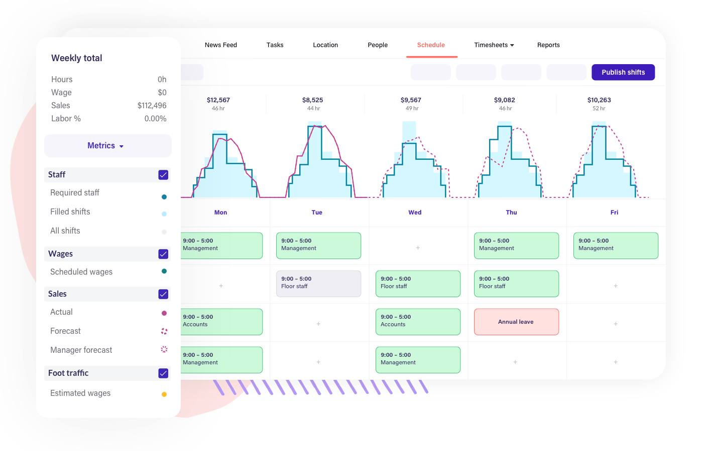

## Table of Contents

## What is labor demand forecasting?

Labor demand forecasting is a way for businesses to predict how many workers they will need in the future. It helps companies plan ahead so they can have the right number of employees at the right time. By looking at things like past sales, expected growth, and seasonal changes, businesses can make smart guesses about their future labor needs. This helps them avoid having too many or too few workers, which can save money and keep things running smoothly.

There are different ways to do labor demand forecasting. Some businesses use simple methods, like looking at past data and making predictions based on that. Others use more complex methods, like computer models and statistical analysis, to get more accurate forecasts. No matter which method is used, the goal is the same: to make sure the company has enough workers to meet its needs without wasting resources. Good labor demand forecasting can help a business stay competitive and successful.

## Why is labor demand forecasting important in human resources planning?

Labor demand forecasting is really important in human resources planning because it helps companies figure out how many workers they will need in the future. By knowing this, businesses can make sure they have enough people to do the work without hiring too many or too few. This helps save money and keeps things running smoothly. If a company knows it will need more workers during busy times, like the holiday season, they can start hiring earlier so they are ready when the rush comes.

Also, labor demand forecasting helps with long-term planning. Companies can look at trends and changes in their industry to guess what their labor needs might be in the future. This can help them train current employees for new roles or start hiring people with specific skills before they are urgently needed. By planning ahead, businesses can avoid last-minute hiring rushes and make sure they have the right people in the right jobs. This makes the company more efficient and competitive.

## What are the basic methods used for labor demand forecasting?

One simple method for labor demand forecasting is using historical data. This means looking at how many workers were needed in the past during different times of the year or for different projects. By seeing patterns from the past, a company can guess how many workers they will need in the future. For example, if a store always needs more workers during the holiday season, they can plan to hire extra people for that time every year.

Another method is using expert judgment. This means asking people who know a lot about the business, like managers or industry experts, to give their best guess about future labor needs. These experts can think about things like new products, changes in the market, or new technology that might affect how many workers are needed. Their guesses can help the company plan for the future.

A more advanced method is using statistical models and computer software. These tools can look at a lot of data, like sales numbers, economic trends, and even weather patterns, to make predictions about labor demand. By using math and computers, companies can get very detailed and accurate forecasts. This helps them plan better and be ready for whatever might happen in the future.

## How does historical data influence labor demand forecasting?

Historical data is really important for labor demand forecasting because it shows what happened in the past. By looking at how many workers were needed at different times before, a company can see patterns and trends. For example, if a business always needs more workers during the summer, they can use this information to plan for hiring more people next summer. This helps them avoid being short-staffed during busy times.

Using historical data also helps companies make better guesses about the future. They can look at past sales, how busy they were, and even what happened during special events like holidays. This information gives them a good starting point for planning. By understanding what happened before, a business can be ready for what might happen next, making sure they have enough workers without hiring too many.

## What role do economic indicators play in forecasting labor demand?

Economic indicators are important for forecasting labor demand because they give businesses a good idea about what is happening in the economy. Things like unemployment rates, inflation, and consumer spending can tell a company if people are likely to buy more or less of their products. If the economy is doing well, with low unemployment and high consumer spending, a business might expect to need more workers because they will be busier. On the other hand, if the economy is struggling, with high unemployment and low spending, a company might not need as many workers because fewer people are buying their products.

By keeping an eye on these economic indicators, businesses can make better guesses about their future labor needs. For example, if a company sees that consumer spending is going up, they might start hiring more people to meet the expected increase in demand. This helps them be ready for more customers without being caught off guard. By using economic indicators, companies can plan ahead and make sure they have the right number of workers to keep things running smoothly, no matter what the economy is doing.

## How can qualitative methods improve labor demand forecasts?

Qualitative methods can help make labor demand forecasts better by using the knowledge and guesses of people who know a lot about the business. These people, like managers or industry experts, can think about things that numbers alone can't tell us. For example, they might know about new products coming out, changes in what customers want, or new laws that could affect how many workers a company needs. By talking to these experts and getting their ideas, a business can make more accurate guesses about their future labor needs.

Using qualitative methods also helps a company plan for things that are hard to predict with just numbers. For instance, if there's a new technology that might change how work is done, experts can help guess how this might affect the number of workers needed. By combining these expert opinions with other forecasting methods, like looking at past data, a business can get a fuller picture of what might happen in the future. This helps them be ready for changes and make sure they have the right number of people to keep things running well.

## What are the challenges of implementing labor demand forecasting in small businesses?

Small businesses often find it hard to do labor demand forecasting because they might not have enough money or people to do it well. Big companies can hire experts or use fancy computer programs to predict how many workers they will need. But small businesses usually don't have these resources. They might only have a few people who have to do many different jobs, so it's tough to find the time and skills needed to make good forecasts.

Another challenge is that small businesses can be more affected by sudden changes. For example, if a small shop loses a big customer, it can change how many workers they need very quickly. Small businesses also might not have a lot of past data to look at, which makes it harder to see patterns and predict the future. Even though labor demand forecasting is important, these challenges can make it tough for small businesses to do it well.

## How do technological advancements affect labor demand forecasting techniques?

Technological advancements have made labor demand forecasting easier and more accurate. In the past, businesses had to rely a lot on looking at old records and guessing based on what happened before. Now, with computers and special software, companies can use big data and fancy math to make better predictions. These tools can look at a lot of information at once, like sales numbers, how the economy is doing, and even the weather, to guess how many workers a company will need in the future. This helps businesses plan better and be ready for changes.

But technology also brings new challenges. As new tools and machines come out, the kind of work people do can change. This means companies have to keep updating their forecasting methods to keep up. For example, if a business starts using robots, they might need fewer people to do certain jobs, but more people to take care of the robots. Keeping up with these changes can be hard, but it's important for making sure labor demand forecasts stay accurate and useful.

## What are some advanced statistical models used in labor demand forecasting?

One advanced statistical model used in labor demand forecasting is time series analysis. This method looks at data over time to find patterns and trends. For example, it can help a business see if there are busy times of the year when they need more workers. Time series analysis uses math to make predictions based on what happened in the past. This helps companies plan for the future by understanding how their labor needs might change over time.

Another advanced model is regression analysis. This method looks at how different things, like sales or economic indicators, affect how many workers a company needs. By studying these relationships, businesses can make better guesses about future labor demand. For example, if a company knows that more sales mean they need more workers, they can use regression analysis to predict how many extra people they will need if sales go up. This helps them be ready for changes and plan their workforce better.

## How can labor demand forecasting be integrated with overall business strategy?

Labor demand forecasting is a key part of a business's overall strategy because it helps the company plan for the future. By knowing how many workers they will need, a business can make sure they have enough people to meet their goals without wasting money. For example, if a company wants to grow and open new stores, they can use labor demand forecasting to figure out how many new workers they will need. This helps them hire the right people at the right time, so they can keep up with their growth plans.

Also, labor demand forecasting helps a business stay flexible and ready for changes. If the market changes or new technology comes out, a company can use their forecasts to adjust their plans. For instance, if a new product is going to be popular, the business can hire more workers to make and sell it. By including labor demand forecasting in their overall strategy, a company can be ready for whatever happens and keep moving forward successfully.

## What are the best practices for validating and updating labor demand forecasts?

To make sure labor demand forecasts are correct, it's important to check them regularly. One good way to do this is by comparing the forecasts to what actually happens. For example, if a business predicted they would need 10 new workers but only needed 5, they can see where their guess was wrong and fix it for next time. Another way to validate forecasts is by getting feedback from managers and workers on the ground. They can tell if the forecasts seem right based on what they see every day. By doing these checks often, a business can make their forecasts more accurate.

Updating labor demand forecasts is also really important. As things change, like the economy or new technology, a company needs to change their forecasts too. They should look at new data and trends and use them to update their predictions. For example, if a new product is doing better than expected, the business might need to hire more people sooner than they thought. By keeping their forecasts up to date, a company can stay ready for whatever comes next and make sure they have the right number of workers to keep things running smoothly.

## How can machine learning and AI enhance the accuracy of labor demand forecasting?

Machine learning and AI can make labor demand forecasting a lot better by looking at a lot of data really fast. These smart computer programs can find patterns and trends that people might miss. For example, they can look at things like sales numbers, how the economy is doing, and even the weather to guess how many workers a business will need. By using all this information, machine learning and AI can make more accurate predictions than just looking at past data. This helps businesses plan better and be ready for changes.

Also, machine learning and AI can keep learning and getting better over time. As they get more data, they can update their guesses to be even more accurate. This means that the more a business uses these tools, the better their labor demand forecasts will become. By using machine learning and AI, companies can save time and money, and make sure they have the right number of workers to meet their needs.

## What is the process for understanding workforce and labor demand forecasting?

Workforce forecasting is a vital component of organizational strategy, focused on predicting the future need for human resources. The primary aim is to ensure the right number of employees, with the requisite skills, are available when needed. This process is crucial for maintaining operational efficiency and supporting long-term business goals.

Labor demand forecasting, on the other hand, involves predicting the requirement for labor based on a variety of factors, including economic conditions and anticipated growth in organizational activities. This form of forecasting is integral to understanding how internal and external elements impact the demand for labor.

Human resources departments utilize a combination of qualitative and quantitative methods to yield accurate forecasts. Qualitative methods may involve expert judgment, industry insights, and scenario analysis. Quantitative approaches often involve statistical models and econometric techniques, which can incorporate past employment trends, productivity rates, and economic indicators.

For instance, econometric models can be employed to estimate future labor demand using historical data. A basic linear regression model might look like:

$$
\text{LaborDemand} = \beta_0 + \beta_1 \times \text{GDP} + \beta_2 \times \text{IndustryGrowth} + \epsilon
$$

Where:
- $\text{LaborDemand}$ is the dependent variable representing forecasted demand.
- $\text{GDP}$ and $\text{IndustryGrowth}$ are independent variables.
- $\beta_0, \beta_1, \beta_2$ are coefficients to be determined.
- $\epsilon$ is the error term.

These forecasts are not merely academic exercises; they play a pivotal role in guiding strategic human resources planning. By accurately anticipating workforce needs, organizations can align their recruitment, training, and retention strategies to ensure they meet business objectives efficiently. This alignment minimizes risks associated with overstaffing or understaffing, both of which can have adverse financial implications.

By assessing both current workforce capabilities and future labor requirements, businesses can establish more robust strategies for talent acquisition, development, and retention. This foresight enables organizations to adapt swiftly to dynamic market conditions and positions them advantageously in a competitive landscape.

## What is the role of Human Resources Planning in Workforce Forecasting?

Human resources planning is a crucial component of workforce forecasting, ensuring organizations can meet their labor demands while aligning with broader business objectives. This planning involves both quantitative and qualitative methods to anticipate and fulfill workforce needs strategically.

Quantitative approaches involve econometric modeling, which uses statistical methods to understand economic data and forecast labor demand. Econometric models can incorporate variables such as economic growth rates, industry trends, and historical employment data to predict future workforce requirements. For instance, a basic econometric model might use regression analysis to estimate the relationship between economic indicators and labor demand. A simple linear regression model could be expressed as:

$$

Y = \beta_0 + \beta_1X_1 + \beta_2X_2 + \ldots + \beta_nX_n + \epsilon 
$$

where $Y$ represents the labor demand, $X_1, X_2, \ldots, X_n$ are independent variables like GDP growth or technological advancements, $\beta_0$ is the intercept, $\beta_1, \beta_2, \ldots, \beta_n$ are the coefficients, and $\epsilon$ is the error term.

On the qualitative front, managerial judgment is often leveraged. This approach involves insights from experienced managers who can intuitively assess the workforce needs based on their understanding of the market conditions and organizational goals. Managers might consider factors such as upcoming projects, expected retirements, or skill shortages that quantitative models might not fully capture.

By integrating these methods, human resources planning prevents overstaffing and understaffing, thus reducing unnecessary labor costs and improving operational efficiency. Overstaffing can lead to inflated labor costs, while understaffing may result in missed opportunities and reduced productivity. Effective planning means the organization can quickly adapt to changes in market demand, maintaining a balance that bolsters productivity and sustenance in a competitive market.

Ultimately, human resources planning enhances the organization's agility, equipping it to respond promptly to market fluctuations while ensuring that its workforce aligns with current and future business strategies. This strategic alignment not only meets immediate operational needs but also supports long-term growth and stability.

## References & Further Reading

[1]: Bergstra, J., Bardenet, R., Bengio, Y., & Kégl, B. (2011). ["Algorithms for Hyper-Parameter Optimization."](https://papers.nips.cc/paper/4443-algorithms-for-hyper-parameter-optimization) Advances in Neural Information Processing Systems 24.

[2]: ["Advances in Financial Machine Learning"](https://www.amazon.com/Advances-Financial-Machine-Learning-Marcos/dp/1119482089) by Marcos Lopez de Prado

[3]: ["Evidence-Based Technical Analysis: Applying the Scientific Method and Statistical Inference to Trading Signals"](https://www.amazon.com/Evidence-Based-Technical-Analysis-Scientific-Statistical/dp/0470008741) by David Aronson

[4]: ["Machine Learning for Algorithmic Trading"](https://github.com/stefan-jansen/machine-learning-for-trading) by Stefan Jansen

[5]: ["Quantitative Trading: How to Build Your Own Algorithmic Trading Business"](https://www.amazon.com/Quantitative-Trading-Build-Algorithmic-Business/dp/1119800064) by Ernest P. Chan