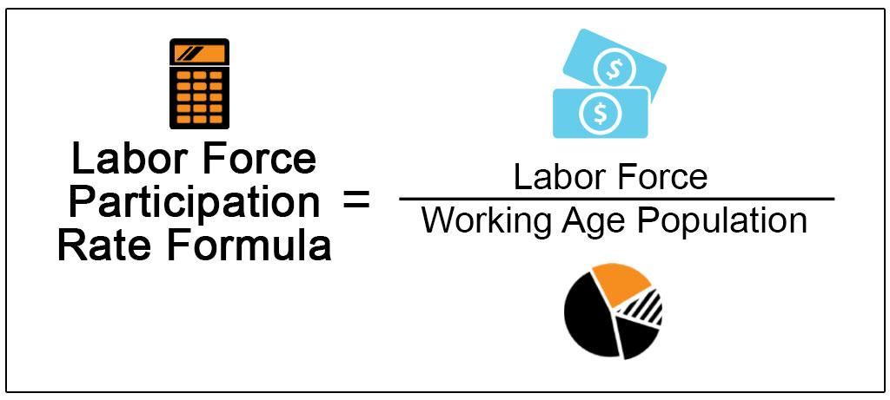

In the current economic landscape, understanding the interplay between employment trends, economic indicators, labor force participation, and algorithmic trading is crucial. These components are deeply interconnected, influencing and shaping the economic environment in which businesses and financial markets operate.

Employment trends, a broad term encompassing job creation, job loss, and changes in employment patterns, serve as a primary driver of economic indicators. For instance, shifts in employment levels can directly impact the unemployment rate, a critical economic indicator that reflects the health of an economy. Additionally, employment trends influence Gross Domestic Product (GDP) growth, as employment is a key determinant of consumer spending and productivity.

Economic indicators such as GDP, unemployment rates, and inflation are essential for policymakers and businesses to gauge economic performance and make informed decisions. They form a framework to assess economic health and guide monetary and fiscal policies. Unemployment rates, for example, can indicate economic slowdown or recovery, prompting governments to adjust interest rates or implement stimulus measures accordingly.

Algorithmic trading, the use of complex algorithms and automated systems to execute trading decisions, plays a significant role in modern financial markets. By rapidly analyzing market data and executing trades, algorithmic trading can enhance market liquidity, ensuring that securities are bought and sold smoothly. However, it also introduces complexity and potential volatility, as algorithms may respond instantaneously to economic indicators and employment data, amplifying market movements.

The purpose of this article is to explore and analyze the intricate relationships between employment trends, economic indicators, labor force participation, and algorithmic trading. By dissecting these interconnections, the aim is to provide a comprehensive understanding of how these elements interact and influence the broader economic and financial landscape. This understanding is vital for economic forecasting, policy formulation, and strategic investment decisions. As such, continuous research and discourse on these dynamics are essential to stay ahead in an ever-evolving economic environment.

## Table of Contents

## Understanding Employment Trends

## Understanding Employment Trends

Employment trends refer to the patterns and movements within the labor market concerning job creation, job loss, sectoral shifts, and employment rates over time. These trends are shaped by various components, including the availability of jobs, the types of industries generating employment, wage levels, and the demographic characteristics of the workforce such as age, education, and skills.

### Current Global Employment Trends and Their Implications

In recent years, global employment trends have been characterized by significant shifts driven by globalization, technological advancements, and demographic changes. According to recent reports, there has been a marked increase in job opportunities in healthcare, technology, and service sectors, while manufacturing and traditional retail jobs have seen declines. The gig economy has burgeoned, offering flexible work but often lacking job security and benefits. Such trends have substantial implications for economic stability, influencing policy decisions around labor markets, education, and social welfare programs.

### Factors Influencing Changes in Employment Patterns

Several factors affect shifts in employment patterns:

- **Globalization:** The international integration of markets has decentralized production, often relocating jobs to regions with lower labor costs.
- **Technological Advancements:** Automation and artificial intelligence have replaced routine jobs, driving demand for technology-savvy labor while rendering certain skill sets obsolete.
- **Economic Policies:** Policies influencing taxation, trade, and labor rights can alter employment landscapes by either incentivizing or stifling job creation.
- **Demographics:** Population aging and changing gender roles have shifted workforce composition and labor force participation rates.

### The Impact of Technology and Automation on Employment

Technology and automation have profoundly impacted employment by enhancing productivity but also displacing workers in certain roles. While low-skill, routine jobs are most at risk, technology has spurred new employment opportunities in tech-driven sectors. This shift necessitates reskilling and education reforms to equip the workforce with relevant skills. The rise of [artificial intelligence](/wiki/ai-artificial-intelligence) is particularly significant, as it affects sectors ranging from manufacturing to financial services.

### Connection Between Employment Trends and Labor Force Participation

Employment trends are closely interconnected with labor force participation, defined as the percentage of working-age population either employed or actively seeking employment. Changes in employment trends influence labor force participation rates through factors such as job availability and wage levels. For instance, if technological advances create more high-skilled jobs, labor force participation may increase among those with advanced education but decline among less-skilled workers.

Understanding employment trends is critical for policymakers and businesses alike, allowing them to anticipate shifts in labor demand and adapt strategies accordingly. By addressing the factors influencing employment changes, stakeholders can better navigate the evolving economic landscape and foster a resilient, inclusive labor market.

## Economic Indicators and Their Relevance

Economic indicators are quantitative metrics used to evaluate the economic performance of a country. They provide critical insight into the state of an economy, influencing decisions made by policymakers, investors, and businesses. These indicators can be broadly categorized into three types: leading, lagging, and coincident indicators. Leading indicators are metrics that change before the economy starts to follow a particular trend, such as stock market returns or new orders for capital goods. Lagging indicators, like unemployment rates, change after the economy as entered a particular pattern. Coincident indicators, including Gross Domestic Product (GDP) and industrial production, change at approximately the same time as the economy.

Employment trends serve as vital economic indicators as they offer a glimpse into the labor market's health and potential economic trajectory. Employment metrics such as job creation, job loss rates, and workforce participation levels signal economic activity and overall market health. For instance, an increase in employment rates can suggest economic expansion, whereas rising unemployment rates may indicate economic contraction.

Key economic indicators such as GDP, unemployment rate, and inflation are pivotal in assessing economic health. GDP represents the total monetary value of all finished goods and services produced within a country's borders in a specific time frame, serving as a comprehensive measure of national economic activity. Unemployment rate, defined as the percentage of the labor force that is jobless and actively seeking employment, provides critical insights into the labor market's performance. Inflation, measured by indexes such as the Consumer Price Index (CPI), refers to the rate at which the general level of prices for goods and services is rising, eroding purchasing power.

These economic indicators play a significant role in shaping economic policy. Policymakers rely on them to design and adjust fiscal and monetary policies aimed at stabilizing the economy. For example, a rising unemployment rate could prompt central banks to lower interest rates to stimulate job creation and economic growth. Similarly, high inflation might lead to tighter monetary policies to curb excessive price rises.

The interplay between economic indicators and labor market dynamics is complex. Employment trends directly affect GDP, as a growing labor force often translates to increased production and consumption. The unemployment rate, a critical lagging indicator, lags behind the real economic activity and is directly tied to economic cycles. Inflation impacts real wages and employment costs, influencing hiring and investment decisions by businesses.

In summary, understanding economic indicators and their relevance is crucial for comprehending macroeconomic trends and making informed policy and investment decisions. These indicators reflect the intricate dynamics of labor markets and economic health, underscoring the importance of accurate measurement and analysis in foreseeing economic trends and crafting strategic responses.

## Labor Force Participation: Key Insights

Labor force participation refers to the proportion of the working-age population that is either employed or actively seeking employment. It is a crucial indicator of economic activity, reflecting the availability of labor resources in an economy. Analyzing labor force participation provides insight into economic health, potential growth, and the effectiveness of labor markets.

The significance of labor force participation lies in its ability to influence various economic dimensions, such as productivity, income distribution, and social stability. Higher participation rates generally indicate a robust economy with abundant employment opportunities, whereas declining rates may suggest underlying issues such as economic stagnation or inadequate job creation.

### Trends in Labor Force Participation: Demographics and Gender Aspects

Demographic changes, including aging populations in many developed countries, significantly impact labor force participation. As the proportion of the elderly increases, overall participation rates tend to decline since older individuals typically retire from active employment. Conversely, countries with younger populations may exhibit higher participation rates.

Gender dynamics also play a crucial role. Traditionally, male participation rates have been higher than female rates, largely due to historical, cultural, and policy-related reasons. However, there has been a significant increase in female labor force participation over recent decades, driven by improved access to education, changing social norms, and policy initiatives promoting gender equality.

### Factors Affecting Changes in Labor Force Participation Rates

Several factors influence changes in labor force participation rates:

1. **Economic Conditions**: Economic booms generally lead to increased participation as job availability improves. Conversely, during recessions, discouraged workers may exit the labor force, reducing participation rates.

2. **Education and Skills**: Higher education levels typically correlate with greater participation rates, as skilled workers find it easier to secure employment. As educational attainment rises globally, this factor increasingly drives participation rates.

3. **Technological Advancements**: Technology can both negatively and positively affect participation. Automation may displace workers in certain sectors, while new industries and jobs emerge, potentially attracting more participants.

4. **Social and Cultural Factors**: Changing societal norms and cultural attitudes towards work, especially concerning women and minorities, impact participation rates.

### The Impact of Policy Changes on Labor Force Participation

Government policies significantly affect labor force participation. Policies aimed at increasing workforce skills through education and training can enhance participation by making workers more competitive. Labor market regulations, such as minimum wage laws and employment protection legislation, can have mixed effects; while they might protect workers, they can also discourage hiring if perceived as burdensome by employers.

Family-friendly policies, such as parental leave and childcare support, have proven effective in boosting female labor force participation. For example, Scandinavian countries, with their extensive social welfare systems, have some of the highest female participation rates globally.

### How Labor Force Participation Affects Overall Economic Growth

Labor force participation is a key driver of economic growth. A higher participation rate expands the labor supply, contributing to increased production, innovation, and consumption. This, in turn, enhances gross domestic product (GDP) growth. The relationship between participation and economic growth can be expressed as:

$$
\text{GDP} = \text{Labor Force} \times \text{Labor Productivity}
$$

Where an increase in the labor force, assuming constant or improving productivity, leads to GDP growth.

However, simply increasing participation is insufficient without addressing productivity and employment quality. A holistic approach that considers skills development, equitable employment opportunities, and supportive policies is essential to harness the full benefits of labor force participation for economic growth.

In conclusion, understanding labor force participation and its myriad influences is vital for policymakers aiming to foster sustainable economic development. Future strategies should holistically address the diverse factors affecting participation, ensuring inclusive growth and resilience in an ever-evolving global economy.

## The Rise of Algorithmic Trading

Algorithmic trading, defined as the use of algorithms and automated systems to execute trades in financial markets, has revolutionized the way trading is conducted. The history of [algorithmic trading](/wiki/algorithmic-trading) dates back to the latter half of the 20th century when computerized systems began aiding in trading decisions. However, it became more prevalent in the 1980s with the advent of electronic exchanges and the development of sophisticated trading algorithms. This shift allowed for faster execution of trades, reduced transaction costs, and provided a competitive advantage through the ability to process vast amounts of data more efficiently than human traders.

In modern financial markets, algorithmic trading offers several benefits. It enhances market [liquidity](/wiki/liquidity-risk-premium) by facilitating a large [volume](/wiki/volume-trading-strategy) of transactions and can stabilize markets by minimizing the bid-ask spread. Algorithms can identify [arbitrage](/wiki/arbitrage) opportunities and make rapid adjustments to trading strategies, thereby increasing market efficiency. Moreover, algorithmic trading provides transparency and fairness by adhering to pre-defined parameters and reducing human error associated with manual trading.

Employment trends impact algorithmic trading strategies in several ways. Developments in artificial intelligence and [machine learning](/wiki/machine-learning) have increased demand for specialized skills, influencing the hiring patterns in financial and tech firms. Skilled quantitative analysts and data scientists are increasingly integrated into trading teams to refine algorithms and improve predictive accuracy. Changes in labor markets can also shift consumer behavior and economic conditions, indirectly affecting the market conditions that algorithms analyze and respond to.

Despite its benefits, algorithmic trading poses challenges, particularly concerning market [volatility](/wiki/volatility-trading-strategies). Algorithms can exacerbate price swings, especially during periods of market instability, as they might amplify collective trading behavior without considering nuanced market conditions. High-frequency trading, a subset of algorithmic trading, has been scrutinized for potentially triggering flash crashes due to its rapid trade execution based on market signals.

The future outlook for algorithmic trading includes advances in artificial intelligence and machine learning, which promise to further refine trading strategies and enhance decision-making processes. However, this future is not without its regulatory considerations. Regulators may implement measures to oversee algorithm development and deployment to prevent market manipulation and ensure ethical utilization. Potential regulations could focus on testing and monitoring algorithms to mitigate risks associated with automated trading systems.

In conclusion, algorithmic trading continues to evolve, driven by technological advancements and changing economic conditions. Understanding the nexus between employment trends, regulatory environments, and market dynamics is crucial for navigating this complex landscape. As the industry progresses, stakeholders must balance innovation with prudent oversight to ensure sustainable growth in financial markets.

## Interconnections and Economic Impact

Understanding the relationships between employment trends, economic indicators, and labor force participation provides significant insights into market dynamics and the broader economic environment. These components are intertwined in a complex manner, affecting each other and influencing algorithmic trading strategies and market liquidity.

Employment trends often serve as a bellwether for the economic climate. Changes in employment figures can signal shifts in consumer spending, manufacturing output, and overall economic confidence. For instance, an increase in employment rates typically boosts consumer spending and stimulates economic growth, which may then be reflected in key economic indicators such as GDP (Gross Domestic Product) and inflation rates. These indicators, in turn, impact labor force participation, as improved job prospects can attract more individuals into the labor market.

Economic indicators are crucial in shaping economic policy and investment strategies. For example, a rising unemployment rate may prompt monetary policies aimed at stimulating job creation. Similarly, high inflation rates might lead to an [interest rate](/wiki/interest-rate-trading-strategies) hike to cool down the economy. These policy decisions affect the labor market's dynamics by altering hiring and investment patterns within industries, which can influence labor force participation rates across different demographics.

Algorithmic trading, which utilizes computer algorithms to execute trades at high speed and volume, relies heavily on economic indicators and employment trends. Traders develop algorithms based on historical data and predictive models, which are designed to capitalize on anticipated market movements. Shifts in employment trends and economic indicators can trigger algorithmic models to adjust their strategies, impacting market liquidity. For example, positive employment data might lead to increased buy orders, enhancing market liquidity but also potentially increasing volatility if the data defy market expectations.

Case studies illustrate how these components interact. During the 2008 financial crisis, rising unemployment led to decreased consumer spending, significantly impacting GDP growth. This prompted central banks to implement quantitative easing, affecting interest rates and the currency markets, which were heavily traded by algorithmic systems. The interconnectedness of labor market dynamics and economic policies during this period highlighted the need for robust forecasting models.

A greater understanding of how employment trends, economic indicators, and labor force participation interconnect can aid economic forecasting. By analyzing historical data and patterns, economists and policymakers can better predict future economic conditions, allowing for informed decision-making. For instance, integrating machine learning models to analyze data can improve the accuracy of these forecasts.

Incorporating insights from these dynamics into economic planning and investment strategies can yield substantial benefits. Decision-makers can develop more adaptive policies that respond effectively to labor market signals. Investors can design diversified portfolios that hedge against economic downturns influenced by declining employment or unfavorable economic indicators. Algorithmic trading firms can refine their models to account for anticipated macroeconomic changes, enhancing their market strategies.

In conclusion, understanding the synergy between employment trends, economic indicators, and labor force dynamics is essential for navigating the modern economic landscape. It not only informs policy and investment strategies but also enhances the predictive capabilities of algorithmic trading, ultimately supporting a more resilient and responsive economic environment.

## Conclusion

In conclusion, the dynamic interplay between employment trends, economic indicators, labor force participation, and algorithmic trading is a vital area of study in contemporary economics. Monitoring employment trends provides valuable insights into the overall health of an economy, acting as a precursor to changes in key economic indicators such as GDP, the unemployment rate, and inflation. Understanding these trends is crucial for policymakers, businesses, and investors.

As we look toward the future of labor force participation, it is essential to consider demographic shifts, technological advancements, and evolving societal norms. These elements can significantly influence participation rates, hence impacting economic growth and workforce strategies. Continuous exploration and adaptation are necessary to respond adeptly to these changes.

Similarly, algorithmic trading represents a transformative shift in financial markets, offering efficiency and speed but also posing challenges regarding market stability and regulation. Its growth underscores the need for ongoing research and potential recalibration of regulatory frameworks to balance innovation with risk management.

The relationships among these components are intricate and multifaceted, suggesting that robust economic forecasting must integrate these insights. Encouragement for continued research and dialogue in these areas is imperative, as these discussions can help refine our understanding and enhance our ability to anticipate and navigate future economic challenges. Engaging with this topic will undoubtedly yield valuable perspectives that can inform both economic policy and investment strategies.

## References & Further Reading

[1]: Bergstra, J., Bardenet, R., Bengio, Y., & Kégl, B. (2011). ["Algorithms for Hyper-Parameter Optimization."](https://dl.acm.org/doi/10.5555/2986459.2986743) Advances in Neural Information Processing Systems 24.

[2]: ["Advances in Financial Machine Learning"](https://www.amazon.com/Advances-Financial-Machine-Learning-Marcos/dp/1119482089) by Marcos Lopez de Prado

[3]: ["Evidence-Based Technical Analysis: Applying the Scientific Method and Statistical Inference to Trading Signals"](https://www.amazon.com/Evidence-Based-Technical-Analysis-Scientific-Statistical/dp/0470008741) by David Aronson

[4]: ["Machine Learning for Algorithmic Trading"](https://github.com/PacktPublishing/Machine-Learning-for-Algorithmic-Trading-Second-Edition) by Stefan Jansen

[5]: ["Quantitative Trading: How to Build Your Own Algorithmic Trading Business"](https://books.google.com/books/about/Quantitative_Trading.html?id=j70yEAAAQBAJ) by Ernest P. Chan