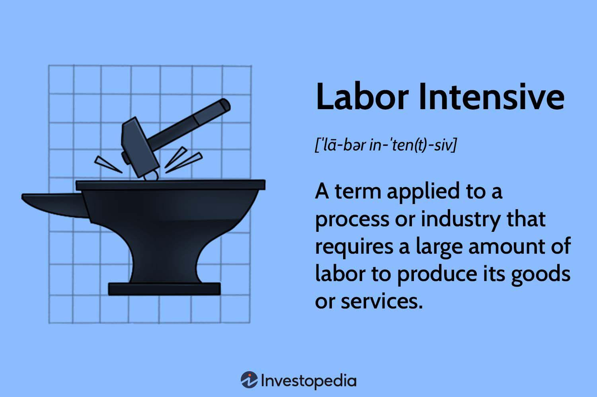

## Table of Contents

## What is a labor-intensive industry?

A labor-intensive industry is one where a lot of people are needed to do the work. This means that the cost of workers, or labor, is a big part of the total cost of making the product or providing the service. Industries like farming, construction, and some types of manufacturing are often labor-intensive. In these industries, machines can't do all the work, so people are very important.

For example, in farming, many workers are needed to plant, care for, and harvest crops. Even though there are machines that can help, a lot of the work still needs to be done by hand. In construction, workers are needed to build houses and buildings. They do things like laying bricks, painting, and putting up walls. These tasks often require human skill and effort, making the industry labor-intensive.

## Can you provide examples of labor-intensive industries?

One example of a labor-intensive industry is agriculture. This is because farming requires many workers to plant seeds, take care of crops, and pick the harvest. Even though there are machines that can help, a lot of the work still needs to be done by hand. For example, picking fruits and vegetables often needs careful hands to avoid damaging the produce.

Another example is the construction industry. Building houses, offices, and other structures needs a lot of people to do different jobs. Workers lay bricks, paint walls, and put up roofs. These tasks need human skill and effort, so the industry relies heavily on labor. Machines can help, but many parts of construction still need people to do the work.

A third example is the textile industry. Making clothes and fabrics often involves many steps that need human hands. Workers sew, cut, and assemble materials into finished products. While some parts of the process can be automated, much of the work still requires people, making it labor-intensive.

## Why are some industries more labor-intensive than others?

Some industries are more labor-intensive than others because of the type of work they need to do. In some jobs, machines can do a lot of the work, like in car factories where robots can build cars. But in other jobs, like [picking](/wiki/asset-class-picking) fruits or building houses, machines can't do everything. These jobs need people to do the work because they need careful hands or special skills that machines don't have. So, industries like farming and construction end up needing more people to get the job done.

Another reason is the cost of using machines. In some industries, it's cheaper to use people than to buy and maintain expensive machines. For example, in the textile industry, it might be cheaper to have workers sew clothes than to buy sewing machines that can do the same job. Also, some tasks are just too complex for machines to do well, so people are needed to make sure the job is done right. This is why some industries rely more on people and are more labor-intensive.

## What are the advantages of working in a labor-intensive industry?

Working in a labor-intensive industry can be good because it creates a lot of jobs. When an industry needs many workers, it means more people can find work. This is really helpful in places where there aren't many other jobs. It also means that people who might not have gone to school for a long time or don't have special skills can still find work. They can learn on the job and earn money to support their families.

Another advantage is that working in these industries can help people build skills. Even if the job starts out simple, over time, workers can learn new things and get better at their work. For example, someone working in construction might start by helping out and then learn to do more skilled tasks like laying bricks or painting. This can lead to better job opportunities and higher pay in the future. Plus, working with other people can help build teamwork and communication skills, which are important in any job.

## What are the challenges faced by workers in labor-intensive industries?

Working in labor-intensive industries can be really hard on the body. Workers often have to do a lot of physical work, like lifting heavy things, standing for a long time, or doing the same movements over and over. This can lead to tiredness, pain, and even long-term health problems like back pain or joint issues. The work can also be dangerous, especially in industries like construction or farming, where accidents can happen if safety rules aren't followed. Workers might need to be very careful to avoid getting hurt.

Another challenge is that the pay in labor-intensive jobs can sometimes be low. Because there are a lot of people who can do these jobs, companies might not have to pay as much. This can make it hard for workers to earn enough money to live comfortably. Also, these jobs might not always offer benefits like health insurance or paid time off, which can make life even harder if workers get sick or need to take care of their families. It can be tough to balance the hard work with the need to make ends meet.

## How do labor-intensive industries impact the economy?

Labor-intensive industries can help the economy by creating a lot of jobs. When these industries need many workers, more people can find work and earn money. This is good because it means more people can spend money on things they need, like food and clothes. When people spend money, it helps other businesses too, making the whole economy grow. In places where there aren't many other jobs, labor-intensive industries can be really important for keeping the economy going.

But there are also some challenges. Sometimes, the pay in these jobs is not very high, which means workers might not have a lot of money to spend. This can slow down the economy because if people don't have money, they can't buy things. Also, if workers get hurt or sick from doing hard physical work, it can cost a lot of money for healthcare. This can be a problem for the workers and for the economy because it means less money is being used to help the economy grow.

## What role does technology play in labor-intensive industries?

Technology can help labor-intensive industries by making work easier and faster. Machines can take over some of the hard physical work that people used to do. For example, in farming, machines can plant seeds and harvest crops, which saves time and effort for workers. In construction, tools like cranes and bulldozers can move heavy things that would be hard for people to lift. This can make the job safer and less tiring for workers. Technology can also help with keeping track of work and making sure everything is done right, like using computers to plan out construction projects or manage farming operations.

But technology can also create problems for workers in labor-intensive industries. If machines can do more of the work, companies might not need as many people. This can lead to job losses, which is bad for workers and their families. Also, the cost of buying and using new technology can be high, and not all companies can afford it. This means some workers might still have to do hard physical work because their company can't buy the machines that could help them. So, while technology can make work easier, it can also make things harder for workers if it leads to fewer jobs or if companies can't use it.

## How have labor-intensive industries evolved over time?

Labor-intensive industries have changed a lot over time. In the past, almost everything was done by hand. People worked hard in fields to grow food, built houses with simple tools, and made clothes by sewing them piece by piece. But as time went on, new inventions and technology started to help out. Machines like tractors and harvesters made farming easier, and tools like cranes and power tools helped in construction. These changes made the work faster and less tiring for workers, but they also meant that fewer people were needed to do the same amount of work.

Even though technology has changed things, labor-intensive industries still need a lot of people. Some jobs are just too hard for machines to do well, like picking delicate fruits or doing detailed work in construction. So, even with machines helping out, many workers are still needed. But the way these industries work has changed. Now, workers often use technology to help them do their jobs better. They might use computers to plan out projects or special tools to make their work easier. This mix of people and technology has made labor-intensive industries more efficient, but it also means workers need to learn new skills to keep up with the changes.

## What are the global trends affecting labor-intensive industries?

Around the world, labor-intensive industries are changing because of globalization and technology. Globalization means that companies can now do business all over the world. This has led to more competition, and companies often look for places where labor is cheaper. For example, some companies move their factories to countries where workers are paid less. This can create jobs in those countries, but it can also lead to job losses in places where labor costs are higher. At the same time, technology is changing how work is done. Machines and automation can do more of the work that people used to do, which can make things faster and cheaper, but it can also mean fewer jobs for workers.

Another big trend is the focus on sustainability and fair labor practices. More people are paying attention to how products are made and whether workers are treated fairly. This means companies have to think about how they can be more environmentally friendly and ensure good working conditions. For example, in the textile industry, there's a push for better wages and safer workplaces. These changes can be good for workers, but they can also make it harder for companies to keep costs down. Overall, these global trends are making labor-intensive industries more complex, with both challenges and opportunities for workers and companies alike.

## How do labor laws and regulations influence labor-intensive industries?

Labor laws and regulations have a big impact on labor-intensive industries. These rules are made to protect workers and make sure they are treated fairly. For example, laws might say that workers must be paid at least a certain amount of money, or that they can't work too many hours without a break. These rules can help make sure workers are safe and have good working conditions. But they can also make it more expensive for companies to hire workers. If companies have to pay more or follow strict rules, they might decide to use machines instead of people, or move their business to a place where the rules are less strict.

On the other hand, labor laws can also help labor-intensive industries by making them more stable and fair. When workers know they will be treated well and paid fairly, they are more likely to stay with a company and work hard. This can be good for the company because happy workers can do better work. Also, when companies follow labor laws, they can build a good reputation. This can help them attract more customers who care about how workers are treated. So, while labor laws can make things harder for companies in some ways, they can also help by making the industry more sustainable and responsible.

## What strategies can be used to improve efficiency in labor-intensive industries?

One way to make labor-intensive industries more efficient is by using technology to help workers. Machines and tools can do some of the hard work, like lifting heavy things or doing the same task over and over. This can make the job easier and faster for workers. For example, in farming, machines can plant seeds and harvest crops, which saves time and effort. In construction, tools like cranes can move heavy materials that would be hard for people to lift. By using technology, workers can focus on tasks that need their skills and care, making the whole process more efficient.

Another strategy is to train workers better. When workers know more about their job and how to do it well, they can work faster and make fewer mistakes. Companies can offer training programs to teach workers new skills or help them get better at what they already do. For example, in the textile industry, workers can learn how to use new sewing machines or how to make clothes more quickly. Good training can also help workers stay safe and healthy, which means they can work more days without getting hurt or sick. This makes the industry more efficient because workers can keep working without long breaks.

A third way to improve efficiency is by organizing work better. This means planning out tasks so that everything is done in the best order and at the right time. For example, in construction, a good plan can make sure that materials are ready when workers need them, so they don't have to wait. In farming, organizing work can mean planting and harvesting at the best times of the year. By managing time and resources well, labor-intensive industries can get more done with the same number of workers, making them more efficient.

## What future developments might affect the sustainability of labor-intensive industries?

In the future, labor-intensive industries might change a lot because of new technology. Machines and robots are getting better and can do more of the work that people used to do. This can make things faster and cheaper, but it might also mean fewer jobs for workers. For example, in farming, new machines might be able to pick fruits and vegetables without hurting them, which could replace the need for human workers. In construction, robots might be able to build houses and buildings, making the job easier but also reducing the number of people needed. Companies will have to find a balance between using technology to improve efficiency and making sure there are still enough jobs for people.

Another big change that could affect labor-intensive industries is a focus on being more environmentally friendly. People are starting to care more about how products are made and whether they harm the environment. This means companies might have to change how they do things to be more sustainable. For example, in the textile industry, companies might need to use less water and chemicals to make clothes. In farming, there could be more use of organic methods that are better for the soil and the planet. These changes can help the environment, but they might also make it harder for companies to keep costs down. Labor-intensive industries will need to adapt to these trends to stay sustainable in the future.

## References & Further Reading

[1]: Bergstra, J., Bardenet, R., Bengio, Y., & Kégl, B. (2011). ["Algorithms for Hyper-Parameter Optimization."](https://dl.acm.org/doi/10.5555/2986459.2986743) Advances in Neural Information Processing Systems 24.

[2]: ["Advances in Financial Machine Learning"](https://www.amazon.com/Advances-Financial-Machine-Learning-Marcos/dp/1119482089) by Marcos Lopez de Prado

[3]: ["Evidence-Based Technical Analysis: Applying the Scientific Method and Statistical Inference to Trading Signals"](https://www.amazon.com/Evidence-Based-Technical-Analysis-Scientific-Statistical/dp/0470008741) by David Aronson

[4]: ["Machine Learning for Algorithmic Trading"](https://github.com/stefan-jansen/machine-learning-for-trading) by Stefan Jansen

[5]: ["Quantitative Trading: How to Build Your Own Algorithmic Trading Business"](https://www.amazon.com/Quantitative-Trading-Build-Algorithmic-Business/dp/1119800064) by Ernest P. Chan