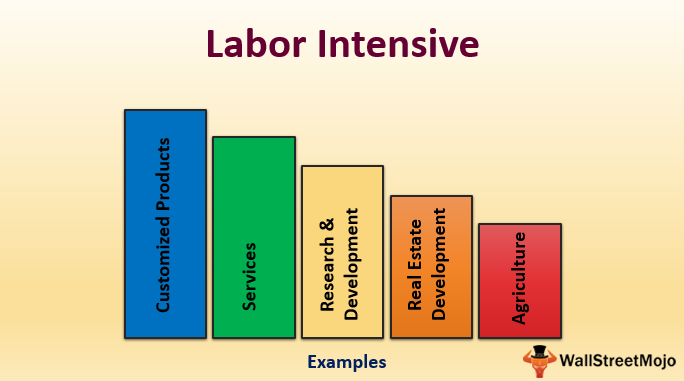

In today's rapidly evolving market landscape, understanding the various facets of industries and trading strategies is crucial. The dynamic interplay between traditional labor-intensive industries and contemporary technological advancements such as algorithmic trading exemplifies this transformation. Labor-intensive industries, characterized by their heavy reliance on human labor, include sectors such as agriculture, hospitality, and construction. These industries have historically thrived in economies with abundant and cost-effective labor. However, as the global economy transitions into a more digital era, the integration of advanced technologies is becoming essential.

Algorithmic trading, which employs sophisticated algorithms to automate trading decisions, represents a significant technological leap. It offers the potential to optimize resource allocation, manage schedules effectively, and improve decision-making processes within labor-intensive industries. Companies such as Renaissance Technologies and Two Sigma have already harnessed AI and algorithms to secure competitive advantages, setting a precedent for others to follow.

This article will explore labor-intensive industries, highlighting key examples and the role of algorithmic trading in these sectors. Through the lens of technology’s transformative power, we seek to provide insights into how traditional practices can merge with technological innovations to boost productivity and efficiency.

## Table of Contents

## Understanding Labor-Intensive Industries

Labor-intensive industries are characterized by their heavy reliance on human labor rather than machinery or capital investment in the production process. These industries are distinguished by high labor costs as compared to capital expenditures, making human labor a critical factor in their operations. The significance of labor in these industries stems from the nature of the tasks involved, which often require skills, adaptability, and decision-making that are challenging to automate entirely.

Agriculture serves as a prime example of a labor-intensive industry. It requires significant human effort for tasks such as planting, harvesting, and post-harvest handling. Despite advancements in mechanization, many agricultural processes continue to depend on manual labor, particularly in regions where technology adoption is limited due to economic constraints. The need for intensive human intervention in agriculture is especially pronounced in small-scale farms where investment in machinery is economically infeasible.

The hospitality industry is another noteworthy example. This sector thrives on personalized customer service, which necessitates a substantial workforce to satisfy guests' needs ranging from accommodation to food services. The variability and unpredictability of human interaction require service providers to maintain a flexible and responsive labor force. Hospitality businesses are labor-intensive because the essence of the service offered is rooted in human engagement and experience.

Construction is also a classic labor-intensive industry where human labor is indispensable. From the initial stages of building design to actual construction and maintenance, labor input is vital. Skilled and unskilled workers perform various tasks such as bricklaying, carpentry, plumbing, and electrical work. The unique nature of each construction project often necessitates custom solutions that rely heavily on manual labor, making it challenging to fully automate the industry.

These sectors generally flourish in economies where labor is not only abundant but also cost-effective. In such economic contexts, the availability of affordable labor resources enables businesses to maintain competitive operations while keeping production costs in check. Consequently, countries with large labor pools often attract and sustain labor-intensive industries, providing employment opportunities and fostering economic growth.

Understanding the dynamics of labor-intensive industries is essential for policymakers and business leaders. By recognizing the importance of human labor in these sectors, strategies can be developed to improve efficiency, productivity, and competitiveness while also considering the socioeconomic impacts on the workforce.

## Applications of Algorithmic Trading

Algorithmic trading, often referred to as algo trading, employs sophisticated algorithms to automate trading decisions and executions, fundamentally transforming traditional trading methodologies. In labor-intensive industries, the integration of [algorithmic trading](/wiki/algorithmic-trading) systems can lead to significant enhancements in various operational facets, such as resource allocation, production schedule management, and decision-making processes.

One of the primary advantages of algorithmic trading in these sectors is its capacity to optimize resource allocation. By analyzing large data sets in real time, algorithms can identify patterns and inefficiencies that human operators might overlook. This capability allows industries to better allocate resources, reduce waste, and improve productivity. For instance, in agriculture, algorithms can forecast weather patterns and market demand to optimize planting schedules and resource use, thereby maximizing yields and minimizing costs.

Moreover, algorithmic trading facilitates efficient management of production schedules. In industries where timing is crucial, such as construction or hospitality, algorithms can automate the scheduling process by considering multiple variables simultaneously. These include supply chain logistics, labor availability, and market demand forecasts. As a result, companies can reduce downtime and enhance operational efficiency, leading to cost savings and increased profitability.

Algorithmic trading also enhances decision-making processes within labor-intensive industries. By utilizing [artificial intelligence](/wiki/ai-artificial-intelligence) and [machine learning](/wiki/machine-learning), algorithms can process and analyze vast amounts of data more quickly and accurately than human operators. This capability enables industries to make informed, data-driven decisions in real time, which is crucial in environments characterized by rapidly changing conditions and high competition.

Firms such as Renaissance Technologies and Two Sigma have been at the forefront of applying AI and algorithms to gain competitive advantages in various markets. Their pioneering efforts demonstrate the potential for algorithmic trading to revolutionize industry practices by providing more precise and efficient approaches to market analysis and decision-making.

Overall, the application of algorithmic trading in labor-intensive industries is a testament to the power of technology to drive efficiency and innovation, offering a pathway to enhanced operational capabilities and competitive positioning in the market.

## Examples of Labor-Intensive Industries in Algo Trading

In agriculture, algorithmic trading plays a pivotal role in predicting commodity prices, thereby assisting both farmers and investors in making informed decisions. Algorithms analyze variables such as weather patterns, supply chain disruptions, and global market trends to offer predictions on futures prices. This helps in mitigating risks associated with price [volatility](/wiki/volatility-trading-strategies). For example, machine learning models can be employed to analyze satellite data for evaluating crop yields and predicting future supply levels, which influence commodity prices. By integrating these data-driven insights, agricultural producers can optimize planting schedules, manage crop inventories, and negotiate better prices for their produce.

The hospitality sector also benefits significantly from the utilization of algorithms. These algorithms can process vast amounts of data to assess market trends and customer preferences, delivering insights that allow for a tailored service offering. With advanced analytics, hospitality businesses can manage inventory efficiently, optimize pricing strategies, and enhance customer experience. For instance, algorithms can be used to determine optimal room pricing based on demand forecasts, seasonal trends, and competitor pricing. This not only maximizes revenue but also ensures high occupancy rates.

In construction, companies turn to algorithms to optimize supply chain logistics and forecast future material demands, effectively enhancing operational efficiency. By employing predictive analytics, construction firms can better manage procurement processes and reduce waste. Algorithms can handle complex datasets that include material costs, labor availability, project timelines, and external factors such as economic shifts and regulatory changes. These insights allow for precise planning and resource allocation, minimizing delays and cost overruns. For example, algorithmic models can predict the demand for construction materials based on the projected completion rate of infrastructure projects, ensuring timely procurement and avoiding costly shortages.

Overall, the integration of algorithmic trading into labor-intensive industries such as agriculture, hospitality, and construction has proven to be a game-changer, driving performance improvements and offering strategic advantages in decision-making processes.

## Benefits and Challenges

The integration of algorithmic trading into labor-intensive industries offers several distinct benefits. Fundamental among these is the potential for increased efficiency. By deploying complex algorithms, businesses can automate various processes that traditionally required significant manual input. This automation leads to faster decision-making and reduced time lags in operational workflows. For instance, the substitution of manual scheduling with automated systems in a construction company can curtail downtime and ensure optimal deployment of labor and resources.

Cost savings constitute another significant advantage. The automation of repetitive tasks diminishes the need for excessive human labor, allowing firms to reallocate funds typically reserved for wages towards capital investment or other strategic objectives. This shift not only fosters financial savings but also enhances the competitive positioning of these businesses in their respective markets.

Improved service delivery is yet another benefit. By leveraging algorithmic trading, industries can better anticipate market demands and refine their product or service offerings. In the hospitality sector, for example, algorithms can dynamically adjust room pricing based on real-time demand fluctuations, thus optimizing occupancy rates and revenue.

However, the adoption of algorithmic trading is not without its challenges. A primary hurdle is the substantial initial investment required for technology acquisition and integration. This expenditure includes the cost of advanced hardware, software, and the training of personnel to effectively manage and utilize these new systems. For many smaller enterprises, these initial costs can be prohibitive.

The potential disruption of traditional labor roles also poses significant challenges. As algorithms assume tasks formerly managed by humans, concerns about job displacement and the resultant socio-economic impacts arise. This necessitates a proactive approach in workforce planning, emphasizing upskilling and retraining initiatives to equip employees for emerging roles within this technologically augmented environment.

Lastly, there are intrinsic concerns related to the accuracy of data and the reliability of systems. Algorithms are only as effective as the data they process and the soundness of their design. Ineffective or erroneous algorithms can lead to misguided decisions, resulting in financial losses or operational inefficiencies. Therefore, maintaining data integrity and ensuring robust, fault-tolerant system architectures are imperative to mitigate these risks. Regular audits, system updates, and the implementation of fail-safe mechanisms are essential strategies in this regard.

## The Future of Labor-Intensive Industries and Algo Trading

As technology continuously advances, the integration between labor-intensive industries and algorithmic trading is poised to grow even stronger. The progression in artificial intelligence (AI) and machine learning is anticipated to be at the helm of this convergence, offering refined predictive analytics and enhanced operational efficiencies.

Advancements in AI, particularly in [deep learning](/wiki/deep-learning) and neural networks, are allowing industries to predict market trends and customer behaviors with unprecedented accuracy. Machine learning algorithms can analyze vast amounts of data to identify patterns and make data-driven predictions that were previously unattainable. For instance, by leveraging AI-driven tools, industries can anticipate changes in demand, optimize inventory management, and streamline supply chains, leading to substantial cost savings and improved resource allocation.

The integration of algorithmic trading into labor-intensive industries necessitates a skilled workforce capable of navigating these technological tools. As such, stakeholders must prioritize upskilling employees to ensure they are equipped with the requisite knowledge and skills to operate and maintain these advanced systems. Training programs and continuous learning opportunities are essential to prepare the workforce for a rapidly transforming economic landscape.

Furthermore, with the increasing reliance on technology, ensuring data security becomes paramount. Algorithmic trading systems handle vast amounts of sensitive data, making them attractive targets for cyber threats. Implementing robust cybersecurity measures and adhering to strict data protection regulations are critical to safeguarding the integrity of these systems. This involves employing advanced encryption techniques and continuously monitoring systems for vulnerabilities and potential breaches.

In conclusion, as AI and machine learning technologies continue to mature, their application within labor-intensive industries through algorithmic trading will likely lead to significant transformations. By focusing on workforce readiness and data security, these industries can harness the full potential of technology to revolutionize traditional practices and achieve sustainable growth.

## Conclusion

Labor-intensive industries possess immense potential for transformation through the integration of algorithmic trading strategies. These industries, often characterized by substantial human labor input, can significantly benefit from improved operational efficiencies, cost reductions, and superior decision-making capabilities. Algorithmic trading, by automating and optimizing various processes within these sectors, offers the promise of streamlined operations and enhanced productivity.

The challenges associated with integrating algorithmic trading into labor-intensive fields are not insignificant. Initial investments in technological infrastructure and the potential shift in traditional labor roles require careful planning and management. Nevertheless, the compelling benefits outweigh these hurdles, demonstrating a formidable case for embracing technological advancements.

The fusion of labor-intensive modalities with algorithmic trading has the potential to redefine traditional practices. This synergy is poised to facilitate a transition towards more technologically integrated operations, enabling industries to respond adeptly to market demands and consumer preferences. As industries continuously adapt to technological changes, the incorporation of algorithmic strategies promises a future where labor and technology coexist harmoniously, enhancing overall industry viability and competitiveness.

## References & Further Reading

[1]: Bergstra, J., Bardenet, R., Bengio, Y., & Kégl, B. (2011). ["Algorithms for Hyper-Parameter Optimization."](https://dl.acm.org/doi/10.5555/2986459.2986743) Advances in Neural Information Processing Systems 24.

[2]: ["Advances in Financial Machine Learning"](https://www.amazon.com/Advances-Financial-Machine-Learning-Marcos/dp/1119482089) by Marcos Lopez de Prado

[3]: ["Evidence-Based Technical Analysis: Applying the Scientific Method and Statistical Inference to Trading Signals"](https://www.amazon.com/Evidence-Based-Technical-Analysis-Scientific-Statistical/dp/0470008741) by David Aronson

[4]: ["Machine Learning for Algorithmic Trading"](https://github.com/stefan-jansen/machine-learning-for-trading) by Stefan Jansen

[5]: ["Quantitative Trading: How to Build Your Own Algorithmic Trading Business"](https://www.amazon.com/Quantitative-Trading-Build-Algorithmic-Business/dp/1119800064) by Ernest P. Chan