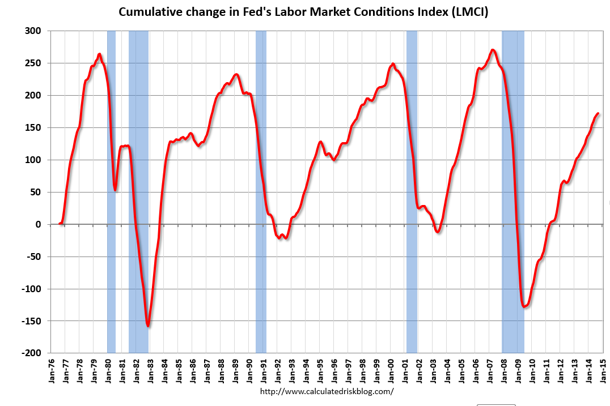

Understanding the labor market is crucial for economists, policymakers, and traders. The state of the labor market is a significant indicator of a nation’s economic health, influencing wage levels, employment rates, and overall economic stability. The labor market operates through the interaction of demand for labor by employers and the supply provided by workers. It is closely monitored to assess economic well-being and guide policy and investment decisions.

Economic indicators such as unemployment, inflation, and Gross Domestic Product (GDP) play a pivotal role in understanding labor market dynamics. Unemployment rates reflect the proportion of the labor force that is jobless and actively seeking employment. Persistent high unemployment signals economic distress, potentially resulting in decreased consumer spending and economic output. Inflation, the rate of increase in prices for goods and services, affects real wages and the purchasing power of consumers. GDP, the total market value of all final goods and services produced in a country, indicates the level of economic activity, with growth suggesting expansion and job creation, while contraction might imply economic downturns and rising unemployment.



In recent years, algorithmic trading has revolutionized financial markets by using complex computer algorithms to execute trades based on real-time data and statistical analysis. This technology enables the rapid processing and integration of various data streams, including labor market indicators like employment figures and wage statistics, into trading strategies. The inclusion of labor market data in algorithmic trading offers both new opportunities and significant challenges. On one hand, it enhances the accuracy of market predictions, providing traders and investors with improved tools for decision-making. On the other hand, it introduces complexity in understanding how these factors shape market outcomes, requiring ongoing adjustments and innovations in trading algorithms to maintain competitiveness and manage risks.

This article examines 'Labor Market Analysis Economic Indicator Labor Market algo trading' and the consequential impacts on modern finance and economic stability. Exploring this intersection is vital to grasp how evolving employment trends, economic data, and technological advancements interact to shape the financial landscape and inform strategic decisions across economic sectors.

## Table of Contents

## Unemployment as an Economic Indicator

Unemployment rates are fundamental gauges of an economy's condition, representing the proportion of the labor force that is actively pursuing employment but remains without work. They provide insight into the overall economic health by indicating the level of economic activity, efficiency, and resource utilization.

A high unemployment rate typically signals underlying economic issues such as stagnation or recession. During economic downturns, companies may downsize or halt recruitment, leading to increased joblessness. This often results in reduced consumer spending, as unemployed individuals and households adjust their financial priorities to accommodate lower income levels. Consequently, decreased consumer expenditure can lead to reduced demand for goods and services, further slowing economic activity and creating a negative feedback loop that hinders economic growth.

There are several types of unemployment, each with distinct causes and economic implications:
1. **Frictional Unemployment**: This occurs as workers transition between jobs, often voluntarily. It is a natural part of a dynamic economy, where mismatches between job seekers and available positions entail short-term unemployment. Frictional unemployment reflects the time necessary for workers to find employment that matches their skills and preferences.

2. **Structural Unemployment**: This form arises from long-term shifts in an economy, such as technological advancements or changes in consumer demand. Structural unemployment can persist due to mismatches between the skills of the unemployed and the skills required for new job opportunities. It often requires retraining or education to align the workforce's capabilities with market needs.

3. **Cyclical Unemployment**: Tied directly to the economic cycle, cyclical unemployment increases during recessions and decreases during periods of economic expansion. It is related to the overall demand for labor in the economy; when demand is weak, unemployment rises.

4. **Seasonal Unemployment**: This type is linked to industries where demand for labor fluctuates throughout the year, such as agriculture, tourism, and retail. Seasonal unemployment is predictable and follows a consistent pattern based on the seasons and consumer behaviors.

Evaluating unemployment requires assessing various indicators to understand labor market health comprehensively. These indicators include:
- **Unemployment Rate**: The percentage of the labor force that is unemployed and actively seeking work.
- **Labor Force Participation Rate**: The ratio of individuals actively participating in the labor force, either employed or seeking employment, compared to the total working-age population.
- **Job Vacancy Rate**: The proportion of unoccupied positions in relation to total positions available, indicating demand for labor.

Understanding these aspects of unemployment is crucial for economic analysis and policymaking. Policymakers use unemployment data to guide decisions on fiscal and monetary policy, aiming to stabilize or stimulate the economy. For instance, during high unemployment periods, expansionary fiscal policies, such as increased government spending or tax cuts, may be implemented to spur job creation and economic activity. Additionally, central banks might adjust interest rates to influence borrowing, spending, and investment.

In conclusion, unemployment as an economic indicator plays a pivotal role in reflecting and influencing economic performance. The interplay of various types of unemployment, alongside key labor market indicators, offers valuable insights that help policymakers, economists, and analysts assess economic conditions and develop strategies to promote economic stability and growth.

## The Role of Economic Indicators in Labor Market Analysis

Economic indicators are integral to analyzing labor market dynamics and foreseeing economic trajectories. Gross Domestic Product (GDP) growth is commonly associated with economic expansion, which typically results in job creation. Conversely, a shrinking GDP often suggests an economic contraction, potentially leading to increased unemployment rates. GDP measures the total value of goods and services produced within a country and serves as an essential tool for economists and policymakers to assess economic health.

Inflation, another crucial economic indicator, influences hiring patterns by affecting the real cost of labor. High inflation erodes purchasing power and can lead to increased wage demands, impacting employer hiring decisions. Inflation rates are closely monitored as they guide central bank policies, which aim to maintain price stability and foster economic growth. 

Employment rates provide direct insights into labor market health, indicating the proportion of the population that is actively employed. Fluctuations in employment rates reflect underlying economic conditions, such as business cycles and seasonal variations. Economic indicators collectively offer a comprehensive view of labor market conditions, aiding in the formulation of policies and investment strategies. For instance, during periods of GDP growth, central banks might raise interest rates to control inflation, whereas, in a downturn, they may lower rates to stimulate economic activity.

Policy decisions and investment strategies are often based on systematic analysis of these indicators. For example, governments may implement fiscal policies, such as increased public spending, to counteract high unemployment and stimulate growth. Meanwhile, investors use these indicators to gauge market conditions and assess risks, tailoring their portfolios to align with economic forecasts.

The interconnectedness of GDP, inflation, and employment rates underscores their significance in labor market analysis. Understanding these indicators allows economists and decision-makers to anticipate economic shifts and implement measures that promote stability and growth. Integrating technological tools and sophisticated models can further enhance the analysis of these economic indicators, providing more accurate and timely insights.

## Algorithmic Trading and Labor Market Dynamics

Algorithmic trading utilizes computer algorithms to automate trading tasks, significantly reshaping financial markets. The integration of labor market data such as unemployment rates and job creation [statistics](/wiki/bayesian-statistics) within these algorithms has enhanced market prediction accuracy, as traders and investors gain a more immediate understanding of economic dynamics.

Labor market data provides timely insights into economic health, thereby influencing trading strategies. Real-time access to unemployment figures allows algorithms to adjust positions in anticipation of economic shifts. For instance, a spike in unemployment could lead to a recalibration of trading strategies, anticipating a potential weakening in consumer spending and thus affecting stock valuations.

These algorithms benefit from employment statistics published on a monthly or quarterly basis, often considerable indicators of economic trends. By ingesting real-time labor data, [algorithmic trading](/wiki/algorithmic-trading) systems enhance their predictive capabilities. They can make more informed investment decisions before human traders might detect an opportunity. This timeliness is essential for maintaining competitive edges in highly volatile markets.

Algorithmic trading systems often use data from labor market reports, released by official bodies like the U.S. Bureau of Labor Statistics, to fuel their predictive models. They employ sophisticated techniques, such as [machine learning](/wiki/machine-learning), to learn patterns from historical data and predict future market movements. For example, a machine learning model can be trained using historical unemployment data to predict stock market reactions to new unemployment figures.

Python code snippet demonstrating how one might begin setting up such a model with historical data:

```python
from sklearn.model_selection import train_test_split
from sklearn.ensemble import RandomForestRegressor
import pandas as pd

# Load the labor market data
data = pd.read_csv('unemployment_data.csv')

# Feature selection
features = data[['unemployment_rate', 'job_creation']]
target = data['market_impact']

# Split the data into training and testing sets
X_train, X_test, y_train, y_test = train_test_split(features, target, test_size=0.2, random_state=42)

# Initialize the model
model = RandomForestRegressor(n_estimators=100, random_state=42)

# Train the model
model.fit(X_train, y_train)

# Predict market impacts using the model
predictions = model.predict(X_test)
```

Real-time labor market data integration into trading algorithms demands high-speed data processing capabilities and robust infrastructures to manage large volumes of data efficiently. The success of these systems depends not only on the algorithms themselves but also on the quality and timeliness of the data feeding them. As data becomes more abundant and accessible, the capabilities of algorithmic trading in leveraging labor market dynamics continue to expand, offering unprecedented insights and opportunities for market participants.

## Insights from Algorithmic Trading on Labor Market Predictions

Algorithmic trading, often leveraging high-frequency data analytics, has revolutionized the ability to make swift and informed decisions in finance. One of the primary advantages is the capability to process massive datasets rapidly, uncovering patterns and trends that may not be immediately visible through traditional analysis. By integrating labor market statistics, such as unemployment rates, job creation figures, and hours worked, algorithmic trading systems can refine economic forecasts and enhance the precision of their trading strategies.

Successful trading algorithms rely heavily on techniques like [backtesting](/wiki/backtesting), where historical data is utilized to test the viability and performance of trading strategies before they are employed in live markets. For example, a machine learning model can be trained using past unemployment data to predict future market movements. Consider a simplified Python example:

```python
import pandas as pd
from sklearn.model_selection import train_test_split
from sklearn.ensemble import RandomForestRegressor

# Load historical labor market data
data = pd.read_csv('labor_market_data.csv')

# Feature engineering
X = data[['unemployment_rate', 'job_openings', 'average_hourly_earnings']]
y = data['market_index_close']

# Split data into training and testing sets
X_train, X_test, y_train, y_test = train_test_split(X, y, test_size=0.2, random_state=42)

# Train a machine learning model
model = RandomForestRegressor()
model.fit(X_train, y_train)

# Predict market outcomes
predictions = model.predict(X_test)
```

This model allows traders to incorporate labor market data into their strategic arsenal more effectively, potentially increasing profits or reducing risks.

However, reliance on algorithms does not come without risks. One prominent concern is the inherent [volatility](/wiki/volatility-trading-strategies) in financial markets, which can be exacerbated by the rapid execution of a large [volume](/wiki/volume-trading-strategy) of trades, a phenomenon known as 'flash crashes'. Additionally, algorithms trained on historical data may not account for unprecedented economic events or structural changes in the economy, which could lead to significant prediction errors.

Another challenge is maintaining accuracy in predictions over time, especially as model drift can occur, where the relationships between variables change. Continuous model updating and recalibration are essential to mitigate such risks, ensuring that the algorithm remains attuned to the latest market realities.

In summary, the integration of labor market data into algorithmic trading provides substantial advantages in economic forecasting but requires careful management of the associated risks and uncertainties to minimize potential negative impacts on market stability. This balancing act underscores the need for sophisticated modeling techniques and ongoing evaluation.

## Future Outlook: The Evolving Relationship Between Labor Markets and Algo Trading

Advancements in [artificial intelligence](/wiki/ai-artificial-intelligence) (AI) and machine learning continue to transform algorithmic trading strategies, delivering heightened precision in economic forecasts and reshaping financial markets. The integration of AI into trading algorithms not only enhances efficiency but also provides a platform for more sophisticated data analysis. Machine learning models can process vast amounts of real-time data, anticipating market shifts by identifying patterns that are often imperceptible to human analysts. These capabilities are essential in navigating complex economic landscapes, where multiple variables interact dynamically.

The labor market is influenced by automation and technological advancement, posing new challenges to traditional employment structures. As automation incorporates AI into various industries, certain job roles face obsolescence, while others evolve or emerge entirely. According to a study from McKinsey Global Institute, up to 30% of global work hours could be automated by 2030. This shift necessitates a reevaluation of workforce strategies and skill development, emphasizing flexibility and continuous learning.

Algorithmic trading can substantially impact how labor market trends are analyzed and predicted. The integration of labor market data into trading algorithms can aid in identifying potential shifts in employment patterns. For instance, real-time analysis of job creation statistics may influence stock market behavior, as companies in sectors showing employment growth tend to attract investment. 

However, the reliance on algorithms for market prediction involves risks, primarily those associated with overfitting and model inaccuracies. It is crucial to strike a balance between data-driven insights and human oversight to mitigate potential inaccuracies that could lead to significant market volatility. Policymakers and financial analysts must consider these dynamics when crafting regulations and strategies that address the ethical and social implications of increased automation.

Future trends in unemployment will likely be shaped by the ongoing interplay between technological advancement and governmental policy. Strategies that foster collaboration between technology developers, businesses, and policymakers will be essential in ensuring that the benefits of automation positively shape the labor market, minimizing displacement while maximizing opportunities for growth.

As we look ahead, the continuous evolution of AI and machine learning will likely lead to further refinements in both algorithmic trading and labor market analysis. Emphasizing the development of adaptive, resilient economic models will be critical in navigating the complexities of these transformations, ensuring economic stability and equitable growth across sectors.

## Conclusion

The labor market, economic indicators, and algorithmic trading collectively shape the modern financial landscape by offering critical insights into market trends and economic performance. Understanding these connections allows for a more responsive and informed approach to economic changes, consequently improving market predictions and economic analyses. Labor market data provide valuable information on employment trends, wage levels, and workforce dynamics, which are crucial for economic forecasting and policymaking. Economic indicators, such as GDP growth, inflation rates, and unemployment figures, offer additional context to these analyses, helping to paint a comprehensive picture of economic health.

Algorithmic trading leverages these insights to optimize trading strategies, using advanced computational techniques and real-time data to enhance the accuracy of market predictions. The integration of machine learning and artificial intelligence in algorithmic trading continues to revolutionize financial markets, enabling more precise and efficient decision-making processes. These technological advancements, however, present challenges that need addressing. As automation becomes more prevalent, the labor market faces the threat of job displacement, necessitating a reevaluation of employment structures and policy frameworks.

Future research should focus on refining predictive models and ensuring a balance between technological progress and the socioeconomic impact on employment. By prioritizing equitable growth and economic stability, stakeholders can harness the advantages of technological advancements while mitigating the risks associated with automation. This dual focus will create a more resilient and inclusive economic environment, benefiting both the workforce and the broader financial markets. It's essential to foster a synergy between human insight and algorithmic efficiency to navigate the complexities of today's rapidly evolving economic landscape.

## References & Further Reading

[1]: Bergstra, J., Bardenet, R., Bengio, Y., & Kégl, B. (2011). ["Algorithms for Hyper-Parameter Optimization."](https://dl.acm.org/doi/10.5555/2986459.2986743) Advances in Neural Information Processing Systems 24.

[2]: ["Advances in Financial Machine Learning"](https://www.amazon.com/Advances-Financial-Machine-Learning-Marcos/dp/1119482089) by Marcos Lopez de Prado

[3]: ["Evidence-Based Technical Analysis: Applying the Scientific Method and Statistical Inference to Trading Signals"](https://www.amazon.com/Evidence-Based-Technical-Analysis-Scientific-Statistical/dp/0470008741) by David Aronson

[4]: ["Machine Learning for Algorithmic Trading"](https://github.com/stefan-jansen/machine-learning-for-trading) by Stefan Jansen

[5]: ["Quantitative Trading: How to Build Your Own Algorithmic Trading Business"](https://www.amazon.com/Quantitative-Trading-Build-Algorithmic-Business/dp/1119800064) by Ernest P. Chan

[6]: McKinsey Global Institute (2017). ["Jobs lost, jobs gained: Workforce transitions in a time of automation."](https://www.mckinsey.com/~/media/McKinsey/Industries/Public%20and%20Social%20Sector/Our%20Insights/What%20the%20future%20of%20work%20will%20mean%20for%20jobs%20skills%20and%20wages/MGI-Jobs-Lost-Jobs-Gained-Executive-summary-December-6-2017.pdf)

[7]: U.S. Bureau of Labor Statistics (BLS). ["Employment Projections."](https://www.bls.gov/emp/)