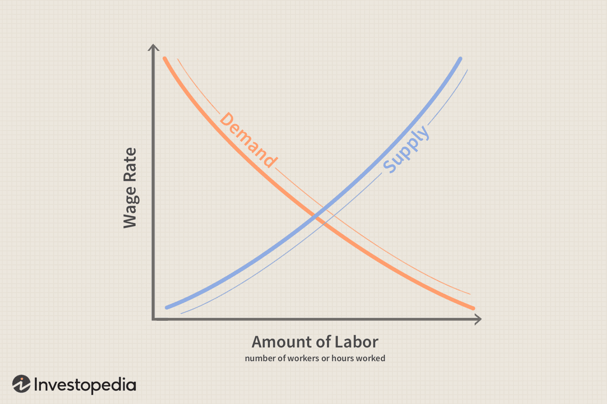

The labor market is integral to the functioning of the modern economy, influencing not only individual livelihoods but also broader economic trends. It serves as the platform where labor supply meets demand, determining employment rates, wage levels, and productivity, which are crucial metrics for assessing economic health. This article investigates critical components that shape the labor market, including workforce composition and economic theories related to labor dynamics, shedding light on their implications for various stakeholders.

Workforce composition, which encompasses factors such as age, gender, education, and skills, impacts economic efficiency and innovation. As economies evolve toward more technology-driven environments, understanding shifts in workforce capabilities becomes increasingly vital. The emergence of new technologies and the subsequent demand for tech-savvy and adaptable workers highlight the evolving nature of labor requirements.



Economic theories provide a framework for analyzing labor market behaviors. Macroeconomic theories examine aggregate supply and demand, illuminating their influence on wages and employment levels. Simultaneously, microeconomic theories explore the decision-making processes within firms regarding hiring, firing, and wage determination, guiding policies on minimum wage regulation and labor laws.

The influence of algorithmic trading on labor markets also warrants attention. While it primarily pertains to financial markets, algorithmic trading impacts labor indirectly by affecting stock prices and investment flows, which can, in turn, influence job creation and economic stability. Additionally, the increasing role of algorithms poses questions about the future landscape of employment in finance sectors, as automation reshapes job roles.

A comprehensive understanding of these dynamics is essential for policymakers, businesses, and investors aiming to navigate and shape the future economic landscape effectively. Adapting to changes in workforce composition and integrating economic theories into policy-making are crucial steps toward ensuring a balanced and equitable labor market.

## Table of Contents

## Understanding Labor Market Dynamics

The labor market represents a crucial economic framework where the supply of labor converges with the demand for labor. This marketplace is pivotal in shaping overall economic health and individual financial stability. The dynamics within this market are influenced by several macroeconomic factors, among which immigration and the aging population are particularly significant.

Immigration impacts the labor market by altering the supply side. An influx of migrants often leads to an increase in the labor supply, which can fill gaps in sectors experiencing shortages. Migrants frequently contribute to workforce diversity, introducing varied skills and perspectives that can drive innovation and efficiency. However, if not well-managed, sudden surges in labor supply could potentially lead to increased competition for jobs, putting downward pressure on wages for certain market segments.

On the other hand, the aging population affects the labor market by potentially shrinking the labor force as a larger portion of the population retires. This demographic shift poses challenges such as increased demand for healthcare and pension services while simultaneously reducing the taxable workforce. Countries experiencing these changes may face labor shortages, prompting a need for policy reforms around retirement age, immigration, and skills training to ensure economic stability.

Key indicators of labor market health include unemployment rates, labor productivity, and wage growth. The unemployment rate is a critical metric that reflects the percentage of the labor force actively seeking employment but unable to find work. An ideally low unemployment rate signals a healthy economy with adequate job creation.

Labor productivity, calculated as the output per hour worked, is another vital indicator. It reflects the efficiency of the labor force in converting labor input into economic output. Higher productivity indicates that the labor market is effectively utilizing its workforce, often correlating with economic growth and improved living standards.

Wage growth is equally important, as it affects consumer spending and standard of living. Consistent wage growth indicates robust demand for labor, which can stimulate economic expansion as employees have more spending power. However, wage growth must be aligned with productivity increases to prevent inflationary pressures.

In summary, understanding labor market dynamics involves analyzing how macroeconomic factors influence labor supply and demand, and monitoring key indicators that signal economic health. These insights are vital for developing strategies that improve labor market efficiency and economic resilience.

## Workforce Composition

Workforce composition comprises various attributes such as age, gender, education, and skill levels. These characteristics collectively define the demographics and qualifications of a labor force, influencing economic performance and organizational success.

**Age Diversity**: Age distribution within a workforce affects productivity, creativity, and adaptability. Older workers generally bring experience and stability, while younger workers may offer fresh perspectives and a keen understanding of new technologies. According to the U.S. Bureau of Labor Statistics, the labor force participation rate of individuals aged 65 and older is projected to increase, reflecting an aging population that continues to work longer.

**Gender Diversity**: Gender diversity has been shown to enhance organizational performance. A study by Catalyst found that companies with higher gender diversity in their executive teams were 21% more likely to outperform those with less diversity. Gender equality can lead to more inclusive decision-making and innovation, benefiting overall productivity.

**Educational Attainment and Skill Levels**: Education and skills are crucial to workforce composition, significantly impacting economic growth and competitiveness. Higher levels of education correlate with increased productivity and innovation. In recent years, there has been a marked shift towards tech-savvy workforces, emphasizing digital skills and competencies. This trend is evident in the rising demand for specialists in fields like data analysis, artificial intelligence, and cybersecurity.

**Current Trends**: The modern workforce is increasingly characterized by adaptability and continuous learning. The rapid pace of technological advancement necessitates ongoing education and skill development. Employers are seeking workers who can thrive in dynamic environments and quickly assimilate new knowledge.

Moreover, the rise of remote work and telecommuting has broadened workforce diversity in terms of geographic location, further diversifying the composition of the labor market. This shift has led to increased access to talent across borders, allowing companies to harness a wider range of skills and perspectives.

In summary, workforce composition, defined by factors such as age, gender, education, and skills, is pivotal to the productivity and innovation of organizations. Embracing diversity and fostering an environment conducive to the development of digital skills are essential strategies for staying competitive in the modern economy.

## Economic Theories Related to the Labor Market

Economic theories relating to labor markets are essential for comprehending how labor demand and supply influence wages and employment levels. These theories are categorized into macroeconomic and microeconomic perspectives, both playing distinct yet interconnected roles in shaping labor policy and economic understanding.

**Macroeconomic Theory** examines labor markets from a broad perspective, focusing on the aggregate dynamics of labor supply and demand. It evaluates how different factors, such as economic growth, unemployment, inflation, and government policy, impact overall employment levels and wage trends. A crucial aspect of this theory is the Phillips Curve, which illustrates an inverse relationship between unemployment and inflation, suggesting that as unemployment decreases, inflation tends to increase, often leading to upward pressure on wages.

In macroeconomic models, labor supply and demand depend on factors such as natural population changes, immigration, and economic policies. The demand for labor is derived from the production needs of an economy as firms seek to maximize profits by hiring additional workers when the marginal revenue product of labor (MRP) exceeds the wage rate. The equilibrium wage rate and employment level are determined at the intersection of labor supply and demand curves.

**Microeconomic Theory** focuses on individual firms and workers, looking at how they interact within labor markets. This analysis involves the behavior of firms in hiring and firing decisions and how they set wages under varying market conditions. It considers how factors such as skills, education, experience, and worker bargaining power influence wage levels and employment opportunities.

Microeconomic labor models often emphasize labor market imperfections, such as monopsony power, where a single employer dominates a labor market and can influence wages. In contrast, competitive labor markets consist of numerous firms and workers where wages and employment levels naturally align with productivity levels.

Both macroeconomic and microeconomic theories inform policy decisions on labor markets, guiding interventions like minimum wage regulations, labor rights legislation, and employment benefits. Policies aiming to address unemployment often draw from these theoretical frameworks to balance the goals of equity, efficiency, and economic growth.

For example, setting a minimum wage requires understanding its potential effect on employment levels. According to basic microeconomic theory, setting a wage floor above the equilibrium rate might result in excess supply of labor (i.e., unemployment). However, in a monopsonistic market, a minimum wage could potentially increase employment by countering the employer's wage-setting power.

To assist with computational modeling of these theories, Python can be used to simulate labor supply and demand dynamics. Below is a simple example of a Python script that models labor supply and demand curves:

```python
import numpy as np
import matplotlib.pyplot as plt

# Define wage range
wages = np.linspace(5, 50, 100)

# Define labor supply and demand functions
def labor_demand(wage):
    return 1000 / wage

def labor_supply(wage):
    return wage * 15

# Calculate associated labor values
demand = labor_demand(wages)
supply = labor_supply(wages)

# Plot the labor supply and demand curves
plt.plot(wages, demand, label='Labor Demand')
plt.plot(wages, supply, label='Labor Supply')
plt.axhline(0, color='black', linewidth=0.8)
plt.axvline(0, color='black', linewidth=0.8)
plt.xlabel('Wage Rate')
plt.ylabel('Labor')
plt.title('Labor Market Equilibrium')
plt.legend()
plt.show()
```

This code illustrates the intersection where labor supply meets labor demand, representing the equilibrium wage and employment in a competitive market, effectively bridging theoretical concepts with practical application.

## Impact of Algorithmic Trading on Labor Markets

Algorithmic trading, a method of executing financial transactions using pre-set rules and algorithms, has become increasingly prevalent in global financial markets. The deployment of complex computational models allows traders to execute orders with speed and precision unattainable by human traders. This technological approach harnesses historical and real-time data, leveraging statistical and [machine learning](/wiki/machine-learning) models to predict market movements and identify trading opportunities.

The impact on financial markets is significant, with [algorithmic trading](/wiki/algorithmic-trading) accounting for a substantial proportion of trading volumes in major stock exchanges. It has improved the efficiency and [liquidity](/wiki/liquidity-risk-premium) of markets, allowing for narrower bid-ask spreads and lower transaction costs. However, the implications for labor markets are more nuanced and multifaceted.

Algorithmic trading influences the labor market indirectly through its effect on stock prices and investment flows. When algorithmic trading strategies alter market dynamics, they can lead to [volatility](/wiki/volatility-trading-strategies) that affects investor confidence and corporate decision-making. These fluctuations can impact employment levels in industries linked to the financial sector, as companies may adjust staffing based on their financial outlook influenced by market performance.

Moreover, the growing dominance of algorithmic trading has shifted the skills demand within the finance industry. The traditional roles of traders, who once relied heavily on intuition and experience, are diminishing. In their place, there is an increasing demand for quantitative analysts, data scientists, and software engineers who can develop and refine algorithms. This shift necessitates a workforce adept in programming, data analysis, and financial modeling, thus transforming the skill set required in financial institutions.

As algorithmic trading continues to evolve, it raises critical questions about the future of jobs in finance. The reliance on technology and automation suggests potential job displacement, yet it also opens opportunities for new roles centered around algorithm development and oversight. Policymakers and educational institutions must anticipate these changes to provide suitable training and support for the workforce transitioning to these emerging roles.

In conclusion, while algorithmic trading enhances market operations, its ripple effects on the labor market demand a strategic response to ensure that workforce developments align with technological advancements. This includes fostering a labor market that values and integrates the technical skills likely to drive future economic growth in the financial sector.

## Conclusion

The labor market exemplifies a dynamic system shaped by a confluence of economic theories and technological advancements. Its fluid nature is dictated by the balance between supply and demand, influenced by macroeconomic trends such as demographic shifts and globalization. The composition of the workforce, including age, education, and skill sets, is pivotal in shaping labor market outcomes, making it essential to understand these elements to navigate the complexities of future economic landscapes.

Workforce composition plays a critical role in determining the adaptability of labor markets to emerging economic challenges. As technological innovations redefine job roles, a tech-savvy and flexible workforce becomes indispensable. This transformation necessitates continuous investment in education and skills training, fostering a culture of lifelong learning to equip individuals for the evolving job market.

Effective collaboration between policymakers and industry leaders is vital to fostering a balanced and equitable labor market. Policymakers are tasked with ensuring that labor regulations and policies promote fair wages and protect workers' rights, while industry leaders must advocate for inclusive practices that leverage diversity to drive innovation and productivity. Initiatives aimed at bridging the digital divide can help in equipping underrepresented groups with the necessary skills to thrive in a modern economy.

In conclusion, our ability to comprehend and respond to the multifaceted nature of labor markets is crucial for sustainable economic development. By prioritizing the enhancement of workforce competencies and fostering synergies between stakeholders, we can build resilient labor markets poised to meet the demands of tomorrow's economy.

## References & Further Reading

[1]: ["The Labor Market: An Introduction"](https://www.investopedia.com/terms/l/labor-market.asp) by Kwabena Anyane-Ntow 

[2]: Eagly, A.H. & Wood, W. (2012). ["Social Role Theory of Sex Differences and Similarities: A Current Appraisal."](https://psycnet.apa.org/record/2011-21802-024) The Origins and Nature of Social Roles.

[3]: Choudhry, M., Marelli, E., & Signorelli, M. (2012). ["Youth Unemployment Rate and Impact of Financial Crises."](https://www.emerald.com/insight/content/doi/10.1108/01437721211212538/full/html) 

[4]: Bollen, N.P.B. & Whaley, R.E. (1998). ["Are 'Teenies' Better?"](https://www.academia.edu/45467972/Are_Teenies_Better) Review of Financial Studies.

[5]: Autor, D. (2010). ["The Polarization of Job Opportunities in the U.S. Labor Market: Implications for Employment and Earnings."](https://economics.mit.edu/sites/default/files/publications/the%20polarization%20of%20job%202010.pdf) The Hamilton Project. 

[6]: Katz, L.F. & Murphy, K.M. (1992). ["Changes in Relative Wages, 1963-1987: Supply and Demand Factors."](https://inequality.stanford.edu/sites/default/files/media/_media/pdf/Classic_Media/Katz_Murph_1992.pdf) Quarterly Journal of Economics.