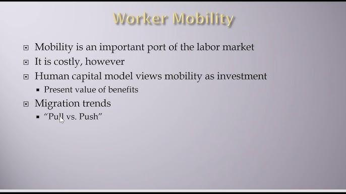

## Table of Contents

## What is labor mobility in economics?

Labor mobility in economics refers to how easily workers can move from one job to another or from one location to another. This movement can be within the same country or between different countries. It's important because it helps the economy work better. When workers can move to where jobs are available, it helps fill job vacancies and can lead to better matching of workers' skills with the needs of employers.

There are two main types of labor mobility: geographical and occupational. Geographical mobility is about workers moving from one place to another to find work. This could be moving from a rural area to a city or from one country to another. Occupational mobility, on the other hand, is about workers changing their jobs or careers. This might happen when someone learns new skills or when the demand for certain jobs changes. Both types of mobility are important for a flexible and responsive economy.

## Why is labor mobility important for economic growth?

Labor mobility is important for economic growth because it helps match workers with jobs where they are needed the most. When people can easily move to new jobs or new places, companies can find the right people to fill their job openings. This means businesses can grow and produce more, which helps the whole economy. If workers stay in jobs or places where there are no opportunities, the economy might not grow as fast because businesses can't find the workers they need.

Also, labor mobility helps workers find better jobs that match their skills and interests. When people have jobs that fit them well, they are usually happier and more productive. This can lead to more innovation and better products or services. When workers can move to new jobs or new places, it also encourages them to learn new skills, which can help the economy grow even more. So, labor mobility is key for making the economy stronger and more dynamic.

## How does labor mobility affect wages and employment?

Labor mobility can affect wages and employment in important ways. When workers can move to where jobs are available, it helps businesses find the people they need. This can lead to more jobs being created because companies can grow when they have enough workers. If there are more jobs, more people can work, which is good for employment. Also, when there are lots of job openings and not enough workers, companies might have to offer higher wages to attract people. So, high labor mobility can lead to more jobs and higher wages.

On the other hand, if labor mobility is low, it can be harder for businesses to find workers. This might mean fewer jobs are created because companies can't grow without enough people to work. If there are fewer job opportunities, some people might stay unemployed or have to take jobs that don't pay well. Also, if workers can't move to where the jobs are, they might not be able to find better-paying jobs. So, low labor mobility can lead to fewer jobs and lower wages.

## What are the different types of labor mobility?

Labor mobility is about how easily workers can move to different jobs or places. There are two main types of labor mobility: geographical mobility and occupational mobility. Geographical mobility means workers moving from one place to another to find work. This could be moving from a small town to a big city or from one country to another. It's important because it helps workers find jobs where there are more opportunities.

Occupational mobility is about workers changing their jobs or careers. This might happen when someone learns new skills or when the demand for certain jobs changes. For example, a teacher might become a writer, or a factory worker might start working in a tech company. Occupational mobility is important because it helps workers find jobs that match their skills and interests better.

Both types of labor mobility are key for a strong economy. When workers can move to new jobs or new places easily, it helps businesses grow and create more jobs. It also helps workers find better opportunities, which can lead to higher wages and more happiness at work.

## What factors influence labor mobility?

Several things can affect how easily workers move to new jobs or new places. One big factor is the cost of moving. If it's expensive to move, like paying for a new home or traveling far, people might not want to do it. Another factor is family and personal ties. People might not want to leave their family and friends behind. Also, language and culture can make moving hard. If you don't speak the language or know the customs in a new place, it can be tough to move there.

Another important thing is the job market. If there are lots of good jobs in one place, people will be more likely to move there. But if there aren't many jobs, people might stay where they are. Education and skills also play a big role. If workers have the right skills for new jobs, they can move more easily. But if they need to learn new skills, it might take time and money, which can stop them from moving.

Laws and government policies can also affect labor mobility. For example, some countries make it easy for people to move in and find work, while others have strict rules. Also, things like unemployment benefits can make a difference. If people get a lot of help when they're out of work, they might not feel the need to move to find a job. All these things together can make labor mobility easier or harder for workers.

## How do government policies impact labor mobility?

Government policies can really affect how easily people move to new jobs or places. For example, some countries have rules that make it easy for people to move in and find work. They might offer visas that let workers come and stay for a while. On the other hand, some countries have strict rules that make it hard for people to move there. These rules can stop workers from moving to where the jobs are, which can slow down the economy.

Another way government policies impact labor mobility is through things like unemployment benefits and job training programs. If a government gives a lot of help to people who are out of work, those people might not feel the need to move to find a job. But if the government helps people learn new skills, it can make it easier for them to change jobs or move to a new place. So, the kinds of help a government offers can make a big difference in how easily people move around for work.

## What are the barriers to labor mobility?

There are many things that can make it hard for people to move to new jobs or places. One big barrier is the cost of moving. If it's expensive to move to a new home or travel far away, people might not want to do it. Another barrier is family and personal ties. People often don't want to leave their family and friends behind. Also, not speaking the language or knowing the customs in a new place can make moving very difficult.

The job market can also be a barrier. If there are not many good jobs in a new place, people might decide to stay where they are. Education and skills play a big role too. If workers don't have the right skills for the new jobs, they might need to spend time and money learning them, which can stop them from moving. Government rules can also make moving hard. Some countries have strict rules about who can come in and work, which can keep people from moving where the jobs are.

All these things together can make labor mobility harder. When it's tough for people to move to new jobs or places, it can slow down the economy because businesses might not be able to find the workers they need. It's important for governments and communities to think about these barriers and try to help people move more easily if they want to.

## How does labor mobility differ across countries?

Labor mobility can be very different from one country to another. In some countries, it's easy for people to move around and find new jobs. These countries often have good job markets with lots of opportunities, and they might have rules that make it easy for people to come in and work. For example, countries like Canada and Australia have special programs that help workers move there. They also have good education and training programs that help people learn new skills, which makes it easier to change jobs or move to a new place.

In other countries, it can be much harder for people to move around. This might be because moving is expensive, or because people don't want to leave their families and friends. Some countries have strict rules about who can come in and work, which can make it hard for people to move there. For example, some countries in Europe have tight rules about immigration, which can stop people from moving to where the jobs are. Also, if the job market in a country is not good, people might not want to move there even if they could.

## What role does education play in enhancing labor mobility?

Education plays a big role in helping people move to new jobs or places. When people go to school and learn new things, they get skills that can help them find better jobs. For example, if someone learns how to use computers, they might be able to work in a tech company. This makes it easier for them to change jobs or move to a new city where there are more tech jobs. Education also helps people learn new languages, which can make it easier to move to another country where they speak a different language.

Also, education can help people understand how to find and apply for jobs in different places. Schools and colleges often have programs that teach people about job hunting and how to move to new areas. This can make people feel more confident about moving to where the jobs are. When more people are educated, it's good for the whole economy because businesses can find the workers they need, and people can find jobs that match their skills and interests.

## How can labor mobility be measured and analyzed?

Labor mobility can be measured and analyzed by looking at how many people move from one job to another or from one place to another. One way to do this is by using data from government records, like census data or employment statistics. These records can show how many people moved to a new city or country in a year, or how many people changed their jobs. Researchers can also use surveys to ask people about their job changes and moves. By looking at this data, they can see patterns and trends in labor mobility.

Another way to analyze labor mobility is by looking at economic indicators like unemployment rates and wage levels. If unemployment is low in one area and high in another, it might mean that people are moving to where the jobs are. Also, if wages are going up in a certain place, it could be a sign that workers are moving there because there are more job opportunities. By putting all this information together, economists can understand how labor mobility is affecting the economy and what might help make it easier for people to move to new jobs or places.

## What are the economic theories related to labor mobility?

One important economic theory related to labor mobility is the human capital theory. This theory says that people invest in their education and skills to get better jobs and higher wages. When people have more education and skills, they can move more easily to new jobs or places where these skills are needed. This helps the economy grow because businesses can find the right workers, and people can find jobs that match their skills. But if it's hard for people to move, like if moving is expensive or there are strict rules, then their human capital might not be used as well as it could be.

Another theory is the neoclassical theory of migration. This theory says that people move to places where they can earn more money. If wages are higher in one place than another, people will move there to get better jobs. This movement helps balance the economy because it moves workers to where they are needed most. But there can be barriers like family ties or language differences that stop people from moving, even if they could earn more money somewhere else. Both theories show how important it is for people to be able to move to new jobs and places for a strong and growing economy.

## What are the future trends and challenges in labor mobility economics?

In the future, technology will play a big role in labor mobility. More people might work from home or use online platforms to find jobs in different places without moving. This can make it easier for people to change jobs or work for companies far away. But technology can also create new challenges. For example, some jobs might disappear because of automation, and people will need to learn new skills to stay employed. Governments and companies will need to help workers learn these new skills so they can move to new jobs easily.

Another trend is globalization. More people might move across countries for work because of global trade and international companies. This can help the economy grow because it brings workers to where they are needed. But it can also create challenges. Countries might need to change their rules to make it easier for people to move in and work. Also, there might be more competition for jobs, and some people might feel left out if they can't move easily. Governments will need to think about how to help everyone benefit from more labor mobility.

Lastly, demographic changes will affect labor mobility. As some countries get older, they might need more workers from other places to fill jobs. This can lead to more people moving to these countries. But it can also be hard for countries to help these new workers fit in and find good jobs. Also, younger people might move to cities for better job opportunities, which can leave rural areas with fewer workers. Governments will need to plan carefully to make sure that labor mobility helps everyone and supports a strong economy.

## What are the economics of labor mobility?

Labor mobility is a fundamental aspect of modern economics, tying directly to the efficiency and adaptability of labor markets within and across borders. At its core, labor mobility encompasses two principal forms: geographic and occupational mobility. Geographic mobility refers to the ability of workers to relocate to different regions or countries, enhancing the distribution of labor where it is most needed. Occupational mobility, on the other hand, concerns the capacity of workers to shift between different industries or job types, allowing for more efficient allocation of human resources.

The advantages of increased labor mobility are manifold. Primarily, it can lead to heightened productivity as resources are reallocated to sectors or regions where there is a higher demand for labor. This reallocation helps optimize the match between workers' skills and job requirements, often resulting in better job satisfaction and economic output. For example, a more mobile labor force can respond effectively to demand shocks in particular industries or localities, mitigating the impact of regional or sector-specific downturns.

However, increased labor mobility is not without its challenges. One significant issue is the potential for wage rate adjustments. As labor supply increases in a particular area due to geographic mobility, the average wage rate might fall, assuming demand for labor does not increase commensurately. This effect is often observed in sectors with a high influx of migrant labor, where the sudden increase in labor supply can outpace demand, leading to downward pressure on wages. Conversely, areas experiencing an outflow of labor might face labor shortages, driving wages up but potentially stifling economic activity if businesses cannot meet their labor needs.

Consider the basic supply and demand model in economics. If $L_s$ denotes the supply of labor and $L_d$ the demand for labor, the equilibrium wage rate $W_e$ can be determined by the equation:

$$
L_s = L_d
$$

Increasing labor mobility implies that $L_s$ is more fluid, potentially causing shifts in $W_e$ as $L_d$ reacts to changes in labor supply. This dynamic can be modeled and analyzed to predict the impacts on wage settings and employment levels in different regions or sectors.

Overall, the economics of labor mobility underpin significant elements of economic theory and policy. The capacity for workers to move geographically and occupationally enhances the flexibility of economies to deal with demographic shifts and economic transformations. Nonetheless, policymakers must consider strategies to address the potential downsides, such as wage [volatility](/wiki/volatility-trading-strategies) and regional disparities, to harness the full benefits of labor mobility.

## References & Further Reading

[1]: Dustmann, C., & Glitz, A. (2011). ["Migration and Education."](https://www.semanticscholar.org/paper/Migration-and-Education-Dustmann-Glitz/7754cb9346f709ce80e32f39e65702b67e45baf1) IZA Discussion Paper Series.

[2]: Borjas, G. J. (2014). ["Immigration Economics."](https://www.hup.harvard.edu/books/9780674049772) Harvard University Press.

[3]: Peri, G. (2012). ["The Effect of Immigration on Productivity: Evidence from US States."](https://www.jstor.org/stable/41349180) The Review of Economics and Statistics.

[4]: Autor, D. H. (2019). ["Work of the Past, Work of the Future."](https://www.nber.org/papers/w25588) Journal of Economic Perspectives.

[5]: Fortress, M. V. (2012). ["Algorithmic Trading: Winning Strategies and Their Rationale."](https://www.wiley.com/en-us/Algorithmic+Trading%3A+Winning+Strategies+and+Their+Rationale-p-9781118460146) Wiley Finance.

[6]: The World Bank. (2020). ["World Development Report 2020: Trading for Development in the Age of Global Value Chains."](https://www.worldbank.org/en/publication/wdr2020) World Bank Publications.