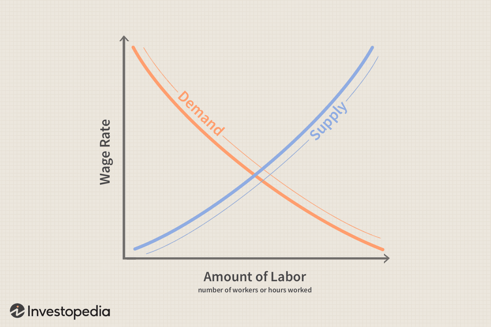

The dynamics of workforce migration and labor mobility are pivotal in shaping today's global economy. As markets continuously evolve, labor mobility—defined as the ability of workers to move both within and between economies—has emerged as a fundamental component of economic growth and productivity. This movement of labor forces is crucial not only for businesses seeking to adapt to changing market conditions but also for economies looking to enhance their competitive edge.

Economic growth is increasingly dependent on the efficient allocation of labor resources, and this efficiency is directly influenced by the level of labor mobility. Greater mobility facilitates the optimal match between workers and jobs, leading to heightened productivity across sectors. For policymakers, understanding the trends and implications of labor mobility is essential for creating frameworks that support sustainable economic development.



This article examines the economics of workforce migration and labor mobility and explores their intersection with algorithmic trading. While algorithmic trading has predominantly affected financial markets by increasing the speed and efficiency of trades, it also has significant implications for labor dynamics within the finance sector. By analyzing these components, we can gain a comprehensive understanding of how technological advancements and workforce trends are interconnected.

In conclusion, understanding labor mobility and workforce migration is not just an academic exercise but a necessary pursuit for policymakers, businesses, and workers alike. As we navigate the complexities of the global economy, it is imperative to recognize and harness the potential of labor mobility to drive productivity and economic growth.

## Table of Contents

## The Economics of Labor Mobility

Labor mobility is a fundamental aspect of modern economics, tying directly to the efficiency and adaptability of labor markets within and across borders. At its core, labor mobility encompasses two principal forms: geographic and occupational mobility. Geographic mobility refers to the ability of workers to relocate to different regions or countries, enhancing the distribution of labor where it is most needed. Occupational mobility, on the other hand, concerns the capacity of workers to shift between different industries or job types, allowing for more efficient allocation of human resources.

The advantages of increased labor mobility are manifold. Primarily, it can lead to heightened productivity as resources are reallocated to sectors or regions where there is a higher demand for labor. This reallocation helps optimize the match between workers' skills and job requirements, often resulting in better job satisfaction and economic output. For example, a more mobile labor force can respond effectively to demand shocks in particular industries or localities, mitigating the impact of regional or sector-specific downturns.

However, increased labor mobility is not without its challenges. One significant issue is the potential for wage rate adjustments. As labor supply increases in a particular area due to geographic mobility, the average wage rate might fall, assuming demand for labor does not increase commensurately. This effect is often observed in sectors with a high influx of migrant labor, where the sudden increase in labor supply can outpace demand, leading to downward pressure on wages. Conversely, areas experiencing an outflow of labor might face labor shortages, driving wages up but potentially stifling economic activity if businesses cannot meet their labor needs.

Consider the basic supply and demand model in economics. If $L_s$ denotes the supply of labor and $L_d$ the demand for labor, the equilibrium wage rate $W_e$ can be determined by the equation:

$$
L_s = L_d
$$

Increasing labor mobility implies that $L_s$ is more fluid, potentially causing shifts in $W_e$ as $L_d$ reacts to changes in labor supply. This dynamic can be modeled and analyzed to predict the impacts on wage settings and employment levels in different regions or sectors.

Overall, the economics of labor mobility underpin significant elements of economic theory and policy. The capacity for workers to move geographically and occupationally enhances the flexibility of economies to deal with demographic shifts and economic transformations. Nonetheless, policymakers must consider strategies to address the potential downsides, such as wage [volatility](/wiki/volatility-trading-strategies) and regional disparities, to harness the full benefits of labor mobility.

## Impact of Workforce Migration on Economies

Workforce migration plays a pivotal role in shaping the economic landscapes of both sending and receiving countries. The movement of labor across borders can result in a cascade of economic outcomes, with both positive and negative repercussions.

One of the most significant impacts of workforce migration is the potential increase in labor supply, which can enhance economic output. The arrival of migrant workers often fills crucial gaps in sectors where there is a high demand for labor but an insufficient supply. This infusion of labor can spur productivity, drive economic growth, and contribute to competitive market dynamics. For instance, the influx of skilled migrants can lead to innovation and the transfer of knowledge, enhancing the overall skill set of the recipient economy.

However, these benefits are contingent upon the ability of economies to absorb new workers effectively. When job creation does not keep pace with the influx of migrant workers, there is a risk of increased unemployment and underemployment. This scenario could create downward pressure on wages, as the supply of labor surpasses demand, potentially leading to economic disparities and social tensions. 

Workforce migration also affects the sending economies. On the one hand, remittances sent back by migrants can form a significant portion of national income, contributing to poverty alleviation and supporting local economies. Remittances can provide a steady flow of foreign currency, which may help stabilize the economies of sending countries. For instance, according to the World Bank, in 2020, global remittances amounted to over $700 billion, with many developing countries relying on these funds as a vital economic lifeline.

On the other hand, the loss of skilled workers, often referred to as "brain drain," can hamper economic development in the countries of origin. When educated and skilled individuals migrate, sending countries may experience a reduction in human capital, which can hinder innovation, productivity, and long-term economic growth.

Balancing these contrasting effects of workforce migration poses significant challenges for policymakers. On a macroeconomic scale, effective management of migration flows can maximize the benefits while mitigating potential downsides. This requires coordinated efforts to enhance labor market flexibility, invest in education and skills training, and implement policies that accommodate the integration of migrants into the workforce. By doing so, both sending and receiving economies can capitalize on the advantages of labor mobility while minimizing its inherent challenges. 

In summary, the impact of workforce migration on economies is multifaceted and requires careful consideration to ensure that the benefits are harnessed and the drawbacks are addressed. Strategic policy measures and international cooperation are crucial to achieving sustainable outcomes that favor economic growth and social harmony.

## Geographic and Occupational Mobility: Key Differences

Geographic mobility refers to the movement of individuals or groups from one location to another in search of better employment opportunities, living conditions, or other socio-economic factors. It plays a pivotal role in the distribution of labor across regions, facilitating the allocation of human resources to areas where they are most needed. This form of mobility is instrumental in balancing labor markets, alleviating regional unemployment disparities, and enhancing economic growth. An example of geographic mobility is rural-to-urban migration, where workers move from less economically developed rural areas to urban centers in pursuit of better job prospects and wages.

Occupational mobility, on the other hand, pertains to the capacity of workers to shift from one occupation to another. This transition can occur within the same industry or between different sectors, influenced by changes in economic demand, technological advancements, or personal career aspirations. Occupational mobility is crucial for workforce adaptability and economic innovation, as it enables workers to update their skills and competencies in response to evolving market needs. It also supports industries in maintaining a flexible and skilled workforce, essential for competitiveness and productivity.

Both geographic and occupational mobility are integral to economic adaptability and growth. They contribute to a dynamic labor market, capable of responding swiftly to economic shifts and technological advancements. Geographic mobility aids in the efficient distribution of labor where it is most needed, while occupational mobility ensures that workers can continuously develop and apply their skills across various domains. Together, they foster a resilient and progressive economy, capable of supporting sustained development and prosperity.

## Algorithmic Trading and Labor Dynamics

Algorithmic trading encompasses automated systems that execute financial transactions based on pre-defined criteria, often using mathematical models and computational algorithms. This technological advancement has profoundly restructured labor demands within the finance industry. Traditionally, finance roles required skills in areas such as [fundamental analysis](/wiki/fundamental-analysis), relationship management, and manual trading. However, with the advent of automated trading, there is a growing demand for expertise in technology, data science, and quantitative analysis.

The transition to technology-driven roles is evident in several dimensions. First, the development and maintenance of [algorithmic trading](/wiki/algorithmic-trading) systems require a multidisciplinary skill set. Professionals in this sector are required to possess strong programming skills, familiarity with statistical software, and an understanding of financial markets. Python, for instance, has become a highly sought-after skill, given its extensive libraries for data analysis and [machine learning](/wiki/machine-learning).

```python
import numpy as np
import pandas as pd

# Example of a simple moving average crossover strategy
def moving_average_crossover(prices, short_window=40, long_window=100):
    signals = pd.DataFrame(index=prices.index)
    signals["signal"] = 0.0

    # Create short simple moving average
    signals["short_mavg"] = prices["Close"].rolling(window=short_window, min_periods=1, center=False).mean()

    # Create long simple moving average
    signals["long_mavg"] = prices["Close"].rolling(window=long_window, min_periods=1, center=False).mean()

    # Create signals
    signals["signal"][short_window:] = np.where(signals["short_mavg"][short_window:] > signals["long_mavg"][short_window:], 1.0, 0.0)   

    # Generate trading orders
    signals["positions"] = signals["signal"].diff()

    return signals
```

The above Python code illustrates a basic moving average crossover strategy that algorithmic traders might use to generate buy and sell signals based on stock prices.

The shift towards algorithmic trading has also impacted labor mobility within the finance sector. Employees in traditional roles might find themselves needing to acquire new skills and qualifications to remain competitive. This necessity could prompt occupational mobility, as workers transition from roles rooted in manual processes to those oriented towards technological proficiency and quantitative analysis.

Furthermore, the geographical mobility of finance professionals is influenced by the global nature of algorithmic trading. Financial firms around the world, irrespective of their physical location, compete for skilled technology and data-driven professionals, thus intensifying cross-border labor mobility. This demand creates opportunities for those with the requisite skills while also challenging traditional financial hubs to adapt and attract talent in this evolving landscape.

Algorithmic trading also introduces economic efficiency by enhancing market [liquidity](/wiki/liquidity-risk-premium) and pricing accuracy. However, it poses challenges such as potential job displacement for traditional finance roles. Financial institutions and regulatory bodies are encouraged to provide training and education programs to facilitate the transition for workers affected by these technological shifts. 

Conclusively, the rise of algorithmic trading necessitates a continual evolution in workforce skills and dynamics within the finance industry, influencing both occupational and geographic labor mobility.

## Challenges and Opportunities in Labor Mobility and Migration

Labor mobility and workforce migration offer significant opportunities for economic growth and development; however, they are accompanied by numerous challenges. Regulatory barriers, such as strict immigration policies and labor laws, can limit the movement of workers across borders and within industries. These constraints often result in prolonged processes for obtaining work permits and visas, deterring potential migrants and creating inefficiencies within labor markets. Simplifying immigration procedures and adopting more flexible labor laws could help overcome these regulatory obstacles.

Social resistance is another challenge that hinders labor mobility. Xenophobia and cultural prejudices can lead to discrimination against migrant workers, affecting their ability to integrate into new communities and labor markets. This resistance often fuels political opposition to more open immigration policies. Promoting multiculturalism and raising awareness about the economic contributions of migrants can help mitigate social resistance and foster a welcoming environment for skilled workers.

Economic inequalities also pose significant hurdles to labor mobility. Differences in wage levels, cost of living, and access to education and training opportunities can create disparities that make migration less appealing or even unfeasible for many workers. Addressing these inequalities requires investment in education and vocational training programs to equip workers with the skills needed for evolving labor markets. Moreover, ensuring equitable access to these opportunities can help bridge the gap between different regions and socio-economic groups.

To enhance labor mobility and maximize economic benefits, policymakers and businesses can adopt several strategies. Implementing comprehensive policy frameworks that address both the challenges and opportunities of labor mobility is crucial. These frameworks should include measures to streamline immigration processes, promote social integration, and reduce economic disparities.

Businesses can play a proactive role by fostering inclusive workplaces and investing in employee development programs. They can also collaborate with governments and educational institutions to create pathways for skill development and career advancement. Technologies such as digital platforms can facilitate job matching and skills recognition, further supporting labor mobility.

In summary, while challenges exist, the potential benefits of labor mobility and workforce migration can be realized through strategic actions aimed at overcoming regulatory, social, and economic barriers. By fostering an environment that encourages movement and integration, economies can harness the contributions of a dynamic and adaptable workforce.

## Conclusion

As global economies continue to grow and diversify, the dynamic interplay of labor mobility and workforce migration will remain crucial components shaping economic landscapes. Balancing the benefits and drawbacks of migration is essential to achieve sustainable economic development. On one hand, labor mobility facilitates efficient allocation of resources, drives competition, and fosters innovation by allowing skills and talents to move where they are most needed. This not only enhances productivity but also contributes to economic resilience in the face of shifting market demands and technological advancements.

However, the potential drawbacks of unchecked migration and labor mobility, such as socio-economic disparities, labor market saturation, and cultural integration challenges, cannot be overlooked. These issues may lead to tensions and economic instability if not addressed adequately. Thus, adopting comprehensive and forward-looking policies is paramount. Strategies should focus on removing unnecessary barriers, enhancing skills through education and training programs, and promoting inclusive labor markets that cater to diverse populations.

Future policies should aim to support labor mobility by investing in infrastructure, simplifying visa and work permit processes, and fostering international cooperation to manage cross-border migration effectively. Furthermore, addressing associated challenges such as social integration and labor rights protection will be critical to harness the full potential of labor mobility and migration. Ultimately, a balanced approach that maximizes economic benefits while mitigating potential downsides is key to ensuring long-term sustainable development in an increasingly interconnected world.

## References & Further Reading

[1]: Dustmann, C., & Glitz, A. (2011). ["Migration and Education."](https://www.semanticscholar.org/paper/Migration-and-Education-Dustmann-Glitz/7754cb9346f709ce80e32f39e65702b67e45baf1) IZA Discussion Paper Series.

[2]: Borjas, G. J. (2014). ["Immigration Economics."](https://www.hup.harvard.edu/books/9780674049772) Harvard University Press.

[3]: Peri, G. (2012). ["The Effect of Immigration on Productivity: Evidence from US States."](https://www.jstor.org/stable/41349180) The Review of Economics and Statistics.

[4]: Autor, D. H. (2019). ["Work of the Past, Work of the Future."](https://www.nber.org/papers/w25588) Journal of Economic Perspectives.

[5]: Fortress, M. V. (2012). ["Algorithmic Trading: Winning Strategies and Their Rationale."](https://www.wiley.com/en-us/Algorithmic+Trading%3A+Winning+Strategies+and+Their+Rationale-p-9781118460146) Wiley Finance.

[6]: The World Bank. (2020). ["World Development Report 2020: Trading for Development in the Age of Global Value Chains."](https://www.worldbank.org/en/publication/wdr2020) World Bank Publications.