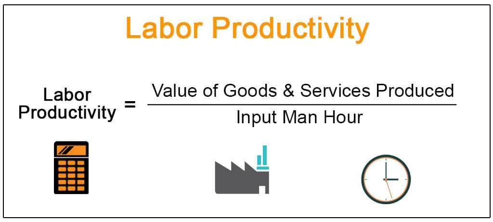

In today's rapidly evolving economic landscape, understanding productivity is more crucial than ever. Productivity, a fundamental driver of economic efficiency and growth, encompasses a spectrum of concepts, including individual labor productivity and total factor productivity. These concepts significantly impact economic dynamics, influencing both macroeconomic factors like GDP and microeconomic factors such as business profitability.

This article aims to elucidate various dimensions of productivity, exploring labor productivity, strategies for its improvement, methods for productivity calculation, and the role of algorithmic trading in enhancing productivity. Understanding labor productivity is pivotal as it indicates how effectively labor is utilized to produce goods and services, often reflected as Gross Domestic Product (GDP) per hour worked. Enhancements in labor productivity can lead to increased economic output and improved living standards, underscoring its importance for policy formulation and economic planning.



Additionally, improving productivity is critical for businesses aiming for growth and sustainability. Technologies such as automation and digital transformation play essential roles in streamlining operations, reducing costs, and improving output quality. These advancements, alongside strategies to optimize worker skills and operational processes, contribute to a more productive and competitive business environment.

The quantification of productivity through specific methods and formulas, such as output per labor hour or multi-factor productivity calculations, provides a framework for benchmarking performance and directing improvements. Such measurements are vital for investors and businesses to maintain a competitive edge, ensuring sustained profitability and economic efficiency.

Moreover, the article highlights how technological advancements, particularly algorithmic trading, amplify productivity improvements in modern trading contexts. Algorithmic trading automates complex trading processes, increasing decision-making efficiency and reducing human error. This technological integration in financial markets exemplifies how productivity enhancements contribute to broader economic growth and efficiency.

As we explore these facets of productivity, we emphasize the importance of continuous investment in technology, human capital, and efficient systems to achieve sustained economic success. Productivity remains a cornerstone of economic development, influencing diverse economic entities from individual businesses to entire national economies. Recognizing its multifaceted impact is crucial for navigating the complexities of today's economic environments.

## Table of Contents

## Understanding Labor Productivity

Labor productivity is a fundamental economic metric that reflects the amount of output produced by a unit of labor input, typically measured in terms of GDP per hour worked. This measure is pivotal in assessing the efficiency and prosperity of an economy, as it indicates how well labor resources are utilized in generating goods and services. High labor productivity implies that a country can produce more output with the same amount of labor, which is an indicator of economic health and competitiveness.

Several drivers significantly influence labor productivity. Investment in physical capital is one such driver. Capital such as machinery, tools, and infrastructure enhances the capability of workers, allowing them to produce more efficiently. For instance, the introduction of automated machinery in manufacturing can increase the speed and precision of production processes, thereby boosting productivity.

Technological advancements are another critical [factor](/wiki/factor-investing). Breakthroughs in technology can lead to the development of new products and services and more efficient production methods. The digital revolution, exemplified by the proliferation of information technology, has been a significant boon for productivity across various industries.

Additionally, human capital development plays a crucial role. Human capital refers to the skills, knowledge, and experience possessed by an individual or population, seen in terms of their value or cost to an organization or country. Investment in education and training enhances labor productivity by improving the workforce's skill set, making workers more adept at using existing and new technologies and methodologies. 

These factors are essential in shaping policies aimed at fostering economic growth and improving living standards. For example, governments can facilitate productivity enhancement by encouraging investments in technology and infrastructure, supporting education and training programs, and creating a regulatory environment conducive to innovation and efficient business operations.

In mathematical terms, labor productivity can be expressed with the formula:

$$
\text{Labor Productivity} = \frac{\text{Total Output}}{\text{Total Labor Hours}}
$$

This simple equation underscores the importance of maximizing output while managing labor input effectively. Accurate measurement and analysis of labor productivity help policymakers and economists identify trends, compare economic performance over time, and make informed decisions to promote sustainable economic growth.

## Strategies for Productivity Improvement

Improving productivity is essential for businesses aiming for growth and sustainability in a competitive market. A variety of strategies can be employed to enhance productivity, focusing on technological investments, workforce skill enhancement, and efficient operational processes.

Investing in technology, particularly automation and digital transformation, is crucial. Automation involves deploying systems and machinery to perform tasks that were traditionally handled by human labor, thereby significantly reducing costs and improving output quality. Digital transformation, on the other hand, entails leveraging digital technologies to modify existing processes, improve customer experiences, and drive innovation. For instance, implementing enterprise resource planning (ERP) systems can facilitate real-time data analysis, streamline supply chain management, and foster interdepartmental collaboration, leading to increased operational efficiency.

Enhancing worker skills is another pivotal strategy. This includes providing ongoing training and development programs to ensure employees are updated with the latest skills and industry knowledge. By investing in human capital development, businesses can enhance employee competencies, leading to enhanced problem-solving capabilities and innovation. Moreover, empowered employees tend to be more motivated, which can significantly impact productivity levels.

Creating a conducive work environment also contributes to productivity gains. This encompasses fostering a culture of open communication, ensuring employee wellness, and promoting work-life balance. When employees feel valued and supported, they are more likely to be productive and contribute positively to the organization’s goals.

Agile management and continuous improvement methodologies are vital for organizations to remain adaptable amidst changing market dynamics. Agile management promotes flexibility, incremental progress, and rapid response to feedback, enabling teams to adjust quickly to shifting demands. Techniques such as Scrum or Lean can be employed to improve project management and efficiency. Continuous improvement practices, like the Plan-Do-Check-Act (PDCA) cycle, encourage regular assessment and refinement of workflows, ensuring persistent enhancement of productivity.

Incorporating these strategies systematically can position businesses to sustainably enhance productivity and secure a competitive advantage in their respective industries.

## Calculating Productivity: Methods and Formulas

Calculating productivity involves a clear understanding of the relationship between inputs and outputs in a production process. The most straightforward approach to measuring productivity is through the basic productivity formula:

$$
\text{Productivity} = \frac{\text{Total Output}}{\text{Total Input}}
$$

This fundamental equation provides insight into how effectively resources are being used to generate goods or services.

### Labor Productivity

Labor productivity is a critical index often expressed as output per labor hour. It serves as a key indicator of labor efficiency. The formula for labor productivity is:

$$
\text{Labor Productivity} = \frac{\text{Total Output}}{\text{Total Labor Hours}}
$$

This measurement helps identify how efficiently labor resources are being utilized, which is crucial for improving competitive advantage in organizations and raising living standards across economies.

### Multi-Factor Productivity (MFP)

Multi-factor productivity offers a broader assessment of productivity by including various inputs, not just labor but also capital. This provides a more comprehensive picture of productivity performance, accounting for the synergy between different resources. The MFP can be calculated as:

$$
\text{Multi-Factor Productivity} = \frac{\text{Total Output}}{\text{Weighted Sum of Inputs}}
$$

In this context, inputs could include labor, capital, energy, materials, and services used within the production process. Each input can be weighted based on its relative importance or cost, resulting in a nuanced understanding of efficiency and productivity improvements across different sectors or industries.

### Importance of Accurate Measurement

Accurate measurement of productivity is crucial for benchmarking performance, setting realistic targets, and identifying areas for improvement. Precise productivity calculations can inform policymaking and strategic business decisions aimed at fostering economic growth and sustainability. Without accurate data, organizations may struggle to pinpoint inefficiencies or fail to capitalize on potential improvements.

Python code can be employed to automate the calculation of productivity measures, allowing for more dynamic analysis over time or across different scenarios:

```python
def calculate_labor_productivity(output, labor_hours):
    return output / labor_hours

def calculate_multi_factor_productivity(output, inputs):
    weighted_sum_of_inputs = sum(inputs.values())
    return output / weighted_sum_of_inputs

# Example usage:
output = 1000  # Units produced
labor_hours = 100  # Total labor hours
inputs = {'labor': 100, 'capital': 200, 'energy': 50}  # Example input weights

labor_productivity = calculate_labor_productivity(output, labor_hours)
mfp = calculate_multi_factor_productivity(output, inputs)

print(f"Labor Productivity: {labor_productivity}")
print(f"Multi-Factor Productivity: {mfp}")
```

By applying such calculations, businesses and policymakers can gain insights into current productivity levels and devising strategies to optimize resource utilization effectively.

## The Role of Algorithmic Trading in Enhancing Productivity

Algorithmic trading plays a transformative role in enhancing productivity within financial markets by automating intricate trading processes that traditionally required extensive human intervention. This helps to streamline operations and improve decision-making efficiency. Utilizing sophisticated algorithms and harnessing vast amounts of data, traders can efficiently execute large volumes of transactions, increasing productivity while minimizing human error.

The core of [algorithmic trading](/wiki/algorithmic-trading) is the application of mathematical models and statistical analyses to determine the optimal timing and price for trades. This process involves leveraging big data to identify patterns and trends that can inform trading decisions. By automating these processes, algorithmic trading enables high-speed execution and enhances the market's [liquidity](/wiki/liquidity-risk-premium).

One of the significant advantages of algorithmic trading is its ability to perform real-time market analysis. Traders can access and analyze market data instantaneously, allowing them to seize opportunities faster than manual trading methods would permit. This capability is particularly crucial in volatile markets, where rapid decision-making is essential to capitalize on short-term price movements.

Algorithmic trading systems are increasingly integrating [artificial intelligence](/wiki/ai-artificial-intelligence) (AI) and [machine learning](/wiki/machine-learning) (ML) to refine trading strategies further. These technologies allow algorithms to learn from historical data, recognize complex patterns, and adapt to new market conditions. Machine learning models can identify subtle market signals that traditional algorithms might overlook, thus improving predictive accuracy and enhancing overall market productivity.

A typical example of a simple algorithmic trading strategy is a moving average crossover, which can be implemented in Python as follows:

```python
import pandas as pd

# Assuming 'data' is a DataFrame with datetime index and a 'price' column
def moving_average_strategy(data, short_window=40, long_window=100):
    data['short_mavg'] = data['price'].rolling(window=short_window, min_periods=1).mean()
    data['long_mavg'] = data['price'].rolling(window=long_window, min_periods=1).mean()

    data['signal'] = 0
    data['signal'][short_window:] = \
        np.where(data['short_mavg'][short_window:] > data['long_mavg'][short_window:], 1, 0)

    data['position'] = data['signal'].diff()

    return data

# Dummy data example
dummy_data = pd.DataFrame({
    'price': [10, 11, 12, 11, 10, 12, 14, 13, 12, 15, 16, 15]
}, index=pd.date_range(start='2023-01-01', periods=12))
strategy_result = moving_average_strategy(dummy_data)
```

This script calculates short-term and long-term moving averages and generates trading signals when the short-term average crosses the long-term average.

In summary, algorithmic trading enhances market productivity by automating extensive and complex trading operations, enabling instantaneous market analysis, and integrating AI and ML to refine trading strategies. This not only increases the efficiency of financial markets but also facilitates better allocation of resources, contributing to broader economic efficiency.

## Conclusion

Productivity remains a cornerstone of economic development, serving as a determinant of economic performance at both the micro and macroeconomic levels. Enhancing productivity is essential for fostering economic growth and elevating living standards. Continuous investments in technology, human capital, and the implementation of efficient systems are pivotal to sustaining improvements in productivity. On the technological front, advancements such as algorithmic trading represent significant strides in productivity enhancement within the financial sector. This approach leverages complex algorithms and data analysis to optimize trading processes, facilitating large volumes of transactions with greater accuracy and reduced operational costs. By minimizing human intervention, algorithmic trading not only increases efficiency but also enables traders to respond swiftly to market fluctuations, thereby amplifying market productivity.

As global markets continue to experience rapid change, driven by technological advances, competitive pressures, and shifting consumer demands, maintaining a strong focus on productivity will be crucial. Organizations and economies that prioritize productivity will be better positioned to capitalize on emerging opportunities, ensuring sustained economic success in an increasingly interconnected and dynamic global landscape.

## References & Further Reading

[1]: Syverson, C. (2011). ["What Determines Productivity?"](https://www.aeaweb.org/articles?id=10.1257/jel.49.2.326) Journal of Economic Literature, 49(2), 326-365.

[2]: Brynjolfsson, E., & McAfee, A. (2014). ["The Second Machine Age: Work, Progress, and Prosperity in a Time of Brilliant Technologies"](https://psycnet.apa.org/record/2014-07087-000). W.W. Norton & Company.

[3]: Jorgenson, D. W., Ho, M. S., & Stiroh, K. J. (2005). ["Productivity, Volume 3: Information Technology and the American Growth Resurgence."](https://www.aeaweb.org/articles?id=10.1257/jep.22.1.3) MIT Press.

[4]: Autor, D. H., Katz, L. F., & Krueger, A. B. (1998). ["Computing Inequality: Have Computers Changed the Labor Market?"](https://www.nber.org/papers/w5956) The Quarterly Journal of Economics, 113(4), 1169-1213.

[5]: Angrist, J. D., & Pischke, J-S. (2008). ["Mostly Harmless Econometrics: An Empiricist's Companion."](https://www.jstor.org/stable/j.ctvcm4j72) Princeton University Press.