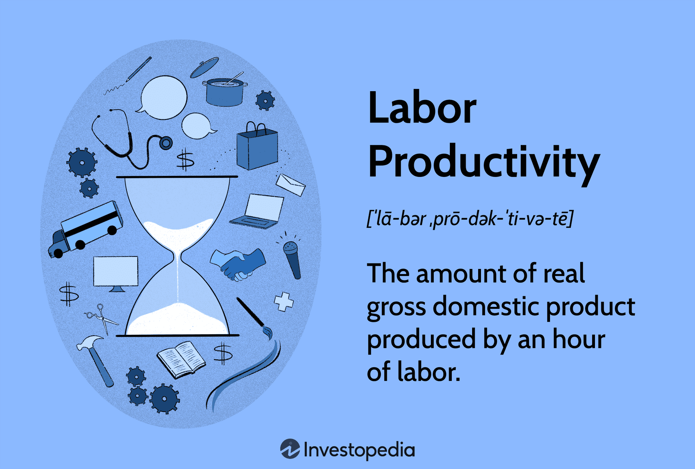

## Table of Contents

## What is labor productivity?

Labor productivity is a measure of how much work a person can do in a certain amount of time. It is calculated by dividing the total output of goods or services by the total number of hours worked. This helps businesses and economists understand how efficiently workers are using their time and resources.

Improving labor productivity can lead to more goods and services being produced, which can help grow the economy. There are many ways to increase labor productivity, such as using better technology, training workers to be more skilled, and organizing work more efficiently. When labor productivity goes up, it often means that workers are able to produce more with less effort, which can lead to higher wages and better living standards.

## Why is labor productivity important for businesses and economies?

Labor productivity is important for businesses because it shows how well they are using their workers. When a business has high labor productivity, it means that its workers can make more products or provide more services in less time. This can help the business make more money because they can sell more without needing more workers. If a business can make things faster and cheaper than others, it can be more competitive and grow bigger.

For economies, labor productivity is also very important. When all the businesses in a country have high labor productivity, the whole country can produce more goods and services. This can make the economy grow because there are more things to sell and more money moving around. When the economy grows, people can have better jobs and earn more money, which can make their lives better. So, improving labor productivity is good for both businesses and the whole country.

## How is labor productivity typically measured?

Labor productivity is usually measured by dividing the total output of goods or services by the total number of hours worked. For example, if a factory makes 1000 widgets in a week and the workers put in 500 hours, the labor productivity would be 2 widgets per hour. This simple calculation helps businesses and economists see how much work is being done in a certain amount of time.

There are different ways to measure output depending on the industry. In manufacturing, it might be the number of items produced. In services, it could be the number of customers served or tasks completed. No matter the industry, the goal is to find out how much is being produced per hour of work. This information helps businesses understand if they are using their workers' time well and if they need to make changes to improve.

## What are the common units used to express labor productivity?

Labor productivity is usually shown in units that tell how much is made for every hour of work. A common way is to use the number of items made per hour, like "widgets per hour." If a factory makes 1000 widgets in a week with 500 hours of work, the labor productivity is 2 widgets per hour.

In service industries, labor productivity might be measured in different ways. It could be the number of customers served per hour or the number of tasks done per hour. For example, a call center might measure productivity as "calls handled per hour." This helps businesses see how much work their employees are doing in a set amount of time.

## What factors influence labor productivity?

Many things can affect how much work people can do in a certain amount of time. One big factor is the technology and tools that workers use. If they have good machines and computers, they can often work faster and make more things. Another important thing is how well workers are trained. If they know a lot about their job and have good skills, they can do their work better and quicker. The way work is organized also matters. If the tasks are set up in a smart way, workers can move smoothly from one job to the next without wasting time.

Other factors that can change labor productivity include how motivated and healthy the workers are. If people feel good about their job and are in good health, they usually work better. The environment where they work is also important. A safe and comfortable place to work can help people be more productive. Finally, things like government rules and economic conditions can affect productivity too. If there are good laws and a strong economy, businesses might find it easier to be productive.

## How can labor productivity be calculated using different methods?

Labor productivity can be calculated in a few different ways, depending on what you want to measure. The most common method is to take the total output of goods or services and divide it by the total number of hours worked. For example, if a bakery makes 500 loaves of bread in a week and the workers put in 100 hours, the labor productivity would be 5 loaves per hour. This method helps businesses see how much work is being done per hour.

Another way to calculate labor productivity is by using the value of the output instead of the number of items. This method is useful for industries where it's hard to count the output in units, like in service industries. For example, if a consulting firm earns $10,000 in a week and the workers put in 200 hours, the labor productivity would be $50 per hour. This helps businesses understand how much money they are making for each hour of work.

Sometimes, labor productivity is also measured by looking at the total output divided by the number of workers, instead of hours worked. This can give a different view of productivity, focusing on how much each worker contributes. For example, if a factory makes 1000 toys in a week with 10 workers, the labor productivity would be 100 toys per worker. This method can be useful for businesses that want to see how efficient their workforce is overall.

## What are the limitations of traditional labor productivity measures?

Traditional ways of measuring labor productivity can have some problems. One big issue is that they often only look at how much is made or how much money is earned, but they don't think about the quality of what is made. For example, if a factory makes more toys but they are not as good as before, the numbers might say productivity is up, but really, it might not be better. Also, these measures don't always take into account things like how happy the workers are or how safe the workplace is. If workers are not happy or if the place is not safe, they might not work as well, even if the numbers look good.

Another problem is that traditional measures can be hard to use across different industries. What works for measuring productivity in a factory might not work for a school or a hospital. In a factory, you can count the number of items made, but in a school, it's harder to measure how much students learn. This makes it tough to compare productivity across different types of businesses. Also, these measures can miss out on new ways of working, like when people work from home or use new technology. If the measures don't change, they might not show the real productivity of the workers.

## How do technological advancements affect labor productivity?

Technological advancements can really help boost labor productivity. When businesses use new machines or software, workers can often do their jobs faster and make more things. For example, a factory that gets a new robot to help with assembly can make more products in less time. In offices, new computer programs can help people finish their work quicker and make fewer mistakes. This means businesses can produce more with the same number of workers, which can save money and make them more competitive.

But technology can also change the way we think about work and productivity. Sometimes, new technology means workers need to learn new skills, which can take time and might slow things down at first. Also, not all technology is good for productivity. If it's hard to use or doesn't fit well with the work people are doing, it might not help as much as expected. Over time, though, as people get used to the new tools and learn how to use them well, productivity usually goes up. So, while technology can make a big difference, it's important for businesses to choose the right tools and help their workers learn how to use them.

## What strategies can businesses implement to improve labor productivity?

Businesses can improve labor productivity by using better technology. This means getting new machines or software that help workers do their jobs faster and easier. For example, a factory might use robots to help with making things, or an office might use new computer programs to do work quicker. But it's important to choose the right technology that fits the work and to train workers on how to use it. When workers know how to use the new tools well, they can make more things in less time, which helps the business grow.

Another way to boost productivity is by training workers to have better skills. When people know more about their jobs, they can do them better and faster. Businesses can offer classes or workshops to help workers learn new things. Also, organizing work in a smart way can help. This means setting up tasks so workers can move smoothly from one job to the next without wasting time. When workers feel good about their job and the work is set up well, they usually work better and make more things.

Lastly, businesses can improve productivity by making the workplace a good place to be. This means keeping the place safe and comfortable, so workers feel happy and healthy. When people are happy at work, they often work better. Also, giving workers a say in how things are done can help. When workers feel like they are part of the team and their ideas matter, they are often more motivated to do a good job. All these things together can help businesses make more with the same number of workers, which is good for everyone.

## How can labor productivity be compared across different industries or countries?

Comparing labor productivity across different industries or countries can be tricky because each place and type of work is different. For example, making cars in a factory is very different from serving food in a restaurant. To compare them, we need to look at how much work is done per hour in each place. But even then, it's hard because some industries might use more machines, while others might rely more on people. Also, different countries might have different ways of measuring productivity, so it's important to use the same method when comparing them.

One way to compare labor productivity across industries or countries is by using value added per hour worked. This means looking at how much money is made after taking away the cost of materials and other things needed to make the product or service. This can help show how much the workers are adding to the value of what's being made. But even with this method, it's important to remember that things like the cost of living, the kind of technology used, and how well workers are trained can all affect the numbers. So, while we can compare productivity, it's good to keep in mind all the different things that can make the numbers different.

## What role does employee training and development play in enhancing labor productivity?

Employee training and development are very important for making labor productivity better. When workers get good training, they learn new skills and know more about their jobs. This helps them do their work faster and make fewer mistakes. For example, if a worker in a factory learns how to use a new machine, they can make more things in less time. Training can also help workers feel more confident and happy at work, which makes them want to do a good job. When businesses spend time and money on training, it often pays off because workers can make more and do better work.

Another way training and development help is by keeping up with new technology and ways of working. As things change, workers need to learn new things to stay good at their jobs. Businesses that offer regular training can help their workers keep up with these changes. This means the business can use new tools and methods to make more things without needing more workers. When workers are always learning and getting better, the whole business can grow and be more successful. So, training and development are key to making labor productivity better over time.

## How can advanced analytics and data-driven approaches be used to optimize labor productivity?

Advanced analytics and data-driven approaches can help businesses see where they can do better and make work more efficient. By looking at data about how workers spend their time and what they produce, businesses can find patterns and problems. For example, if the data shows that workers are spending too much time on a certain task, the business can think of ways to make that task easier or quicker. This might mean using new tools or changing how the work is organized. By using data to make smart choices, businesses can help workers do more in less time, which makes labor productivity go up.

These approaches also help businesses see how different parts of the company are doing and where they can improve. For example, if one part of the business is not as productive as others, the data can show why this is happening. Maybe the workers need more training, or maybe they need better tools. By understanding these things, the business can make changes to help that part do better. Over time, using data to guide decisions can lead to big improvements in how much work gets done, making the whole business more productive and successful.

## What is Understanding Labor Productivity?

Labor productivity is a fundamental economic metric that reflects the amount of output produced by a unit of labor input, typically measured in terms of GDP per hour worked. This measure is pivotal in assessing the efficiency and prosperity of an economy, as it indicates how well labor resources are utilized in generating goods and services. High labor productivity implies that a country can produce more output with the same amount of labor, which is an indicator of economic health and competitiveness.

Several drivers significantly influence labor productivity. Investment in physical capital is one such driver. Capital such as machinery, tools, and infrastructure enhances the capability of workers, allowing them to produce more efficiently. For instance, the introduction of automated machinery in manufacturing can increase the speed and precision of production processes, thereby boosting productivity.

Technological advancements are another critical [factor](/wiki/factor-investing). Breakthroughs in technology can lead to the development of new products and services and more efficient production methods. The digital revolution, exemplified by the proliferation of information technology, has been a significant boon for productivity across various industries.

Additionally, human capital development plays a crucial role. Human capital refers to the skills, knowledge, and experience possessed by an individual or population, seen in terms of their value or cost to an organization or country. Investment in education and training enhances labor productivity by improving the workforce's skill set, making workers more adept at using existing and new technologies and methodologies. 

These factors are essential in shaping policies aimed at fostering economic growth and improving living standards. For example, governments can facilitate productivity enhancement by encouraging investments in technology and infrastructure, supporting education and training programs, and creating a regulatory environment conducive to innovation and efficient business operations.

In mathematical terms, labor productivity can be expressed with the formula:

$$
\text{Labor Productivity} = \frac{\text{Total Output}}{\text{Total Labor Hours}}
$$

This simple equation underscores the importance of maximizing output while managing labor input effectively. Accurate measurement and analysis of labor productivity help policymakers and economists identify trends, compare economic performance over time, and make informed decisions to promote sustainable economic growth.

## How can productivity be calculated using different methods and formulas?

Calculating productivity involves a clear understanding of the relationship between inputs and outputs in a production process. The most straightforward approach to measuring productivity is through the basic productivity formula:

$$
\text{Productivity} = \frac{\text{Total Output}}{\text{Total Input}}
$$

This fundamental equation provides insight into how effectively resources are being used to generate goods or services.

### Labor Productivity

Labor productivity is a critical index often expressed as output per labor hour. It serves as a key indicator of labor efficiency. The formula for labor productivity is:

$$
\text{Labor Productivity} = \frac{\text{Total Output}}{\text{Total Labor Hours}}
$$

This measurement helps identify how efficiently labor resources are being utilized, which is crucial for improving competitive advantage in organizations and raising living standards across economies.

### Multi-Factor Productivity (MFP)

Multi-factor productivity offers a broader assessment of productivity by including various inputs, not just labor but also capital. This provides a more comprehensive picture of productivity performance, accounting for the synergy between different resources. The MFP can be calculated as:

$$
\text{Multi-Factor Productivity} = \frac{\text{Total Output}}{\text{Weighted Sum of Inputs}}
$$

In this context, inputs could include labor, capital, energy, materials, and services used within the production process. Each input can be weighted based on its relative importance or cost, resulting in a nuanced understanding of efficiency and productivity improvements across different sectors or industries.

### Importance of Accurate Measurement

Accurate measurement of productivity is crucial for benchmarking performance, setting realistic targets, and identifying areas for improvement. Precise productivity calculations can inform policymaking and strategic business decisions aimed at fostering economic growth and sustainability. Without accurate data, organizations may struggle to pinpoint inefficiencies or fail to capitalize on potential improvements.

Python code can be employed to automate the calculation of productivity measures, allowing for more dynamic analysis over time or across different scenarios:

```python
def calculate_labor_productivity(output, labor_hours):
    return output / labor_hours

def calculate_multi_factor_productivity(output, inputs):
    weighted_sum_of_inputs = sum(inputs.values())
    return output / weighted_sum_of_inputs

# Example usage:
output = 1000  # Units produced
labor_hours = 100  # Total labor hours
inputs = {'labor': 100, 'capital': 200, 'energy': 50}  # Example input weights

labor_productivity = calculate_labor_productivity(output, labor_hours)
mfp = calculate_multi_factor_productivity(output, inputs)

print(f"Labor Productivity: {labor_productivity}")
print(f"Multi-Factor Productivity: {mfp}")
```

By applying such calculations, businesses and policymakers can gain insights into current productivity levels and devising strategies to optimize resource utilization effectively.

## References & Further Reading

[1]: Syverson, C. (2011). ["What Determines Productivity?"](https://www.aeaweb.org/articles?id=10.1257/jel.49.2.326) Journal of Economic Literature, 49(2), 326-365.

[2]: Brynjolfsson, E., & McAfee, A. (2014). ["The Second Machine Age: Work, Progress, and Prosperity in a Time of Brilliant Technologies"](https://psycnet.apa.org/record/2014-07087-000). W.W. Norton & Company.

[3]: Jorgenson, D. W., Ho, M. S., & Stiroh, K. J. (2005). ["Productivity, Volume 3: Information Technology and the American Growth Resurgence."](https://www.aeaweb.org/articles?id=10.1257/jep.22.1.3) MIT Press.

[4]: Autor, D. H., Katz, L. F., & Krueger, A. B. (1998). ["Computing Inequality: Have Computers Changed the Labor Market?"](https://www.nber.org/papers/w5956) The Quarterly Journal of Economics, 113(4), 1169-1213.

[5]: Angrist, J. D., & Pischke, J-S. (2008). ["Mostly Harmless Econometrics: An Empiricist's Companion."](https://www.jstor.org/stable/j.ctvcm4j72) Princeton University Press.