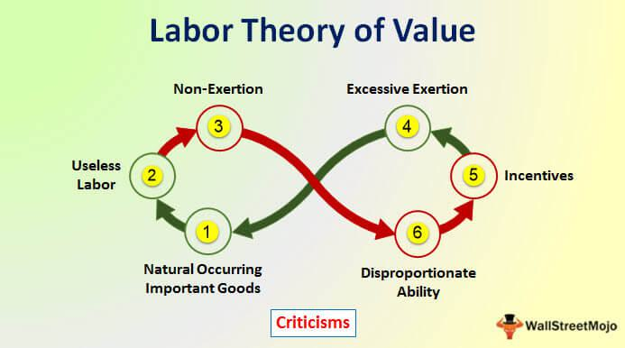

Economic theory and algorithmic trading represent two pivotal areas of study and practice in understanding and navigating modern financial systems. One of the key classical economic theories is the labor theory of value (LTV), which asserts that the value of a commodity is primarily determined by the labor involved in its production. This theory, championed by economists like Adam Smith, David Ricardo, and Karl Marx, provides a foundational perspective on how value might be derived in economic activities. 

The labor theory of value has had a profound impact on economic thought, influencing various schools of economic philosophy and policy-making. Despite its classical roots, the LTV's significance has shifted over time, as new economic models and theories emerged. Exploring the intersection of this theory with modern technological tools, such as algorithmic trading, offers valuable insights into contemporary market dynamics.



Algorithmic trading, which employs complex algorithms to conduct trading at speeds and scales not achievable by traditional methods, represents a transformative force in financial markets. By automating trading strategies, these algorithms are able to analyze vast datasets to optimize decision-making processes in real-time. Understanding how classical economic theories, such as the labor theory of value, integrate with these advanced trading technologies, sheds light on the evolution of modern markets.

This article investigates into how classical economic theories continue to underpin automated trading strategies. By examining the evolution and current relevance of LTV, we gain deeper insights into the functioning of today's financial markets and the foundational economic theories that guide contemporary trading algorithms. The integration of these classical insights with technological advancements presents a compelling narrative of how economic principles continue to shape and enhance algorithmic trading practices.

## Table of Contents

## The Labor Theory of Value: A Historical Perspective

The labor theory of value (LTV), a pivotal concept in classical economic thought, asserts that the value of a commodity is fundamentally determined by the quantity of labor required for its production. This theory can be traced back to the seminal works of classical economists, notably Adam Smith, David Ricardo, and Karl Marx, each of whom contributed significantly to its development and interpretation.

Adam Smith, in his influential work "The Wealth of Nations," laid the foundational ideas for LTV by suggesting that labor was the true measure of the value of goods and services. He postulated that the amount of labor embedded within a product provides a more intrinsic measure of value than the prevailing market prices, which could be distorted by various factors. Smith’s observations on the division of labor and its impact on productivity also served to reinforce the role of labor as a key determinant of value.

Building on Smith’s foundational ideas, David Ricardo further refined the labor theory of value. Ricardo's focus was on the determination of comparative advantage and the implications of labor cost in pricing. He introduced the concept of "natural price," which he believed to be aligned closely with the labor required for production. Ricardo acknowledged that capital and land also contributed to exchange value, but he maintained that labor remained the primary source of value under typical economic conditions.

Karl Marx provided a more systemic and critical approach to the labor theory of value, incorporating it into his analysis of capitalist production systems. Marx argued that the surplus value, derived from the difference between what workers are paid and the value they produce, is the essence of capitalist profit. He emphasized the exploitative nature of this surplus value generation, which became central to his critique of capitalism. Marx’s interpretation firmly positioned the labor theory of value within a broader socio-economic and political critique, highlighting labor as not only a measure of value but a source of inequality and economic power dynamics.

Despite its central role in early economic discourse, the labor theory of value has largely been supplanted by more contemporary theories of value, particularly after the Marginalist Revolution in the late 19th century, which introduced the concept of utility and subjective value. Historically, LTV's appeal lay in its straightforward approach to value determination and its compatibility with emerging industrial economies that were heavily labor-centric. However, as economies evolved, the simplistic correlation between labor and value struggled to encapsulate the complexities of modern market dynamics, where factors such as consumer preferences, technological advancements, and capital investment play crucial roles.

In conclusion, while LTV provided the scaffolding for early economic models and theories, setting the stage for integral discussions around value and production, its limitations have seen it largely replaced by more nuanced and flexible theories. Nevertheless, the labor theory of value remains a critical historical construct, offering insights into the development of economic thought and its impact on policy-making during the industrial age.

## Critiques and Decline of the Labor Theory of Value

The labor theory of value (LTV) has faced significant criticism over time, which has led to its decline as a predominant economic theory. One major critique of LTV is its limited ability to account for variations in labor productivity and consumer demand. According to LTV, the value of a commodity is directly linked to the labor time required for its production. However, this perspective does not consider that two commodities requiring equal labor time may hold different market values due to efficiency differences in production processes or varying consumer preferences.

Additionally, the emergence of the Subjectivist Revolution in the late 19th and early 20th centuries marked a pivotal shift in economic thought. This movement introduced the subjective theory of value, which posits that the value of a commodity is determined by individual consumer preferences rather than the labor input. The subjective theory emphasizes market dynamics driven by the perception of utility and marginalism, rendering the labor-based approach less relevant in analyzing economic value.

Modern economists further critique LTV for its applicability in today's complex markets, where factors like capital intensity, technological innovation, and global trade play substantial roles in value determination. The rigidity of LTV in the face of these dynamic variables makes it a less effective tool for contemporary economic analysis.

Despite its decline, LTV retains influence, particularly within Marxian economics, where it serves as a fundamental component in understanding capitalist production, class structure, and exploitation. Marxian analysis continues to utilize LTV to critique capitalism and highlight disparities in wealth distribution based on labor contributions.

In summary, while the labor theory of value has been largely supplanted by more flexible economic theories, its impact persists, shaping discourse in specific economic frameworks and offering historical insights into the evolution of economic thought.

## Algorithmic Trading: Revolutionizing Modern Markets

Algorithmic trading, also referred to as algo-trading, has significantly reshaped financial markets by automating trading processes and enabling transactions with unprecedented speed and precision. This form of trading leverages complex algorithms to execute orders based on pre-defined criteria, such as timing, price, or [volume](/wiki/volume-trading-strategy), often relying heavily on quantitative analysis.

One of the fundamental principles of [algorithmic trading](/wiki/algorithmic-trading) is speed. Algorithms can process and analyze vast amounts of market data in fractions of a second, allowing traders to capitalize on fleeting market opportunities that would be impractical to exploit manually. The execution speed not only reduces the latency between decision-making and order execution but also helps in achieving more favorable pricing for trades.

Scalability is another critical [factor](/wiki/factor-investing). Algorithms can simultaneously monitor and execute trades across multiple markets and instruments, making them highly scalable. This capability allows traders to deploy strategies at a much larger scale than would be possible with traditional trading methods. For instance, a high-frequency trading ([HFT](/wiki/high-frequency-trading-strategies)) algorithm can handle thousands of trades per second, optimizing the overall trading strategy's efficiency.

Data analysis is at the core of algorithmic trading. Using historical and real-time data, algorithms employ statistical models and [machine learning](/wiki/machine-learning) techniques to identify trading signals and trends. This data-driven approach enhances decision-making processes, enabling traders to optimize their strategies based on quantitative insights rather than purely qualitative judgments.

Despite its benefits, algorithmic trading presents several challenges. Improved efficiency and [liquidity](/wiki/liquidity-risk-premium) are offset by concerns about market manipulation and systemic risks. The rapid execution speeds can exacerbate [volatility](/wiki/volatility-trading-strategies), leading to events like the "flash crash" of 2010, where markets quickly lost significant value and subsequently recovered within minutes. Furthermore, the opacity of complex algorithms makes it difficult to regulate and ensure they comply with market rules, leading to potential manipulations such as spoofing or layering.

Technology plays a pivotal role in evolving trading strategies and market dynamics. Innovations in computing power, network technology, and data analytics continuously enhance the capabilities of algorithmic trading systems. Firms invest heavily in infrastructure to minimize latency, using technologies such as co-location services, where their servers are placed physically close to the exchange servers to gain time advantages.

Case studies reveal how algorithmic trading influences market structure and investor behavior. During the 2010 flash crash, algorithms reacted to massive selling pressure with further sales, amplifying the downtrend. This event underscored the impact of algorithmic trading on market stability, prompting regulatory bodies to introduce safeguards like circuit breakers that halt trading during extreme volatility.

In summary, algorithmic trading stands at the forefront of financial innovation, driven by speed, scalability, and data analysis. However, it demands careful management to mitigate challenges such as potential market manipulation and systemic risks. As technology continues to advance, the landscape of trading strategies will likely evolve further, necessitating ongoing research and adaptation within the financial sector.

## Interplay Between Economic Theory and Algorithmic Trading

The integration of classical economic theories within the framework of algorithmic trading presents a fascinating interplay between historical insights and contemporary technology. At the forefront of this integration is the labor theory of value (LTV), which historically posited that the value of a commodity is largely determined by the labor required for its production. While modern economic theories have largely transitioned towards the subjective theory of value—emphasizing that value is determined by individual preferences and market conditions—the foundational concepts from LTV continue to indirectly influence trading strategies.

Algorithmic trading, characterized by speed, scalability, and advanced data analysis, often incorporates these economic theories to predict market trends, manage risk, and set appropriate pricing strategies. For instance, the subjective value theory directly influences trading algorithms that prioritize consumer preferences and market sentiments. In practice, this means algorithmic systems frequently analyze vast datasets to identify trends, preferences, and behaviors that could hint at future market movements. This aligns with subjective valuations wherein algorithms attempt to interpret and anticipate individual and collective market sentiments.

Economic theories provide critical frameworks for guiding algorithmic strategies, particularly in pricing and risk management. In pricing, understanding market demand and consumer behavior remains pivotal. Algorithmic models can employ principles from the supply and demand curves, derived from economic theory, to determine optimal pricing strategies. Tools such as time-series analysis, regression models, or machine learning algorithms are applied to historical data to identify correlations and causations shaping market prices. Simple linear regression might look like this in Python:

```python
import numpy as np
from sklearn.linear_model import LinearRegression

# Example dataset
X = np.array([[1], [2], [3], [4], [5]])
y = np.array([2, 3, 5, 7, 11])

model = LinearRegression().fit(X, y)
predicted_y = model.predict(np.array([[6]]))

print(f"Predicted value for input 6: {predicted_y[0]}")
```

Risk management, another crucial aspect of algorithmic trading, leverages economic theories to predict and mitigate potential financial risks. Techniques such as the Capital Asset Pricing Model (CAPM) use ideas from financial economics to assess an asset's expected return based on its systemic risk. These models help traders diversify portfolios effectively based on quantified risk assessments.

The potential for classical economic insights to enhance the effectiveness of trading algorithms lies in the depth and proven nature of these theories. Historical economic principles enable a robust interpretative framework that enhances algorithmic precision and reliability. These insights are particularly valuable in developing predictive modeling techniques where understanding historical market patterns can offer substantial competitive advantages.

Trade strategies have evolved into a synthesis of historical economic principles, advanced statistical methods, and cutting-edge technological tools, resulting in more sophisticated algorithmic trading approaches. The combination of well-established economic theories with state-of-the-art technology allows for continuously evolving strategies that adapt to changing market conditions, ultimately striving for optimized performance in dynamic financial ecosystems. Thus, the contemporary landscape of trading benefits immensely from foundational economic theories, ensuring their enduring relevance in modern financial practices.

## Conclusion

In summarizing the influence of historical economic theories on contemporary financial markets through algorithmic trading, it is evident that foundational concepts remain relevant even as technology evolves. The labor theory of value (LTV), though critiqued and largely replaced by modern economic theories, continues to contribute to economic discourse by providing a basis for understanding production costs and labor allocation. Its philosophical foundations encourage deeper inquiry into the determinants of value, which helps frame contemporary discussions on pricing strategies and value assessment in automated trading systems.

Algorithmic trading has fundamentally transformed market operations, relying heavily on rapid data processing, mathematical models, and automated decision-making. While these technologies primarily incorporate modern theories like the subjective theory of value—which prioritize consumer preferences and market signals—the influence of historical economic insights, such as those offered by LTV, persists. This is particularly evident in the analytical frameworks used to assess cost structures and efficiencies across production and trading systems.

Looking ahead, the future of algorithmic trading is likely to be marked by increasingly sophisticated models that integrate historical economic insights with machine learning and [artificial intelligence](/wiki/ai-artificial-intelligence). These advancements will necessitate continuous exploration into the interplay between classical economics and technological innovations. For instance, potential research areas include the development of hybrid models that fuse objective production costs with subjective market sentiment, or the application of behavioral economics principles to refine trading algorithms.

Lastly, economic education plays a critical role in equipping individuals with the knowledge to navigate the complexities of modern financial systems. A thorough understanding of both historical and contemporary economic theories is essential for developing effective trading strategies and for the broader comprehension of market dynamics. As algorithmic trading evolves, so too must educational frameworks adapt, ensuring that future economists and traders can adeptly bridge the gap between theory and practice.

## References & Further Reading

[1]: Smith, Adam. ["The Wealth of Nations."](https://www.ibiblio.org/ml/libri/s/SmithA_WealthNations_p.pdf) 

[2]: Ricardo, David. ["On the Principles of Political Economy and Taxation."](https://www.econlib.org/library/Ricardo/ricP.html)

[3]: Marx, Karl. ["Capital: Critique of Political Economy."](https://www.marxists.org/archive/marx/works/download/pdf/Capital-Volume-I.pdf)

[4]: Jansen, Stefan. ["Machine Learning for Algorithmic Trading."](https://github.com/stefan-jansen/machine-learning-for-trading)

[5]: Lopez de Prado, Marcos. ["Advances in Financial Machine Learning."](https://www.amazon.com/Advances-Financial-Machine-Learning-Marcos/dp/1119482089)

[6]: Chan, Ernest P. ["Quantitative Trading: How to Build Your Own Algorithmic Trading Business."](https://github.com/ftvision/quant_trading_echan_book)