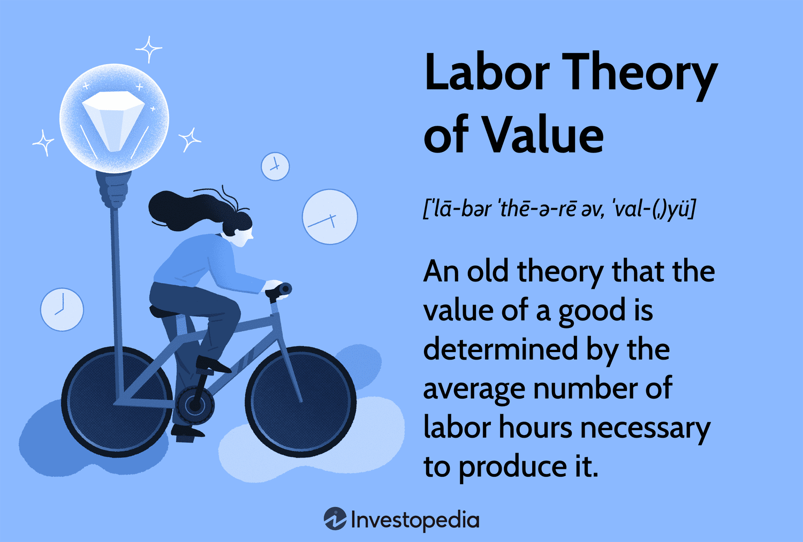

## Table of Contents

## What is the Labor Theory of Value?

The Labor Theory of Value is an economic idea that says the value of a product comes mostly from the work people put into making it. This theory was first talked about by people like Adam Smith and David Ricardo, but it was Karl Marx who really focused on it. According to Marx, if you want to know how much something is worth, you should look at how much labor was used to make it. This includes the time and effort workers spend, not just the cost of materials or how much people want the product.

This theory is important because it helps explain why some things are more expensive than others. For example, if a handmade wooden chair takes a lot of time and skill to make, it might be more valuable than a simple plastic chair that can be made quickly by a machine. However, the Labor Theory of Value has been criticized by some economists who argue that other factors, like how much people want something or how rare it is, also affect its value. Despite this, the theory remains a key part of understanding how value is created in an economy, especially in discussions about labor and fairness.

## Who developed the Labor Theory of Value?

The Labor Theory of Value was first talked about by Adam Smith and David Ricardo. Adam Smith, who is often called the father of economics, wrote about it in his book "The Wealth of Nations" in 1776. He said that the value of a thing comes from the labor that goes into making it. David Ricardo, another famous economist, built on Smith's ideas in the early 1800s. He focused more on how labor affects the price of goods.

Later, Karl Marx took the Labor Theory of Value and made it a big part of his economic ideas. In his book "Capital," Marx argued that the value of a product is determined by the amount of labor used to make it. He believed that workers should be paid based on the value they create, and this idea became important in his critique of capitalism. Marx's work made the Labor Theory of Value very influential, especially in discussions about labor rights and economic fairness.

## How does the Labor Theory of Value differ from other economic theories of value?

The Labor Theory of Value says that the value of something comes mostly from the work people put into making it. This idea was made popular by Karl Marx, who thought that if you want to know how much something is worth, you should look at how much labor was used to make it. This includes the time and effort workers spend, not just the cost of materials or how much people want the product. For example, if a handmade wooden chair takes a lot of time and skill to make, it might be more valuable than a simple plastic chair that can be made quickly by a machine.

Other economic theories of value, like the Subjective Theory of Value, say that the value of something depends on how much people want it and how rare it is. This idea was developed by economists like Carl Menger and William Stanley Jevons. They believed that value is not just about the labor that goes into making something, but also about what people are willing to pay for it. For example, a diamond might be very valuable because people want it a lot, even if it doesn't take much labor to find it. These different theories show that there are many ways to think about what makes something valuable, and they can lead to different ideas about how economies should work.

## Can you explain the concept of 'socially necessary labor time' in the context of the Labor Theory of Value?

In the Labor Theory of Value, 'socially necessary labor time' is a key idea that helps explain how much something is worth. It means the amount of time it usually takes for workers to make a product, using the normal tools and skills of their time. For example, if it takes about an hour for a skilled worker to make a wooden chair using common tools, then that hour is the socially necessary labor time for that chair. This idea is important because it helps us understand that the value of a product isn't just about how long one person takes to make it, but how long it takes on average in society.

Karl Marx used the concept of socially necessary labor time to talk about how value is created in an economy. He believed that if a worker can make a chair faster than the average time, the extra time they save doesn't add more value to the chair. Instead, the value stays the same because it's based on the average time it takes everyone else. This idea helps explain why some products might be cheaper or more expensive, depending on how efficient the whole society is at making them. It also shows how changes in technology or skills can change the value of products over time.

## How is value determined according to the Labor Theory of Value?

According to the Labor Theory of Value, the worth of a product comes mostly from the work people put into making it. This idea says that if you want to know how much something is worth, you should look at how much labor was used to make it. This includes the time and effort workers spend, not just the cost of materials or how much people want the product. For example, if a handmade wooden chair takes a lot of time and skill to make, it might be more valuable than a simple plastic chair that can be made quickly by a machine.

A key part of this theory is the idea of 'socially necessary labor time.' This means the amount of time it usually takes for workers to make a product, using the normal tools and skills of their time. If it takes about an hour for a skilled worker to make a wooden chair using common tools, then that hour is the socially necessary labor time for that chair. The value of the chair isn't just about how long one person takes to make it, but how long it takes on average in society. This helps explain why some products might be cheaper or more expensive, depending on how efficient the whole society is at making them.

## What role does labor play in the production of commodities according to this theory?

In the Labor Theory of Value, labor is the main thing that makes commodities valuable. This theory says that the worth of a product comes from the work people put into making it. For example, if a wooden chair takes a lot of time and skill to make, it might be more valuable than a simple plastic chair that can be made quickly by a machine. The idea is that the more labor someone puts into making something, the more valuable it becomes.

A key part of this theory is the idea of 'socially necessary labor time.' This means the amount of time it usually takes for workers to make a product, using the normal tools and skills of their time. If it takes about an hour for a skilled worker to make a wooden chair using common tools, then that hour is the socially necessary labor time for that chair. The value of the chair isn't just about how long one person takes to make it, but how long it takes on average in society. This helps explain why some products might be cheaper or more expensive, depending on how efficient the whole society is at making them.

## How does the Labor Theory of Value relate to the concept of surplus value?

The Labor Theory of Value says that the value of a product comes from the work people put into making it. This idea is important when we talk about surplus value, which is a key part of Karl Marx's ideas about how capitalism works. Surplus value is the extra value that workers create when they make things, but they don't get paid for it. For example, if a worker makes a chair in one hour, but the chair is sold for more than what the worker is paid for that hour, the difference is the surplus value. This extra value goes to the person who owns the business, not the worker.

Marx believed that this surplus value is what makes capitalism unfair. He thought that workers should be paid based on the value they create, but in capitalism, they are paid less than the value of what they produce. This means that the owners of businesses get richer by keeping the surplus value, while workers stay poor. The Labor Theory of Value helps explain why this happens, because it shows that the value of a product comes from the labor of workers, and when they are not paid fairly for that labor, it creates a big problem in the economy.

## What are the criticisms of the Labor Theory of Value?

Some people don't agree with the Labor Theory of Value. They say it's too simple to think that the value of something comes only from the work people put into making it. They believe other things matter too, like how much people want the product and how rare it is. For example, a diamond might be very valuable because people want it a lot, even if it doesn't take much work to find it. Economists who support the Subjective Theory of Value think that value is more about what people are willing to pay for something, not just how much labor went into it.

Another problem people see with the Labor Theory of Value is that it doesn't explain why prices change all the time. If value comes from labor, then why do prices go up and down even when the amount of labor stays the same? Critics say that things like supply and demand, technology, and competition can change prices a lot. They also argue that the theory doesn't work well in the real world because it's hard to measure exactly how much labor goes into making something, especially when different people work at different speeds and use different tools.

## How has the Labor Theory of Value been applied in economic and political movements?

The Labor Theory of Value has been a big part of many economic and political movements, especially those that want to make things fairer for workers. Karl Marx used this idea to talk about how capitalism works and why it can be unfair. He said that workers should be paid based on the value they create, but in capitalism, they are paid less than the value of what they make. This idea helped start movements like socialism and communism, which wanted to change the way economies work so that workers get a fairer share of what they produce. These movements have led to big changes in many countries, like better pay and working conditions for workers.

The Labor Theory of Value also helped shape labor unions and workers' rights movements. These groups used the idea to argue for better pay and conditions, saying that workers should get more of the value they create. For example, unions have fought for things like the eight-hour workday and minimum wage laws, using the idea that workers deserve to be paid fairly for their labor. Even though not everyone agrees with the Labor Theory of Value, it has been a powerful tool for people trying to make the economy more fair for workers.

## What are the implications of the Labor Theory of Value for understanding economic inequality?

The Labor Theory of Value helps us understand economic inequality by showing how the value created by workers is often not shared fairly. According to this theory, the value of a product comes from the work people put into making it. But in many cases, workers are paid less than the value of what they produce, and the extra value, called surplus value, goes to the owners of businesses. This means that the people who do the work don't get as much money as the people who own the businesses, which can lead to big differences in how much money people have.

This idea has been used to explain why some people are rich while others are poor. If workers are not paid fairly for their labor, then the owners of businesses can get richer and richer, while workers stay poor. This can lead to a lot of economic inequality, where a few people have most of the money and power, and many people have very little. Understanding this can help us see why some people want to change the way the economy works, so that everyone gets a fairer share of what they help create.

## How do modern economists view the relevance of the Labor Theory of Value?

Modern economists have different views on the Labor Theory of Value. Many of them think it's not very useful for understanding how the economy works today. They believe that the value of something depends more on how much people want it and how rare it is, rather than just the labor that went into making it. This idea is called the Subjective Theory of Value, and it's more popular among economists now. They also say that prices change all the time because of things like supply and demand, technology, and competition, which the Labor Theory of Value doesn't explain well.

However, some modern economists still find the Labor Theory of Value useful, especially when talking about fairness and workers' rights. They use it to argue that workers should be paid more fairly for the value they create. This idea can help explain why there is so much economic inequality and why some people want to change the way the economy works. Even though it's not the main way economists think about value anymore, the Labor Theory of Value still has a place in discussions about how to make the economy more fair for everyone.

## Can you discuss any contemporary updates or adaptations to the Labor Theory of Value?

Some people today still use the Labor Theory of Value, but they have changed it a bit to fit better with how the economy works now. One big change is that they look at how technology affects the value of things. For example, if a new machine makes it easier and faster to make a product, the value of that product might go down because it takes less labor to make it. This idea helps explain why prices can change even if the amount of labor stays the same. Some economists also talk about how workers' skills and education can change the value of what they make, so they include these things in their updated version of the theory.

Another way people have updated the Labor Theory of Value is by looking at how it can help understand problems like economic inequality. They use the idea of surplus value to talk about how workers are often paid less than the value of what they produce, and how this can make the rich richer and the poor poorer. This updated theory is used to argue for things like better pay and working conditions for workers. Even though not everyone agrees with these new ideas, they show that the Labor Theory of Value can still be useful for thinking about how to make the economy fairer for everyone.

## References & Further Reading

[1]: Smith, Adam. ["The Wealth of Nations."](https://www.ibiblio.org/ml/libri/s/SmithA_WealthNations_p.pdf) 

[2]: Ricardo, David. ["On the Principles of Political Economy and Taxation."](https://www.econlib.org/library/Ricardo/ricP.html)

[3]: Marx, Karl. ["Capital: Critique of Political Economy."](https://www.marxists.org/archive/marx/works/download/pdf/Capital-Volume-I.pdf)

[4]: Jansen, Stefan. ["Machine Learning for Algorithmic Trading."](https://github.com/stefan-jansen/machine-learning-for-trading)

[5]: Lopez de Prado, Marcos. ["Advances in Financial Machine Learning."](https://www.amazon.com/Advances-Financial-Machine-Learning-Marcos/dp/1119482089)

[6]: Chan, Ernest P. ["Quantitative Trading: How to Build Your Own Algorithmic Trading Business."](https://github.com/ftvision/quant_trading_echan_book)