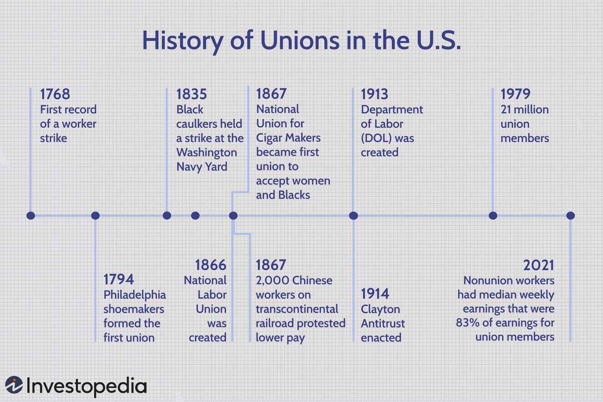

## Table of Contents

## What is a labor union?

A labor union is a group of workers who join together to make their workplace better. They work together to talk to their bosses about things like pay, hours, and safe working conditions. By being part of a union, workers have a stronger voice and can get better deals than if they tried to do it alone.

Unions also help workers by giving them support and advice. If a worker has a problem at work, like unfair treatment, the union can help them solve it. Unions can also organize strikes, where workers stop working to show they are serious about their demands. This can push bosses to listen and make changes.

## When and where did the first labor unions form?

The first labor unions started a long time ago, around the late 1700s and early 1800s. They began in places like Britain and the United States. In Britain, workers in different trades, like shoemakers and printers, started to form groups to fight for better pay and working conditions. These early unions were small and often focused on one type of job.

In the United States, the first labor unions also appeared around the same time. One of the earliest was the Federal Society of Journeymen Cordwainers, formed in 1794 in Philadelphia. This group was made up of shoemakers who wanted to improve their wages and working hours. Like in Britain, these early American unions were small and often faced challenges from employers who didn't want them to organize.

Over time, these early efforts grew into larger and more organized labor movements. By the mid-1800s, unions started to become more common and powerful, leading to bigger changes in workers' rights and conditions.

## What are the main goals of labor unions?

The main goals of labor unions are to help workers get better pay and benefits. They want to make sure that workers earn enough money to live well and have things like health insurance and retirement plans. Unions work hard to negotiate with bosses to get the best deals for their members. They believe that when workers are paid fairly, everyone benefits because workers can spend more money in their communities.

Another big goal of labor unions is to improve working conditions. They want to make sure that workplaces are safe and healthy for everyone. This means fighting for things like shorter work hours, breaks, and safe equipment. Unions also help protect workers from being treated unfairly. They make sure that if someone is fired or disciplined, it's for a good reason and not because the boss doesn't like them.

Lastly, labor unions aim to give workers a stronger voice. When workers join together in a union, they can speak up more powerfully than if they were alone. Unions help workers talk to their bosses about their needs and concerns. They can also organize strikes or other actions to show how serious they are about their demands. This helps make sure that workers' voices are heard and respected.

## How do labor unions negotiate with employers?

Labor unions negotiate with employers through a process called collective bargaining. This means the union leaders sit down with the bosses to talk about what the workers want. They discuss things like pay, hours, and working conditions. The union tries to get the best deal for the workers, while the employer wants to keep costs down. Both sides go back and forth until they can agree on something that works for everyone. If they can't agree, the union might take stronger actions, like strikes, to show how serious they are.

Sometimes, unions and employers use mediators to help them reach an agreement. A mediator is someone who doesn't work for either side but helps them talk things out. The mediator listens to both the union and the employer and tries to find a solution that everyone can accept. This can make the process smoother and help avoid big conflicts. In the end, the goal is to make a contract that both the workers and the employer are happy with, so everyone can move forward together.

## What is collective bargaining and how does it work?

Collective bargaining is when a group of workers, usually represented by a labor union, talks with their employer to make a deal about their work. This deal, called a contract, covers things like how much workers will get paid, how many hours they will work, and what benefits they will get, like health insurance or vacation time. The union leaders sit down with the bosses to discuss what the workers want and what the employer can offer. They go back and forth, trying to find a middle ground where both sides are happy.

If the union and the employer can't agree on everything, they might need help from a mediator. A mediator is someone who doesn't work for either side but helps them talk things out and find a solution. The mediator listens to both the union and the employer and suggests ways they can reach an agreement. If they still can't agree, the union might decide to go on strike, where workers stop working to show how serious they are about their demands. Strikes can put pressure on the employer to listen and make changes. In the end, the goal of collective bargaining is to make a fair contract that both the workers and the employer can agree on, so everyone can work together smoothly.

## Can you provide examples of early labor unions and their impact?

One of the earliest labor unions was the Federal Society of Journeymen Cordwainers, formed in 1794 in Philadelphia. This group was made up of shoemakers who wanted better pay and shorter working hours. They were one of the first groups in the United States to try to improve their work lives by working together. Even though they were small, their efforts helped show other workers that they could stand up for themselves. This union faced challenges, like being taken to court by their bosses, but they helped start the idea of workers joining together to make changes.

Another early labor union was the National Labor Union, formed in 1866 in the United States. This union was different because it tried to bring together workers from many different jobs, not just one type. They wanted to make big changes, like an eight-hour workday and better pay for everyone. The National Labor Union didn't last long, but it helped start the idea of a bigger labor movement. It showed that workers from different jobs could work together to make their lives better. This union's efforts helped lead to more unions forming and more workers fighting for their rights.

In Britain, early labor unions also had a big impact. One example is the Tolpuddle Martyrs, a group of farm workers who formed a union in 1834 in the village of Tolpuddle. They wanted better pay and working conditions, but they were arrested and sent to Australia for trying to start a union. Their story became famous and helped show other workers that they needed to fight for their rights. The Tolpuddle Martyrs' struggle helped lead to more unions forming in Britain and more workers standing up for themselves. Their story is still remembered today as an important part of the labor movement.

## How have labor laws evolved to support or restrict unions?

Labor laws have changed a lot over time to help and sometimes limit unions. In the early days, there were few laws to protect workers, and bosses could stop unions from forming. But as unions grew stronger, governments started making laws to help them. In the United States, the National Labor Relations Act of 1935, also called the Wagner Act, was a big change. This law said that workers had the right to join unions and that bosses couldn't stop them. It also set up rules for how unions and bosses should talk to each other about work issues. This law helped unions grow and become more powerful.

But not all laws have helped unions. Some laws have made it harder for unions to do their work. For example, in the United States, the Taft-Hartley Act of 1947 put limits on what unions could do. It made it harder for unions to go on strike and allowed states to pass "right-to-work" laws. These laws say that workers don't have to join a union or pay union dues, even if they work at a place with a union. This can make it harder for unions to get money and support from workers. So, while some laws have helped unions, others have made it more challenging for them to help workers.

## What are some significant labor union strikes in history?

One of the most famous labor union strikes in history is the Homestead Strike of 1892. It happened at the Carnegie Steel Company in Homestead, Pennsylvania. The workers, who were part of the Amalgamated Association of Iron and Steel Workers, went on strike because the company wanted to cut their wages. The strike turned violent when the company hired guards to stop the workers, and several people were killed. Even though the workers lost the strike, it showed how serious workers could be about fighting for their rights and helped other workers see the power of standing together.

Another big strike was the United Auto Workers (UAW) strike against General Motors in 1936-1937. This strike, known as the Flint Sit-Down Strike, happened in Flint, Michigan. The workers sat down inside the factories and refused to leave until General Motors agreed to recognize their union. The strike lasted for 44 days and ended with General Motors agreeing to negotiate with the UAW. This strike was important because it showed that workers could use new tactics, like sitting down inside factories, to win better deals from their bosses. It also helped other workers see that they could fight for their rights and win.

The 1984-1985 UK miners' strike is another significant event. Led by the National Union of Mineworkers, the miners went on strike to stop the closing of coal mines and to fight for their jobs. The strike lasted for a year and was very hard on the workers and their families. In the end, the miners lost the strike, and many mines were closed. But the strike showed how determined workers could be to fight for their jobs and communities. It also led to changes in how unions worked in the UK and showed the power of solidarity among workers.

## How do labor unions vary across different countries?

Labor unions are different in every country because of the laws, culture, and history there. In some places like Sweden and Denmark, unions are strong and work closely with the government and businesses to make good deals for workers. They have a system called "social partnership" where unions, bosses, and the government talk a lot to make sure workers get good pay and conditions. In these countries, most workers are in unions, and strikes are not very common because they can usually work things out by talking.

In other countries, like the United States, unions are not as strong as they used to be. Laws like the Taft-Hartley Act made it harder for unions to grow and do their work. Also, some states have "right-to-work" laws that let workers not join unions or pay union fees, even if they work at a place with a union. This can make it hard for unions to get money and support. In the U.S., unions often have to fight hard to get good deals for workers, and strikes can happen more often when they can't agree with the bosses.

In countries like China, the government controls the main union, called the All-China Federation of Trade Unions. This union is supposed to help workers, but it often works more with the government and businesses. In China, workers can't start their own unions easily, and the government watches them closely. This makes it hard for workers to fight for better pay and conditions. So, even though there is a big union, it doesn't always help workers as much as unions in other countries do.

## What role do labor unions play in modern economies?

Labor unions play an important role in modern economies by helping workers get better pay and working conditions. They do this by talking to bosses and making deals, called contracts, that say how much workers will earn and what benefits they will get. Unions also help make sure workplaces are safe and fair. When workers are paid well and treated right, they can spend more money in their communities, which helps the whole economy grow. Unions also give workers a voice, so they can speak up about what they need and want at work.

In some countries, unions work closely with the government and businesses to make the economy better for everyone. They help make rules that protect workers and keep the economy fair. But in other places, unions face challenges because of laws that make it hard for them to grow or do their work. Even so, unions keep fighting to make sure workers are treated fairly and have good jobs. This helps keep the economy strong and balanced, because when workers do well, the whole economy does well too.

## How have technological advancements affected labor unions?

Technological advancements have changed the way labor unions work. With new technology, like computers and the internet, unions can talk to their members more easily. They can send emails, use websites, and even hold meetings online. This helps them reach more workers and keep them updated about what's happening. But technology also brings challenges. Some jobs are being replaced by machines and computers, which can make it harder for unions to protect workers in those jobs. Unions have to find new ways to help workers who might lose their jobs because of technology.

In some ways, technology has made it easier for unions to organize and fight for workers' rights. For example, social media can help unions spread their message quickly and get more people involved in their causes. But technology can also make it harder for unions to negotiate with bosses. Companies can use technology to keep track of workers more closely, which can lead to more pressure and less power for unions. So, while technology has given unions new tools to use, it has also created new problems they have to deal with.

## What are the current challenges and future prospects for labor unions?

Labor unions today face many challenges. One big challenge is that fewer people are joining unions. In some places, laws make it hard for unions to grow or even exist. For example, "right-to-work" laws in the United States let workers not join unions or pay union fees, even if they work at a place with a union. This can make it hard for unions to get money and support. Another challenge is that technology is changing jobs. Some jobs are being replaced by machines and computers, which can make it harder for unions to protect workers in those jobs. Unions have to find new ways to help workers who might lose their jobs because of technology.

Despite these challenges, there are still good things happening for labor unions. In some countries, unions are finding new ways to help workers. They are using the internet and social media to reach more people and get them involved. Unions are also working on new ways to help workers in jobs that are changing because of technology. For example, they are fighting for better training and education for workers so they can move to new jobs. In the future, unions might become more important as more people see the need for fair pay and good working conditions. If unions can keep adapting and finding new ways to help workers, they can stay strong and continue to make a big difference in people's lives.

## References & Further Reading

[1]: ["Labor Unions and the Effects of Technological Change"](https://www.sciencedirect.com/science/article/pii/S0160791X21002074) by John T. Dunlop, Journal of Economic Literature.

[2]: Friedman, G., & Mandelbaum, M. (2011). ["Rewired: Understanding the iGeneration and the Way They Learn."](https://www.amazon.com/Rewired-Understanding-iGeneration-They-Learn/dp/0230614787) 

[3]: ["American Labor Unions: The Power and Limits of Collective Action"](https://www.theatlantic.com/ideas/archive/2024/04/american-labor-movement-unions-support/678099/) by Robert Zieger.

[4]: Brynjolfsson, E., & McAfee, A. (2014). ["The Second Machine Age: Work, Progress, and Prosperity in a Time of Brilliant Technologies."](https://psycnet.apa.org/record/2014-07087-000)

[5]: Autor, D. H. (2015). ["Why are there still so many jobs? The history and future of workplace automation."](https://www.aeaweb.org/articles?id=10.1257/jep.29.3.3) 

[6]: Freeman, R. B., & Medoff, J. L. (1984). ["What Do Unions Do?"](https://journals.sagepub.com/doi/abs/10.1177/001979398503800207)

[7]: Acemoglu, D., & Restrepo, P. (2018). ["The Race between Man and Machine: Implications of Technology for Growth, Factor Shares, and Employment."](https://www.aeaweb.org/articles?id=10.1257/aer.20160696) The American Economic Review.

[8]: ["Digitalization and automation and employment: A literature overview."](https://www.sciencedirect.com/science/article/pii/S0040162523001336) by Ines Oswald & R. Fernando Campos, Seminar: India's National Magazine.