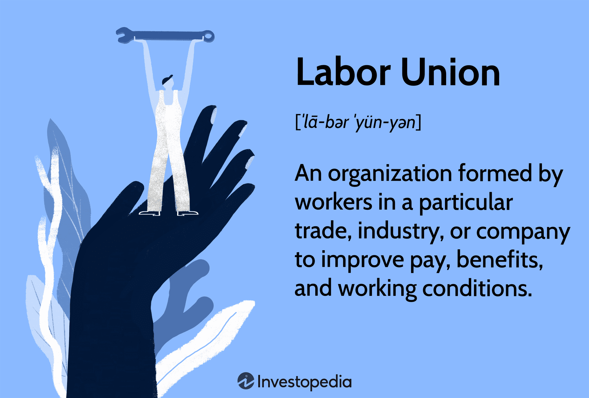

The labor movement has been instrumental in the development of workers' rights and economic policies worldwide. Labor unions are central to this effort, advocating for equitable wages, safe working conditions, and reasonable working hours. Originating during the industrial revolution, these organizations have helped shape the fabric of labor laws and safeguards we see today. Their influence has ensured the establishment of a workforce that is protected and fairly compensated.

In contemporary times, as technology continues to rapidly advance, labor unions are encountering new challenges and opportunities. The emergence of algorithmic trading exemplifies these dual forces. This development signifies a pivotal intersection between traditional labor concerns and the sophisticated technological advancements of today. Algorithmic trading, characterized by the use of computer algorithms to conduct trades at high speed and volume, is transforming labor markets. It creates a wide array of consequences that labor unions need to navigate, including shifts in job availability and the emergence of new skill demands.

This article examines the historical trajectory of the labor movement, highlighting the key role unions have played over the years. It also discusses the significant impact of recent technological advancements, specifically in the context of algorithmic trading. As these changes unfold, labor unions must continue to adapt, seeking ways to protect workers' rights while also capitalizing on new opportunities presented by the digital economy.

## Table of Contents

## A Brief History of the Labor Movement

The labor movement began in the midst of the Industrial Revolution, a period characterized by rapid industrialization and urbanization. During this era, workers faced harsh conditions, low wages, and long hours. In response to these challenges, labor unions emerged as pivotal organizations advocating for the interests of workers against the growing power of employers. These unions provided a collective voice to demand improved conditions, fair treatment, and just compensation.

One of the earliest and most influential milestones in the labor movement was the establishment of the American Federation of Labor (AFL) in 1886. Led by Samuel Gompers, the AFL focused on securing better wages, hours, and working conditions for skilled workers through collective bargaining and strikes. Its emphasis on craft unionism, concentrating on skilled trades, distinguished its approach during its formative years.

The subsequent formation of the Congress of Industrial Organizations (CIO) marked another significant development in the labor movement. Founded in the mid-1930s, the CIO broke away from the AFL, advocating for the industrial unionism model, which sought to unite all workers within an industry regardless of skill level. This approach led to successful organization drives in industries such as steel, automotive, and rubber, broadening the scope of unionized labor.

Significant legislative victories were milestones that highlighted the unions’ growing influence. The National Labor Relations Act of 1935, also known as the Wagner Act, was pivotal in granting workers the right to form unions and engage in collective bargaining. This legislation established the framework for fair labor practices and set the stage for the rise of organized labor in America.

Moreover, the Fair Labor Standards Act of 1938 introduced fundamental labor rights, including the establishment of a minimum wage, the mandate of overtime pay, and the prohibition of oppressive child labor. These legislative victories were instrumental in embedding labor rights within the legal fabric of the United States.

Over the decades, labor unions have been central in securing essential rights for workers, such as the weekend, a standard concept today but a hard-fought achievement in the past. They have also championed the implementation of the minimum wage and the institutionalization of collective bargaining processes, which have become standard practices governing employer-employee relationships.

The contributions of the labor movement have profoundly reshaped the landscape of labor rights and continue to influence contemporary discussions on workers' welfare and economic justice. Through persistent advocacy and strategic actions, unions have played an enduring role in striving for equity and improved conditions for workers worldwide.

## The Role and Impact of Labor Unions

Labor unions have historically emerged as formidable advocates for workers, orchestrating collective efforts to secure more favorable terms and conditions of employment. By negotiating on behalf of their members, unions have succeeded in obtaining higher wages, better benefits, and safer working environments. This role as a collective voice has been central to the improvements seen in labor rights over the last century.

One of the pivotal roles of unions has been their advocacy for labor rights, which has led to significant enhancements in worker safety and benefits. Legislation such as the Occupational Safety and Health Act in the United States has roots in the persistent efforts of labor unions to ensure safer working conditions. These organizations have also been instrumental in advancing social issues and promoting political agendas that align with workers' rights. Their influence has been felt in reforms related to family leave, healthcare benefits, and policies against workplace discrimination.

Despite their historical accomplishments, labor unions today encounter several challenges. A primary issue is the decline in membership. According to data from the U.S. Bureau of Labor Statistics, union membership in private industries has steadily decreased from its peak in the mid-20th century. Factors contributing to this decline include changes in the industrial landscape, the rise of service-oriented and technology-driven jobs, and increasingly stringent anti-union legislation in various regions.

Further complicating matters is the wave of legislation that poses additional obstacles to unionization efforts. These legal frameworks often create hurdles for organizing, such as requiring higher thresholds for worker representation or implementing stricter regulations around union dues.

The sustainability and future success of labor unions hinge on their ability to adapt to these evolving economic and social environments. This necessitates a strategic rethinking of traditional union activities. Unions must explore innovative approaches to engage with a modern workforce that increasingly comprises freelance and gig economy workers, who often lack the traditional benefits and protections associated with full-time employment.

In anticipation of continual change, unions are encouraged to leverage digital tools and platforms for mobilization and communication, thus broadening their reach and appeal. Additionally, by aligning with burgeoning industries and advocating for universal labor rights across both traditional and emerging sectors, unions can potentially rejuvenate their influence and relevance in the contemporary workplace.

Overall, the role and impact of labor unions remain significant. Their continued advocacy for worker empowerment and equitable economic practices is crucial for ensuring a balanced and fair labor market well into the future.

## Algorithmic Trading and Its Impact on Labor Markets

Algorithmic trading, often referred to as algo trading, involves utilizing sophisticated computer algorithms to conduct trades at speeds and volumes beyond human capability. This technological advancement has significantly reshaped financial markets. On one hand, it enhances market efficiency through rapid data processing, reducing the cost of transactions, and minimizing human errors. On the other hand, it raises concerns about job displacement as traditional roles in trading and analysis are increasingly automated.

The financial sector is at the forefront of labor market transformations due to [algorithmic trading](/wiki/algorithmic-trading). Roles traditionally held by human traders, such as executing trades, monitoring markets, and analyzing data, are being automated. This shift can lead to a contraction of employment opportunities in these areas. Moreover, sectors indirectly affected by market [volatility](/wiki/volatility-trading-strategies)—triggered in part by high-frequency trading—also face labor challenges. These sectors may experience unpredictability in demand for their goods and services, impacting labor stability.

In response to these transformations, labor unions are faced with the task of addressing the implications of these advancements. This involves negotiating not only on behalf of existing roles but also advocating for the development of new job categories that can accommodate the evolving needs of a tech-driven economy. One approach involves pushing for policies that support retraining and upskilling programs. These programs can help workers transition into roles that demand proficiency in digital literacy and technical skills.

As algorithmic trading continues to advance, there is an increasing necessity for employees in technology-heavy industries to acquire skills tailored to a digitized workplace. This includes understanding complex algorithms, data analysis, and [machine learning](/wiki/machine-learning). By fostering an adaptable and skilled workforce, labor markets can better absorb the impacts of automation. The interplay between technology and labor demands a strategic approach to education and career development, ensuring that workers are equipped to meet the challenges and seize the opportunities presented by technological innovations.

## The Role of Labor Unions in the Age of Technology

As technology reshapes industries, labor unions must proactively engage in discussions regarding technological advancements to maintain their relevance. A primary opportunity lies in advocating for digital literacy and training programs. By ensuring workers are equipped with the necessary skills to thrive in evolving job markets, unions can help bridge the gap between current competencies and future employment requirements. Organizations can provide resources and workshops, empowering workers to adapt to continuously changing technologies.

In addition to fostering digital literacy, unions play a critical role in negotiating policies that mitigate the adverse effects of automation. These policies can address job displacement and reduced work hours, which are common concerns associated with automation. By advocating for policies such as job transition support and wage protection measures, unions can help create a safety net for workers transitioning into new roles shaped by technological change.

Moreover, collaboration with technology companies is essential for aligning the interests of workers and industry leaders. By establishing partnerships, unions can influence how technologies are implemented in workplaces. This collaboration enables unions to ensure that worker concerns, such as job security and fair compensation, are addressed in the adoption of new technologies. Collaborative efforts can lead to more inclusive workplace innovations that benefit both employers and employees.

The intersection of unions and emerging tech sectors is crucial for fostering a future economy that is both inclusive and equitable. By engaging with tech companies and advocating for workers' interests, unions can help shape an economic landscape where technological advancements contribute to widespread prosperity rather than exacerbating inequality. This strategic engagement requires unions to be agile in their approaches and to embrace innovation as a tool for promoting worker welfare and sustainable economic practices.

## Challenges and Opportunities for Unions Today

Labor unions today face significant challenges as they navigate an economic landscape transformed by globalization and technological disruption. The rapid pace of technological advancements has reshaped industries, often leading to job displacement and altering traditional labor market dynamics. As a result, unions must evolve their strategies to address the effects of automation, [artificial intelligence](/wiki/ai-artificial-intelligence), and algorithmic trading on the workforce.

One prominent challenge for labor unions is maintaining relevance in an era characterized by a decline in traditional, long-term employment arrangements. With the rise of the gig economy, more workers are engaged in short-term contracts or freelance work, making it difficult for unions to organize and protect these individuals. However, this shift also presents an opportunity for unions to expand their influence by advocating for universal labor rights that transcend conventional employer-employee relationships. By actively engaging with gig workers, unions can strengthen their role as a champion of workers' rights, irrespective of employment status.

Digital platforms offer unions a powerful tool to mobilize and communicate with their members. The adoption of digital technologies can enable unions to reach a broader audience, fostering greater engagement and participation among workers. Online platforms can facilitate the dissemination of information, provide forums for discussion, and allow for more responsive and adaptable organizational frameworks. Embracing digital communication channels can enhance the effectiveness of union campaigns and negotiations, ensuring that worker interests are effectively represented.

Public discourse and legislation play crucial roles in shaping policies that protect workers in a tech-driven economy. Unions can leverage their collective influence to advocate for policies that address emerging issues such as data privacy, workplace surveillance, and the ethical use of technology. By participating actively in public debates, unions can contribute to the development of equitable labor standards that keep pace with technological advancements.

Navigating these challenges strategically is essential for unions to enhance their relevance in the modern workplace. This may involve forging partnerships with technology companies to ensure that the implementation of new technologies aligns with the interests of workers. By collaborating with industry leaders, unions can promote an inclusive approach to technological adoption that prioritizes workforce inclusion and skill development.

To stay relevant, unions must also adapt their organizational models to be more flexible and responsive. Innovative strategies that focus on the unique needs and conditions of various sectors can help unions remain pivotal in advocating for workers' rights. By continuously evaluating and updating their approaches, unions can better protect the welfare of workers while fostering a sustainable and just economic environment.

In summary, the challenges and opportunities for labor unions today are intricately linked to the evolving economic landscape. By harnessing digital tools, engaging with diverse worker groups, and shaping public discourse, unions can maintain their vital role in promoting workers' rights and shaping the future of work in a technology-driven era.

## Conclusion

The history of the labor movement reveals the vital role that unions have played in championing workers' rights and enhancing welfare standards. Their efforts have led to tangible improvements in working conditions, fair wages, and the establishment of essential labor rights. Today, as the world stands on the brink of new technological advancements, labor unions face the pressing need to innovate and adapt their strategies to continue being relevant.

Algorithmic trading, as a facet of these technological advancements, introduces a complex landscape that presents both challenges and opportunities. On one hand, the automation of trading processes could lead to job displacement and greater market volatility, impacting various sectors. On the other hand, it also offers the potential for increased efficiency and the creation of new roles that require advanced technological skills.

For labor unions to maintain their significance, embracing technological change is imperative. This involves engaging with digital tools and platforms, advocating for policies that protect against the negative repercussions of automation, and fostering digital literacy programs that prepare workers for a continuously changing economy. By taking proactive steps, unions can support workers in navigating the digital age while ensuring their own ongoing relevance.

At the core of this transformation is a steadfast commitment to worker empowerment and sustainable economic practices. These will ultimately define the future trajectory of the labor movement, ensuring that it remains a pivotal force in advocating for fair labor standards and equitable workplace practices in a tech-driven world.

## References & Further Reading

[1]: ["Labor Unions and the Effects of Technological Change"](https://www.sciencedirect.com/science/article/pii/S0160791X21002074) by John T. Dunlop, Journal of Economic Literature.

[2]: Friedman, G., & Mandelbaum, M. (2011). ["Rewired: Understanding the iGeneration and the Way They Learn."](https://www.amazon.com/Rewired-Understanding-iGeneration-They-Learn/dp/0230614787) 

[3]: ["American Labor Unions: The Power and Limits of Collective Action"](https://www.theatlantic.com/ideas/archive/2024/04/american-labor-movement-unions-support/678099/) by Robert Zieger.

[4]: Brynjolfsson, E., & McAfee, A. (2014). ["The Second Machine Age: Work, Progress, and Prosperity in a Time of Brilliant Technologies."](https://psycnet.apa.org/record/2014-07087-000)

[5]: Autor, D. H. (2015). ["Why are there still so many jobs? The history and future of workplace automation."](https://www.aeaweb.org/articles?id=10.1257/jep.29.3.3) 

[6]: Freeman, R. B., & Medoff, J. L. (1984). ["What Do Unions Do?"](https://journals.sagepub.com/doi/abs/10.1177/001979398503800207)

[7]: Acemoglu, D., & Restrepo, P. (2018). ["The Race between Man and Machine: Implications of Technology for Growth, Factor Shares, and Employment."](https://www.aeaweb.org/articles?id=10.1257/aer.20160696) The American Economic Review.

[8]: ["Digitalization and automation and employment: A literature overview."](https://www.sciencedirect.com/science/article/pii/S0040162523001336) by Ines Oswald & R. Fernando Campos, Seminar: India's National Magazine.