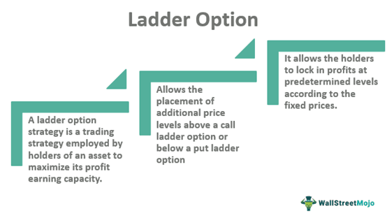

Ladder options are a type of exotic option in the world of financial derivatives known for their structured approach to profit-taking. Unlike vanilla options, which provide the holder with the right, but not the obligation, to buy or sell an underlying asset at a specified price before expiration, ladder options introduce multiple price levels, or "rungs," which create opportunities to lock in profits incrementally as the asset price hits these levels. This characteristic makes ladder options particularly appealing for traders looking to secure gains while maintaining exposure to further price movements.

As financial markets evolve, there is increased interest in exotic options, such as ladder options, due to their capacity to cater to specific trading strategies and risk appetites. The flexibility of ladder options allows traders to adopt complex strategies that can optimize returns while managing risks effectively. This rising interest is mirrored by advancements in algorithmic trading, which offers a way to systematically trace and analyze market conditions to enhance decision-making processes in options trading.



Algorithmic trading, also known as algo trading, plays a critical role in options markets by automating trading strategies based on predetermined criteria. It leverages computational power and advanced algorithms to interpret vast datasets, identify trends, and execute trades at optimal times, often without human intervention. This is especially beneficial in ladder options trading, where multiple price triggers and profit-taking points can be systematically managed through automated processes, reducing the risk of human error and emotional trading.

In this article, attention is given to exploring trading strategies, the integration of algorithmic trading, and effective risk management practices associated with ladder options. By understanding the mechanics and advantages of ladder options and how they can be utilized within algorithmic frameworks, traders can optimize their portfolios and potentially enhance their trading performance. This section sets the foundation for a comprehensive examination of ladder options and the integration of advanced trading practices, encouraging traders to explore the potential offered by these sophisticated financial instruments.

## Table of Contents

## Understanding Ladder Options

Ladder options are a type of exotic option that provides structured opportunities for profit-taking as the underlying asset price reaches certain predetermined levels, known as "rungs". Unlike vanilla options, which have a single strike price and expiration, ladder options allow traders to lock in partial profits as the asset price ascends through multiple specified levels before maturity.

### Mechanics of Ladder Options

The primary feature of ladder options is the series of rungs that represent different price levels. These rungs act as checkpoints where a portion of the option's potential profit can be locked in. For instance, if a ladder call option is structured with rungs at $50, $60, and $70, profits are progressively secured as the underlying asset price reaches or surpasses each of these marks.

The mechanics can be seen as follows:

1. **Strike Price**: Each rung has a specific strike level that, when achieved, allows for profit to be locked.
2. **Expiration**: Similar to other options, ladder options have an expiration date, determining the overall timeframe for achieving profit at each rung.
3. **Partial Profit Locking**: Upon hitting each rung, a trader has the option to realize a portion of the gains, insulating against future declines in the asset's price that could erode overall profit.

### Benefits and Drawbacks

**Benefits:**

- **Risk Management**: By locking in profits at pre-defined levels, ladder options offer a systematic approach to managing risks while still keeping upside potential.
- **Structured Payouts**: They present the opportunity for multiple partial payouts during the life of the option, compared to the single payout at expiration typical of vanilla options.
- **Flexibility**: Traders can tailor ladders to fit various market conditions and strategies, benefiting both conservative and speculative traders.

**Drawbacks:**

- **Higher Complexity**: The setup and pricing of ladder options can be more complex, requiring a comprehensive understanding of multiple moving parts compared to standard options.
- **Cost**: Due to the additional features, ladder options tend to have higher premium costs, which may deter some traders.
- **Limited Availability**: Being exotic options, ladders may not be available on all trading platforms or for all underlying assets.

### Misconceptions and Related Terms

A common misconception is equating ladder options with simpler strategies like covered calls or spreads. However, ladder options are distinct due to their ability to lock in profits at multiple points, providing a unique blend of structure and flexibility. 

Key terms include:

- **Rungs**: Predetermined price levels at which profits can be locked.
- **Strike Price**: The price at each rung where a portion of profits becomes realizable.
- **Expiration**: The date when the ladder option contract concludes, similar to other options but with accumulated locked profits through prior rungs.

By understanding the specific structure and mechanics of ladder options, traders can better assess whether these instruments align with their investment strategies and risk tolerance.

## How Ladder Options Work

Ladder options provide a unique mechanism for traders by allowing the locking of profits at predetermined price levels, known as "rungs." Unlike traditional options where a payoff is realized only at expiration, ladder options offer multiple opportunities to secure profits as the asset price ascends or descends past specified levels. This distinct feature modifies the typical risk-reward profile associated with options trading, introducing flexibility but also additional complexity.

The mechanics of ladder options revolve around the concept of rungs, which are essentially price checkpoints. As the market price of the underlying asset reaches these rungs, a portion of the profit becomes locked in, regardless of future price movements. This is in contrast to a vanilla call or put option, where profits are realized or losses incurred depending on the price of the underlying asset at expiration.

### Locking in Profits: An Example

Consider a ladder call option with three rungs set at $50, $55, and $60, each locking in one-third of the potential profit. If the underlying asset's price hits $50, one-third of the option’s potential profit becomes guaranteed. Should the price advance to $55, another third is secured, and finally, reaching $60 locks in the full profit. This tiered mechanism allows traders to capture gains incrementally, offering a safeguard against adverse price reversals before expiration.

```python
def calculate_locked_profits(price, rungs):
    total_profits = 0
    payout_per_rung = 1/len(rungs)
    for rung in rungs:
        if price >= rung:
            total_profits += payout_per_rung
        else:
            break
    return total_profits

# Example usage
rungs = [50, 55, 60]
current_price = 56
locked_profits = calculate_locked_profits(current_price, rungs)
print(f"Total locked profits: {locked_profits*100}%")
```

### Pricing Ladder Options

Pricing ladder options involves a more advanced model compared to traditional options due to the multiple exercise opportunities. Standard models like Black-Scholes may be extended or modified to accommodate the multi-tiered structure of ladder options. Each rung represents a separate mini-option, which requires its own pricing considerations based on factors like [volatility](/wiki/volatility-trading-strategies), time to expiration, and the specific price level of the rung.

The pricing model must account for the probability of reaching each rung as well as the associated payoffs upon hitting these checkpoints. This layered approach often results in higher premiums for ladder options, reflecting their added complexity and the embedded opportunities for early profit realization.

### Risk and Reward Dynamics

Ladder options modify the conventional risk-reward balance. The main advantage lies in the ability to lock in profits progressively, which mitigates some risks associated with unfavorable price swings before expiry. This feature is particularly appealing in volatile markets, where swings in the asset price can be significant and unpredictable.

However, the potential for total returns may be capped if the market price does not reach higher rungs. The risk, therefore, is the trade-off between immediate profit-taking and the possibility of higher returns had the market moved more favorably. This structured approach essentially provides a more conservative strategy, appealing to traders seeking stability and incremental outcomes over potentially larger, but less certain, payoffs.

In conclusion, the functioning of ladder options introduces an innovative method of securing profits while navigating market volatility. Their intricate pricing and risk management demands a deeper understanding but can offer substantial benefits when correctly applied within trading strategies.

## Algorithmic Trading in Ladder Options

Algorithmic trading refers to the use of computer algorithms to execute trades based on pre-defined criteria and quantitative models. In the options market, [algorithmic trading](/wiki/algorithmic-trading) plays a crucial role by enhancing speed, efficiency, and precision in executing trades, which are pivotal given the complex and dynamic nature of options trading.

Algorithms can significantly optimize trading strategies for ladder options by dynamically adjusting positions as the underlying asset price moves through different rungs or levels. The algorithms assess real-time market data, gauge price trends, and execute trades automatically, thereby implementing efficient entry and [exit](/wiki/exit-strategy) points in the market. This automated approach allows traders to capitalize on small price movements and lock in partial profits efficiently as specific ladder levels are reached.

To execute algorithmic trading in ladder options, a robust technical infrastructure is necessary. This includes powerful computational systems capable of processing vast amounts of market data in real-time, fiber-optic connections to reduce latency, and sophisticated trading platforms capable of executing orders automatically. Furthermore, access to high-quality financial data and a reliable market interface are essential components to ensure the successful deployment of these algorithms.

Data analytics plays a fundamental role in developing and refining trading algorithms for ladder options. Advanced statistical techniques and [machine learning](/wiki/machine-learning) models can be employed to analyze historical data and uncover patterns that may inform future price movements. By employing predictive analytics, traders can enhance algorithm performance, thereby increasing the probability of achieving desired trading outcomes.

Backtesting is a critical process in algorithmic trading, providing an empirical framework to evaluate the viability of a trading strategy by applying it to historical market data. Through [backtesting](/wiki/backtesting), traders can assess how a strategy would have performed in past conditions, enabling the identification of strengths and potential weaknesses. This process helps refine the trading algorithm, ensuring that it is optimized for various market scenarios. Strategy validation also involves rigorous testing to confirm that the algorithmic model functions as intended and can reliably generate expected returns under current market conditions.

In essence, algorithmic trading in ladder options offers a sophisticated approach to enhance trading efficiency and accuracy, leveraging computational power and data-driven insights. Through the integration of advanced algorithms, robust technical infrastructure, and comprehensive data analytics, traders can effectively navigate the complexities of the options market, embracing a systematic methodology to achieve optimal trading outcomes.

## Strategies for Ladder Options Trading

Ladder options trading involves unique strategies that can cater to different trading goals and market conditions. One popular strategy is the hedging approach, which aims to protect gains by locking in profits as the underlying asset's price reaches predetermined levels, or "rungs." This is particularly beneficial in volatile markets where price movements can be unpredictable. A trader might set multiple rungs close together in a highly volatile market to secure incremental gains while minimizing risk if the asset's price retreats.

Momentum strategies are another prevalent method. These strategies rely on the idea that an asset’s price will continue moving in its current direction. Traders using this strategy often employ technical indicators to identify when to enter and exit positions. Moving averages and Bollinger Bands are common among these indicators. Moving averages help smooth out price data over a specified period, making it easier to spot trends, while Bollinger Bands provide a visual gauge of an asset's volatility and potential reversal points. For instance, traders might look for a crossing of the price over the moving average to signal a new rung position or use the expanding width of Bollinger Bands to anticipate increasing volatility and adjust rung placements accordingly.

Incorporating ladder options into broader trading strategies can enhance risk management. For example, a trader using a trend-following strategy might add a ladder option to lock in profits at various stages of the trend, effectively safeguarding against sharp reversals. This layered approach can ensure that even if the trend ends abruptly, previously accrued profits are not entirely lost.

Different strategies can also be tailored to suit varying market conditions. In a bull market, traders might set their rungs higher to maximize profits in the expectation of continued price increases. Conversely, in a bear market, focusing on closer rungs might be more prudent to secure smaller, more frequent gains.

Execution pitfalls in ladder options trading often arise from incorrect market assessments or inappropriate use of technical indicators. For example, setting rungs too close together in a low-volatility environment could lead to minor gains being realized too soon, missing out on more substantial profits. Conversely, placing rungs too far apart in a volatile market might result in missed profit opportunities if the price doesn’t reach the next rung before reversing. To avoid these issues, traders should continuously analyze market conditions and adjust their strategies as needed.

Ensuring successful ladder options strategies requires adaptability and a keen understanding of market dynamics. By effectively employing hedging and [momentum](/wiki/momentum) strategies and utilizing technical indicators appropriately, traders can enhance their ability to manage risk and capitalize on market opportunities.

## Pros and Cons of Ladder Options

Ladder options offer a distinctive approach within the broader landscape of financial derivatives, presenting both promising opportunities and notable challenges. One of the primary advantages of integrating ladder options into a trading portfolio is the potential for high returns. The structured nature of ladder options, featuring multiple strike prices or "rungs," allows traders to lock in profits incrementally as the underlying asset's price ascends each level. This layered approach not only offers the potential for substantial returns but also provides a measure of flexibility to fine-tune strategies according to specific market movements.

The inherent flexibility in ladder options strategies is another key advantage. Traders can design and adjust their positions to align with market expectations, utilizing various rungs to capture incremental gains and manage risk. This adaptability makes ladder options particularly appealing for traders seeking to exploit short-term market fluctuations without committing to a single outcome.

Despite these benefits, trading ladder options comes with challenges and limitations. The complexity involved in structuring and managing these options is significantly higher compared to traditional vanilla options. Traders must be adept at anticipating multiple market conditions and coordinating the timing of options execution, which can be a daunting task. Additionally, the layered nature of ladder options inherently introduces higher risk factors. If the underlying asset does not reach the predetermined rungs, potential gains could be lost, leading to possible financial losses.

In comparison to other derivative products like vanilla options and binary options, ladder options present unique benefits and drawbacks. Unlike vanilla options, ladder options provide structured profit-taking opportunities at various price levels, which is not possible with single strike prices. However, unlike binary options that offer a straightforward yes-or-no proposition with fixed returns, ladder options necessitate a nuanced understanding of multiple price points and market dynamics.

Identifying when ladder options are appropriate investments requires a careful assessment of market conditions and individual risk tolerance. They are particularly suitable in scenarios where traders anticipate upward trends with multiple price thresholds. It is crucial for traders to engage in thorough market analysis and ensure they have a comprehensive understanding of their trading objectives and the potential risks involved. Careful consideration and strategic planning are essential for leveraging the advantages of ladder options while mitigating the inherent complexities and risks.

## Getting Started with Ladder Options Trading

Choosing the right broker is a fundamental step for those interested in trading ladder options. It is crucial to select a broker that not only offers ladder options but also provides a reliable and user-friendly platform. Some key features to look for in a broker include robust trading tools, educational resources, competitive spreads, and efficient customer service. It's advisable to review brokers’ regulatory compliance and ensure they have a transparent fee structure. Brokers like IG or Saxo Bank, known for offering a comprehensive range of derivatives, can be considered as starting points.

Once a suitable broker is chosen, the next step is opening a brokerage account. This typically involves filling out an application, submitting necessary identification documents, and funding the account. It can be beneficial to start with a demo account if the broker offers this option, allowing traders to familiarize themselves with the platform and practice trading without financial risk.

Implementing a trading strategy for ladder options demands thorough preparation. Traders should develop a well-structured approach, possibly using algorithmic strategies to handle the intricate nature of ladder options. This might involve setting up automatic trade triggers based on specific criteria using a programming language like Python, leveraging libraries such as pandas or NumPy for data handling. A simple Python script could look like this:

```python
import numpy as np
import pandas as pd

# Example strategy function
def ladder_option_strategy(price_data):
    rungs = np.array([50, 55, 60, 65, 70])  # Define ladder rungs
    positions = []  # To store buy/sell signals
    for price in price_data:
        if price >= rungs[-1]:
            positions.append('Sell')
        elif price <= rungs[0]:
            positions.append('Buy')
        else:
            positions.append('Hold')
    return positions

# Sample price data
price_data = pd.Series([48, 52, 58, 66, 71])
signals = ladder_option_strategy(price_data)
print(signals)
```

Selecting the right market and instruments for ladder options trading is essential. Ladder options thrive in volatile markets, where price movements are frequent and pronounced. Therefore, identifying markets with sufficient [liquidity](/wiki/liquidity-risk-premium) and volatility, such as foreign exchange or major equity indices, can be advantageous. 

Moreover, a deep understanding of market conditions and volatility is imperative. Traders should routinely analyze economic indicators, geopolitical events, and market sentiment, which can affect price volatility and trading opportunities. The VIX index, also known as the "fear index," is a common tool for gauging market volatility.

Continuous learning and market analysis are critical components of successful ladder options trading. Traders should engage with financial literature, attend webinars, and participate in community forums to keep abreast of market developments and evolving trading strategies. Additionally, subscribing to analytical tools and services that offer real-time data and insights can enhance decision-making processes. Advanced traders often employ statistical methods and machine learning models to refine their strategies further.

In summary, starting with ladder options trading involves carefully selecting a broker, opening and funding a trading account, diligently crafting trading strategies, choosing appropriate markets, and maintaining a disciplined approach to learning and market analysis. These steps ensure a holistic approach and provide a solid foundation for navigating the complexities of ladder options trading.

## Conclusion

Ladder options and algorithmic trading together form a potent combination that can enhance a trader's ability to optimize financial outcomes. Ladder options, with their ability to lock in partial profits at predetermined levels, offer substantial benefits and strategic advantages, such as increased flexibility and potential for higher returns. By incorporating these derivatives into their portfolios, traders can diversify strategies and potentially mitigate risks associated with market volatility.

Algorithmic trading serves as a vital tool in managing and executing these strategies efficiently. It allows for the continuous monitoring of market conditions and the execution of trades based on preset criteria, which is particularly advantageous in capturing opportunities at the various rungs of ladder options. The use of algorithms in trading also helps in minimizing emotional biases and improving discipline through systematic trading approaches. However, responsible trading and comprehensive risk management cannot be overemphasized. While ladder options provide opportunities for high returns, they also come with inherent complexities and risks that need careful consideration.

Aspiring traders are encouraged to further their understanding by exploring additional educational resources and tools. This continuous learning process aids in refining strategies and enhancing market acumen. Options trading, particularly with exotic options like ladders, requires a thorough knowledge base and a pragmatic approach to risk management, making education and continuous improvement essential components for success.

In conclusion, the integration of ladder options and algorithmic trading offers a pathway for innovation and excellence in the dynamic world of financial markets. By maintaining a focus on education, responsible trading, and strategic diversification, traders can effectively harness these tools for optimal financial performance.

## References & Further Reading

[1]: ["Exotic Options: A Guide to Second Generation Options"](https://www.amazon.com/Exotic-Options-Guide-Second-Generation/dp/9810235216) by Peter G Zhang

[2]: Derman, E., & Kani, I. (1994). ["Riding on a Smile."](https://www.researchgate.net/publication/239059413_Riding_on_a_Smile) Risk Magazine, 7(2).

[3]: Hunt, P., & Kennedy, J. (2004). ["Financial Derivatives in Theory and Practice"](https://onlinelibrary.wiley.com/doi/book/10.1002/0470863617). Wiley.

[4]: Hull, J. C. (2017). ["Options, Futures, and Other Derivatives"](https://www.pearson.com/en-us/subject-catalog/p/options-futures-and-other-derivatives/P200000005938/9780136939917). Pearson. 

[5]: Das, S. R. (1996). ["Beyond Mean Reversion: Adaptive Markets, Long Memory, and the Level Shifts in U.K. Interest Rates"](https://www.bu.edu/econ/files/2014/05/Perron-Forecasting-Return-Volatility-Level-Shifts-Nov-2013.pdf). The Journal of Business, 69(4), 499-508.