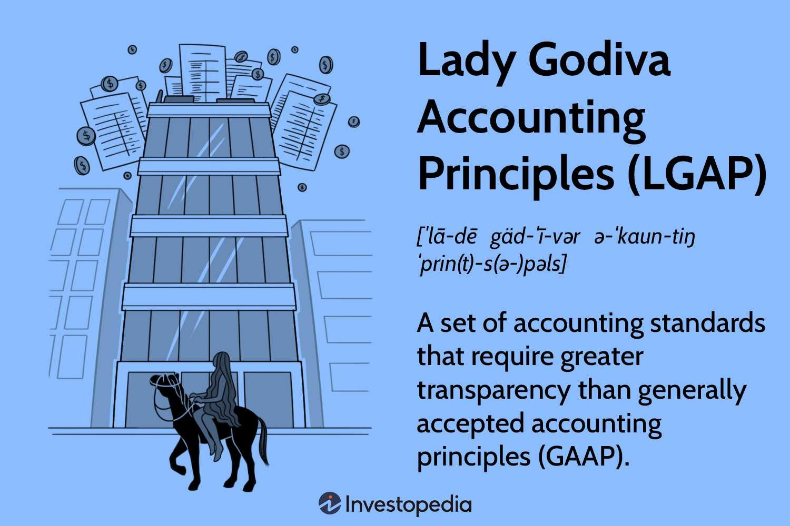

## Table of Contents

## What are the Lady Godiva Accounting Principles?

The Lady Godiva Accounting Principles are a humorous set of accounting rules that were made up as a joke. They are not real accounting principles. The name comes from Lady Godiva, a woman from a famous story who rode a horse naked through a town to protest high taxes. The idea behind the Lady Godiva Accounting Principles is that they are so simple and transparent that anyone can understand them, just like Lady Godiva's protest was very clear and easy to see.

These principles are often mentioned in accounting classes or books to make students laugh and to remind them that accounting can be fun. They are not used in real businesses or by real accountants. Instead, they serve as a light-hearted way to break the ice and make the subject of accounting seem less boring. So, while the Lady Godiva Accounting Principles are not something you need to learn for a job in accounting, they can help make learning about real accounting principles more enjoyable.

## Who created the Lady Godiva Accounting Principles and why?

The Lady Godiva Accounting Principles were created by a man named George O. May. He was an important accountant who worked in the early 1900s. George O. May made up these principles as a funny way to talk about accounting. He wanted to show that accounting could be simple and easy to understand, just like Lady Godiva's famous ride through the town.

George O. May used the Lady Godiva Accounting Principles to make people laugh and to help them see that accounting doesn't have to be boring. By using a funny story, he hoped to make the subject more interesting and easier to learn. Even though these principles are not real, they have been used in accounting classes to break the ice and make students more comfortable with the subject.

## How do the Lady Godiva Accounting Principles differ from traditional accounting principles?

The Lady Godiva Accounting Principles are not real rules for accounting. They were made up as a joke by George O. May to make accounting seem fun and easy. These principles are based on the story of Lady Godiva, who rode through town on a horse to protest high taxes. The idea is that these accounting principles would be so simple and clear that anyone could understand them, just like Lady Godiva's protest was very easy to see.

Traditional accounting principles, on the other hand, are real rules that accountants must follow. These rules help businesses keep track of their money in a correct and organized way. They include things like making sure all financial records are accurate, following laws about taxes, and making sure the business can show how it is doing financially to others. Unlike the Lady Godiva Accounting Principles, these rules are very important and must be followed carefully.

## What are the core components of the Lady Godiva Accounting Principles?

The Lady Godiva Accounting Principles are a made-up set of accounting rules that are meant to be funny. They are named after Lady Godiva, who rode a horse through town without any clothes to protest high taxes. The idea behind these principles is that they should be very simple and clear, just like Lady Godiva's protest. They are not real rules that accountants use, but they are used in accounting classes to make students laugh and feel more relaxed about learning.

These principles do not have specific components because they are not real. If they did have components, they might include things like being very honest and open about money, and making sure everyone can understand the financial records easily. But since they are just a joke, they are not used in real businesses or by real accountants. They help make the subject of accounting seem less boring and more fun.

## Can you explain the ethical considerations in the Lady Godiva Accounting Principles?

The Lady Godiva Accounting Principles are not real rules for accounting. They were made up as a funny way to talk about accounting. Because they are not real, they do not have any real ethical considerations. The idea behind them is to be simple and clear, just like Lady Godiva's ride through the town. If they were real, they might suggest being very honest and open about money, but since they are just a joke, they do not have any rules about what is right or wrong.

In real accounting, ethical considerations are very important. Accountants have to follow rules to make sure they are honest and fair. They need to keep accurate records, follow the law, and make sure they are not hiding anything from people who need to know about the business's money. These rules help make sure that businesses are doing things the right way and that people can trust the financial information they see. The Lady Godiva Accounting Principles do not have these kinds of rules because they are not meant to be taken seriously.

## How are the Lady Godiva Accounting Principles applied in financial reporting?

The Lady Godiva Accounting Principles are not used in real financial reporting because they are just a funny made-up idea. They were created by George O. May to make accounting seem less boring and more fun. The idea behind them is that they should be very simple and easy to understand, like Lady Godiva's ride through the town. But since they are not real rules, they do not have any steps or guidelines for how to report money in a business.

In real financial reporting, accountants follow serious rules and guidelines to make sure their reports are accurate and honest. These rules help businesses keep track of their money correctly and make sure everyone who needs to see the financial information can trust it. The Lady Godiva Accounting Principles do not have any part in this process because they are just a joke. They are sometimes mentioned in accounting classes to make students laugh and feel more comfortable with the subject, but they are not used in the actual work of financial reporting.

## What industries benefit most from using the Lady Godiva Accounting Principles?

No industries benefit from using the Lady Godiva Accounting Principles because they are not real rules for accounting. They were made up as a funny way to talk about accounting and to make it seem less boring. The idea behind them is to be very simple and clear, like Lady Godiva's ride through the town to protest high taxes. But since they are just a joke, they do not help any businesses or industries with their real financial work.

In real accounting, industries like banking, manufacturing, and retail use serious rules to keep track of their money. These rules help make sure their financial reports are accurate and honest. The Lady Godiva Accounting Principles do not have any place in these industries because they are not meant to be taken seriously. They are only used in accounting classes to make students laugh and feel more comfortable with the subject.

## What are some case studies or examples where the Lady Godiva Accounting Principles have been successfully implemented?

The Lady Godiva Accounting Principles are not real rules for accounting, so there are no case studies or examples where they have been successfully implemented. They were made up as a funny way to talk about accounting and to make it seem less boring. The idea behind them is to be very simple and clear, like Lady Godiva's ride through the town to protest high taxes. But since they are just a joke, they do not help any businesses or industries with their real financial work.

In real accounting, businesses follow serious rules to keep track of their money correctly. These rules help make sure their financial reports are accurate and honest. The Lady Godiva Accounting Principles do not have any place in these real-world situations because they are not meant to be taken seriously. They are only used in accounting classes to make students laugh and feel more comfortable with the subject, but they do not have any practical use in actual financial reporting or business operations.

## How do the Lady Godiva Accounting Principles impact financial decision-making?

The Lady Godiva Accounting Principles do not impact financial decision-making because they are not real rules for accounting. They were made up as a funny way to talk about accounting and to make it seem less boring. The idea behind them is to be very simple and clear, like Lady Godiva's ride through the town to protest high taxes. But since they are just a joke, they do not help any businesses or industries with their real financial work.

In real financial decision-making, businesses use serious rules to keep track of their money correctly. These rules help make sure their financial reports are accurate and honest. They guide businesses in making important decisions about spending, investing, and managing their money. The Lady Godiva Accounting Principles do not have any place in these real-world situations because they are not meant to be taken seriously. They are only used in accounting classes to make students laugh and feel more comfortable with the subject, but they do not have any practical use in actual financial decision-making.

## What are the criticisms and limitations of the Lady Godiva Accounting Principles?

The Lady Godiva Accounting Principles are not real rules for accounting. They are just a funny idea made up by George O. May to make accounting seem less boring. Because they are not real, they do not have any actual criticisms or limitations in the way that real accounting rules do. People might say they are too simple or not serious enough, but that's the point—they are meant to be a joke, not something to use in real businesses.

In real accounting, rules are very important and must be followed carefully. These rules help businesses keep their money organized and make sure their financial reports are correct. The Lady Godiva Accounting Principles do not help with this at all because they are not meant to be used in real situations. They are just a fun way to talk about accounting in classes, but they do not have any place in the serious work of managing money in a business.

## How do the Lady Godiva Accounting Principles integrate with international accounting standards?

The Lady Godiva Accounting Principles do not integrate with international accounting standards because they are not real rules for accounting. They were made up as a funny way to talk about accounting and to make it seem less boring. The idea behind them is to be very simple and clear, like Lady Godiva's ride through the town to protest high taxes. But since they are just a joke, they do not help any businesses or industries with their real financial work.

International accounting standards are serious rules that businesses all over the world follow to keep their money organized and make sure their financial reports are correct. These rules help make sure that everyone can trust the financial information they see. The Lady Godiva Accounting Principles do not have any place in these real-world situations because they are not meant to be taken seriously. They are only used in accounting classes to make students laugh and feel more comfortable with the subject, but they do not have any practical use in actual financial reporting or business operations.

## What future developments or evolutions are expected in the Lady Godiva Accounting Principles?

The Lady Godiva Accounting Principles are not real rules for accounting. They are just a funny idea made up by George O. May to make accounting seem less boring. Because they are not real, there are no expected future developments or evolutions for them. They are meant to be a joke, so they will probably stay the same and continue to be used in accounting classes to make students laugh and feel more comfortable with the subject.

In the world of real accounting, rules and standards are always changing and improving to keep up with new ways of doing business and new technology. These changes help make sure that businesses can keep their money organized and that their financial reports are correct and trustworthy. The Lady Godiva Accounting Principles do not have any part in these real-world changes because they are not meant to be taken seriously. They are just a fun way to talk about accounting, but they do not have any practical use in the serious work of managing money in a business.

## References & Further Reading

[1]: Healy, P. M., & Palepu, K. G. (2001). ["Information asymmetry, corporate disclosure, and the capital markets: A review of the empirical disclosure literature."](https://www.sciencedirect.com/science/article/pii/S0165410101000180) Journal of Accounting and Economics.

[2]: Bertomeu, J., & Cheynel, E. (2013). ["Asset measurement and the general accepted accounting principles (GAAP)."](https://onlinelibrary.wiley.com/doi/10.1111/1475-679X.12390) Economic Theory.

[3]: Kolb, R. W. (2010). ["Lessons from the Financial Crisis: Causes, Consequences, and Our Economic Future."](https://archive.org/details/lessonsfromfinan0000unse_u1q9) Wiley.

[4]: Zakić, N., & Jovanović, M. (2009). ["A comparative analysis of convergence of IFRS and US GAAP accounting standards."](https://www.researchgate.net/publication/306137126_The_Convergence_of_US_GAAP_with_IFRS_A_Comparative_Analysis_of_Principles-based_and_Rules-based_Accounting_Standards) Journal of Economic and Management Studies.

[5]: ["Algorithmic Trading – Winning Strategies and Their Rationale"](https://www.amazon.com/Algorithmic-Trading-Winning-Strategies-Rationale-ebook/dp/B00CY5HC0U) by Ernie Chan