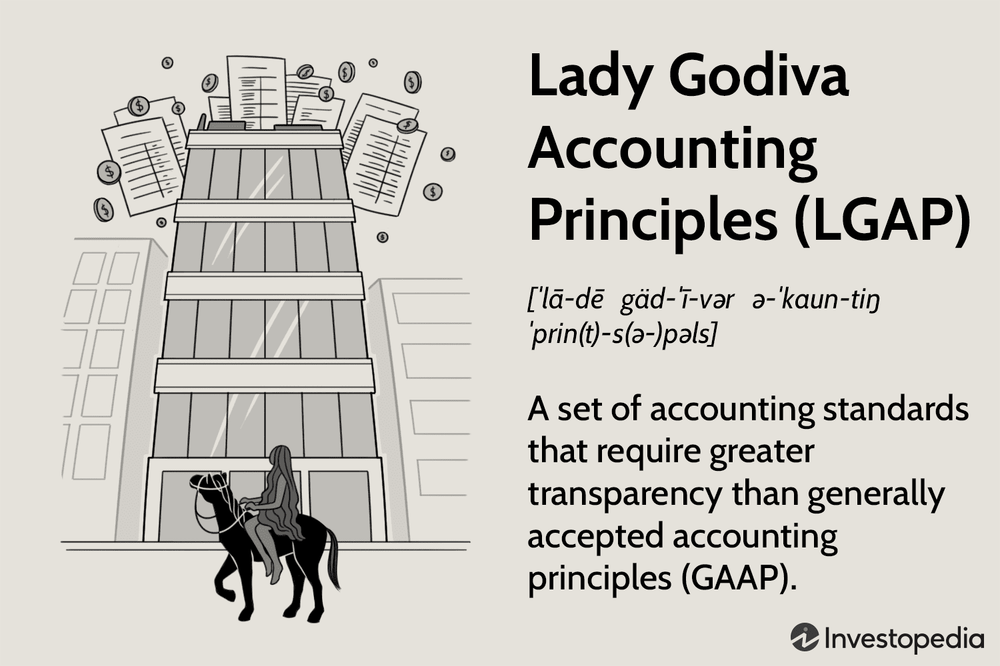

The world of accounting has witnessed numerous transformative ideas and practices over the decades, reflecting the evolving demands for transparency and ethical financial reporting. Among these concepts is the Lady Godiva Accounting Principles (LGAP), a theoretical framework introduced to emphasize the importance of transparency and full disclosure in corporate financial reporting. LGAP is metaphorically inspired by the legendary tale of Lady Godiva, where the emphasis lies on the removal of barriers to transparency, mirroring her act that sought to provide unobstructed insight.

LGAP proposes that corporate financial statements should offer exhaustive disclosure, thereby ensuring that investors and stakeholders have access to all pertinent fiscal information. This level of transparency is vital in averting financial misrepresentations and unethical practices that have historically plagued financial markets. Such misrepresentations have led to significant scandals and losses, illustrating the need for principles like LGAP.



In this article, the intricacies of LGAP will be explored, including its historical roots, the impact it holds within modern algorithmic trading, and how it compares with the generally accepted accounting principles (GAAP). GAAP, currently the industry standard, dictates a structured and regulated approach to financial reporting. The discussion will shed light on how LGAP, despite not being formally adopted in the accounting world, provides a provocative perspective on financial disclosure, thereby influencing discussions around improving transparency in financial systems and trading algorithms.

## Table of Contents

## Understanding Lady Godiva Accounting Principles (LGAP)

The Lady Godiva Accounting Principles (LGAP) emerged as a reaction to corporate financial scandals, which underscored the critical need for transparency in financial reporting. This concept emphasizes thorough transparency, similar to the legendary narrative of Lady Godiva's ride, which symbolizes the act of revealing the full scope of information for the public good. This allegorical linkage highlights the expectations for modern corporations to unveil their complete financial picture, allowing investors and stakeholders to make well-informed decisions based on undistorted financial data.

In corporate contexts, LGAP insists on the principle of full disclosure, requiring firms to disclose all pertinent financial data, reducing the potential for financial misdirection. By advocating for extensive transparency, LGAP seeks to counteract the hidden motives and obscure financial manipulations that have historically led to significant trust deficits between corporations and investors.

The foundational philosophy of LGAP is that unrestricted access to detailed financial information fortifies investor confidence and market stability by reducing asymmetries in information. This expectation aligns with the broader ethical thrust of ensuring honesty and openness in financial dealings, promoting an environment where financial statements accurately reflect a company's financial health without omission or embellishment.

## The Origin and Need for LGAP

Lady Godiva Accounting Principles (LGAP) emerged out of the necessity for increased transparency in corporate financial reporting, particularly highlighted by the Enron scandal in the early 2000s. The collapse of Enron was a watershed moment in financial history, demonstrating the catastrophic impact of concealed liabilities and fraudulent accounting practices. Enron's financial ruin was largely attributed to its use of complex accounting strategies, such as special purpose entities (SPEs), to obscure debt and inflate profits. This manipulation misled investors and regulators, precipitating one of the largest bankruptcies in U.S. history and leading to significant financial losses.

Rick Wayman, a financial analyst, introduced the concept of LGAP as a response to these events. His intention was to promote an accounting strategy that would mandate full disclosure and mitigate the risks posed by obscured financial activities. By advocating for transparency akin to the symbolic gesture of Lady Godiva, LGAP underscores the necessity for corporations to provide complete and unambiguous financial information to stakeholders.

The drive for LGAP was motivated by the need to prevent similar corporate frauds and financial scandals. Full financial transparency, as prescribed by LGAP, aims to strip away the layers of complexity that can obscure a company's true financial health, facilitating a clearer understanding for investors, analysts, and regulators. This transparency helps to ensure that all parties have access to the same critical financial data, reducing the likelihood of manipulative practices and improving market stability. The importance of LGAP is further amplified in today's fast-paced financial markets, where the speed and complexity of transactions demand even greater levels of trust and verification.

## LGAP versus GAAP: A Comparative Insight

While both the Lady Godiva Accounting Principles (LGAP) and Generally Accepted Accounting Principles (GAAP) focus on financial reporting, they adopt fundamentally different approaches. GAAP represents the established regulatory framework governing financial reporting. It provides a structured approach that ensures consistency, reliability, and comparability in financial statements across various companies. This is achieved through a comprehensive set of guidelines that delineate how financial transactions should be recorded and reported.

GAAP is designed to ensure compliance with financial standards, which helps maintain market confidence and ensures the information's reliability. These standards include principles such as revenue recognition, matching, and accrual accounting. The uniformity ensures financial statements are understandable and comparable, which is crucial for investors, regulators, and other stakeholders.

In contrast, LGAP advocates for a level of transparency that exceeds the requirements outlined by GAAP. The essence of LGAP is rooted in the philosophy of complete disclosure, where corporations disclose all pertinent financial information with utmost clarity, regardless of regulatory demands. This approach is inspired by the iconic tale of Lady Godiva, symbolizing the stripping away of layers to achieve ultimate transparency.

While GAAP focuses on compliance with predetermined standards, LGAP emphasizes the accessibility and availability of financial information to all stakeholders. It seeks to prevent financial manipulation by promoting a more transparent and open financial reporting framework. As a result, LGAP is often seen as an idealistic contrast to the more pragmatic GAAP.

The difference between the two lies primarily in their objectives: GAAP aims to create a standardized reporting framework, while LGAP proposes that full transparency could potentially lead to greater trust and accountability in financial markets. Although LGAP is not a regulatory requirement, its principles provoke thought on how financial transparency might evolve beyond current standards. Understanding this distinction is crucial as it highlights potential areas for growth and innovation in financial reporting practices.

## Role of LGAP in Algorithmic Trading

Algorithmic trading utilizes complex algorithms and mathematical models to execute trades at speeds and frequencies that would be impossible for human traders. This approach relies extensively on access to accurate and complete data, making the transparency offered by the Lady Godiva Accounting Principles (LGAP) exceedingly pertinent. The core tenet of LGAP—full financial disclosure—aligns seamlessly with the requirements of [algorithmic trading](/wiki/algorithmic-trading) systems, enhancing decision-making capabilities by providing exhaustive data for analysis.

Algorithmic trading strategies, such as statistical [arbitrage](/wiki/arbitrage), [momentum](/wiki/momentum) trading, and market-making, capitalize on the subtle and rapid movements in market price. These strategies rely on data integrity, as discrepancies or incomplete information can critically affect outcomes. LGAP's emphasis on transparency ensures a more reliable data input, which can significantly reduce risks related to misinformation or hidden financial elements.

```
def analyze_trading_data(data):
    """
    A simple illustration using Python to demonstrate how algorithmic trading models might leverage 
    comprehensive and transparent accounting data for more precise calculations.
    """
    import numpy as np

    # Assuming 'data' is a numpy array of financial metrics
    # Calculate moving average as an example of an algorithmic trading strategy
    window_size = 5
    weights = np.repeat(1.0, window_size)/window_size
    moving_averages = np.convolve(data, weights, 'valid')

    # Return insights based on moving averages
    trends = []
    for i in range(len(moving_averages)-1):
        if moving_averages[i+1] > moving_averages[i]:
            trends.append('upward')
        else:
            trends.append('downward')

    return trends

data = np.array([100, 102, 104, 108, 110, 112, 115, 117, 120]) 
trend_analysis = analyze_trading_data(data)
print(trend_analysis)
```

In this conceptual Python snippet, an algorithm evaluates financial data to identify trends using a moving average strategy. In practice, with LGAP principles ensuring full data disclosure, the input data becomes more complete and reliable, thereby improving the output of such trend analyses.

Adopting LGAP in algorithmic trading could lead to enhanced credibility within markets. Comprehensive and transparent financial data reduces the incidence of anomalous trading behaviors caused by data irregularities, thus fostering a more stable trading environment. Moreover, investors and market participants gain confidence when they perceive a commitment to transparency, which can enhance market [liquidity](/wiki/liquidity-risk-premium) and efficiency.

Ultimately, the intersection of LGAP and algorithmic trading highlights the shared priority of integrity in financial reporting and analysis. By advocating for full disclosure, the Lady Godiva Accounting Principles contribute significantly to the veracity of inputs that algorithmic trading platforms rely on, potentially leading to improved stability and trust in financial markets.

## Potential Challenges and Criticisms of LGAP

The Lady Godiva Accounting Principles (LGAP) advocate for complete transparency in financial reporting, yet face several challenges that hinder their implementation. One significant issue is the exhaustive nature of full financial disclosure. Companies often deal with vast amounts of data and complex transactions, making the documentation of all financial activities an overwhelming task. The requirement for such detailed disclosure demands significant resources in terms of time, personnel, and technology, potentially outweighing the benefits of transparency.

Furthermore, critics argue that complete transparency may not always be practical or beneficial. One major concern is privacy; full disclosure could lead to the exposure of sensitive financial information that might be misused if it falls into the wrong hands. In addition, there's the issue of competitive secrecy. Companies often have proprietary processes and strategies that give them a competitive edge, and full transparency might compel them to reveal these trade secrets, potentially undermining their market position.

Balancing transparency with operational needs presents another substantial challenge to the wider adoption of LGAP. Corporations aim to maintain a competitive advantage while adhering to ethical standards in financial reporting. Striking a balance between these objectives requires companies to navigate between being open enough to foster trust and compliance, and being discreet enough to protect their strategic interests.

Some argue that the pursuit of complete transparency could inadvertently lead to information overload, where the sheer [volume](/wiki/volume-trading-strategy) of data disclosed becomes counterproductive. Stakeholders may struggle to sift through excessive amounts of information to identify what is truly pertinent, thereby defeating the original purpose of clarity and understanding.

The challenges associated with LGAP underline the need for a pragmatic approach to financial disclosure. While transparency is crucial, it must be pursued in a manner that aligns with both the practical capabilities of organizations and the strategic preservation of their competitive standing in the market.

## Conclusion

Lady Godiva Accounting Principles (LGAP) represent a thought-provoking approach to financial transparency and accountability. By advocating for full disclosure, LGAP challenges traditional accounting frameworks that often prioritize standardized reporting over comprehensive transparency. Though LGAP is not an industry-standard practice, its principles continue to influence discussions surrounding financial reporting and algorithmic trading. The ongoing evolution of markets places a growing emphasis on transparency, where LGAP principles can provide valuable insights. Increased transparency can foster trust among investors and stakeholders, strengthen accountability measures, and contribute to the efficiency of global financial systems by reducing risks associated with nondisclosure and misinformation.

## References & Further Reading

[1]: Healy, P. M., & Palepu, K. G. (2001). ["Information asymmetry, corporate disclosure, and the capital markets: A review of the empirical disclosure literature."](https://www.sciencedirect.com/science/article/pii/S0165410101000180) Journal of Accounting and Economics.

[2]: Bertomeu, J., & Cheynel, E. (2013). ["Asset measurement and the general accepted accounting principles (GAAP)."](https://onlinelibrary.wiley.com/doi/10.1111/1475-679X.12390) Economic Theory.

[3]: Kolb, R. W. (2010). ["Lessons from the Financial Crisis: Causes, Consequences, and Our Economic Future."](https://archive.org/details/lessonsfromfinan0000unse_u1q9) Wiley.

[4]: Zakić, N., & Jovanović, M. (2009). ["A comparative analysis of convergence of IFRS and US GAAP accounting standards."](https://www.researchgate.net/publication/306137126_The_Convergence_of_US_GAAP_with_IFRS_A_Comparative_Analysis_of_Principles-based_and_Rules-based_Accounting_Standards) Journal of Economic and Management Studies.

[5]: ["Algorithmic Trading – Winning Strategies and Their Rationale"](https://www.amazon.com/Algorithmic-Trading-Winning-Strategies-Rationale-ebook/dp/B00CY5HC0U) by Ernie Chan