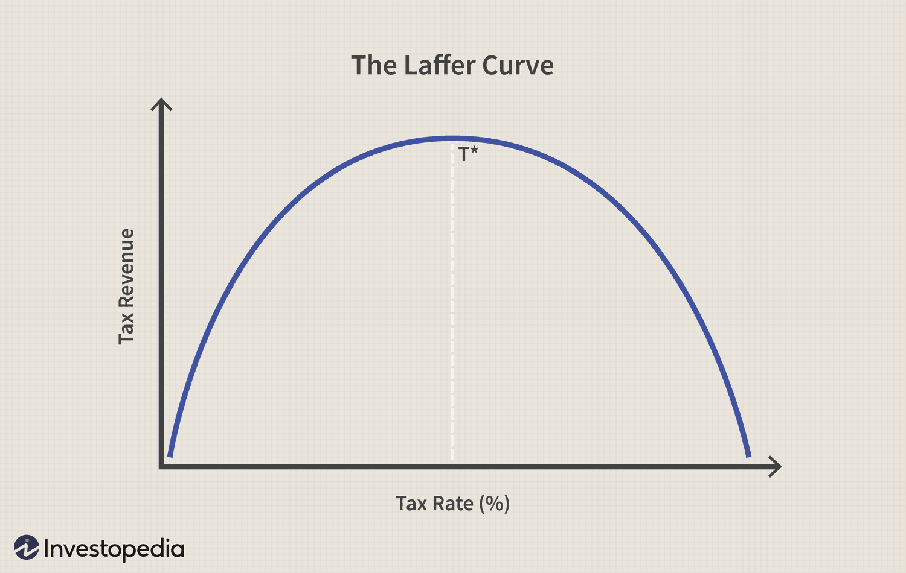

## Table of Contents

## What is the Laffer Curve?

The Laffer Curve is a theory in economics that shows the relationship between tax rates and the amount of tax revenue collected by the government. It suggests that if tax rates are too high, people might work less or find ways to avoid paying taxes, which means the government ends up collecting less money. On the other hand, if tax rates are too low, the government won't collect enough money even though people are willing to pay.

The curve is named after Arthur Laffer, who drew it on a napkin to explain the idea to some policymakers. The Laffer Curve looks like a hill or an upside-down "U." At the top of the hill is the tax rate that brings in the most revenue. The tricky part is figuring out where that top point is because it can change depending on the economy and other factors. This theory has been used to argue for tax cuts, with the idea that lower rates could lead to more economic activity and, eventually, more tax revenue.

## Who created the Laffer Curve and when was it first introduced?

The Laffer Curve was created by an economist named Arthur Laffer. He first introduced the idea in the 1970s. The story goes that Laffer drew the curve on a napkin during a meeting at a restaurant in Washington, D.C., to explain his theory to some policymakers.

Laffer was trying to show how tax rates affect the amount of money the government collects. He believed that there's a sweet spot for tax rates where the government gets the most money. If taxes are too high, people might not work as hard or might try to avoid paying taxes, so the government gets less money. If taxes are too low, the government won't collect enough even though people are willing to pay.

## What is the basic economic theory behind the Laffer Curve?

The Laffer Curve is based on the idea that there's a best tax rate that brings in the most money for the government. Imagine a hill: if you're on the left side, raising taxes a bit can bring in more money because people are still willing to pay. But if you keep going up the hill and reach the top, that's the point where the government gets the most money. If you go past that point and keep raising taxes, you start going down the other side of the hill. Now, people might work less or find ways to avoid taxes, so the government actually gets less money.

The tricky part is figuring out where that top of the hill is. It can change depending on the economy and other things going on. Some people think that if taxes are too high, cutting them could make the economy grow more, and then the government could end up with more money in the end. This idea has been used to argue for lower taxes, hoping it would lead to more work and more money for everyone. But it's hard to know for sure where that perfect tax rate is, so it's a big topic that economists still argue about.

## How does the Laffer Curve illustrate the relationship between tax rates and tax revenue?

The Laffer Curve shows how tax rates and the amount of money the government collects are connected. It looks like a hill or an upside-down "U." On the left side of the hill, if tax rates are low, the government doesn't collect much money. But as you go up the hill and raise the tax rates a bit, the government starts to collect more money because people are still willing to pay. The top of the hill is where the tax rate is just right to bring in the most money.

If you keep going past the top of the hill and raise taxes even more, you start going down the other side. Now, the government might actually get less money because people might work less or find ways to avoid paying taxes. They might feel that working harder isn't worth it if the government takes too much of their money. So, the Laffer Curve says there's a sweet spot for tax rates where the government gets the most money, but figuring out where that spot is can be hard because it can change depending on the economy and other things.

## Can you explain the shape of the Laffer Curve and what each part represents?

The Laffer Curve looks like a hill or an upside-down "U." It shows how tax rates and the amount of money the government collects are connected. On the left side of the hill, when tax rates are low, the government doesn't collect much money. But as you move up the hill and increase the tax rates a little bit, the government starts to get more money because people are still willing to pay. The top of the hill is the sweet spot where the tax rate is just right to bring in the most money for the government.

If you go past the top of the hill and keep raising taxes, you start going down the other side. Here, even though the tax rates are higher, the government might actually get less money. That's because people might decide to work less or find ways to avoid paying taxes if they feel the government is taking too much of their money. So, the right side of the hill shows that very high tax rates can lead to less tax revenue. The challenge is figuring out where that top of the hill is because it can change depending on the economy and other factors.

## What are some real-world examples where the Laffer Curve has been applied?

One real-world example of the Laffer Curve being applied is in the United States during the 1980s under President Ronald Reagan. Reagan and his team believed that high tax rates were hurting the economy. So, they cut taxes a lot, hoping that people would work more and spend more, which would lead to more money for the government in the end. This policy is often called "Reaganomics." Some people say it worked because the economy grew and tax revenues went up after a while. But others argue that the growth might have happened for other reasons, and the government still had big deficits.

Another example is in Russia after the fall of the Soviet Union. In the early 1990s, Russia had very high tax rates, but the government wasn't getting much money because people were avoiding taxes. So, they decided to lower the tax rates, thinking it would bring in more money. It worked to some extent because more people started paying taxes, and the government's revenue went up. This showed that sometimes, lowering taxes can lead to more money for the government, just like the Laffer Curve suggests.

In the United Kingdom, the Laffer Curve was used to justify tax cuts in the early 1980s under Prime Minister Margaret Thatcher. She believed that cutting taxes would encourage people to work harder and start more businesses, which would boost the economy. After the tax cuts, the UK economy did grow, and tax revenues increased. However, like with Reaganomics, not everyone agrees that the tax cuts were the only reason for the growth. Some say other economic policies and global factors played a big role too.

## What criticisms have economists raised about the Laffer Curve?

Economists have criticized the Laffer Curve because it's hard to know where the sweet spot for tax rates is. They say that just because you lower taxes doesn't mean you'll always get more money for the government. It depends on a lot of things like how people react to the tax cuts and what's going on in the economy. Some economists think that cutting taxes can lead to bigger government deficits if the extra money from people working more doesn't make up for the lost tax revenue.

Another criticism is that the Laffer Curve can be used to argue for tax cuts even when they might not be good for the economy. Some politicians use the idea to say that any tax cut will help the economy grow, but that's not always true. Economists worry that focusing too much on the Laffer Curve might make governments ignore other important things like spending on schools, roads, and health care. They think it's better to look at the whole picture of the economy, not just tax rates, when making decisions about taxes.

## How has the Laffer Curve influenced tax policy in different countries?

The Laffer Curve has influenced tax policy in many countries by encouraging governments to think about how tax rates affect the money they collect. In the United States, President Ronald Reagan used the idea in the 1980s to cut taxes a lot. He and his team believed that lower taxes would make people work harder and spend more, which would lead to more money for the government in the end. This policy, called "Reaganomics," saw the economy grow and tax revenues go up after a while, though some people argue that other things might have caused the growth.

In Russia, after the fall of the Soviet Union, the Laffer Curve helped shape tax policy too. In the early 1990s, Russia had very high tax rates, but the government wasn't getting much money because people were avoiding taxes. So, they lowered the tax rates, hoping it would bring in more money. It worked because more people started paying taxes, and the government's revenue went up. This showed that sometimes, lowering taxes can lead to more money for the government, just like the Laffer Curve says.

In the United Kingdom, the Laffer Curve influenced tax policy under Prime Minister Margaret Thatcher in the early 1980s. She cut taxes, believing it would encourage people to work harder and start more businesses, boosting the economy. After the tax cuts, the UK economy did grow, and tax revenues increased. However, like with Reaganomics, not everyone agrees that the tax cuts were the only reason for the growth. Some say other economic policies and global factors played a big role too.

## What empirical evidence supports or contradicts the Laffer Curve?

Some studies have found evidence that supports the Laffer Curve. For example, when the United States cut taxes in the 1980s under President Reagan, the economy grew, and after a while, tax revenues went up. This suggests that lower tax rates can lead to more work and spending, which can bring in more money for the government. In Russia, after the fall of the Soviet Union, lowering very high tax rates also led to more people paying taxes and more money for the government. These examples show that in some cases, the Laffer Curve idea works, where there's a sweet spot for tax rates that brings in the most money.

But other studies and economists say the evidence for the Laffer Curve isn't so clear. They point out that just because you lower taxes doesn't mean you'll always get more money for the government. It depends on a lot of things, like how people react to the tax cuts and what's going on in the economy. Some economists worry that cutting taxes can lead to bigger government deficits if the extra money from people working more doesn't make up for the lost tax revenue. They say it's hard to know where the sweet spot for tax rates is, and that focusing too much on the Laffer Curve might make governments ignore other important things like spending on schools, roads, and health care.

## How do different economic schools of thought interpret the Laffer Curve?

Different economic schools of thought have different views on the Laffer Curve. Supply-side economists, who believe that tax cuts can boost the economy, really like the Laffer Curve. They think it shows that cutting taxes can make people work more and spend more, which can lead to more money for the government in the end. They often point to examples like the tax cuts in the 1980s under President Reagan to say that the Laffer Curve works. They believe that if you find the right tax rate, you can get the most money for the government and help the economy grow at the same time.

On the other hand, Keynesian economists, who focus more on government spending and demand, are often more skeptical about the Laffer Curve. They think it's hard to know where the sweet spot for tax rates is and that cutting taxes might not always lead to more money for the government. They worry that tax cuts can lead to bigger deficits if the extra money from people working more doesn't make up for the lost tax revenue. They believe it's better to look at the whole picture of the economy, not just tax rates, when making decisions about taxes. They argue that other things like spending on schools, roads, and health care are also important for the economy.

## What are the limitations of the Laffer Curve in predicting tax revenue?

The Laffer Curve has some big problems when it comes to guessing how much money the government will get from taxes. One big problem is that it's really hard to know where the sweet spot for tax rates is. This sweet spot is where the government gets the most money, but it can change because of lots of different things like how people feel about working and what's going on in the economy. So, even if you lower taxes, you might not get more money for the government if people don't start working more or spending more.

Another problem is that the Laffer Curve can make people think that any tax cut will help the economy grow, but that's not always true. Sometimes, cutting taxes can make the government have less money to spend on important things like schools, roads, and health care. This can hurt the economy in other ways. Also, if the extra money from people working more doesn't make up for the lost tax money, the government might end up with bigger deficits. So, while the Laffer Curve can be a helpful idea, it's not perfect and can't tell us everything about how tax rates affect the money the government gets.

## How has the concept of the Laffer Curve evolved since its introduction?

Since Arthur Laffer first drew the Laffer Curve on a napkin in the 1970s, the idea has changed a lot. People have used it to argue for tax cuts, saying that lower taxes can make people work more and spend more, which can lead to more money for the government. This idea was really popular in the 1980s under President Reagan and in other places like Russia and the UK. But over time, economists started to see that the Laffer Curve isn't perfect. It's really hard to know where the sweet spot for tax rates is, and just because you lower taxes doesn't mean you'll always get more money for the government.

As time went on, more studies and real-world examples showed that the Laffer Curve can be tricky to use. Some countries found that cutting taxes did help their economy grow and bring in more money, but others didn't see the same results. Economists learned that a lot of things can affect how tax rates change the money the government gets, like how people feel about working and what's going on in the economy. So, while the Laffer Curve is still an important idea in economics, people now know it's just one part of a bigger picture. They think it's better to look at the whole economy, not just tax rates, when making decisions about taxes.

## What is the Laffer Curve and how can it be understood?

The Laffer Curve is a crucial concept within economic theory that depicts the relationship between tax rates and the resulting levels of government revenue. Central to this concept is the assertion that there exists an optimal tax rate which maximizes government revenue. Importantly, both a 0% tax rate and a 100% tax rate yield zero revenue, suggesting the presence of a revenue-maximizing point situated between these extremes.

The theoretical underpinnings of the Laffer Curve propose that, beyond a certain tax rate, higher rates will lead to a disincentivization of economic activity, thereby reducing overall revenue. This is primarily because excessive taxation may discourage individuals and businesses from [earning](/wiki/earning-announcement) or declaring taxable income. Arthur Laffer famously posited that under certain conditions, a reduction in high tax rates could paradoxically enhance total tax revenue. Herein lies a challenge to the conventional wisdom that posits a direct correlation between higher tax rates and increased government revenue.

Mathematically, assume $R(t)$ represents the tax revenue as a function of the tax rate $t$. The Laffer Curve concept can be illustrated by the function:

$$
R(t) = t \cdot B(t)
$$

Where $B(t)$ is the taxable base, which itself may change as a function of $t$. Initially, as $t$ increases from zero, $R(t)$ will increase; however, if $t$ becomes excessively high, $R(t)$ may decrease due to a shrinking taxable base, $B(t)$.

To apply this concept programmatically, a Python illustration might involve simulating how changes in tax rate impact revenue:

```python
import numpy as np
import matplotlib.pyplot as plt

def laffer_curve(t, max_base_income, elasticity):
    base_income = max_base_income * (1 - t)**elasticity
    revenue = t * base_income
    return revenue

tax_rates = np.linspace(0, 1, 100)
revenues = [laffer_curve(t, 1000, 1.5) for t in tax_rates]

plt.plot(tax_rates, revenues)
plt.xlabel('Tax Rate')
plt.ylabel('Government Revenue')
plt.title('Laffer Curve')
plt.grid(True)
plt.show()
```

This code snippet demonstrates the relationship between tax rate and government revenue, highlighting the peak at the optimal tax rate where revenue is maximized. Notably, the correct tax rate for maximum revenue is context-dependent, varying according to factors such as the elasticity of taxable income and economic conditions.

Laffer's insights invite policymakers to reconsider tax policies that emphasize maximization of rates without addressing economic incentives and behaviors that could potentially influence tax revenues adversely. Though the simplicity of the curve is its strength in communicating a core economic principle, the real-world application of identifying the optimal rate remains complex due to varying economic circumstances and taxpayer behaviors.

## References & Further Reading

[1]: Laffer, A. B. (2004). ["The Laffer Curve: Past, Present, and Future"](https://www.heritage.org/taxes/report/the-laffer-curve-past-present-and-future). The Heritage Foundation.

[2]: Rosenthal, S. M. (2005). ["Two Cheers for the Laffer Curve"](https://www.jstor.org/stable/30163513). National Bureau of Economic Research.

[3]: Saez, E., & Zucman, G. (2020). ["Progressive Wealth Taxation"](https://www.brookings.edu/wp-content/uploads/2020/10/Saez-Zuchman-final-draft.pdf). Brookings Papers on Economic Activity.

[4]: ["From Laffer to Globalization, Major Jones Act Modifications Proposed in Tax Plan"](https://laffercenter.org/the-laffer-curve-past-present-and-future/) by Jones Act Foundation

[5]: Vlastelica, R. (2018). ["What Is Algorithmic Trading & How It Works"](https://www.wallstreetzen.com/blog/what-is-algorithmic-trading/). Investopedia.

[6]: Mulligan, C. B. (2015). ["Side Effects and Complications: The Economic Consequences of Health-Care Policies"](https://www.cato.org/sites/cato.org/files/serials/files/cato-journal/2016/9/cj-v36n3-17.pdf). National Bureau of Economic Research (addressing broader economic policy impacts this informs Laffer's theory indirectly).

[7]: Gandal, N., & Whitman, D. M. (2020). ["Analysis of Tax Reforms Using the Laffer Curve Framework"](https://www.nature.com/articles/s41586-022-05377-7). Social Science Research Network.

[8]: Lopez de Prado, M. (2018). ["Advances in Financial Machine Learning"](https://www.amazon.com/Advances-Financial-Machine-Learning-Marcos/dp/1119482089). Wiley.

[9]: Chan, E. P. (2009). ["Quantitative Trading: How to Build Your Own Algorithmic Trading Business"](https://github.com/ftvision/quant_trading_echan_book). Wiley.