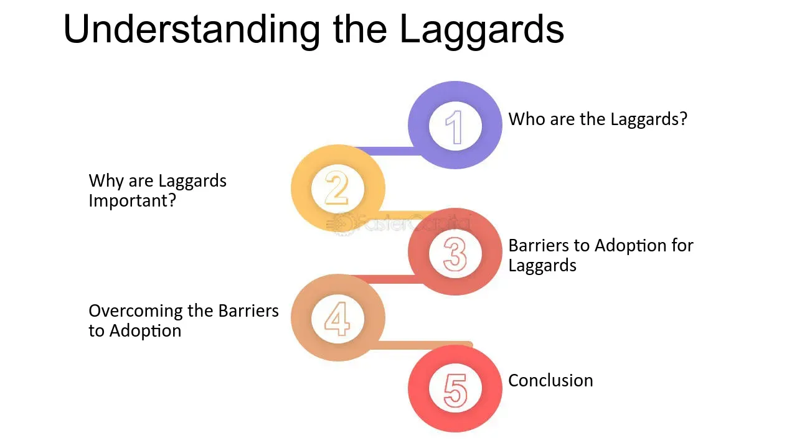

## Table of Contents

## What is the basic definition of a laggard in economic or technological contexts?

A laggard is a term used to describe someone or something that is slow to adopt new technology, ideas, or economic changes. In the world of technology, laggards are the last group of people to start using a new product or service. They often stick to old ways of doing things because they are comfortable with them or because they are hesitant about trying something new.

In economics, laggards can refer to companies or industries that are slow to adapt to new market conditions or trends. These businesses might struggle to keep up with competitors who are quicker to embrace change. Being a laggard can be risky because it might lead to falling behind and losing market share. However, not all laggards are doomed; some may eventually catch up if they find the right strategy or if the change they resisted turns out to be temporary.

## How does the concept of a laggard differ from early adopters and innovators?

The concept of a laggard is the opposite of early adopters and innovators. Early adopters are people who are quick to try new things. They like to be among the first to use a new technology or product. Innovators are even more eager; they not only use new things but also create them. They are the ones who come up with new ideas and inventions. Both early adopters and innovators are important because they help new products and ideas spread quickly.

Laggards, on the other hand, take a long time to try new things. They prefer to stick with what they know and are comfortable with. They might be hesitant because they don't trust new technology or because they don't see the need to change. Laggards often wait until a new product or idea has been around for a long time and is well-proven before they decide to use it. This slow approach can sometimes put them at a disadvantage, especially in fast-changing fields like technology or business.

## What are the common characteristics of laggards?

Laggards often have a strong preference for the familiar. They like to stick with what they know and feel comfortable with, which can make them slow to try new things. This can be because they are cautious by nature or because they don't see the need to change. Laggards may also be older and have less access to information about new technologies or ideas, which can make them even more hesitant.

Another common trait of laggards is that they are often influenced by their social circles. If their friends or family are not using a new product or technology, they are less likely to try it themselves. They also tend to be more traditional and value stability over change. This can sometimes make them resistant to new ideas, even if those ideas could benefit them.

## Can you explain the mechanisms that lead to someone or something being classified as a laggard?

People or companies can become laggards because they like what is familiar and are scared of change. They might not want to try new things because they are happy with how things are now. They might also not have a lot of information about new ideas or technologies. This can make them feel unsure about trying something different. They might also be older or live in places where new things are not common, so they don't see the need to change.

Another reason someone or a company might be a laggard is because of the people around them. If their friends, family, or other businesses they know are not using new things, they might not want to either. They might think that if others are not changing, then they don't need to either. Laggards often value staying the same more than trying new things. This can make them slow to adopt new ideas, even if those ideas could help them in the long run.

## What industries are most affected by the presence of laggards?

The technology industry is one of the most affected by laggards. New gadgets and software come out all the time, and companies that don't keep up can fall behind quickly. For example, if a business sticks with old computers and doesn't update its software, it might not be able to work as well as others that use the latest technology. This can make it hard for them to compete and grow.

Another industry where laggards can have a big impact is healthcare. New treatments and medical technologies can improve patient care, but if doctors or hospitals are slow to use them, patients might not get the best treatment. For instance, if a hospital doesn't use new machines that help with surgery, it might not be able to help patients as well as other hospitals that do use them. This can affect the quality of care and the hospital's reputation.

The retail industry also feels the effects of laggards. With the rise of online shopping, stores that don't have a good website or don't use new ways to sell things can lose customers. If a store doesn't start selling things online or using social media to reach people, it might not be able to keep up with other stores that do. This can lead to fewer sales and even the store closing down.

## How do laggards impact the diffusion of innovations?

Laggards can slow down the spread of new ideas and technologies. Because they take a long time to try new things, it can take longer for new products or ideas to become popular. If a lot of people are laggards, it might take years for a new technology to be used by everyone. This can be frustrating for companies that want to sell new products quickly. They might have to wait a long time before everyone is using their new invention.

On the other hand, laggards can also help make sure that new ideas are really good before they become popular. Because they wait to see if a new technology is useful and safe, they can help stop bad ideas from spreading. If a new product turns out to have problems, laggards might avoid it, which can protect them and others from wasting money or time. So, while laggards can slow things down, they can also make sure that only the best ideas become popular in the end.

## What are the potential risks for businesses that are identified as laggards?

Businesses that are laggards can face big problems. They might lose customers to other companies that are quicker to use new technology or ideas. For example, if a store doesn't start selling things online, people might go to other stores that do. This can mean less money coming in, and the business might struggle to stay open. Laggards can also have a hard time keeping up with new ways of doing things, like using new machines or software. This can make them less efficient and able to do less work than their competitors.

Another risk for laggard businesses is that they might miss out on new opportunities. If a new technology comes out that can help them make more money or do things better, but they don't use it, they could fall behind. This can make it hard for them to grow and stay competitive. Over time, being a laggard can lead to the business getting smaller and smaller, or even closing down if they can't keep up with changes in their industry.

## How can companies identify if they are at risk of becoming laggards?

Companies can tell if they are at risk of becoming laggards by looking at how quickly they adopt new technology or ideas. If they see that other businesses in their industry are using new tools or ways of doing things, but they are not, that's a sign. They might also notice that they are falling behind in sales or that their customers are going to competitors who are more up-to-date. It's important for companies to keep an eye on what's happening around them and to be open to trying new things.

Another way to spot the risk is by looking inside the company. If the people working there are resistant to change or don't have good information about new technologies, that can be a problem. Companies should check if their employees are trained to use new tools and if they have a culture that encourages trying new things. If they find that they are slow to change and stick to old ways, they need to act fast to avoid becoming laggards.

## What strategies can organizations implement to avoid becoming laggards?

Organizations can avoid becoming laggards by staying open to new ideas and technologies. They need to keep an eye on what's happening in their industry and be ready to try new things. This means they should always be learning and looking for ways to do things better. If they see other companies using new tools or ways of doing things, they should think about trying them too. By being curious and willing to change, they can stay ahead and keep up with the competition.

Another important strategy is to make sure everyone in the company is on board with trying new things. This means training employees to use new technology and creating a culture where change is welcomed. If people in the company are scared of change or don't have the right information, it can be hard to move forward. So, it's important to talk to employees, help them understand why change is good, and give them the tools they need to adapt. By working together and supporting each other, the whole company can stay up-to-date and avoid falling behind.

## What are the long-term economic consequences for regions or countries with a high number of laggards?

Regions or countries with a lot of laggards can face big problems over time. If many people and businesses in a place are slow to try new things, the whole area might fall behind. This can mean less money coming into the region because businesses might not be as good at making things or selling services. If other places are using new technology and doing things better, they might take away jobs and money from the region with many laggards. This can make it hard for the region to grow and can lead to people moving away to find better opportunities.

Over time, being full of laggards can also make it hard for a region or country to compete in the world. If they are not using the latest technology or ideas, they might not be able to make things as well or as cheaply as other places. This can hurt their economy because they might not be able to sell as much to other countries. If this keeps happening, the region or country might have a hard time getting better and might stay poor compared to others. To avoid these problems, it's important for everyone in the region to be open to trying new things and to keep learning and improving.

## How do global economic trends influence the emergence of laggards?

Global economic trends can make more laggards appear. When new technology or ways of doing business spread quickly around the world, some places or companies might not be able to keep up. They might not have the money or the knowledge to use these new things. If a new way of making things becomes popular and cheaper in other countries, businesses that don't use it might find it hard to compete. This can lead to them becoming laggards because they are left behind while others move forward.

These trends can also make it harder for some regions to grow. If a lot of new ideas and technologies are coming from other parts of the world, places that are slow to try them might miss out on new jobs and money. For example, if a new type of factory is becoming common in one country but not in another, the country without the new factories might not be able to make things as well or as cheaply. Over time, this can make the gap between different places bigger, with some areas falling further behind and becoming more like laggards.

## What advanced metrics or models are used to predict and analyze the behavior of laggards in complex systems?

To predict and understand how laggards behave in complex systems, experts use different kinds of math models and measurements. One common way is to use something called diffusion models. These models help show how new ideas or technologies spread through a group of people or businesses. They can tell us how fast or slow laggards are compared to others. Another tool is network analysis, which looks at how people or companies are connected. This can help us see why some are slow to change, maybe because they don't have as many connections to others who are using new things.

Another important metric is the technology adoption lifecycle, which splits people into groups based on when they start using new things. Laggards are at the end of this cycle. By looking at data from this lifecycle, experts can predict how long it might take for everyone to use a new product or idea. They also use something called the Bass Diffusion Model, which is a math formula that helps predict how many people will adopt a new technology over time. This can show how laggards might slow down the spread of new things and help companies plan better.

## References & Further Reading

[1]: Bergstra, J., Bardenet, R., Bengio, Y., & Kégl, B. (2011). ["Algorithms for Hyper-Parameter Optimization."](https://dl.acm.org/doi/10.5555/2986459.2986743) Advances in Neural Information Processing Systems 24.

[2]: ["Advances in Financial Machine Learning"](https://www.amazon.com/Advances-Financial-Machine-Learning-Marcos/dp/1119482089) by Marcos Lopez de Prado

[3]: ["Evidence-Based Technical Analysis: Applying the Scientific Method and Statistical Inference to Trading Signals"](https://www.amazon.com/Evidence-Based-Technical-Analysis-Scientific-Statistical/dp/0470008741) by David Aronson

[4]: ["Machine Learning for Algorithmic Trading"](https://github.com/stefan-jansen/machine-learning-for-trading) by Stefan Jansen

[5]: ["Quantitative Trading: How to Build Your Own Algorithmic Trading Business"](https://www.amazon.com/Quantitative-Trading-Build-Algorithmic-Business/dp/1119800064) by Ernest P. Chan