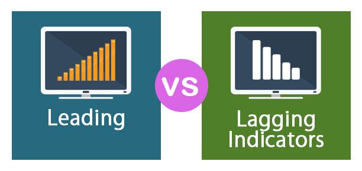

In the rapidly evolving world of business and finance, understanding the nuances of various indicators is crucial. Indicators serve as vital tools for interpreting the vast amount of information that flows through the economic landscape. This article explores the concept of lagging indicators, business metrics, and economic indicators, along with their impact on algorithmic trading. Each of these elements plays a pivotal role in analyzing past performance, assessing current conditions, and predicting future trends. By examining their interconnections, we aim to provide a comprehensive overview that highlights their significance in decision-making processes.

Whether you're a seasoned investor or a curious newcomer, this guide will enhance your understanding of these essential tools. We aim to equip readers with the knowledge of how to interpret and apply these indicators effectively in their financial strategies. As the global economy becomes increasingly complex, having a firm grasp of these indicators will empower individuals and organizations to make informed and strategic decisions. Join us as we explore the sophisticated network of indicators that drive economic and trading decisions, helping to transform raw data into actionable insights.



## Table of Contents

## Understanding Lagging Indicators

Lagging indicators serve as retrospective metrics that encapsulate the results of prior economic activities or business decisions. These indicators are integral to confirming persistent trends and understanding the trajectory of an economy or industry, despite their inability to forecast future conditions. 

A classic example of lagging indicators is the Gross Domestic Product (GDP). GDP reflects the total value of goods and services produced over a specific period and is often analyzed on a quarterly basis. It provides insight into economic health by confirming growth patterns established over time. For instance, an upward trend in GDP could substantiate the presence of a burgeoning economy. 

Another critical lagging indicator is the unemployment rate, which tracks the percentage of the labor force that is jobless and actively seeking employment. This metric offers a window into the labor market's historical performance and aids in assessing economic stability. A decrease in unemployment rates generally signals that economic conditions have improved over previous periods.

Corporate earnings, which denote a company’s profit after all expenses have been deducted from revenues, are also categorized as lagging indicators. They are vital for investors as they confirm the financial success and viability of businesses, providing data that analysts use to trace profitability trends.

While these indicators do not provide predictive insight, they are invaluable for validating the robustness and direction of existing economic and business trends. Analysts and business decision-makers leverage lagging indicators to gain a comprehensive understanding of past performance, informing strategic plans and resource management. 

In business analysis, lagging indicators give substantive evidence for past strategies and initiatives, allowing firms to align future goals with historically successful practices. Consequently, maintaining a robust comprehension of these metrics is essential for economists, policymakers, and business leaders seeking to adapt to economic movements with informed precision.

## Business Metrics: Gauging Organizational Performance

Business metrics are essential quantitative measures that organizations use to assess and track performance across various domains. These metrics can be broadly categorized into financial and non-financial metrics, each serving distinct roles within an organization's analytical framework.

Financial metrics are traditional indicators of an organization's economic health and performance. Key financial metrics include revenue, profit margins, and return on investment (ROI). Revenue indicates the total income generated from sales before any expenses are deducted, providing an overview of the organization's market reach and consumer demand. Profit margins, often expressed as a percentage, measure the efficiency with which a company converts its revenue into actual profit. ROI, calculated as $(\text{Net Profit} / \text{Initial Investment}) \times 100$, evaluates the efficiency of an investment or compares the efficiency of several different investments.

In contrast, non-financial metrics encompass a broader scope of organizational activities and stakeholder satisfaction, focusing on qualitative aspects that influence long-term success. Notable non-financial metrics include customer satisfaction and employee engagement. Customer satisfaction surveys can be quantified using metrics like Net Promoter Score (NPS), which asks consumers how likely they are to recommend the company’s products or services. Employee engagement metrics assess the level of commitment and involvement employees have towards their organization, often linked to higher productivity and reduced turnover rates.

These metrics collectively function as a comprehensive scorecard for business leaders. By analyzing these metrics, leaders can make informed strategic decisions that guide resource allocation and operational adjustments. For instance, a decline in profit margin or customer satisfaction can trigger a strategic pivot or an operational review to address underlying issues.

Integration of these metrics into business strategies and operations ensures that organizations can stay agile and responsive to both market conditions and internal dynamics. This often involves setting target metrics that align with organizational goals and regularly monitoring these targets through performance dashboards or balanced scorecards. These tools allow for the visualization of data, making it easier to identify trends, set benchmarks, and track progress over time.

Effectively utilizing business metrics requires not only collecting accurate data but also establishing a culture of data-driven decision-making. As organizations increasingly employ technology and analytics, the ability to harness and interpret these metrics becomes a critical driver of success. By continuously refining their strategies based on robust metrics, organizations can enhance their competitive edge and ensure sustainable growth.

## Economic Indicators: A Broader Perspective

Economic indicators are essential tools that provide comprehensive insights into the economic environment, assisting analysts and policymakers in making informed decisions. These indicators are predominantly divided into three categories: leading, lagging, and coincident indicators, each offering distinct perspectives and utilities in economic forecasting and analysis.

Leading indicators are predictive in nature, providing foresight into future economic activities. They include measures such as the stock market indexes, new business orders, and consumer sentiment indexes. Their primary utility lies in their ability to indicate imminent economic shifts before they occur, thus offering businesses and policymakers valuable time to prepare and adjust strategies accordingly.

Lagging indicators, in contrast, reflect the outcomes of past economic events. Common examples include unemployment rates and Gross Domestic Product (GDP). They are crucial in confirming the long-term trends and the overall health of an economic environment, offering a retrospective view that reassures the solidity of observed changes or trends.

Coincident indicators operate in tandem with the current state of the economy, showing the real-time economic conditions. Indicators such as employment levels and personal income provide insights that align with the present economic activity, allowing immediate assessment of economic performance.

Prominent economic indicators like the Consumer Price Index (CPI), Producer Price Index (PPI), and the Employment Cost Index are vital for gauging economic health. The CPI measures changes in the price level of a market basket of consumer goods and services purchased by households, reflecting inflation levels. The PPI measures the average change over time in selling prices received by domestic producers for their output, serving as an inflation gauge at the wholesale level. The Employment Cost Index measures the growth of employment costs, including wages and salaries, offering insights into inflation pressures from labor markets.

The influence of these economic indicators extends to shaping economic policy and business planning. For instance, central banks closely monitor inflation indicators such as the CPI and PPI to make decisions regarding monetary policy, particularly interest rates. Elevated CPI levels might prompt rate hikes to curb inflation, affecting borrowing costs and economic growth.

Business planning also heavily relies on these indicators. Companies use indicators to forecast consumer demand, adjust pricing strategies, and assess risk. For example, a rising PPI may signal the need for businesses to anticipate increased production costs, thereby affecting pricing and purchasing strategies.

Overall, understanding the intricate roles of leading, lagging, and coincident indicators allows businesses and policymakers to navigate the complexities of economic environments effectively. They serve as a foundation for proactive planning, strategic policy formulation, and timely decision-making, reinforcing their indispensability in comprehensive economic analysis.

## The Intersection of Indicators and Algorithmic Trading

Algorithmic trading employs sophisticated computer algorithms to execute trades based on predefined criteria. These algorithms rely heavily on various types of indicators to inform decision-making processes. Indicators serve as vital tools in both constructing and refining these algorithms, acting as the backbone for trade predictions and validation.

In [algorithmic trading](/wiki/algorithmic-trading), different kinds of indicators [carry](/wiki/carry-trading) distinct roles. Leading indicators, such as the yield curve or stock [momentum](/wiki/momentum) oscillators, are designed to signal future market movements. For example, a positive crossing in moving averages might predict an upcoming upward trend. Implementing these leading indicators in trading algorithms allows traders to anticipate and act on potential market changes swiftly.

On the other hand, lagging indicators are not designed to predict future movements; rather, they are utilized to confirm trends and validate predictions made by leading indicators. Common lagging indicators include metrics such as moving averages, [volume](/wiki/volume-trading-strategy) metrics, and the Relative Strength Index (RSI). For instance, a prolonged increase in the market index observed through lagging indicators like the simple moving average (SMA) can confirm the validity of trends predicted by leading indicators.

Effectively integrating both leading and lagging indicators enhances the accuracy and reliability of algorithmic trading strategies. By programming algorithms that simultaneously leverage the predictive nature of leading indicators and the confirmatory power of lagging indicators, traders can form robust strategies that are both proactive and reactive.

Consider a basic example of an algorithmic trading strategy using Python:

```python
import pandas as pd
import numpy as np

# Load historical price data
data = pd.read_csv('price_data.csv')
data['SMA'] = data['Close'].rolling(window=50).mean()
data['RSI'] = compute_RSI(data['Close'])

# Define trading signals
def generate_signals(df):
    signals = pd.DataFrame(index=df.index)
    signals['signal'] = 0.0

    # Signal 1: Leading Indicator (Crossing Moving Averages)
    signals.loc[df['Close'] > df['SMA'], 'signal'] = 1.0

    # Signal 2: Lagging Indicator confirmation (RSI)
    signals['signal'] = np.where((df['RSI'] > 70), 0.0, signals['signal'])

    signals['positions'] = signals['signal'].diff()
    return signals

signals = generate_signals(data)
```

In this illustrative algorithm, a simplistic trading signal is generated based on the crossing of the stock's closing price above a 50-day simple moving average (a leading indicator), and further validated by conditions set using the RSI (a lagging indicator). The RSI is used to ensure that the market is not overbought, adding an additional layer of validation to the initial buy signal.

By understanding the intricate relationship between different types of indicators, traders can optimize their strategies to balance risk and maximize returns. A crucial aspect is not merely using these signals but understanding their interplay to form robust, data-driven strategies that adapt to changing market conditions.

## Practical Applications and Case Studies

Practical applications of business metrics and economic indicators are crucial in both corporate strategy and trading scenarios. By using these indicators, organizations can improve decision-making processes, enhance performance, and gain a competitive edge. This section presents notable methodologies and real-world case studies showcasing the effective use of indicators in business and trading.

One exemplary case involves a leading retail corporation, Walmart. The company utilizes economic indicators such as the Consumer Price Index (CPI) and Producer Price Index (PPI) to adjust pricing and inventory strategies effectively. By analyzing these indicators, Walmart can forecast cost variations and consumer buying power, enabling them to optimize inventory levels and pricing strategies. This approach has been critical in maintaining their market leadership position.

Another instance can be observed with the investment firm, Renaissance Technologies, known for employing algorithmic trading strategies. The firm leverages a mixture of leading and lagging economic indicators to refine its trading algorithms. Using historical data on indicators such as GDP growth, unemployment rates, and interest rates, the algorithms are programmed to identify profitable trading opportunities. By validating predictions with lagging indicators, the firm ensures robust trading strategies that have consistently yielded high returns.

Furthermore, within the sphere of algorithmic trading, the use of moving averages as lagging indicators is a widely adopted practice. For example, traders often use the Simple Moving Average (SMA) to smooth out price data and better understand market trends. A common strategy is the moving average crossover, where a short-term SMA crossing above a long-term SMA signals a potential buy opportunity. This technique allows traders to confirm market trends and make informed entry or [exit](/wiki/exit-strategy) decisions.

```python
# Example Python code for calculating simple moving averages
def simple_moving_average(prices, window):
    return [sum(prices[i:i+window])/window for i in range(len(prices)-window+1)]

prices = [120, 122, 121, 123, 125, 126, 127, 129, 130, 128, 127]
short_term_sma = simple_moving_average(prices, 5)
long_term_sma = simple_moving_average(prices, 7)

print("Short-term SMA:", short_term_sma)
print("Long-term SMA:", long_term_sma)
```

In addition, case studies from companies like Google illustrate how business metrics such as Return on Investment (ROI) and customer satisfaction metrics are essential in strategic decisions. Google integrates these metrics into its product development process to ensure alignment with business objectives and consumer needs, ultimately driving successful product launches and sustaining its innovation leadership.

These examples highlight the practical applications and significant benefits that can be garnered from adept usage of business metrics and economic indicators. Mastery of these concepts enables organizations to enhance their decision-making capabilities and fortify their strategic frameworks, proving indispensable in the contemporary economic landscape.

## Conclusion

The landscape of business metrics, economic indicators, and algorithmic trading is indeed intricate yet rewarding for those who invest the time to understand it. These components each have a unique role and impact on financial analysis and decision-making.

Understanding business metrics allows organizations to track and improve their performance. Metrics such as revenue, profit margins, and return on investment (ROI) provide a quantifiable means of assessing a company's health and strategic effectiveness. By harnessing these metrics, business leaders are better equipped to make informed decisions and allocate resources efficiently.

Economic indicators further extend this understanding by offering insights into broader economic trends. These indicators, categorized into leading, lagging, and coincident types, help contextualize a company's performance within the larger economic framework. Lagging indicators, such as GDP and unemployment rates, are particularly valuable, providing a reliable retrospective analysis of economic health. Although they are not predictive, their role is crucial in confirming trends and validating strategic decisions.

Integrating insights from lagging indicators into algorithmic trading systems can significantly enhance a trader's performance and predictability. Algorithmic trading, which uses computer algorithms to execute trades, benefits from incorporating various indicators to refine its strategies. While leading indicators may anticipate market shifts, lagging indicators serve as a crucial check, verifying the accuracy of these anticipations and helping optimize trading decisions.

By embracing the dynamic interplay of business metrics, economic indicators, and algorithmic trading, businesses and traders can maximize their strategic success. The synergy between these elements enables a more comprehensive understanding of the financial landscape, facilitating more informed and effective decision-making. To achieve excellence in financial endeavors, it is essential to master the integration of these components, ultimately driving strategic success and sustainability.

## References & Further Reading

[1]: ["Knowing Your Economic Lag Indicators: Unemployment Rate, Consumer Price Index, and Corporate Earnings"](https://www.investopedia.com/ask/answers/what-are-leading-lagging-and-coincident-indicators/) Investopedia Article

[2]: ["Technical Analysis Explained: The Successful Investor's Guide to Spotting Investment Trends and Turning Points"](https://www.amazon.com/Technical-Analysis-Explained-Fifth-Successful/dp/0071825177) by Martin J. Pring

[3]: Ariyo, A. A., Adewumi, A. O., & Ayo, C. K. (2014). ["Stock Price Prediction Using the ARIMA Model."](https://ieeexplore.ieee.org/document/7046047) Proceedings of the 2014 UKSim-AMSS 16th International Conference on Computer Modelling and Simulation

[4]: ["Trading and Exchanges: Market Microstructure for Practitioners"](https://www.amazon.com/Trading-Exchanges-Market-Microstructure-Practitioners/dp/0195144708) by Larry Harris

[5]: Narang, R. K. (2009). ["Inside the Black Box: The Simple Truth About Quantitative Trading"](https://onlinelibrary.wiley.com/doi/book/10.1002/9781118267738)