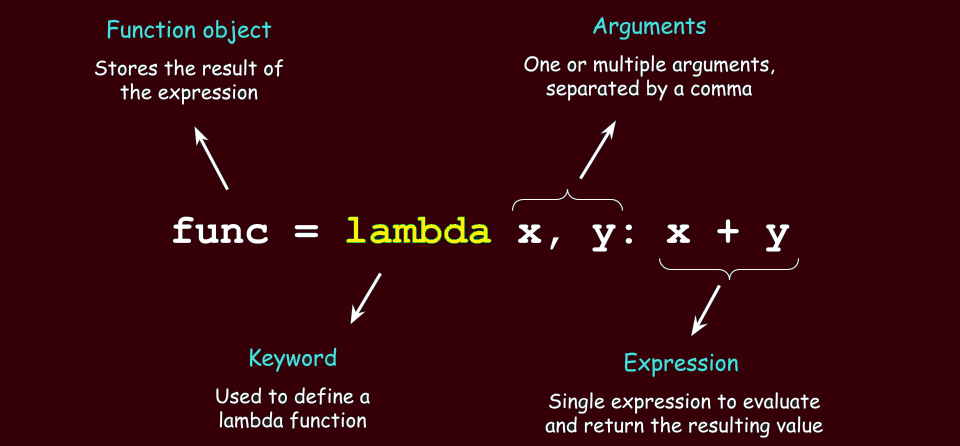

## Table of Contents

## What is a lambda function?

A lambda function is a small, anonymous function that you can define in one line of code. It's called "anonymous" because it doesn't need a name like regular functions do. You can use lambda functions when you need a simple function for a short period of time, often as part of a larger expression or operation.

For example, if you want to double a number, you can create a lambda function like this: `lambda x: x * 2`. Here, `x` is the input, and `x * 2` is what the function does with that input. You can then use this function immediately without giving it a name. Lambda functions are handy in programming because they make your code more concise and easier to read when you need a quick, simple function.

## How does a lambda function differ from a regular function?

A lambda function is different from a regular function in a few key ways. First, a lambda function is anonymous, meaning it doesn't have a name. You don't need to declare it with a special keyword like "def" in Python; instead, you write it in one line using the "lambda" keyword. This makes lambda functions great for quick, simple tasks where you don't need to reuse the function later. On the other hand, regular functions have names and are defined using keywords like "def" in Python. They can be more complex, with multiple lines of code, and you can call them by their name whenever you need them.

Another difference is that lambda functions are limited in what they can do. They can only contain a single expression, not multiple statements or complex logic. This means they're perfect for simple operations like adding numbers or sorting lists, but not for more complicated tasks. Regular functions, however, can have multiple lines of code, include conditional statements, loops, and other complex logic. This makes them more versatile and suitable for tasks that require more detailed programming.

## Can you provide a simple example of a lambda function in Python?

Let's say you want to double a number. You can use a lambda function to do this. The lambda function would look like this: `lambda x: x * 2`. Here, `x` is the number you want to double, and `x * 2` is the operation that doubles it. You can use this lambda function right away without giving it a name.

For example, if you want to double the number 5, you can do this: `(lambda x: x * 2)(5)`. This will give you the result 10. It's a quick and simple way to do a small task without needing to create a whole function with a name.

## What are the key components of a lambda function?

A lambda function has three main parts: the keyword "lambda," the input or inputs, and the expression. The keyword "lambda" tells Python that you're making a lambda function. After "lambda," you write the input or inputs, which are like the placeholders for the values you'll use in the function. For example, if you want to double a number, you'd use "x" as the input.

The last part of a lambda function is the expression, which is what the function does with the input. This is where you write the operation or calculation. In our example of doubling a number, the expression would be "x * 2." The lambda function combines these parts into one line, like "lambda x: x * 2," to create a simple, anonymous function that you can use right away.

## In which programming languages are lambda functions commonly used?

Lambda functions are commonly used in many programming languages, but they are especially popular in Python, JavaScript, and functional programming languages like Haskell and Lisp. In Python, lambda functions are used for small, quick tasks like sorting lists or transforming data. They are also used in JavaScript, where they are called "arrow functions," to make code more concise and easier to read.

In functional programming languages like Haskell and Lisp, lambda functions are even more important. They are used to create small, reusable pieces of code that can be combined to solve bigger problems. These languages often rely on the concept of "functions as first-class citizens," meaning functions can be passed around like any other value, and lambda functions fit perfectly into this model.

## What are the advantages of using lambda functions?

Lambda functions are great because they are quick and easy to write. You don't need to come up with a name for them or use a lot of code. This makes your program shorter and easier to read. For example, if you need to sort a list of numbers, you can use a lambda function to tell the computer how to sort them without writing a whole new function.

Another advantage is that lambda functions are good for doing simple tasks. They can be used right away and then forgotten, which is perfect for small jobs. In languages like Python and JavaScript, they help make your code cleaner and more efficient. This is especially useful when you're working on a big project and want to keep things simple and organized.

## Are there any limitations or disadvantages to using lambda functions?

Lambda functions are great for simple tasks, but they have some limits. They can only do one thing at a time because they can only have one expression. This means you can't use them for bigger jobs that need more steps or different parts. Also, because lambda functions don't have names, it can be hard to understand what they do if you see them in a big piece of code. It's like trying to guess what a mystery tool does without a label.

Another problem with lambda functions is that they can make your code hard to read if you use too many of them. When you have a lot of lambda functions mixed in with other code, it can be confusing. It's like having a bunch of tiny, unlabeled tools scattered around a messy toolbox. It's better to use regular functions for tasks that are more complicated or need to be used again later. That way, your code stays clear and easy to follow.

## How can lambda functions be used in functional programming?

In functional programming, lambda functions are really important because they help you make small, quick pieces of code that you can use right away. They are like little helpers that do one job at a time. For example, if you want to add two numbers together, you can use a lambda function to do that without needing to write a whole new function. This makes your code shorter and easier to understand. In languages like Haskell and Lisp, lambda functions are used a lot because these languages focus on using functions to solve problems.

Another way lambda functions are used in functional programming is by passing them around like regular values. This is called "higher-order functions," where you can give a function to another function as an input. For example, if you want to sort a list of numbers, you can use a lambda function to tell the sorting function how to compare the numbers. This makes your code more flexible and powerful because you can change how things work without changing the main part of your program. It's like having a toolbox where you can swap out tools to do different jobs.

## Can you explain how lambda functions are used in higher-order functions?

In programming, higher-order functions are functions that can take other functions as inputs or return functions as outputs. Lambda functions are perfect for this because they are small and quick to write. For example, if you want to sort a list of numbers, you can use a higher-order function like `sorted()` in Python. You can pass a lambda function to `sorted()` to tell it how to compare the numbers. This makes your code more flexible because you can change how the sorting works without changing the `sorted()` function itself.

Another way lambda functions are used with higher-order functions is when you want to apply a simple operation to every item in a list. In Python, you can use the `map()` function, which takes a function and a list as inputs. You can use a lambda function with `map()` to do things like doubling every number in a list. This is useful because you don't need to write a whole new function just to do something simple. It keeps your code short and easy to read.

## What are some practical applications of lambda functions in data processing?

Lambda functions are really handy in data processing, especially when you want to do quick, simple tasks on a bunch of data. For example, if you have a list of numbers and you want to double each number, you can use a lambda function with a function like `map()` in Python. The lambda function would be something like `lambda x: x * 2`, and `map()` would apply this to every number in your list. This makes your code shorter and easier to read because you don't need to write a whole new function just to double numbers.

Another practical use of lambda functions in data processing is when you want to sort or filter data. If you have a list of people's names and ages, and you want to sort them by age, you can use a lambda function with the `sorted()` function in Python. The lambda function would be `lambda person: person['age']`, and `sorted()` would use this to put the list in order. Lambda functions are also great for filtering data. For example, if you want to keep only the people who are over 18, you can use a lambda function with the `filter()` function. This makes it easy to work with data without writing a lot of extra code.

## How do lambda functions contribute to code readability and maintainability?

Lambda functions help make code easier to read and maintain by keeping things simple and short. When you need to do a small job, like doubling a number or sorting a list, you can use a lambda function instead of writing a whole new function. This means your code doesn't get cluttered with lots of extra functions that you only use once. It's like using a small, handy tool instead of a big, complicated one when you just need to do a quick job.

However, if you use too many lambda functions, they can actually make your code harder to read. Because lambda functions don't have names, it can be tough to figure out what they do if you see them in a big piece of code. It's like trying to guess what a bunch of tiny, unlabeled tools do. So, it's important to use lambda functions for simple tasks and use regular functions for more complex jobs that need names and more detailed explanations. This way, your code stays clear and easy to understand.

## What advanced techniques can be employed with lambda functions in specific programming scenarios?

In some programming situations, you can use lambda functions in more advanced ways to make your code even better. For example, in Python, you can use lambda functions with the `reduce()` function from the `functools` module to do more complicated operations on a list. Imagine you have a list of numbers and you want to find the product of all the numbers. You can use a lambda function with `reduce()` to multiply them all together without writing a whole new function. This can be really helpful when you need to do something a bit more complex but still want to keep your code short and simple.

Another advanced way to use lambda functions is in event-driven programming, like in JavaScript. In this type of programming, things happen when certain events occur, like when a user clicks a button. You can use lambda functions, or arrow functions in JavaScript, to handle these events quickly and easily. For example, if you want to show a message when a button is clicked, you can use a lambda function to do that without writing a separate function. This makes your code more responsive and easier to manage, especially when you have a lot of different events to handle.

## References & Further Reading

1. **Algorithmic Trading: Concepts and Techniques**  
   *By Ernest P. Chan*  
   This book provides a comprehensive overview of [algorithmic trading](/wiki/algorithmic-trading), detailing various strategies and their implementation using programming languages like Python. Chan's insights into market dynamics and [quantitative trading](/wiki/quantitative-trading) strategies are essential for those interested in the field.

2. **AWS Lambda Documentation**  
   [AWS Lambda Developer Guide](https://docs.aws.amazon.com/lambda/latest/dg/welcome.html)  
   This official documentation from Amazon provides a thorough guide to understanding and using AWS Lambda, including its architecture, deployment procedures, and integration with other AWS services crucial for implementing algorithmic trading solutions.

3. **Hands-On Machine Learning for Algorithmic Trading**  
   *By Stefan Jansen*  
   This practical guide introduces [machine learning](/wiki/machine-learning) techniques to algorithmic trading, illustrating how to build models and execute strategies efficiently. The focus on Python makes it particularly relevant for Lambda function integration.

4. **Building Scalable Trading Systems**  
   *By Tom Stark*  
   Stark's book investigates into constructing robust trading systems capable of handling significant data loads, including how serverless functions like AWS Lambda can play a role in achieving scalability and resilience.

5. **Introduction to AWS Lambda for Algorithmic Trading**  
   [Medium Article by Jane Doe](https://medium.com/algorithmic-trading)  
   This article explains the basics of utilizing AWS Lambda within the context of algorithmic trading, offering step-by-step instructions and examples that highlight its application in real-time data processing and automated trading tasks.

6. **Towards Data Science: Serverless Architecture**  
   [Articles on Serverless Technology](https://towardsdatascience.com/serverless-technology)  
   This collection of articles provides insights into serverless computing, emphasizing how technologies like Lambda can enhance computational efficiency and cost-effectiveness in financial applications.

7. **Python for Finance: Analyzing Big Financial Data**  
   *By Yves Hilpisch*  
   Hilpisch explores the use of Python in finance with applications that include data analysis, visualization, and trading strategy development. The text is a valuable resource for understanding how Python scripts can be adapted as Lambda functions for algorithmic trading.

8. **Google Scholar: Lambda Functions in Trading Research**  
   [Research Papers and Articles](https://scholar.google.com/scholar?q=Lambda+Functions+in+Algorithmic+Trading)  
   A repository of academic papers reviewing the applications and effectiveness of Lambda functions in trading algorithms, providing cutting-edge research findings and experimental insights for traders and developers.

These resources offer a foundational understanding as well as advanced insights into the workings of algorithmic trading and the implementation of Lambda functions, equipping readers with knowledge to explore these technologies further.

