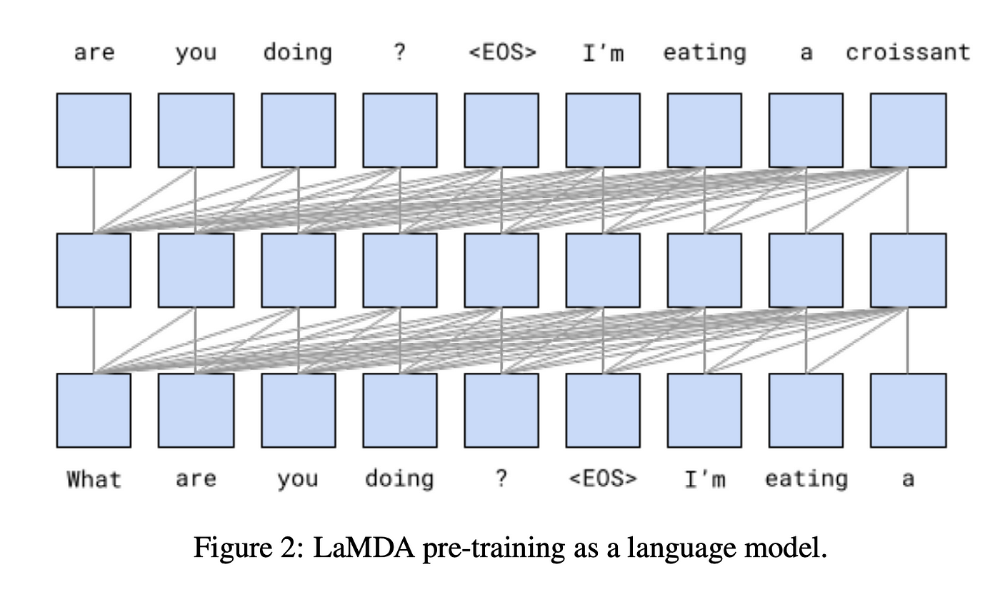

## Table of Contents

## What is Lamda and what does it stand for?

Lamda is a term that can refer to different things depending on the context. In the field of artificial intelligence, Lamda is a language model developed by Google. It stands for "Language Model for Dialogue Applications." This model is designed to understand and generate human-like text, making it useful for creating conversational agents or chatbots. Lamda aims to improve the way machines interact with humans by providing more natural and engaging conversations.

In mathematics and physics, "lambda" (often written as $$\lambda$$) is a commonly used symbol. It represents various concepts, such as wavelengths in optics, eigenvalues in linear algebra, and decay rates in nuclear physics. The use of lambda as a symbol is widespread and its meaning can change based on the specific field of study. For example, in computer science, lambda is used in lambda calculus, a system for expressing functions and computations, which has influenced the design of many programming languages.

## How does Lamda differ from other language models?

Lamda, or Language Model for Dialogue Applications, is different from other language models because it focuses on creating more natural and engaging conversations. While many language models are good at understanding and generating text, Lamda is specifically designed to be used in dialogue situations. This means it tries to understand the context of a conversation and respond in a way that feels more human-like. For example, if you ask Lamda a question, it will try to give a thoughtful answer that keeps the conversation going, rather than just providing a short, factual response.

Another way Lamda differs is in how it was trained. Google used a lot of dialogue data to teach Lamda how to talk like a person. This is different from other models that might be trained on a wider variety of text, like books or articles. By focusing on dialogue, Lamda can better understand the back-and-forth nature of a conversation. This makes it more useful for applications like chatbots or virtual assistants, where having a natural conversation is important.

## What are the main applications of Lamda in dialogue systems?

Lamda, or Language Model for Dialogue Applications, is mainly used in making chatbots and virtual assistants better at talking to people. It helps these systems understand what people are saying and respond in a way that feels more like a real conversation. For example, if you're talking to a customer service chatbot, Lamda can help it understand your problem and give you helpful answers that keep the conversation going smoothly.

Another important use of Lamda is in making voice assistants like Google Assistant or Amazon's Alexa more natural and engaging. These assistants use Lamda to understand spoken commands and reply in a friendly, human-like way. This makes it easier for people to use these devices for everyday tasks, like setting reminders or asking for information, because the conversation feels more natural and less like talking to a machine.

## Can you explain the basic architecture of Lamda?

Lamda's basic architecture is built around a transformer model, which is a type of [neural network](/wiki/neural-network) that is really good at understanding and generating text. The transformer model uses something called attention mechanisms to focus on different parts of the input text. This helps Lamda understand the context of what someone is saying and come up with a good response. For example, if you say, "I like to eat pizza," Lamda can pay attention to "pizza" and know that you're talking about food.

The other important part of Lamda's architecture is how it was trained. Lamda was trained on a lot of dialogue data, which means it learned from conversations that people had. This helps Lamda understand how to keep a conversation going and respond in a way that feels natural. By using this special training data, Lamda can better understand the back-and-forth nature of talking to someone, making it more useful for things like chatbots and voice assistants.

## What kind of data is used to train Lamda?

Lamda is trained using a lot of dialogue data. This means it learns from conversations that people have had. By using this kind of data, Lamda can understand how people talk to each other and respond in a way that feels natural. For example, if you're talking to a friend about your day, Lamda can learn from similar conversations and know how to keep the chat going.

The data used to train Lamda includes many different kinds of conversations. These can be from customer service chats, social media interactions, or even scripted dialogues from movies and TV shows. By looking at all these different types of conversations, Lamda gets a good idea of how to talk like a person and respond in a helpful way.

## How does Lamda handle context in conversations?

Lamda handles context in conversations by using something called attention mechanisms in its transformer model. This means it can focus on different parts of what you say and understand how they relate to each other. For example, if you say, "I had a pizza last night, and it was delicious," Lamda pays attention to "pizza" and "delicious" to understand that you liked the pizza. This helps Lamda give you a good response that fits with what you're talking about.

Lamda also uses the dialogue data it was trained on to understand how conversations flow. This means it knows how to keep a conversation going by remembering what was said before. If you start talking about a different topic, like your plans for the weekend, Lamda can switch focus and respond to that new topic while still remembering the old one. This makes the conversation feel more natural and helps Lamda give helpful answers that fit the context.

## What are the challenges faced when implementing Lamda in real-world scenarios?

One of the main challenges when using Lamda in real life is making sure it understands and responds correctly to what people say. Even though Lamda is good at understanding context and keeping a conversation going, it can still make mistakes. For example, if someone uses slang or talks about something very specific, Lamda might not understand it well. This can make the conversation feel less natural and make people less likely to keep using it.

Another challenge is keeping Lamda's responses safe and appropriate. Because Lamda was trained on a lot of different conversations, it might sometimes say things that are not okay or that could upset people. This is a big problem, especially for things like customer service chatbots where it's important to be polite and helpful. Companies need to spend a lot of time and effort to make sure Lamda's responses are always good and safe for everyone.

## How does Lamda improve over time with new data?

Lamda gets better over time by learning from new conversations. When people talk to Lamda, it can use that information to understand how people talk and what they want to know. This new data helps Lamda give better answers and keep conversations going more smoothly. For example, if Lamda sees a lot of people asking about the weather, it can learn to give more detailed and helpful weather updates.

To make sure Lamda keeps improving, the people who made it can add new data to its training. This means they can teach Lamda about new topics or ways of talking that it didn't know before. By doing this, Lamda can stay up-to-date and be more helpful to more people. This is important because language and what people talk about can change over time, and Lamda needs to keep up with those changes.

## What metrics are used to evaluate the performance of Lamda?

To see how well Lamda is doing, people use different ways to measure its performance. One common way is to look at how well Lamda can keep a conversation going. This is called "engagement." If Lamda can keep people talking and interested, it's doing a good job. Another way is to check if Lamda's answers are right and helpful. This is called "accuracy." If Lamda gives the right information most of the time, it's doing well.

Another important measure is how natural Lamda sounds when it talks. This is called "naturalness." If people feel like they're talking to another person and not a machine, Lamda is doing a good job. There are also more technical ways to measure Lamda's performance, like looking at how quickly it can understand and respond to what people say. This is called "response time." If Lamda can answer quickly, it makes the conversation feel smoother and more like talking to a real person.

## Can Lamda be integrated with other AI technologies, and if so, how?

Lamda can be integrated with other AI technologies to make it even more useful. For example, it can work with speech recognition systems to understand what people are saying when they talk. This means Lamda can be part of voice assistants like Google Assistant or Alexa, making them better at having natural conversations. Lamda can also be used with [machine learning](/wiki/machine-learning) models that predict what people might want next. By combining these technologies, Lamda can give more helpful answers and keep conversations going in a way that feels more like talking to a friend.

Another way Lamda can be integrated is with natural language processing (NLP) tools. These tools help Lamda understand the meaning behind what people say, even if they use different words or phrases. For example, if someone says, "I'm starving," Lamda can understand that they're hungry and suggest a nearby restaurant. By working together with these other AI technologies, Lamda can become a more powerful tool for creating chatbots and virtual assistants that feel more human-like and helpful.

## What are the ethical considerations when using Lamda in dialogue applications?

When using Lamda in dialogue applications, it's really important to think about ethical issues. One big concern is making sure Lamda's responses are fair and don't hurt anyone. Because Lamda was trained on a lot of different conversations, it might sometimes say things that could be seen as biased or offensive. It's important for the people who make and use Lamda to check its answers carefully and make sure they are safe and respectful to everyone.

Another ethical consideration is privacy. When people talk to Lamda, they might share personal information. It's important that this information is kept safe and not used in ways that could harm them. The people who use Lamda need to be clear about how they handle data and make sure they follow rules about keeping personal information private. By thinking about these ethical issues, Lamda can be used in a way that helps people without causing problems.

## What future developments can we expect for Lamda in the field of machine learning?

In the future, Lamda is likely to get even better at understanding and responding to people. One way this could happen is by using more and better data to train it. As more people use Lamda and have conversations with it, it can learn from those talks and give even more helpful and natural answers. Another way Lamda might improve is by working with other AI technologies, like those that can understand emotions or predict what people might want next. By combining these tools, Lamda can become even more useful for things like customer service or helping people find information.

Another area where Lamda could see development is in making sure it's safe and fair to use. As Lamda gets better at talking like a person, it's important to make sure it doesn't say anything that could hurt or upset people. This means the people who work on Lamda will need to keep checking its answers and making sure they are respectful and fair to everyone. By focusing on these ethical issues, Lamda can be used in more places and help more people in a way that feels good and right.