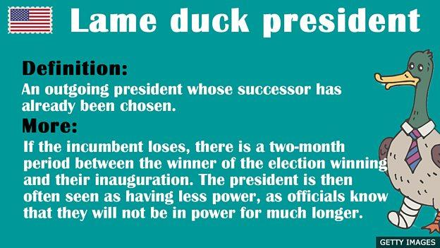

## Table of Contents

## What is the basic meaning of the term 'lame duck'?

The term 'lame duck' refers to a person or group that is still in a position of power but is about to lose that power soon. This term is often used in politics to describe a politician who has been defeated in an election but still has some time left in their current term. During this time, the politician might find it hard to get things done because people know they will soon be out of office.

The term originally came from the world of finance in the 1700s. It was used to describe a trader who could not pay their debts. Over time, the meaning changed to include anyone who is seen as weak or ineffective, especially in a political context. Today, it is most commonly used to talk about politicians who are nearing the end of their term without the chance of being re-elected.

## Where did the term 'lame duck' originate?

The term 'lame duck' started in the world of finance back in the 1700s. It was used to describe a trader who couldn't pay their debts. This made them weak and unable to do much in the market. People started calling these traders 'lame ducks' because they were like ducks that couldn't walk properly.

Over time, the meaning of 'lame duck' changed. It began to be used for anyone who was seen as weak or ineffective, not just in finance. In politics, it became popular to describe a leader who was still in office but would soon lose their power. This happens often after an election when a politician has lost but still has some time left in their term. People know they won't be in power for long, so it's hard for them to get things done.

## How is a 'lame duck' session defined in politics?

A 'lame duck' session in politics happens when lawmakers meet after an election but before the new lawmakers start their jobs. This time is called a 'lame duck' session because some of the lawmakers who are leaving might not have as much power. They know they won't be in office for much longer, so it can be harder for them to make big decisions or pass new laws.

During these sessions, the lawmakers who are leaving might try to finish up important work before they go. But, because they are 'lame ducks,' other people might not listen to them as much. This can make it tough to get things done. Sometimes, these sessions can be important for finishing up work that needs to be done before the new lawmakers take over.

## Can you provide examples of a 'lame duck' period in government?

In the United States, a famous 'lame duck' period happened after the 2016 election. Barack Obama was still president, but Donald Trump had won the election. From November 2016 until January 2017, Obama was a 'lame duck' president. This meant he had less power because everyone knew he would leave office soon. During this time, Obama tried to finish some of his work, but it was hard for him to start new big projects.

Another example is from the UK in 2019. Theresa May was the Prime Minister, but she had to step down because of problems with Brexit. From May to July 2019, she was a 'lame duck' leader. She stayed in office while the Conservative Party chose a new leader. During this time, May couldn't do much because everyone knew she would leave soon. It was a tricky time for the UK government as they waited for a new leader.

## What are the implications of a 'lame duck' status for a political leader?

When a political leader becomes a 'lame duck,' it means they have less power. People know the leader will leave office soon, so they might not listen to them as much. This can make it hard for the leader to get things done. They might want to finish important work before they go, but it's tough because others might not take them seriously. This can lead to a time where not much happens in government.

A 'lame duck' leader might also face challenges in working with other politicians. Since everyone knows the leader's time is almost up, other politicians might not want to work with them on new projects. They might wait for the new leader to come in. This can slow down the government and make it hard to pass new laws or make big decisions. It's a tricky time for everyone involved.

## How does a 'lame duck' situation affect policy-making and governance?

A 'lame duck' situation can make it hard to make new policies and govern well. When people know a leader will soon leave office, they might not listen to them as much. This can make it tough for the leader to get new laws passed or start big projects. Other politicians might wait for the new leader to come in before they want to work on anything important. This can slow down the government and make it hard to do much during this time.

Also, a 'lame duck' leader might try to finish up important work before they go. But because they don't have much power, it's hard to get things done. People might not take them seriously, so even finishing old work can be tricky. This can lead to a time where not much happens in government, and it can be frustrating for everyone involved.

## What strategies can a 'lame duck' leader employ to remain effective?

A 'lame duck' leader can try to stay effective by focusing on finishing important work before they leave. They should pick projects that are almost done and work hard to get them finished. This way, they can still make a difference even though they don't have much time left. It's also a good idea for them to work with other politicians who will stay in office. By doing this, they can get help to finish their work and make sure their ideas keep going after they leave.

Another strategy is for the 'lame duck' leader to use their time to help the new leader get ready. They can share what they know and help the new leader understand the job. This can make the change easier and help the government keep running smoothly. By being helpful and working together, the 'lame duck' leader can still be important and make sure their time in office ends well.

## Are there any notable historical 'lame duck' periods that had significant impacts?

One famous 'lame duck' period was after the 2000 U.S. presidential election. George W. Bush won the election, but there was a lot of confusion and legal battles about the votes in Florida. This meant that Bill Clinton stayed as president for a while longer than usual. During this time, Clinton was a 'lame duck' because everyone knew he would leave soon. It was hard for him to do much because people were focused on the election problems and waiting for Bush to start. This 'lame duck' period showed how tricky it can be when there's a long wait before the new leader takes over.

Another important 'lame duck' period was in the UK in 1974. Edward Heath was the Prime Minister, but he lost an election in February. He stayed as a 'lame duck' leader while the country tried to form a new government. It took a few months to figure out who would be the new leader. During this time, Heath couldn't do much because everyone knew he was leaving. The country had a hard time making decisions and moving forward. This 'lame duck' period showed how a long wait for a new leader can make it hard for the government to work well.

## How do different political systems handle the 'lame duck' phenomenon?

In the United States, the 'lame duck' period is very clear because of how their elections work. After an election, the old president stays in office until the new one starts on January 20th. This time can be tricky because the old president has less power. They might try to finish important work, but it's hard because everyone knows they are leaving soon. The U.S. system has a clear 'lame duck' time, but it can still make it tough for the government to do much during this period.

In countries like the United Kingdom, the 'lame duck' period can be different. If a Prime Minister loses an election, they might stay in office for a short time while a new leader is chosen. This time can be hard because the old leader has less power, and everyone is waiting for the new one. In some cases, if a leader steps down but stays until a new one is ready, it can make things even trickier. Different political systems handle 'lame duck' periods in their own way, but it's always a challenging time for getting things done in government.

## What are the criticisms and defenses of the concept of a 'lame duck'?

Some people don't like the idea of a 'lame duck' leader. They say it makes the government weak because the leader can't do much. When everyone knows a leader will leave soon, it's hard for them to start new projects or pass new laws. This can slow everything down and make people frustrated. Critics also say that 'lame duck' periods can be confusing and make it hard for the government to work well. They think it's better to have a quick change of leaders so the new one can start working right away.

On the other hand, some people think 'lame duck' periods are important. They say it gives the old leader time to finish important work before they leave. This can help make sure things don't get left undone. Defenders also say that 'lame duck' periods can help the new leader get ready. The old leader can share what they know and help the new one understand the job. This can make the change smoother and help the government keep running well.

## How has the understanding and impact of 'lame duck' periods evolved over time?

The idea of a 'lame duck' started a long time ago in the world of money. It was used for traders who couldn't pay their debts. Over time, the meaning changed to include anyone who was seen as weak or not able to do much. In politics, it became popular to talk about leaders who were still in office but would soon lose their power. This happens a lot after elections when a leader has lost but still has some time left in their job. People know they won't be in power for long, so it's hard for them to get things done.

Today, the impact of 'lame duck' periods is still important but has changed a bit. In the past, these times were seen as very weak and not much happened. Now, some people think 'lame duck' periods can be useful. They give the old leader time to finish important work before they leave. This can help make sure things don't get left undone. Also, 'lame duck' periods can help the new leader get ready. The old leader can share what they know and help the new one understand the job. This can make the change smoother and help the government keep running well.

## What future changes might we see regarding the management of 'lame duck' periods in politics?

In the future, we might see countries trying to make 'lame duck' periods shorter. This could happen by changing laws so that new leaders can start their jobs sooner after an election. This way, the old leader won't stay in power for long after they lose. It could help the government work better because the new leader can start making decisions right away. People might like this because it could mean less time when the government is weak and not much happens.

Another change we might see is more rules to help 'lame duck' leaders finish their work. This could mean setting up special teams to help the old leader get things done before they leave. It could also mean making it easier for the old leader to work with the new one. This way, the old leader can share what they know and help the new one get ready. It could make the change smoother and help the government keep running well, even during a 'lame duck' period.

## References & Further Reading

[1]: Malkiel, B. G. (2019). ["A Random Walk Down Wall Street: The Time-Tested Strategy for Successful Investing"](https://yourknowledgedigest.org/wp-content/uploads/2020/04/a-random-walk-down-wall-street.pdf). W.W. Norton & Company.

[2]: O’Hara, M. (2015). ["High-Frequency Trading: What We Know and What We Do Not."](https://www.sciencedirect.com/science/article/pii/S0304405X15000045) Journal of Financial Economics.

[3]: Carrion, A. (2013). ["Very Fast Money: High-frequency trading on the NASDAQ."](https://www.sciencedirect.com/science/article/pii/S138641811300027X) Journal of Financial Markets.

[4]: Jones, C. M. (2013). ["What Do We Know About High-Frequency Trading?"](https://papers.ssrn.com/sol3/papers.cfm?abstract_id=2236201) The Review of Futures Markets.

[5]: Tomlin, B. R. (2016). ["The Political Economy of Lame Duck Presidents."](https://www.jstor.org/stable/pdf/48744878.pdf) Journal of Public Policy.