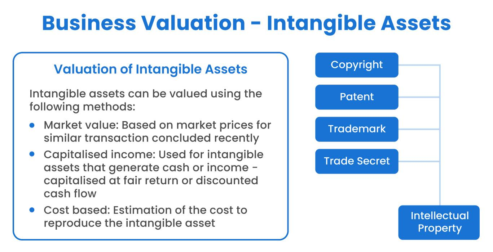

## Table of Contents

## What is land valuation and why is it important in business?

Land valuation is the process of figuring out how much a piece of land is worth. This is done by looking at things like the location, the size of the land, what it can be used for, and what similar pieces of land have sold for recently. People and businesses use land valuation to make smart choices about buying, selling, or developing land.

Knowing the value of land is really important for businesses because it helps them make good financial decisions. For example, if a business wants to build a new store, they need to know if the land is worth the price they have to pay for it. Land valuation also helps businesses get loans from banks, because banks want to know that the land is worth enough to cover the loan if something goes wrong. In short, understanding land valuation helps businesses manage their money better and plan for the future.

## How do beginners start assessing the value of land?

To start assessing the value of land, beginners should first gather information about the property. This includes looking at the location, the size of the land, and any features it has, like being close to schools or having good road access. It's also helpful to check if the land can be used for different purposes, like building homes or businesses. Beginners can get this information by visiting the land, talking to local real estate agents, or looking at public records.

Next, beginners should compare the land to similar properties that have been sold recently in the same area. This is called the "comparable sales method." By looking at what similar pieces of land have sold for, beginners can get a good idea of what their land might be worth. Websites and local real estate listings can provide this information. It's also a good idea to talk to experienced people, like appraisers or real estate agents, who can give more detailed advice and help make sure the valuation is accurate.

## What are the different methods used to value land?

There are several ways to figure out how much land is worth. One common method is the "comparable sales method." This means looking at the prices of similar pieces of land that have been sold recently in the same area. By comparing these sales, you can get a good idea of what your land might be worth. Another method is the "income approach," which is used for land that can make money, like farmland or land with rental properties. This method looks at how much money the land can make and then uses that to figure out its value.

A third method is the "cost approach," which works by figuring out how much it would cost to buy a similar piece of land and then build on it. This method is helpful for land that doesn't have many similar properties to compare with. Finally, there's the "residual land value method," which is used when you want to develop the land. This method figures out how much money you could make from developing the land and then subtracts the costs of building to find out what the land itself is worth. Each method has its own use, and sometimes people use more than one to get a better idea of the land's value.

## What factors influence the value of land?

Many things can change how much land is worth. One big thing is where the land is. Land in a busy city will usually be worth more than land in a quiet countryside. How big the land is also matters. Bigger pieces of land can be worth more, but sometimes smaller pieces in a good spot can be worth a lot too. What the land can be used for is important too. If it's good for building houses or businesses, it might be worth more than land that can only be used for farming.

Another thing that affects land value is what's happening around it. If the area is growing and new things are being built, the land's value can go up. On the other hand, if the area is getting worse or fewer people want to live there, the land's value might go down. The history of the land also matters. If the land used to be a factory or something else that could be harmful, it might be worth less because it could cost a lot to clean up. Finally, what similar pieces of land have sold for recently can tell you a lot about what your land might be worth.

## How does location affect land valuation?

Location is really important when figuring out how much land is worth. Land in a busy city is usually worth more than land in a quiet countryside. This is because more people want to live or do business in cities, so the demand for land there is higher. Also, if the land is close to good things like schools, shops, or public transport, it can be worth even more. People like to be near these things, so they are willing to pay more for land in those spots.

The type of area the land is in also affects its value. If the land is in a neighborhood that is growing and getting better, its value can go up. New buildings, roads, or businesses in the area can make the land more valuable. On the other hand, if the area is getting worse or fewer people want to live there, the land's value might go down. So, it's important to look at what's happening around the land to understand its value.

## What are the common uses of land in business?

Businesses use land in many different ways. One common use is to build stores, offices, or factories on it. Companies need a place to work from, and land gives them the space to build what they need. For example, a retail company might buy land to build a new shopping center, or a manufacturing company might need land to build a factory where they can make their products.

Another way businesses use land is for investment. Some companies buy land and then sell it later when its value goes up. This can be a good way to make money if the area is growing and becoming more popular. Businesses might also rent out the land to other companies or people, which can give them a steady income. So, land can be a useful part of a business's plan to make money and grow.

## How can land be used to generate income?

One way to make money from land is by renting it out. If you own a piece of land, you can let other people use it for a fee. For example, farmers might rent land to grow crops, or businesses might rent it to build stores or offices. This gives you a steady income without having to do much work yourself. Another way is by letting people use your land for things like parking lots, storage spaces, or even events like weddings or festivals. People will pay to use your land for these purposes, and it can add up to a good amount of money over time.

Another way to make money from land is by selling it when its value goes up. If you buy land in an area that is growing and becoming more popular, the price of the land can increase. When that happens, you can sell the land for more than you paid for it, making a profit. This is called investing in land. It can take some time, but if you pick the right spot, it can be a good way to make money. So, by either renting out the land or selling it at the right time, you can use land to generate income.

## What legal considerations should be taken into account when buying or using land for business?

When buying or using land for business, it's really important to know about the legal stuff. First, you need to check the zoning laws. These laws say what you can and can't do with the land. For example, some areas might only allow houses, while others might be okay for businesses. If you want to build a store, you need to make sure the zoning allows it. You also need to look at any restrictions on the land, like rules about how tall buildings can be or what they can look like. Not following these rules can get you in trouble and cost a lot of money.

Another thing to think about is the title of the land. You need to make sure you're really getting what you're paying for. This means checking if there are any liens or debts on the land that you might have to pay off. It's a good idea to get a title search done by a professional to make sure everything is clear. Also, think about environmental laws. If the land was used for something like a factory before, it might have pollution that you need to clean up. This can be expensive and take a long time. So, knowing the legal stuff can help you avoid big problems and make smart choices about using land for your business.

## How do zoning laws impact the use of land for business purposes?

Zoning laws are rules made by the government that say what you can do with a piece of land. These laws can really change how you use land for your business. For example, if you want to open a store, you need to find land that is zoned for business use. If the land is only zoned for houses, you won't be able to build your store there. Zoning laws also say things like how tall your building can be or how much space you need to leave between buildings. If you don't follow these rules, you could get in big trouble and have to pay a lot of money.

Sometimes, you might find a piece of land that is perfect for your business, but the zoning doesn't allow what you want to do. In these cases, you might be able to ask the government to change the zoning, but this can take a long time and cost a lot of money. It's important to check the zoning laws before you buy land, so you know if you can use it the way you want. Knowing the zoning rules can help you avoid problems and make sure your business can grow the way you plan.

## What advanced techniques can be used to maximize land value?

One advanced way to make land more valuable is by changing how it's used. For example, if you have land that's only good for farming, you might be able to get permission to build houses or businesses on it instead. This is called rezoning, and it can make the land worth a lot more money because more people want to buy it. Another way is to improve the land itself. This could mean adding things like roads, water, and electricity, which makes the land more useful and attractive to buyers. It's a bit like fixing up an old house to sell it for more money.

Another technique is to use the land in smart ways that bring in more money. For example, if you have a big piece of land, you could build a shopping center instead of just one store. This can bring in more rent and make the land more valuable. You could also mix different uses, like building apartments above stores. This is called mixed-use development, and it can make the land more valuable because it can do more things at once. By thinking carefully about how to use the land and making smart changes, you can make it worth a lot more money.

## How can technology be utilized in land valuation and management?

Technology can help a lot with figuring out how much land is worth and taking care of it. One way is by using special computer programs that can look at a lot of information at once. These programs can check things like how much similar pieces of land have sold for, what the land is being used for now, and what it might be used for in the future. This helps people get a more accurate idea of what the land is worth. Also, technology like drones and satellite pictures can show what the land looks like from above. This can help people see if there are any problems with the land, like if it's been damaged or if there are buildings on it.

Another way technology helps is by making it easier to keep track of land. There are apps and websites that let people see all the information about a piece of land in one place. This can include things like the history of the land, who owns it, and any rules about what you can do with it. This makes it easier to make smart choices about buying or using the land. Plus, technology can help with planning how to use the land better. For example, computer models can show what would happen if you built certain things on the land, like how much money you might make or how it would affect the area around it. By using technology, people can make better decisions about land and make it more valuable.

## What are the future trends in land use and valuation in business?

In the future, businesses will use land in new and different ways. One big trend is that more companies will use land for mixed purposes. This means they might build apartments above stores or offices, so the land can do more than one thing at once. This can make the land more valuable because it can bring in money from different sources. Another trend is that businesses will pay more attention to being green. They might use land to build things like solar farms or green buildings that use less energy. This is good for the environment and can also make the land more attractive to people who care about these things.

Technology will also change how businesses value and manage land. More companies will use special computer programs to figure out how much land is worth. These programs can look at a lot of information at once and give a more accurate value. Drones and satellites will help too, by showing what the land looks like from above. This can help find any problems with the land and make sure it's being used in the best way. As technology gets better, it will be easier for businesses to make smart choices about land and use it to make more money.

## What are the key factors and strategies in business valuation?

Business valuation involves determining the economic value of a company or property, a crucial aspect for investors and stakeholders making informed decisions. Various factors influence the valuation process, with financial performance, market conditions, and land use being key determinants.

Financial performance is often the primary focus, encompassing revenue, profit margins, and cash flow. Evaluating these metrics provides insight into a company’s operational efficiency and growth potential. Market conditions, including industry trends and economic variables such as interest rates and inflation, also play a central role, affecting the risk assessment and future earnings projections.

Land use presents a unique impact on business valuation, notably in sectors reliant on physical locations like retail and manufacturing. Properties zoned for commercial purposes, for instance, may derive higher valuations due to the potential for revenue generation and expansion. Zoning regulations and local government policies further influence the land's strategic value, thus affecting overall business worth.

Valuation methods vary, with popular techniques including discounted cash flow (DCF), market capitalization, and asset-based approaches. The DCF method estimates a business's present value based on projected future cash flows, discounted back at a rate reflecting the time value of money. This is represented mathematically as:

$$
\text{DCF} = \sum \frac{CF_t}{(1 + r)^t}
$$

where $CF_t$ is the cash flow at time $t$, and $r$ is the discount rate.

Market capitalization provides a straightforward measure, calculated by multiplying the company's share price by its total number of shares outstanding. This approach reflects current market perceptions and investor sentiment.

Asset-based valuations consider the fair market value of a company’s assets minus its liabilities. This method is particularly useful for businesses with substantial tangible assets or during liquidation scenarios.

Case studies exemplify the significant role of land use in business valuation. For example, a retail chain's profitability may hinge on its stores' strategic locations, which not only facilitate consumer access but also enhance brand visibility. On the other hand, industrial companies benefit from properties that accommodate expansive facilities for production and distribution.

In summary, understanding the interplay between financial metrics, market conditions, and land use is essential for accurate business valuation. By employing appropriate valuation methods and considering land use implications, stakeholders can better assess and enhance business strategies.

## What are the best practices and future trends?

Staying competitive in today's economic landscape necessitates embracing both technological and methodological innovations. Optimizing land use, conducting precise business valuations, and employing algorithmic trading tools are critical strategies for achieving this goal.

### Optimizing Land Use

Best practices for land use optimization emphasize the integration of sustainable development principles. This involves balancing ecological, economic, and social factors to make land development practices more efficient. Implementing green infrastructure and smart growth strategies can improve urban planning by reducing environmental impact and enhancing community resilience. Additionally, leveraging Geographic Information Systems (GIS) can aid in the precise evaluation of land potential, allowing investors and developers to make more informed decisions.

### Conducting Precise Business Valuations

Accurate business valuations require a deep understanding of various influencing factors, including land use strategies. Employing advanced valuation methodologies such as the discounted cash flow (DCF) approach, which considers future cash flows adjusted for the time value of money, can enhance precision. 

$$

DCF = \sum \left( \frac{CF_t}{(1+r)^t} \right) 
$$

Where $CF_t$ is the cash flow in year $t$ and $r$ is the discount rate.

Increasingly, machine learning algorithms are being used to analyze large datasets, identifying patterns and trends that may not be immediately obvious. This can lead to more accurate and dynamic valuation models.

### Utilizing Algorithmic Trading Tools

Algorithmic trading remains at the forefront of modern financial strategies, providing speed and efficiency in executing trades. It is crucial to employ robust [backtesting](/wiki/backtesting) systems that can assess the past performance of trading strategies under different market conditions. Moreover, the integration of artificial intelligence and machine learning can refine trading algorithms, enhancing their predictive capabilities and adaptability to market fluctuations.

### Emerging Trends

Several emerging trends have the potential to redefine how businesses approach land use, valuation, and trading:

- **Sustainable Land Development:** Emphasis on minimizing environmental footprints through eco-friendly building practices and renewable energy sources is gaining traction.

- **Blockchain in Real Estate:** Blockchain technology provides transparency and security in property transactions, reducing fraud and increasing efficiency. Smart contracts can automate processes, further enhancing efficiency and reducing costs.

- **Quantum Computing in Trading:** Quantum computing is expected to revolutionize trading algorithms, offering unprecedented processing speeds and complex problem-solving capabilities. Although still in its infancy, businesses should monitor this development for potential applications in data analysis and predictive modeling.

### Regulatory Considerations and Ethical Dimensions

The increased use of technology in finance and real estate brings regulatory and ethical challenges. Ensuring compliance with local and international regulations is essential to mitigate risks associated with technological advancements. Ethical considerations, particularly in algorithmic trading, must address issues such as market manipulation and data privacy to promote fair trading practices. Transparency and accountability in algorithmic strategies can help cultivate trust among stakeholders.

By staying informed about these trends and adopting best practices, businesses are better positioned to navigate the complexities of the economic environment, leading to improved long-term success.

## References & Further Reading

[1]: Díaz, J. C., Gonzalo, M. T., & Stephen, V. (2019). ["Understanding Land Use and Management"](https://www.sciencedirect.com/org/science/article/pii/S1314283621001639). Land Use Policy, 30(8), 162-176.

[2]: Lopez de Prado, M. (2018). ["Advances in Financial Machine Learning"](https://www.amazon.com/Advances-Financial-Machine-Learning-Marcos/dp/1119482089). Wiley.

[3]: Chan, E. P. (2008). ["Quantitative Trading: How to Build Your Own Algorithmic Trading Business"](https://github.com/ftvision/quant_trading_echan_book). Wiley.

[4]: Batty, M. (2013). ["The New Science of Cities"](https://direct.mit.edu/books/monograph/3422/The-New-Science-of-Cities). MIT Press.

[5]: Jansen, S. (2020). ["Machine Learning for Algorithmic Trading"](https://github.com/stefan-jansen/machine-learning-for-trading). Packt Publishing.

[6]: Aronson, D. (2006). ["Evidence-Based Technical Analysis: Applying the Scientific Method and Statistical Inference to Trading Signals"](https://www.amazon.com/Evidence-Based-Technical-Analysis-Scientific-Statistical/dp/0470008741). Wiley.

[7]: Hoesli, M., & MacGregor, B. D. (2000). ["Property Investment: Principles and Practice of Portfolio Management"](https://www.taylorfrancis.com/books/mono/10.4324/9781315840482/property-investment-bryan-macgregor-martin-hoesli). Pearson.

[8]: Rosenbaum, J., & Pearl, J. (2013). ["Investment Banking: Valuation, Leveraged Buyouts, and Mergers & Acquisitions"](https://www.amazon.com/Investment-Banking-Valuation-Leveraged-Acquisitions/dp/1118656210). John Wiley & Sons.