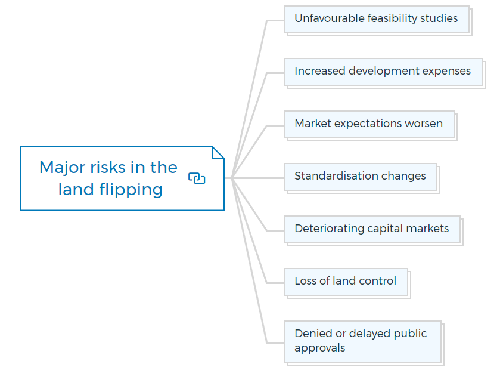

## Table of Contents

## What is land flipping?

Land flipping is when someone buys a piece of land and then sells it quickly for a higher price. People do this to make money without making any changes to the land. They look for land that is cheap and has the potential to increase in value. This could be because the area is growing or because there are plans for new developments nearby.

It's important to do a lot of research before trying land flipping. You need to understand the local real estate market and know what makes land valuable. There are also risks involved, like not being able to sell the land quickly or finding out that the land has problems, like bad soil or legal issues. So, while land flipping can be profitable, it requires careful planning and understanding of the market.

## How does land flipping differ from house flipping?

Land flipping and house flipping are both ways to make money in real estate, but they are different. In land flipping, you buy a piece of land and sell it quickly without making any changes to it. The goal is to find land that is cheap and likely to go up in value soon. This could be because a new road is being built nearby or because the area is becoming more popular. You don't need to do any work on the land itself, just buy and sell it at the right time.

House flipping, on the other hand, involves buying a house, fixing it up, and then selling it for a profit. This means you have to spend money and time to make the house look better or fix any problems it has. You might paint the walls, replace the kitchen, or repair the roof. The idea is to make the house more attractive to buyers so you can sell it for more than what you paid for it, plus the cost of the repairs. House flipping requires more work and money upfront compared to land flipping.

## What are the basic steps involved in land flipping?

The first step in land flipping is finding the right piece of land. You need to look for land that is priced low but has a good chance of going up in value soon. This could be because there are new developments planned nearby, like a new school or shopping center, or because the area is becoming more popular. You can find these opportunities by looking at real estate listings, talking to local real estate agents, and doing research on the internet. Once you find a promising piece of land, you need to make sure it doesn't have any problems, like bad soil or legal issues, that could make it hard to sell later.

After you buy the land, the next step is to sell it quickly for a higher price. This means you need to find buyers who are interested in the land and are willing to pay more than what you paid. You can do this by listing the land on real estate websites, working with a real estate agent, or reaching out to people who might be interested, like developers or investors. The key is to sell the land before its value goes down or before you have to pay too much in holding costs, like property taxes. If you can do this successfully, you can make a profit without having to do any work on the land itself.

## What are the potential benefits of land flipping?

Land flipping can be a good way to make money without doing a lot of work. When you buy land at a low price and sell it quickly for more money, you can make a profit without having to fix up the land or build anything on it. This means you don't have to spend a lot of time or money on the land itself, which can be a big advantage if you want to keep your costs low.

Another benefit of land flipping is that it can be a quick way to make money. If you find the right piece of land in an area that is growing or where new developments are planned, you can sell it fast and make a profit. This can be especially helpful if you need money quickly or if you want to invest in more land to flip in the future.

## What are the common risks associated with land flipping?

One of the main risks of land flipping is that you might not be able to sell the land quickly. If you buy land hoping to sell it fast for a profit, but then no one wants to buy it, you could be stuck with it. This can be a problem because you still have to pay property taxes and other costs while you wait for a buyer. If the land's value goes down while you're waiting, you could end up losing money instead of making a profit.

Another risk is that the land might have hidden problems. For example, the soil might be bad, or there could be legal issues with the land that you don't know about when you buy it. These problems can make it hard to sell the land later, or they could make it less valuable than you thought. It's important to do a lot of research and maybe even hire experts to check the land before you buy it, but even then, you might miss something important.

Lastly, land flipping can be risky because it depends a lot on the real estate market. If the market changes and land values go down, you could lose money. Also, if there are big changes in the economy, like a recession, it can be harder to find buyers for your land. So, while land flipping can be a good way to make money, it's important to understand these risks and be ready for them.

## How can one identify undervalued land for flipping?

To find undervalued land for flipping, you need to look at where the land is and what is happening around it. Start by checking areas that are growing or where new projects like roads, schools, or shopping centers are planned. These changes can make land more valuable over time. You can find this information by looking at local news, talking to real estate agents, or using websites that show upcoming developments. Also, look for land that is priced lower than similar pieces of land nearby. This might happen because the current owner needs to sell quickly or doesn't know the land's true value.

Once you have a list of potential land to buy, you should do more research. Check the land's history to see if there are any problems, like bad soil or legal issues, that could make it hard to sell later. You can use public records or hire a professional to help with this. Also, talk to local people and businesses to get a sense of how the area is changing. If you find land that is in a good spot, doesn't have big problems, and is cheaper than similar land around it, you might have found a good piece of undervalued land to flip.

## What legal considerations should be taken into account when flipping land?

When flipping land, it's important to know about the legal rules that can affect your plans. One big thing to check is the zoning laws, which tell you what the land can be used for. If you buy land thinking you can sell it for building houses, but the zoning laws say it can only be used for farming, you might have a hard time finding buyers. You also need to look at any liens or debts on the land. If the land has debts, you could end up having to pay them if you buy the land, which can cut into your profit or even make you lose money.

Another important legal thing to think about is the title of the land. You need to make sure the person selling the land actually owns it and can legally sell it to you. If there are any disputes or unclear ownership, you could end up in a legal mess. It's a good idea to get a title search done by a professional to make sure everything is clear. Also, some places have rules about how long you have to own land before you can sell it again. Knowing these rules can help you avoid legal problems and make sure your land flipping goes smoothly.

## How does zoning affect land flipping opportunities?

Zoning is really important when you're thinking about flipping land. It's the rules that say what you can and can't do with a piece of land. If you buy land thinking you can sell it to someone who wants to build houses, but the zoning says it can only be used for farming, you might have a hard time finding a buyer. So, before you buy any land, you need to check the zoning laws. This will help you know if the land can be used for what you want and if it's a good investment.

Understanding zoning can also help you find land that might go up in value. Sometimes, areas are rezoned, which means the rules change and the land can be used for something different. If you hear about a place that might be rezoned for more houses or businesses, that land could become more valuable. So, keeping an eye on zoning changes can help you find good land flipping opportunities. It's all about knowing the rules and how they might change in the future.

## What financing options are available for land flipping?

When you want to flip land, you can use different ways to get the money you need. One common way is to take out a land loan from a bank or a private lender. These loans are made just for buying land and can help you buy the property even if you don't have all the money upfront. Another option is to use a home equity line of credit (HELOC) if you already own a house. This lets you borrow money against the value of your home to buy land. Some people also use their own savings or money from friends and family to buy land for flipping.

Another way to finance land flipping is through seller financing. This means the person selling the land agrees to let you pay for it over time instead of all at once. It can be a good option if you can't get a loan from a bank. You can also look into partnerships or joint ventures, where you team up with someone else who has money to buy the land together. This can help spread out the cost and the risk. No matter which option you choose, it's important to make sure you can pay back the money you borrow and that the land you buy will be worth more when you sell it.

## How can market analysis improve success in land flipping?

Market analysis is really important for land flipping because it helps you understand what's going on in the real estate market. When you do a market analysis, you look at things like how much land costs in different areas, if those prices are going up or down, and what kinds of new projects or developments are planned nearby. This information can help you find land that is cheap now but might be worth a lot more soon. For example, if you see that a new school or shopping center is going to be built, the land around it could become more valuable. By knowing these things, you can make smarter choices about which land to buy and when to sell it.

Doing a good market analysis also helps you avoid making bad decisions. If you see that land prices are going down in an area, you might decide not to buy there because it could be hard to sell the land later for a profit. On the other hand, if you see that an area is growing and land prices are going up, you might want to buy land there quickly before it gets too expensive. Market analysis can also help you understand who might want to buy your land and how much they might be willing to pay. This way, you can set a good price and find the right buyers faster, which can make your land flipping more successful.

## What are some advanced strategies for maximizing profits in land flipping?

One advanced strategy for maximizing profits in land flipping is to buy land in areas that are about to change a lot. This means looking for places where new projects like roads, schools, or shopping centers are planned. These changes can make the land more valuable because more people will want to live or build there. To find these opportunities, you need to do a lot of research and stay updated on local news and development plans. You can also talk to local government and real estate agents to get the latest information. By buying land before these changes happen, you can sell it later for a much higher price.

Another strategy is to use creative financing options to buy more land without using all your own money. You can use seller financing, where the person selling the land lets you pay over time instead of all at once. This can help you buy more land and flip it faster. You can also partner with other investors who have money to buy land together. This way, you can share the costs and the profits. By using these financing methods, you can flip more land and make more money. It's all about finding the right land at the right time and using smart ways to pay for it.

## Can you provide case studies or examples of successful land flipping?

In one successful land flipping case, a person named John bought a piece of land in a small town for $20,000. He found out that a new highway was going to be built nearby, which would make the area more popular. John did his research and knew that the land would become more valuable once the highway was finished. He waited for a year and then sold the land for $50,000, making a profit of $30,000. John's success came from understanding the local market and knowing about the upcoming development.

Another example is Sarah, who bought a plot of land in a growing suburb for $30,000. She learned that a new school was planned to be built close to her land. Sarah knew that families would want to live near the school, so she bought the land before the news got out. After six months, she sold the land for $60,000, doubling her investment. Sarah's strategy was to find land in areas with upcoming projects that would increase its value.

## What is Understanding Real Estate Investment Property?

Real estate investment property involves the strategic purchase, ownership, management, or rental of real estate assets with the objective of generating profit. Unlike traditional residential property purchases, investment properties necessitate a more sophisticated understanding of various market trends and economic factors that influence their desirability and value.

One of the primary considerations in selecting a real estate investment property is its location. The location largely determines the property's value and appeal, with factors such as proximity to amenities, local economic conditions, and infrastructure development playing crucial roles. For instance, properties located in growing urban areas or regions experiencing economic revitalization often present higher potential for appreciation.

Zoning laws are another critical aspect that investors must examine. These regulations govern land use and can significantly impact the functionality and profitability of a property. Understanding the zoning restrictions and possibilities for rezoning can inform better investment decisions by identifying properties with untapped potential or those that may face limitations in development.

Investors should also evaluate the potential for property appreciation. This involves analyzing historical price trends and considering future market developments that could influence property values. Economic indicators, such as employment rates and regional GDP growth, can offer insights into future demand for real estate in a particular area.

Moreover, income-generation capabilities are central to the evaluation of investment properties. Prospective investors should assess the potential rental income against the costs of ownership, including maintenance, taxes, and financing. High rental demand, occupancy rates, and competitive rental pricing can indicate a lucrative investment opportunity. Tools such as the capitalization rate, which is calculated as:

$$
\text{Capitalization Rate} = \frac{\text{Net Operating Income}}{\text{Current Market Value}}
$$

help in assessing the income-generating potential of properties by providing a comparative measure of profitability.

In summary, successful real estate investment requires a comprehensive assessment of location, zoning laws, appreciation potential, and income prospects. By diligently analyzing these factors, investors can make more informed and strategic decisions to maximize profit in the real estate market.

## References & Further Reading

[1]: Margolis, D. (2018). ["Land Flipping: Risks and Rewards."](https://www.benzinga.com/money/land-flipping) Investopedia.

[2]: Clemons, E. K., & Weber, B. W. (2019). ["Algorithmic Trading in Real Estate Markets."](https://www.tandfonline.com/doi/full/10.1080/07421222.2018.1440766) Social Science Research Network.

[3]: ["The Intelligent REIT Investor: How to Build Wealth with Real Estate Investment Trusts"](https://www.amazon.com/Intelligent-REIT-Investor-Wealth-Investment/dp/1119252717) by Stephanie Krewson-Kelly and Brad Thomas

[4]: Higgs, J., & Worthington, A. (2005). ["Zoning Regulations and Urban Real Estate Investment."](https://www.scribd.com/document/291887265/CHANGE-MANAGEMENT-Higgs-Rowland-2005-Exploring-Approaches-to-Change-Its-Leadership) Journal of Property Investment & Finance.

[5]: Narang, R. (2013). ["Inside the Black Box: The Simple Truth About Quantitative Trading."](https://onlinelibrary.wiley.com/doi/book/10.1002/9781118267738) by Rishi K. Narang