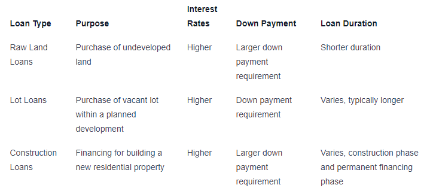

## Table of Contents

## What is a land loan?

A land loan is a type of loan that people use to buy a piece of land. Unlike a home loan, which is used to buy a house, a land loan is specifically for purchasing empty land. This land could be used for building a home in the future, starting a farm, or for other purposes.

Land loans can be harder to get than home loans because banks see them as riskier. This is because the land doesn't have a house on it, so it might not be worth as much if the borrower can't pay back the loan. Because of this, land loans often have higher interest rates and might require a bigger down payment.

## How does a land loan differ from a traditional mortgage?

A land loan and a traditional mortgage are used for different purposes. A land loan is for buying a piece of land that doesn't have a house on it. People might use this land to build a home later, start a farm, or use it for other projects. On the other hand, a traditional mortgage is for buying a house that's already built and ready to live in.

Because land loans are seen as riskier by banks, they can be harder to get than traditional mortgages. Banks worry that if the borrower can't pay back the loan, the empty land might not be worth as much as a house. Because of this, land loans often come with higher interest rates and might need a bigger down payment. Traditional mortgages, since they are backed by a house, usually have lower interest rates and smaller down payments.

## What are the eligibility criteria for obtaining a land loan?

To get a land loan, you usually need to show that you can pay it back. This means having a good credit score, which shows banks that you have a history of paying your bills on time. You also need to have a steady job or income, so the bank knows you can keep making payments. Sometimes, banks might ask for a bigger down payment for a land loan than for a home loan, because they see it as riskier.

Another thing banks look at is what you plan to do with the land. If you have a clear plan, like building a house or starting a farm, it can help your case. The location of the land matters too. Land in a good spot, where people want to live or do business, is easier to get a loan for. Banks also like to see if you have any money saved up or other assets, which can make them feel more confident about lending to you.

## What types of land can be financed with a land loan?

Land loans can be used to buy different types of land. You can get a loan for raw land, which is just empty land with no buildings or utilities like water and electricity. This kind of land is often used for building a home or starting a farm. Another type is improved land, which already has some utilities or basic structures, making it easier to build on.

Some land loans can also be used for buying land for business purposes. This could be land for a new store, office, or factory. The type of land you want to buy can affect how easy it is to get a loan. Banks usually like to see that the land is in a good location and has a clear purpose, like building a home or starting a business.

## What are the typical interest rates for land loans?

Interest rates for land loans are usually higher than for traditional home loans. This is because banks see land loans as riskier. They worry that if you can't pay back the loan, the land might not be worth as much as a house. Because of this, land loan interest rates can be anywhere from 5% to 15% or even higher, depending on things like your credit score, the location of the land, and what you plan to do with it.

The exact [interest rate](/wiki/interest-rate-trading-strategies) you get can change based on a few things. If you have a good credit score and a clear plan for the land, you might get a lower rate. But if the land is in a less popular area or you don't have a strong credit history, the rate could be higher. It's a good idea to shop around and talk to different banks or lenders to find the best rate for your situation.

## How long are the repayment terms for land loans?

The repayment terms for land loans can be different depending on the lender and the type of land you're buying. Usually, land loans have shorter repayment periods than home loans. They can last anywhere from 5 to 20 years. This shorter time means you have to pay back the loan faster, which can make your monthly payments higher.

The length of the loan term can also depend on what you plan to do with the land. If you're buying land to build a home, some lenders might offer longer terms, maybe up to 30 years, but this is less common. It's important to talk to different lenders to see what terms they offer and choose one that fits your financial situation.

## What is the down payment requirement for a land loan?

The down payment for a land loan is usually higher than for a home loan. Banks see land loans as riskier because the land doesn't have a house on it. Because of this, they might ask for a down payment of 20% to 50% of the land's price. This means if you're buying a piece of land that costs $100,000, you might need to pay $20,000 to $50,000 upfront.

The exact amount you need to put down can change based on a few things. Your credit score is important; if it's good, you might need a smaller down payment. The location of the land matters too. If it's in a popular area, the down payment might be lower. Also, what you plan to do with the land can affect the down payment. If you have a clear plan, like building a house, the lender might be more flexible with the down payment amount.

## What are the risks associated with land loans?

Getting a land loan can be risky because the land might not be worth as much as a house if you can't pay back the loan. This is why banks see land loans as riskier and might charge higher interest rates and ask for bigger down payments. If you can't make your payments, the bank could take the land back, but they might not get as much money from selling it as they would from selling a house.

Another risk is that land might not go up in value as quickly as a house. If you're planning to build a home or start a business on the land, it could take a long time before you see any money from it. During that time, you still have to make loan payments, which can be hard if something goes wrong with your plans. It's important to think carefully about these risks before deciding to get a land loan.

## How can land loans be used for investment purposes?

Land loans can be used for investment by buying land that might go up in value over time. If you buy land in a place that is growing or where new businesses and homes are being built, the land could become more valuable. You can then sell it later for a profit. This is a common way people use land loans to invest, hoping that the land will be worth more in the future.

Another way to use land loans for investment is by developing the land. You can buy land with a loan and then build something on it, like houses, stores, or farms. Once you've built on the land, you can sell it or rent it out to make money. This can be a good way to invest, but it takes more time and money because you have to pay for building the project while also paying back the loan.

## What documentation is required when applying for a land loan?

When you apply for a land loan, you need to show the bank some important papers. You'll need to give them proof of your income, like pay stubs or tax returns, so they can see if you can pay back the loan. They also want to see your credit report to check your credit score. This helps them decide if you're a good person to lend money to. You'll also need to give them details about the land you want to buy, like the property deed or a purchase agreement.

Another thing you might need is a plan for what you want to do with the land. If you're going to build a house or start a farm, the bank might ask for building plans or a business plan. This shows them that you have a clear idea of how you'll use the land. Sometimes, they might also ask for an appraisal of the land, which is a report that says how much the land is worth. All these documents help the bank decide if they should give you the loan.

## How does the loan-to-value ratio affect land loan terms?

The loan-to-value (LTV) ratio is important when you want to get a land loan. It's the percentage of the land's value that the bank is willing to lend you. If the land is worth $100,000 and the bank gives you a loan for $50,000, the LTV ratio is 50%. Banks usually give land loans with a lower LTV ratio than home loans because they see land loans as riskier. This means you might need to put down a bigger down payment to get a land loan.

A higher LTV ratio can affect the terms of your land loan. If the LTV ratio is high, the bank might see it as riskier, so they could charge you a higher interest rate or ask for a bigger down payment. On the other hand, if you can get a lower LTV ratio by putting down more money upfront, the bank might give you better terms, like a lower interest rate or a longer time to pay back the loan. So, the LTV ratio can make a big difference in how much your land loan will cost and how easy it is to get one.

## What are the differences between raw land loans and improved land loans?

Raw land loans are for buying land that has nothing on it. It's just empty land without any buildings or utilities like water and electricity. Because raw land is seen as riskier by banks, these loans can be harder to get. They usually come with higher interest rates and might need a bigger down payment. If you want to use raw land to build a home or start a farm, you'll need to plan carefully because it can take a long time before you see any money from it.

Improved land loans are for buying land that already has some utilities or basic structures. This makes it easier to build on because some of the work is already done. Banks see improved land as less risky than raw land, so these loans might have lower interest rates and smaller down payments. If you're planning to build a house or start a business, getting an improved land loan can be a good choice because it's easier to get and the terms might be better.

## References & Further Reading

[1]: Bergstra, J., Bardenet, R., Bengio, Y., & Kégl, B. (2011). ["Algorithms for Hyper-Parameter Optimization."](https://proceedings.neurips.cc/paper/2011/file/86e8f7ab32cfd12577bc2619bc635690-Paper.pdf) Advances in Neural Information Processing Systems 24.

[2]: ["Advances in Financial Machine Learning"](https://www.amazon.com/Advances-Financial-Machine-Learning-Marcos/dp/1119482089) by Marcos Lopez de Prado

[3]: ["Evidence-Based Technical Analysis: Applying the Scientific Method and Statistical Inference to Trading Signals"](https://www.amazon.com/Evidence-Based-Technical-Analysis-Scientific-Statistical/dp/0470008741) by David Aronson

[4]: ["Machine Learning for Algorithmic Trading"](https://github.com/PacktPublishing/Machine-Learning-for-Algorithmic-Trading-Second-Edition) by Stefan Jansen

[5]: ["Quantitative Trading: How to Build Your Own Algorithmic Trading Business"](https://books.google.com/books/about/Quantitative_Trading.html?id=j70yEAAAQBAJ) by Ernest P. Chan