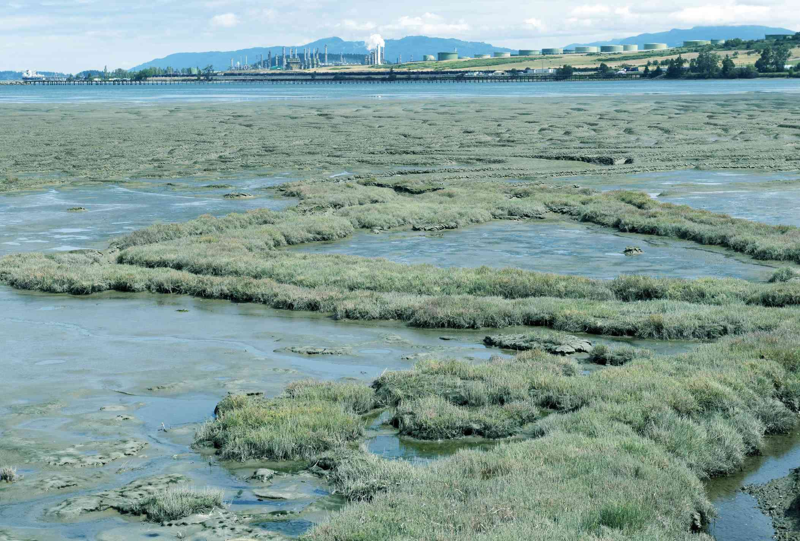

The modern world often grapples with the adverse effects of land degradation, prompting a dire need for solutions like land rehabilitation and restoration. These processes are essential for reversing the damage caused by urbanization, industrialization, and other anthropogenic activities. The restoration of land ecosystems not only helps conserve biodiversity but also mitigates climate change impacts and ensures sustainable development.

Exploring the connection between land rehabilitation and algorithmic trading might initially seem unrelated. However, there is a unique parallel in how both fields address complex systems by utilizing strategic decision-making processes. In algorithmic trading, sophisticated mathematical models and algorithms are employed to make swift trading decisions in financial markets. Similarly, environmental restoration often requires innovative methodologies and precise execution to effectively manage and rehabilitate degraded landscapes.



Innovative techniques in environmental restoration can mirror the sophisticated strategies used in financial markets. For instance, just as algorithmic trading relies on real-time data analysis and pattern recognition to optimize trading decisions, land rehabilitation employs monitoring technologies, such as remote sensing and Geographic Information Systems (GIS), to assess environmental conditions and devise optimal restoration strategies.

Understanding these parallels can offer insights into managing complex systems, whether ecological or economic. Environmental restoration and algorithmic trading both require ongoing monitoring, data-driven analysis, and timely interventions. These fields exemplify how interdisciplinary approaches can enhance the efficiency and efficacy of solutions implemented to tackle profound challenges.

Join us in exploring the intricacies of land and environmental restoration, set against the backdrop of algorithmic decision-making. By seeking inspiration from algorithmic techniques, environmental professionals can refine their strategies, leading to more successful and sustainable outcomes in both environmental restoration and broader systemic management.

## Table of Contents

## The Need for Land Rehabilitation and Restoration

Urbanization and industrial activities are rapidly transforming landscapes, leading to a significant increase in land degradation. This process results in the deterioration of the natural environment, severely impacting biodiversity, water resources, and soil health. Rehabilitation efforts aim to reverse these detrimental effects by restoring ecosystems to their original state, making them habitable for flora, fauna, and human populations. The importance of these initiatives cannot be overstated, especially as urban sprawl and industrial expansion continue to accelerate. 

Major contributing factors to land degradation include pollution, deforestation, and natural disasters. Pollution from industrial emissions, agricultural runoff, and improper waste disposal contaminates the soil, affecting its fertility and the health of ecosystems. Deforestation, often driven by logging and agricultural expansion, results in the loss of tree cover, leading to soil erosion, loss of biodiversity, and disruption of carbon and water cycles. Natural disasters such as floods, fires, and hurricanes exacerbate these issues by causing physical damage to landscapes and altering ecosystems.

Statistics highlight the alarming scope of this problem. According to the United Nations Convention to Combat Desertification (UNCCD), more than 25% of the world's land is degraded, affecting the lives of approximately 3.2 billion people. These degraded landscapes contribute significantly to food insecurity, loss of biodiversity, and increased vulnerability to climate change. Moreover, economic losses associated with land degradation are estimated to be around $6.3-$10.6 trillion annually, a stark indication of the urgent need for effective rehabilitation strategies.

Successful rehabilitation projects, such as the "Great Green Wall" initiative in Africa and the restoration of the Loess Plateau in China, demonstrate the potential benefits of large-scale restoration efforts. These projects not only improve the condition of the land but also enhance food security, create jobs, and mitigate the effects of climate change. By restoring the natural balance of ecosystems, such interventions ensure sustainable use of land resources and contribute to the well-being of local communities.

Overall, addressing land degradation through rehabilitation and restoration is essential for maintaining ecological sustainability and resilience. Policymakers, communities, and industry stakeholders must collaborate to implement strategies that prioritize the health of our planet, ensuring a viable environment for future generations.

## Techniques and Challenges in Land Rehabilitation

Land rehabilitation encompasses a range of techniques designed to restore degraded ecosystems, remove environmental contaminants, and reintroduce native plant species. This multifaceted approach aims to revitalize biological diversity, improve soil health, and reinstate the ecological balance required for lasting environmental health.

One significant technique is bioremediation, a process leveraging microorganisms to detoxify polluted environments. Microorganisms metabolize harmful substances, transforming them into less toxic forms. Bioremediation is cost-effective and sustainable, addressing pollutants such as heavy metals and hydrocarbons often present in industrial sites. Despite its strengths, bioremediation may require extensive monitoring and time, as the biodegradation process is inherently slow, and its effectiveness can vary depending on environmental conditions and the nature of the contaminants.

Remote sensing is another crucial advancement assisting land rehabilitation. Using satellite and aerial imagery, remote sensing provides comprehensive data on land conditions, vegetation health, and soil moisture levels. It enables large-scale environmental assessments and continual monitoring of restoration progress. However, the interpretation of remote sensing data demands skilled personnel and can be costly, limiting accessibility for some projects.

Revegetation, the reintroduction of native plant species, aims to stabilize soil, reduce erosion, and recreate habitats for wildlife. The selection of appropriate species is vital, often requiring indigenous knowledge and local ecological expertise to ensure successful establishment and growth. Challenges in revegetation include sourcing suitable plant materials, particularly when native species are sparse or threatened, and ensuring sufficient genetic diversity to foster resilience.

Phytoremediation, a complementary technique to bioremediation, uses plants to absorb, sequester, and metabolize toxicants. Fast-growing species, such as poplar trees, can extract metals and organic pollutants from soils, enhancing soil fertility and structure. This method, though eco-friendly and aesthetically pleasing, suffers from limitations such as the slow growth rate of plants and the depth of root systems, which may not reach deeply buried contaminants.

Among notable global projects is the rehabilitation of the Loess Plateau in China, where a combination of terracing, reforestation, and sustainable agricultural practices significantly restored degraded land over two decades, improving local economies and reducing poverty. Similarly, the Ria de Aveiro in Portugal demonstrated the successful use of revegetation and tidal engineering to restore a wetland ecosystem, positively affecting biodiversity and water quality.

Despite these advancements, challenges persist. The high costs associated with these technologies can be prohibitive, especially in developing regions where funding is limited. Labor-intensive processes and time constraints further hinder the large-scale implementation of restoration projects. Moreover, the variability of geographic and climatic conditions necessitates tailored approaches, which can complicate standardized solutions.

Overall, while technological advancements have enhanced land rehabilitation efforts, continued research, innovation, and cross-disciplinary collaboration are essential to overcoming existing challenges. Balancing cost, efficiency, and ecological outcomes remains a critical focus for future projects, ensuring that restoration initiatives are both environmentally and economically sustainable.

## Algorithmic Trading: An Unlikely but Enlightening Parallel

Algorithmic trading, commonly known as 'algo trading', employs advanced mathematical models and algorithms to execute trades at speeds and frequencies that a human trader would be incapable of achieving. This involves analyzing vast data sets to identify patterns and trends, which can then be exploited for profit through timely buy or sell decisions. The similarities between the [algorithmic trading](/wiki/algorithmic-trading) process and land rehabilitation strategies may not be immediately apparent, but a closer examination reveals striking parallels.

Both algorithmic trading and land rehabilitation operate within complex and dynamic systems, requiring continuous monitoring, data analysis, and insightful decision-making. In algo trading, traders develop and implement algorithms that automatically execute trade orders based on predetermined criteria, such as price, timing, and [volume](/wiki/volume-trading-strategy). These algorithms are constantly refined through [backtesting](/wiki/backtesting), optimization, and real-time analysis to adapt to changing market conditions.

Similarly, land rehabilitation demands comprehensive strategies that consider various ecological factors, such as soil composition, hydrology, and biodiversity. Like algo traders who rely on real-time data to make informed decisions, environmental project managers utilize technologies such as remote sensing and geographic information systems (GIS) to collect and analyze environmental data. This allows them to implement targeted interventions, monitor their effectiveness, and make necessary adjustments.

The concept of feedback loops, fundamental to both fields, plays a pivotal role. In algorithmic trading, feedback mechanisms enable systems to learn and improve from historical data, reducing risks and enhancing performance. In land rehabilitation, feedback from monitoring ecosystems helps refine restoration techniques and validate ecological models, ensuring long-term environmental success.

Moreover, the optimization processes inherent in algorithmic trading can be translated into environmental project management. By using predictive analytics, similar to those in financial markets, environmental scientists can simulate various scenarios and evaluate the potential outcomes of different rehabilitation strategies. This approach enhances decision-making, improves resource allocation, and increases the chances of successful restoration outcomes.

In conclusion, the structured methodologies and analytical rigor found in algorithmic trading offer valuable insights for environmental restoration projects. By adopting these techniques, practitioners can develop more robust strategies to manage ecological systems effectively, leading to sustainable and resilient ecosystems.

## Case Studies: Success Stories and Learnings

Case studies like the restoration of the Grand Calumet River and the Kubuqi Ecological Restoration Project serve as exemplars in the field of land rehabilitation and environmental restoration.

### Grand Calumet River Restoration

The Grand Calumet River, historically impacted by industrial pollution, has undergone significant transformation through a combination of remediation and restoration efforts. Over decades, this river bore the brunt of industrial waste discharge, resulting in contamination by heavy metals, oils, and other hazardous substances[^1^]. The restoration involved dredging contaminated sediments, capping certain areas, and implementing ecological revitalization efforts to restore native habitats[^2^].

#### Outcomes and Implications

The Grand Calumet River project underscores the efficacy of blending scientific research with practical interventions. These efforts led to a remarkable decrease in pollutants and a gradual return of native species to the ecosystem[^3^]. For local communities, this restoration has not only improved environmental quality but also spurred economic opportunities through enhanced recreational spaces and tourism. Globally, this project exemplifies how methodical approaches to contaminated sites can produce scalable results.

### Kubuqi Ecological Restoration Project

The Kubuqi Project in Inner Mongolia, China, is another success story illustrating land restoration on a vast scale. Once an expanding desert, the Kubuqi region faced challenges such as dune movement, loss of arable land, and adverse climate impacts[^4^]. Guided by an extensive ecological approach, the restoration involved afforestation, water management, and the introduction of sustainable agriculture, successfully transforming 6,000 km² of desert into productive land[^5^].

#### Community and Ecosystem Benefits

The project’s success in stabilizing moving sand dunes and restoring vegetation has had profound impacts on local ecosystems and communities. Wildlife has returned, soil conditions have improved, and local economies have been revitalized through agriculture and renewable energy initiatives[^6^]. Kubuqi serves as a model for large-scale ecological restoration and showcases the importance of multidisciplinary collaboration—spanning government, private sector, and local stakeholders—to achieve sustainable results.

### Lessons and Global Practices

These case studies highlight the importance of targeted interventions and cross-disciplinary collaboration in achieving successful land rehabilitation. By integrating scientific, technological, and community-based approaches, both the Grand Calumet and Kubuqi projects demonstrate the potential for ecological restoration to address complex environmental issues. The broader implications for global practices include adopting a framework for restoration that emphasizes:

- **Holistic Planning:** Effective strategies require an understanding of ecological, economic, and social dynamics.
- **Collaboration Across Sectors:** Coordinated efforts from diverse stakeholders ensure resources and expertise are effectively leveraged.
- **Adaptive Management:** Continuous monitoring and flexible strategies allow projects to adjust to changing conditions and feedback.

These projects exemplify how land restoration can serve as a catalyst for environmental sustainability and socio-economic revitalization, offering blueprints for similar efforts worldwide.

[^1^]: [Environmental Protection Agency (EPA) project reports]
[^2^]: Recorded sediment removal volumes and techniques.
[^3^]: Local biodiversity assessments post-restoration.
[^4^]: Climate data and vegetation comparisons pre- and post-restoration.
[^5^]: Project documentation highlighting afforestation statistics.
[^6^]: Economic impact studies and renewable energy project outcomes.

## Emerging Trends and Future Directions

Innovations in technology and analytics are significantly enhancing the methodologies used in land restoration, reflecting a broader trend towards efficiency and effectiveness in environmental conservation. Advanced techniques such as Geographic Information Systems (GIS) and remote sensing are improving the accuracy of ecosystem assessments, allowing for precise monitoring of land conditions before and after restoration efforts are applied. These technologies facilitate the identification of degraded areas, the classification of vegetation, and the detection of changes over time, thus supporting targeted intervention strategies.

Recent environmental policies and corporate strategies showcase an increasing commitment to sustainability. Governments and organizations are implementing frameworks aimed at reducing carbon footprints, promoting biodiversity, and encouraging sustainable land use practices. The European Union's Green Deal and the United Nations' Sustainable Development Goals are examples of initiatives fostering a supportive landscape for land restoration projects. Corporate strategies are equally transformative, with many companies adopting Environmental, Social, and Governance ([ESG](/wiki/esg-investing)) criteria, which emphasize the importance of sustainable environmental practices.

Predictive modeling, a technique borrowed from the field of algorithmic trading, holds promising potential for revolutionizing planning and monitoring in land restoration. By utilizing models that forecast environmental changes and the impact of restorative actions, restoration efforts can be more accurately planned and adapted to respond to evolving conditions. Algorithmic models such as neural networks and support vector machines (SVM) can analyze large datasets to predict outcomes of various restoration approaches. For instance, using a Python-based [machine learning](/wiki/machine-learning) library, restoration project managers can train models to anticipate the growth rate of plant species or the spread of invasive species under different climatic scenarios. Consider a simple predictive modeling scenario using Python's scikit-learn library:

```python
from sklearn.model_selection import train_test_split
from sklearn.svm import SVR
from sklearn.metrics import mean_squared_error
import numpy as np

# Sample data: environmental variables (temperature, rainfall) and restoration success rate
X = np.array([[22, 50], [23, 52], [24, 49], [25, 55], [26, 70]])
y = np.array([0.5, 0.55, 0.6, 0.68, 0.75])

# Splitting the data
X_train, X_test, y_train, y_test = train_test_split(X, y, test_size=0.2, random_state=42)

# Support Vector Regression
model = SVR(kernel='linear')
model.fit(X_train, y_train)

# Predictions
predictions = model.predict(X_test)
mse = mean_squared_error(y_test, predictions)

print(f"Predictions: {predictions}, Mean Squared Error: {mse}")
```

Emerging research suggests that aligning technologies from algorithmic trading can offer insights into real-time monitoring and adaptive management of restoration projects. The parallels between the dynamic response systems in financial markets and ecological systems underscore the potential for cross-disciplinary applications.

Experts anticipate several trends will define the future of land restoration. Increased reliance on data analytics is anticipated to refine restoration practices by enabling precise, data-driven decisions. Furthermore, integrating traditional ecological knowledge with modern technology can enhance the cultural relevance and effectiveness of restoration projects. These trends signify a shift towards holistic and adaptive management approaches that reflect the complexities of ecological systems, akin to the strategies seen in sophisticated financial trading models.

As the intersection of technology, policy, and ecological science continues to evolve, land restoration can benefit from these advancements. The synergy between technological innovation and strategic policy frameworks promises to accelerate progress towards achieving sustainable ecosystems worldwide.

## Conclusion

Land rehabilitation and restoration are pivotal components in ensuring environmental sustainability and adaptability in the face of rapid developmental activities. These activities, including urbanization and industrial expansion, place significant pressure on natural landscapes, necessitating proactive strategies to restore ecological balance. The parallels between algorithmic trading and land rehabilitation introduce a remarkable opportunity for innovation. Both domains require advanced analytical techniques and dynamic decision-making capabilities. In algorithmic trading, sophisticated algorithms analyze large datasets to predict market trends and execute trades rapidly and efficiently. This systematic approach can be applied to environmental restoration by using data-driven models to predict ecological outcomes and optimize intervention strategies. 

Leveraging cross-disciplinary insights from both fields can establish more innovative and efficient approaches to managing complex systems. In environmental restoration, predictive analytics, inspired by financial algorithms, can model the intricacies of ecosystems to foresee potential changes and address them preemptively. Techniques such as machine learning could significantly enhance the effectiveness of land rehabilitation projects by improving the precision of environmental monitoring and the optimization of resource allocation.

Achieving successful land restoration requires a collaborative effort across multiple sectors. Governments can implement policies that promote sustainable land use, while industries can adopt green practices and reduce their environmental footprint. Individuals, meanwhile, can contribute by supporting initiatives that prioritize ecological sustainability. Only through a united effort can we secure the health of our planet for future generations. This integration of knowledge and resources across disciplines not only fosters ecological recovery but also empowers economic systems to operate more sustainably and efficiently.

## References & Further Reading

[1]: Lambin, E. F., & Geist, H. (Eds.). (2006). ["Land-Use and Land-Cover Change: Local Processes and Global Impacts."](https://link.springer.com/book/10.1007/3-540-32202-7) Springer.

[2]: Maestre, F. T., & Escudero, A. (2009). ["Is the 'issue' of land degradation neutral?"](https://esajournals.onlinelibrary.wiley.com/doi/abs/10.1890/08-2096.1) Trends in Ecology & Evolution, 24(5), 239-240.

[3]: Seo, J. S., & Park, J. H. (2015). ["The impact of algorithmic trading systems on the stocks they're trading."](https://www.sciencedirect.com/science/article/pii/S0957417422006479) Journal of Governance and Regulation.

[4]: Maestre, F. T., Salguero-Gómez, R., & Quero, J. L. (2012). ["It’s Getting Hot in Here: Unlocking the Secrets of Heat Tolerance."](https://pubmed.ncbi.nlm.nih.gov/23045705/) Frontiers in Plant Science.

[5]: The United Nations Convention to Combat Desertification (UNCCD). ["Global Land Outlook"](https://www.unccd.int/resources/global-land-outlook/overview) 

[6]: United Nations Environment Programme (UNEP). ["Restoring the Loess Plateau in China"](https://www.unep.org/topics/nature-action/conservation-sustainable-use-nature/ecosystem-restoration) 

[7]: Foley, J. A., DeFries, R., Asner, G. P., & Barford, C. (2005). ["Global Consequences of Land Use."](https://pubmed.ncbi.nlm.nih.gov/16040698/) Science, 309(5734), 570-574.