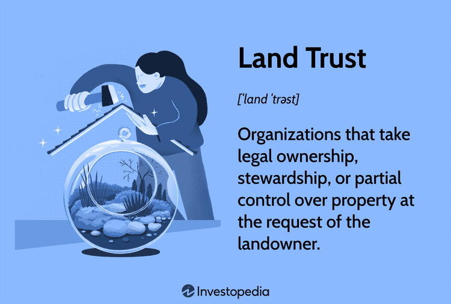

In today's dynamic economic environment, real estate property management, land trusts, and algorithmic trading stand out as emerging trends that are reshaping the investment landscape. These sectors, while distinct, frequently intersect and influence one another, creating a complex tapestry of opportunities for investors and stakeholders. Understanding the intricacies of each can unlock potential avenues for financial growth and stability.

Real estate property management involves the comprehensive operation, control, and oversight of real estate assets. It plays a critical role in maintaining and enhancing the value of properties, ensuring optimal income generation, and managing tenant relationships. On the other hand, land trusts serve as valuable legal entities that aid in protecting and managing real property by offering privacy and asset protection. They simplify the process of property transfer and hold particular significance in estate planning. 

Meanwhile, algorithmic trading, known for its transformative impact on financial markets, is making strides within the real estate sector. By leveraging computer algorithms to automate trading decisions, algo trading leads to more informed and efficient investment choices. As these three domains intertwine, investors are presented with novel opportunities that leverage technology, legal frameworks, and strategic management to optimize returns.

This article aims to explore these intersections and implications, offering insights into how these emerging trends can work collaboratively to enhance investment outcomes. Initial exploration will focus on understanding the basics of real estate property management, land trusts, and algorithmic trading. By engaging with these concepts, investors can harness their potential to navigate and capitalize on the evolving economic environment effectively.

## Table of Contents

## Real Estate Property Management

Property management encompasses the operation, control, maintenance, and oversight of real estate assets. The primary objective is to maintain and potentially enhance the value of the property, thereby ensuring sustained income generation. Effective property management is crucial in optimizing the intrinsic worth of real estate assets through meticulous upkeep and strategic enhancements. This process begins with a strategic plan that identifies both short-term maintenance requirements and long-term property goals.

The responsibilities of property managers are multifaceted. They manage tenant relations, which include addressing tenant inquiries, negotiating lease terms, and ensuring adherence to lease agreements. A robust relationship fosters tenant satisfaction, reducing turnover rates and vacancy periods. Maintenance responsibilities cover regular inspections and timely repairs to prevent potential structural issues and maintain safety standards. Financial reporting is another critical responsibility, requiring managers to track and analyze income and expenditures, thereby providing property owners with transparency regarding the asset's financial performance.

Technological advancements are revolutionizing property management by enhancing process efficiency and accuracy. Software solutions streamline tasks such as accounting, reporting, and tenant communication. Automation tools facilitate seamless operations, allowing managers to focus on strategic planning rather than repetitive tasks. For example, online platforms for rent collection and maintenance requests improve convenience for both managers and tenants, reducing the possibility of errors and facilitating efficient service delivery.

Looking forward, sustainability and smart technology integration are predicted trends in property management. Sustainable practices not only meet legislative and environmental demands but also appeal to increasingly eco-conscious consumers, potentially reducing operational costs and boosting property appeal. Smart technology integration, like IoT devices, enhances the functionality and security of the properties, providing real-time data analytics. Smart systems can manage energy efficiency by optimizing lighting, heating, and cooling systems based on usage, contributing to cost savings and reduced environmental impact.

In summary, property management serves a vital function in enhancing the operational and financial performance of real estate assets. The incorporation of technological advancements and sustainable practices is expected to continue shaping the industry, pushing it toward more efficient and environmentally conscious operations. These innovations are crucial for staying competitive and meeting the evolving needs of property owners and tenants alike.

## Understanding Land Trusts

A land trust is a structured legal mechanism designed to assume ownership or authority over real property, primarily to provide owners with privacy and asset protection. By transferring ownership to a trust, the actual owner’s identity remains confidential, as the trust itself is recorded as the property owner in public records. This privacy aspect is particularly appealing to those who wish to keep their property ownership details hidden from public scrutiny. Moreover, land trusts serve as a protective barrier against legal claims and potential litigations, effectively shielding owners' assets.

One of the significant advantages of land trusts is their ability to simplify the property transfer process. Unlike conventional transfers that might require extensive documentation and public records changes, transferring property within a trust can be more straightforward, often requiring nothing more than amending the trust's terms or transferring beneficial interests.

Land trusts differ from other types of trusts such as revocable living trusts or irrevocable trusts mainly in their specific focus and flexibility. While both land trusts and living trusts can be used for estate planning by designating beneficiaries and avoiding probate, land trusts are particularly geared toward property anonymity and control without transferring ownership publicly. Irrevocable trusts, on the other hand, involve relinquishing ownership entirely for asset protection or tax advantages, which often means less flexibility for the grantor.

In estate planning, land trusts are incredibly beneficial. They not only protect elder family members' privacy and keep real estate assets safe from claims, but they can also facilitate a smoother transition of property to heirs upon the owner’s death without going through probate. This benefit can be extended further within property management by allowing owners or trustees to manage, lease, or sell the property without divulging ownership details, thus retaining operational control through their appointed trustee.

Overall, land trusts provide a strategic tool in both protecting and managing real estate assets, ensuring that ownership remains discreet while still allowing comprehensive control and efficient transfer mechanisms.

## Algo Trading in Real Estate Markets

Algorithmic trading, commonly referred to as algo trading, is a method of executing trades using pre-programmed algorithms that account for factors such as timing, price, and [volume](/wiki/volume-trading-strategy). While algo trading has long been prevalent in the financial markets, its potential application to real estate markets is garnering increasing interest. At its core, algo trading enhances market efficiency by minimizing human intervention, thus reducing the possibility of errors and biases in trading decisions. 

The primary driver behind the interest in employing algo trading in real estate is the growing complexity and volume of data available. Real estate markets are influenced by myriad factors such as interest rates, economic conditions, demographic shifts, and local market trends. Algorithms can process vast datasets that are beyond human capability, providing insights that can lead to more informed and timely investment decisions.

Implementing algo trading in real estate transactions offers several potential benefits. First, it can significantly speed up the transaction process by quickly analyzing market conditions and executing trades. This speed is crucial in volatile markets where the timing of transactions directly affects profitability. Furthermore, algo trading can facilitate better risk management by continuously monitoring market conditions and adjusting investment strategies in real-time.

However, there are challenges associated with integrating algo trading into real estate markets. Unlike stocks or other financial instruments, real estate is inherently less liquid and involves more complex transaction processes. Moreover, real estate data can often be disparate and unstructured, necessitating sophisticated algorithms capable of accurately interpreting this information. Data privacy and security also pose significant concerns, as sensitive information must be protected against breaches.

Despite these challenges, the opportunity for algo trading in real estate is burgeoning. Specialized platforms are emerging that cater specifically to real estate markets, offering tools that integrate [machine learning](/wiki/machine-learning) and [artificial intelligence](/wiki/ai-artificial-intelligence) to enhance algorithmic functionalities. These platforms aim to streamline property management and investment analysis, making algo trading a viable option for institutional and individual investors alike.

In conclusion, while the application of algo trading to real estate markets is still in its nascent stages, its potential to revolutionize the sector is undeniable. By automating trading processes and leveraging vast datasets for better investment decisions, algo trading represents a promising frontier in real estate investment strategies. As technological advancements continue to evolve, it is likely that the role of algo trading will expand, creating new opportunities for efficiency and profitability within the real estate sector.

## Interconnection of Real Estate, Land Trusts, and Algo Trading

The interconnection of real estate, land trusts, and [algorithmic trading](/wiki/algorithmic-trading) represents a frontier of innovation in investment strategy. These domains, while distinct in their traditional applications, present substantial opportunities for synergies that could enhance investment outcomes when combined strategically.

Land trusts play a crucial role in enhancing the efficiency and security of real estate investments. By holding property in a trust, investors can maintain a degree of anonymity, thus protecting their identity and wealth. This structure also simplifies the process of property transfer and management. For example, if a property held in a land trust needs to be sold or transferred, the process can be expedited without the need for multiple parties’ approvals or cumbersome legal procedures. This efficiency is particularly attractive to investors seeking to streamline their portfolios.

Algorithmic trading, or algo trading, has the potential to significantly improve decision-making processes in both real estate management and land trust operations. By leveraging computer algorithms, investors can analyze large datasets to identify market trends and execute trades at optimal times. This approach can reduce the emotional biases associated with investing, offering a disciplined strategy driven by data analytics. For example, by incorporating machine learning models, investors can predict real estate price movements and adjust their investment strategies proactively.

A hypothetical scenario illustrating the combined use of these strategies might involve an investor using a land trust to manage several real estate properties across diverse geographic locations. The investor employs algorithmic trading to monitor housing market indicators, such as interest rates and demographic shifts, to decide when to acquire or divest real estate assets. This combination of legal protections from the land trust and data-driven insights from algorithmic trading could optimize the investor's portfolio performance while minimizing risk.

Looking forward, the integration of technological and financial strategies is poised to transform the real estate landscape. Advances in blockchain technology could enhance land trust transactions by ensuring transparency and security, while AI-driven analytics could further refine algorithmic trading models, making them more predictive and potent. The convergence of these innovations suggests a future where real estate investments are not only protected and efficient but also dynamically attuned to market changes.

Together, real estate, land trusts, and algorithmic trading present a robust framework for sophisticated investment strategies that maximize returns while prioritizing security and efficiency. As these fields continue to evolve, stakeholders have an opportunity to capitalize on technological advancements and legal instruments to navigate the complex terrain of property investments strategically.

## Conclusion

In summarizing the intersectional benefits and innovations brought about by real estate property management, land trusts, and algorithmic trading, it becomes evident that these areas provide substantial opportunities for investors to enhance their financial portfolios. Real estate property management has consistently demonstrated its capacity to increase asset value and generate income through effective oversight, operational excellence, and technological integration. These advancements contribute to more sustainable and financially viable property investments.

Land trusts offer robust solutions for privacy and asset protection. By implementing land trusts, property owners can achieve increased anonymity, protect their property from litigation, and streamline property transfers, making them a strategic component of estate planning.

Algorithmic trading presents a transformative approach to investing by leveraging data-driven decision-making for improved market efficiency. Its potential to automate and enhance transactions can facilitate more informed and timely investments within the real estate sector.

The convergence of these three domains illustrates a comprehensive framework where each component complements and strengthens the others. Land trusts can enhance the security of real estate investments, while property management ensures continued asset growth. Meanwhile, algorithmic trading can unlock nuanced investment strategies, refining the decision-making process. Together, they provide a powerful toolkit for maximizing investment outcomes.

For stakeholders, staying informed about these evolving sectors is crucial for achieving potential financial growth. By incorporating real estate property management, land trusts, and algorithmic trading into a diversified investment strategy, stakeholders can leverage these innovations to their advantage. The integration of technology and legal instruments within real estate promises transformative outcomes, reshaping traditional approaches towards more efficient and effective investment methodologies.

Therefore, it is essential for investors and stakeholders to explore these avenues thoroughly and continuously. Gaining a deeper understanding of the interplay between these sectors will enable more informed and strategic investment decisions, paving the way for enhanced growth and sustainability in an increasingly complex economic landscape.

## References & Further Reading

[1]: "Basic Real Estate & Property Trust Concepts for New Investors." Investopedia. Retrieved from https://www.investopedia.com/articles/investing/100515/basic-real-estate-property-trust-concepts-new-investors.asp

[2]: Lopez de Prado, M. (2018). ["Advances in Financial Machine Learning"](https://www.amazon.com/Advances-Financial-Machine-Learning-Marcos/dp/1119482089). Wiley.

[3]: Jansen, S. (2018). ["Machine Learning for Algorithmic Trading"](https://github.com/stefan-jansen/machine-learning-for-trading). Packt Publishing.

[4]: Chan, E. P. (2008). ["Quantitative Trading: How to Build Your Own Algorithmic Trading Business"](https://github.com/ftvision/quant_trading_echan_book). Wiley.

[5]: Satchell, S., & Scowcroft, A. (2000). ["A Demystification of the Black-Litterman Model: Managing Quantitative and Traditional Portfolio Construction"](https://www.semanticscholar.org/paper/A-demystification-of-the-Black%E2%80%93Litterman-model%3A-and-Satchell-Scowcroft/71414d2f1971e95eaeab3f3d70edea95b3cfef28). Springer.

[6]: Aronson, D. R. (2007). ["Evidence-Based Technical Analysis: Applying the Scientific Method and Statistical Inference to Trading Signals"](https://onlinelibrary.wiley.com/doi/book/10.1002/9781118268315). Wiley.