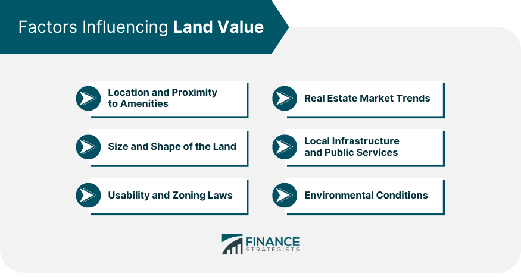

## Table of Contents

## What is land value?

Land value is the worth of a piece of land without considering any buildings or improvements on it. It is determined by factors like location, the land's potential uses, and how easy it is to access. For example, land in a busy city center is usually worth more than land in a quiet rural area because more people want to use it for businesses or homes.

People often use land value to figure out property taxes or to decide how much to pay for a piece of land. Appraisers look at recent sales of similar land nearby and consider what the land could be used for in the future. This helps them come up with a fair price. Understanding land value is important for both buyers and sellers to make smart decisions about land.

## How is land value different from property value?

Land value is just the worth of the land itself, without counting any buildings or improvements on it. It depends on things like where the land is, what it could be used for, and how easy it is to get to. For example, a piece of land in the middle of a busy city might be worth a lot because many people want to build shops or homes there. On the other hand, land in a quiet countryside might not be worth as much because fewer people are interested in it.

Property value, on the other hand, includes the value of the land plus the value of any buildings or improvements on it. So, if you have a house on a piece of land, the property value would be the worth of the land plus the worth of the house. Property value can change based on how well the buildings are kept up, how old they are, and what the local real estate market is like. Understanding the difference between land value and property value is important for buying, selling, or taxing land and buildings.

## What factors influence the value of land?

Several things can affect how much land is worth. One big factor is where the land is located. Land in a busy city is usually worth more than land in a quiet rural area because more people want to use it for things like shops or homes. Another factor is what the land can be used for. If it's easy to build on and close to important places like schools or hospitals, it will be worth more. Also, how easy it is to get to the land matters. If it's near good roads or public transport, its value goes up.

Other things that can change the value of land include the size and shape of the land. Bigger pieces of land or those with a good shape that are easy to build on are worth more. The natural features of the land, like if it has a nice view or good soil for farming, can also make a difference. Economic conditions play a role too. If the economy is doing well, more people might want to buy land, which can push its value up. On the other hand, if the economy is struggling, fewer people might be interested, and the value could go down.

## How does location affect land value?

Location is a big deal when it comes to how much land is worth. Land in a busy city is usually worth a lot more than land out in the countryside. This is because more people want to use city land for things like shops, offices, or homes. Being close to important places like schools, hospitals, or shopping centers can make land even more valuable. People are willing to pay more for land that's easy to get to and in a spot where lots of things are happening.

Another thing that makes location important is how easy it is to reach the land. If the land is near good roads or public transport, it's going to be worth more. People like land that's easy to get to because it makes life more convenient. Also, if the land is in an area where the economy is doing well, its value can go up because more people want to buy or invest in it. So, where the land is can really change how much it's worth.

## What role does zoning play in determining land value?

Zoning is a big deal when it comes to how much land is worth. It's all about the rules that say what you can and can't do with a piece of land. If the land is zoned for things like shops, offices, or homes, it can be worth a lot more. That's because more people want to use it for those things. On the other hand, if the land is zoned for something less popular, like farming or just open space, it might not be worth as much.

Zoning can also change over time, which can make land values go up or down. If the rules change to allow more types of buildings or businesses, the land can become more valuable. For example, if a piece of land goes from being just for farming to being okay for houses, its value can jump up because more people want to buy it. So, understanding the zoning rules is important for figuring out how much land is really worth.

## How do economic conditions impact land values?

Economic conditions play a big role in how much land is worth. When the economy is doing well, people have more money to spend and invest. This means more people want to buy land, which can push its value up. Companies might want to build new factories or stores, and people might want to buy homes. All this demand can make land prices go up. On the flip side, if the economy is struggling, fewer people might be looking to buy land. They might be worried about their jobs or saving money, so they're not as interested in buying land. This can make land values go down because there's less demand.

Interest rates are another part of economic conditions that affect land values. When interest rates are low, it's cheaper to borrow money to buy land. This can make more people want to buy, which can drive up land prices. But if interest rates go up, borrowing money becomes more expensive, and fewer people might want to buy land. This can cause land values to drop. So, the overall health of the economy and things like interest rates can really change how much land is worth.

## What methods are used to appraise land value?

Appraising land value means figuring out how much a piece of land is worth. One common way to do this is by looking at what similar pieces of land nearby have sold for recently. This is called the "sales comparison approach." Appraisers look at these sales to see how much people are willing to pay for land in the area. They also think about what the land could be used for in the future. If the land is in a place where lots of people want to build things, it will be worth more.

Another method is the "income approach," which is used more for land that can make money, like land for rental properties or businesses. Appraisers figure out how much money the land could make in the future and then use that to decide its value. They look at things like how much rent the land could bring in or how much profit a business on the land could make. This method is good for understanding the value of land based on what it can earn over time.

## How does the concept of highest and best use influence land valuation?

The idea of highest and best use is important when figuring out how much land is worth. It means finding the best way to use the land that will make the most money. When appraisers look at land, they think about what people could do with it that would make it the most valuable. This could be building homes, shops, offices, or even keeping it as a park if that's what people want most. The highest and best use depends on things like where the land is, what the zoning rules say, and what people need in that area.

For example, if a piece of land is in the middle of a busy city, the highest and best use might be to build a tall office building because lots of businesses want to be there. But if the same piece of land was in a quiet countryside, maybe the best use would be for farming or a nature reserve. Appraisers use the idea of highest and best use to guess how much people would be willing to pay for the land based on what they could do with it. This helps them come up with a fair price that reflects what the land could be worth in the future.

## What are the differences between market value, assessed value, and appraised value of land?

Market value is what someone would pay for land if it was for sale today. It's based on what people are willing to pay and what similar pieces of land nearby have sold for recently. Appraisers look at the market to figure out this value. It can change a lot because it depends on what's happening in the economy and how much people want to buy land at that time.

Assessed value is used for figuring out property taxes. It's decided by a government office and is usually less than the market value. The assessed value can be based on the market value, but it might not change as often. It's important because it helps decide how much tax you have to pay on your land.

Appraised value is what a professional appraiser says the land is worth. They use different methods, like looking at recent sales of similar land or figuring out what the land could earn if used for something like a business. The appraised value can be close to the market value, but it's a more detailed guess made by someone who knows a lot about land values.

## How do land value taxes work and what impact do they have on land valuation?

Land value taxes are a type of tax where you pay based on how much your land is worth, not including any buildings or improvements on it. Instead of taxing the whole property, this tax only looks at the value of the land itself. The idea is to encourage people to use their land in the best way possible. If the land is sitting empty and not being used well, the owner still has to pay a tax on its value. This can push people to develop the land or sell it to someone who will.

These taxes can change how much land is worth because they make people think about what they're doing with their land. If the tax is high, people might want to use their land to make money, like building homes or businesses, to cover the tax cost. This can make the land more valuable because it's being used in a way that brings in money. On the other hand, if the tax is low, people might not feel as much pressure to use their land, and its value might not go up as much. So, land value taxes can affect how people see the worth of their land and what they decide to do with it.

## What are some advanced statistical models used for predicting land values?

One advanced way to predict land values is by using a model called hedonic pricing. This model looks at different things about the land, like where it is, how big it is, and what's around it. It then figures out how much each of these things adds to or takes away from the land's value. For example, being close to a good school might add a lot to the value, while being near a noisy highway might take away from it. By adding up all these factors, the model can guess how much the land is worth.

Another method is called spatial autoregressive models. These models look at how land values are connected to each other based on where they are. If one piece of land goes up in value, it might affect the value of the land next to it. These models use math to understand these connections and predict how changes in one area might change the values of land in other areas. They're good for understanding how neighborhoods or cities work together when it comes to land values.

## How do global economic trends and policies affect land values in different regions?

Global economic trends and policies can have a big impact on land values in different regions. When the world economy is doing well, more people and businesses want to invest in land, which can drive up its value. For example, if a country has a strong economy, people from other countries might want to buy land there because they think it's a safe place to put their money. On the other hand, if the world economy is struggling, fewer people might want to buy land, which can make its value go down. Policies like interest rates set by central banks can also affect how much people are willing to pay for land. If interest rates are low, borrowing money to buy land is cheaper, so more people might want to buy, pushing up land values.

Different regions can feel the effects of global trends and policies in different ways. For example, a policy that makes it easier for foreigners to buy land in one country might make land values there go up a lot. But in another country with strict rules about who can buy land, the same global trend might not have as much of an effect. Also, if a region depends a lot on one type of business, like tourism or farming, global changes in those industries can change how much land is worth. If tourism drops because of a global economic downturn, land values in popular tourist spots might go down. So, understanding global trends and policies is important for figuring out how much land might be worth in different places.

## What is the key to understanding land value in real estate?

Land value is a crucial determinant in the real estate sector, representing the worth of a piece of land independently and in conjunction with any existing improvements. Several factors play a pivotal role in influencing land value, chief among them being location, accessibility, and potential for development. A prime location generally results in higher land values due to increased demand and desirability. Accessibility—including proximity to transportation, amenities, and infrastructure—further enhances land value by offering convenience and connection, thereby increasing attractiveness for residential or commercial use.

The potential for development is another significant [factor](/wiki/factor-investing), as land that can be developed or redeveloped for profitable ventures is typically valued higher. This potential is assessed based on zoning laws, land use regulations, and the existing growth trajectory of the area. For instance, a parcel of land zoned for commercial development in a rapidly growing urban area might have a higher value compared to land with restricted use in a similar location.

Traditional appraisal methods are employed to accurately determine land value. These methods include analyzing comparable sales, which involves comparing the land in question to similar parcels that have recently sold in the vicinity. This approach assumes that the market has valued similar properties appropriately. Market trends are also considered, including economic indicators, interest rates, and demographic shifts which can affect demand and land values over time.

Furthermore, assessing a land's potential use is critical in valuation. This involves understanding not only the current use but also permissible uses as dictated by zoning regulations and possible changes in land use policy. Accurate land appraisals are vital for multiple stakeholders; they set the foundation for pricing real estate transactions, guide investment decisions, and influence urban development policies.

Mathematically, the valuation can be expressed through models that account for these variables, such as:

$$
V = C + L \times (1 + D)
$$

Where $V$ represents the valuation, $C$ is the value of comparable sales, $L$ is the intrinsic land value, and $D$ denotes potential for development as a percentage increase in land value due to anticipated developments.

Accurate and careful assessment of these criteria ensures fair market value of land, facilitating optimal transactions and contributing to balanced urban development. As real estate markets evolve, blending traditional methods with modern technologies continues to refine land valuation processes, thus enhancing the precision and reliability of appraisals.

## What are Traditional Real Estate Valuation Techniques?

Traditional real estate valuation techniques are fundamental to assessing the worth of properties in the real estate market. These time-tested approaches provide a systematic framework to determine property value, ensuring accuracy and consistency. The main traditional valuation methods include the Sales Comparison Approach, the Cost Approach, and the Income Capitalization Approach. Each method serves a distinct purpose and is chosen based on the nature of the property and the availability of data.

The Sales Comparison Approach relies on evaluating a property by comparing it with similar properties that have recently been sold in the same area. This approach assumes that an informed purchaser would not pay more for a property than the cost of acquiring a similar one with comparable features. Adjustments are made for differences in physical characteristics, location, and amenities. For instance, if Property A has a swimming pool while Property B does not, an adjustment would be made to account for this difference when estimating Property B's value.

The Cost Approach considers the cost to replace or reproduce a property, taking into account both the current construction costs and the depreciation of the structure. This approach is particularly useful for appraising newer properties or those with specialized improvements. The formula for the Cost Approach typically involves calculating the value as:

$$
\text{Property Value} = \text{Cost of Reproduction or Replacement} - \text{Depreciation} + \text{Land Value}
$$

Depreciation accounts for factors such as physical wear and tear, functional obsolescence, and economic obsolescence. By subtracting the depreciation, appraisers arrive at a realistic estimate of the property's worth.

The Income Capitalization Approach is primarily used for income-generating properties, such as rental buildings. It estimates a property’s value based on its ability to generate income, applying a capitalization rate (cap rate) to the net operating income (NOI). The fundamental formula is:

$$
\text{Property Value} = \frac{\text{Net Operating Income (NOI)}}{\text{Capitalization Rate}}
$$

Net Operating Income is determined by subtracting operating expenses from the total income generated by the property. The capitalization rate is a reflection of the risk associated with the income stream and is influenced by factors such as market conditions and the property’s location.

Collectively, these traditional valuation techniques provide a robust foundation for determining property values, guiding investment decisions, and ensuring fair market transactions. While they are universally applied, the choice of method may vary depending on the specific circumstances and characteristics of the property being evaluated.

## References & Further Reading

[1]: Marney, J. P., & Tarbert, H. (2010). ["Corporate Valuation and Trading Strategies."](https://books.google.com/books/about/Corporate_Finance_for_Business.html?id=kqXJoDaBxnEC) Imperial College Press.

[2]: Baum, A., & Crosby, N. (2008). ["Property Investment Appraisal."](https://link.springer.com/article/10.1057/jba.2009.7) Wiley-Blackwell.

[3]: Rahman, H., & Adnan, M. H. (2020). ["Applications and Challenges of Blockchain in Real Estate: A Systematic Review."](https://pmc.ncbi.nlm.nih.gov/articles/PMC6627742/) IEEE Access.

[4]: Tsatsaronis, K., & Zhu, H. (2004). ["What Drives Housing Price Dynamics: Cross-Country Evidence."](https://www.bis.org/publ/qtrpdf/r_qt0403f.pdf) Bank for International Settlements Quarterly Review.

[5]: Fisher, J. D., & Lentz, G. H. (1990). ["The Appraisal of Real Estate."](https://www.deepdyve.com/lp/wiley/tax-reform-and-the-value-of-real-estate-income-property-dVQM8cmSQQ) Appraisal Institute.