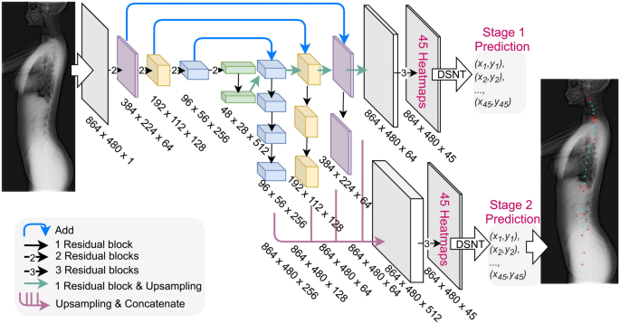

## Table of Contents

## What are landmarks in the context of machine learning?

In machine learning, landmarks are specific points or features in a dataset that are used to help algorithms understand and process the data more effectively. These points are often chosen because they represent important characteristics or patterns within the data. For example, in image recognition, landmarks might be key facial features like the eyes, nose, and mouth that help the algorithm identify a face. By focusing on these landmarks, the machine learning model can simplify complex data and improve its accuracy and efficiency.

Landmarks are particularly useful in tasks like dimensionality reduction and clustering. In dimensionality reduction, landmarks help to map high-dimensional data into a lower-dimensional space while preserving important structures. This makes it easier for the algorithm to analyze and visualize the data. In clustering, landmarks can serve as reference points that help group similar data points together. By using landmarks, the algorithm can more easily identify patterns and relationships within the dataset, leading to better performance and more meaningful results.

## How are landmarks used in image recognition tasks?

In image recognition tasks, landmarks are specific points in an image that help the computer understand what it is looking at. For example, if the image is of a face, landmarks might be the corners of the eyes, the tip of the nose, and the corners of the mouth. By identifying these landmarks, the computer can better recognize and categorize the face, even if the face is turned or partially hidden. Landmarks act like anchors that guide the computer in figuring out the important parts of the image.

These landmarks are often used in algorithms to align and normalize images. This means that the computer can compare different images more easily, even if they are taken from different angles or under different lighting conditions. For instance, once the landmarks on a face are identified, the computer can adjust the image so that all faces are looking straight ahead. This makes it simpler for the computer to match the image to a database of known faces, improving the accuracy of face recognition systems.

## What is the difference between global and local landmarks in machine learning?

In [machine learning](/wiki/machine-learning), global landmarks are points or features that are important for the entire dataset. They help the computer understand the big picture or the overall structure of the data. For example, in a dataset of images of different animals, a global landmark might be the general shape of an animal's body. This helps the computer to recognize that all these images are of animals, even if they are different kinds.

On the other hand, local landmarks are points or features that are important for smaller parts of the data. They help the computer focus on details within specific images or subsets of the data. Using the same example of animal images, a local landmark might be the shape of an animal's ear. This helps the computer tell the difference between a cat and a dog, even though both are animals.

Both types of landmarks are useful in different ways. Global landmarks help with broad categorization and understanding, while local landmarks help with finer distinctions and details. Together, they make machine learning models more accurate and efficient.

## Can you explain how landmarks are detected in facial recognition?

In facial recognition, landmarks are specific points on a face that help computers recognize who someone is. These points might be the corners of the eyes, the tip of the nose, or the corners of the mouth. To find these landmarks, computers use special algorithms that look at the pixels in an image. The algorithms try to match the patterns they see to what they know about where these landmarks should be on a typical face. For example, the algorithm might look for two darker spots close together to find the eyes.

Once the computer thinks it has found a landmark, it checks to see if it makes sense with the rest of the face. If the eyes are found, the algorithm might then look for the nose in the right place below the eyes. This helps the computer make sure it's not making mistakes. By using these landmarks, the computer can then adjust the image to make all faces look the same way, which makes it easier to compare faces and recognize people accurately.

## What are some common algorithms used for landmark detection?

One common algorithm for landmark detection is the Active Shape Model (ASM). This algorithm starts with a rough guess of where landmarks should be on a face. It then adjusts these guesses by looking at the image and moving the landmarks to where they fit best. The ASM uses a model of what a face should look like to help it make these adjustments. This makes it good at finding landmarks even if the face is turned or partially hidden.

Another popular method is the Convolutional Neural Network (CNN). CNNs are good at finding patterns in images. They use layers of filters to look at different parts of the image and figure out where landmarks are. For example, one layer might look for edges, another for corners, and another for specific shapes like eyes or noses. By combining what all these layers see, the CNN can accurately pinpoint landmarks on a face.

A third approach is the Dlib library's facial landmark detector, which uses a pre-trained model. This model was trained on a lot of face images and can quickly find 68 specific points on a face. It's easy to use and works well for many applications. For example, you can use it in Python like this:

```python
import dlib
import cv2

# Load the detector
detector = dlib.get_frontal_face_detector()
predictor = dlib.shape_predictor("shape_predictor_68_face_landmarks.dat")

# Load an image
image = cv2.imread("image.jpg")
gray = cv2.cvtColor(image, cv2.COLOR_BGR2GRAY)

# Detect faces
faces = detector(gray)

for face in faces:
    # Find landmarks
    landmarks = predictor(gray, face)
    for n in range(0, 68):
        x = landmarks.part(n).x
        y = landmarks.part(n).y
        cv2.circle(image, (x, y), 1, (0, 255, 0), -1)

# Show the image with landmarks
cv2.imshow("Output", image)
cv2.waitKey(0)
cv2.destroyAllWindows()
```

## How does the accuracy of landmark detection impact the performance of machine learning models?

The accuracy of landmark detection plays a big role in how well machine learning models perform. When landmarks are detected accurately, the model can better understand the important parts of the data. For example, in facial recognition, if the computer can correctly find the eyes, nose, and mouth, it can more easily recognize and match faces. This leads to fewer mistakes and better results. If the landmarks are not detected accurately, the model might get confused and make wrong guesses about what it's seeing.

In other tasks like image classification or object detection, accurate landmark detection helps the model focus on the right details. If the model can pinpoint where the important features are, it can classify images more correctly or detect objects more precisely. For instance, in a car recognition system, if the model accurately finds the wheels and headlights, it can better tell different car models apart. Overall, the better the landmark detection, the more reliable and effective the machine learning model will be.

## What are the challenges faced when using landmarks in machine learning applications?

One big challenge with using landmarks in machine learning is that they can be hard to find accurately. Landmarks need to be detected correctly for the model to work well, but things like bad lighting, different angles, or partial views can make it tough. For example, if someone is wearing sunglasses, it can be hard for the computer to find their eyes. Also, if the model was trained on images of people looking straight ahead, it might struggle with faces that are turned to the side. This can lead to mistakes and make the model less useful.

Another challenge is that landmarks can be different for everyone. People have different face shapes, sizes, and features, so what works as a landmark for one person might not work for another. This means the model needs to be flexible and able to adjust to these differences. If it's not, it might not recognize someone just because they have a unique feature. This can make it hard to use the model in real life where everyone looks a bit different.

Lastly, finding and using landmarks can take a lot of computer power. The algorithms that detect landmarks have to look at a lot of details in the images, which can slow things down. This can be a problem if you need quick results, like in real-time face recognition systems. Balancing the need for accuracy with the need for speed is a big challenge when using landmarks in machine learning applications.

## How can landmarks be used to improve the robustness of machine learning models?

Landmarks can make machine learning models more robust by helping them focus on the most important parts of the data. For example, in facial recognition, landmarks like the eyes and nose help the computer understand where to look, even if the face is turned or partially hidden. By using landmarks, the model can better handle changes in lighting, angles, and other conditions that might otherwise confuse it. This means the model can still recognize people accurately, even in tough situations.

Another way landmarks improve robustness is by making models more adaptable to different kinds of data. Since landmarks are specific points that are important across many examples, the model can learn to recognize these points in new and varied images. This helps the model work well with different people or objects, even if they look a bit different from what it was trained on. By focusing on these key landmarks, the model becomes more flexible and reliable in real-world use.

## What role do landmarks play in pose estimation and object tracking?

In pose estimation, landmarks are important points on a person's body, like the joints of the arms and legs. These points help the computer understand how a person is moving and standing. By tracking these landmarks, the computer can figure out the whole pose of the person. For example, if the computer sees the landmarks for the shoulders, elbows, and wrists, it can tell if someone is raising their arm. This helps in things like sports analysis or virtual reality, where knowing the exact pose is important.

In object tracking, landmarks are key features on the object that the computer follows as it moves. These could be corners, edges, or other distinct points on the object. By keeping an eye on these landmarks, the computer can track the object's path across different frames of a video. For example, in a car tracking system, the computer might use the landmarks of the car's headlights and wheels to follow it through traffic. This makes it easier for the computer to keep up with the object, even if it moves quickly or changes direction.

## How do advancements in deep learning affect landmark detection techniques?

Advancements in [deep learning](/wiki/deep-learning) have greatly improved landmark detection techniques by making them more accurate and able to handle tougher situations. Deep learning models, like Convolutional Neural Networks (CNNs), can learn to find landmarks by looking at many examples. They get better at spotting the important points on faces or bodies, even if the images are not perfect. For example, these models can still find the eyes and nose on a face that is turned away or in bad lighting. This makes them really useful for real-world applications where things are not always ideal.

These improvements also make landmark detection faster and more reliable. Deep learning models can process images quickly because they use special layers that look at different parts of the image at the same time. This means they can find landmarks in real-time, which is important for things like tracking people in videos or helping with surgery. By using deep learning, landmark detection techniques have become a key part of many machine learning systems, making them more robust and able to work well in different situations.

## What are some state-of-the-art methods for landmark localization in medical imaging?

In medical imaging, state-of-the-art methods for landmark localization often use deep learning techniques, especially Convolutional Neural Networks (CNNs). These models are trained on large datasets of medical images, like X-rays or MRIs, to find important points like the corners of bones or the edges of organs. One popular approach is using U-Net, a type of CNN that is good at finding landmarks in images. U-Net works by first breaking the image down into smaller parts and then building it back up, which helps it find the exact spots it needs to focus on.

Another advanced method is the use of Heatmap Regression. This technique turns the problem of finding landmarks into a problem of predicting a heatmap, where the brightest spots show where the landmarks are. By using heatmaps, the computer can find landmarks more accurately, even if they are hard to see. Heatmap Regression is often used with CNNs to make the predictions even better. These methods have made it easier for doctors to use medical images to plan surgeries or track how a patient's condition is changing over time.

## How can transfer learning be applied to enhance landmark detection across different domains?

Transfer learning can help make landmark detection better across different areas by using what a model has already learned in one place and using it in another. For example, if a model is good at finding landmarks on faces, you can take what it knows and use it to help it find landmarks on X-rays or pictures of animals. This saves time because the model doesn't have to start from scratch. It already knows how to find important points, so it just needs to learn the new details.

To do this, you start with a model that's already been trained on one kind of data. Then, you use this model as a starting point and train it a bit more with the new kind of data. This way, the model can use what it already knows to find landmarks faster and more accurately in the new area. For example, if you have a model that's good at finding the eyes and nose on faces, you can teach it to find the joints on an X-ray by showing it a few examples. This makes the model more flexible and useful in different situations.

## References & Further Reading

[1]: Belagiannis, V., & Zisserman, A. (2017). ["Recurrent Human Pose Estimation."](https://arxiv.org/abs/1605.02914) In ECCV Workshops.

[2]: Bulat, A., & Tzimiropoulos, G. (2017). ["How far are we from solving the 2D & 3D face alignment problem? (and a dataset of 230,000 3D facial landmarks)."](https://arxiv.org/abs/1703.07332) In Proceedings of the IEEE International Conference on Computer Vision (ICCV).

[3]: Wu, Y., & He, K. (2019). ["Facial landmark detection with cross-domain adaptation."](https://arxiv.org/abs/1805.05563) CVPR 2019.

[4]: Ronneberger, O., Fischer, P., & Brox, T. (2015). ["U-Net: Convolutional Networks for Biomedical Image Segmentation."](https://link.springer.com/chapter/10.1007/978-3-319-24574-4_28) In Lecture Notes in Computer Science.

[5]: Kazemi, V., & Sullivan, J. (2014). ["One millisecond face alignment with an ensemble of regression trees."](https://ieeexplore.ieee.org/document/6909637) In Proceedings of the IEEE Conference on Computer Vision and Pattern Recognition (CVPR).