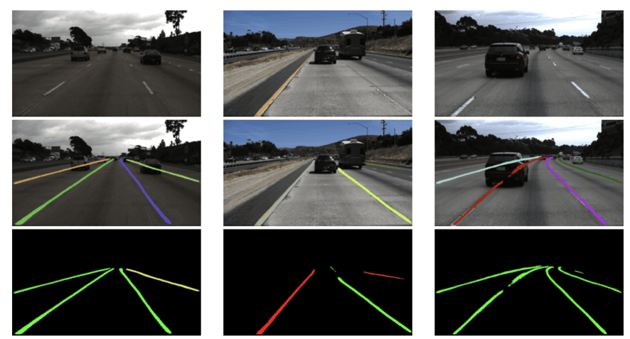

## Table of Contents

## What is lane detection and why is it important in autonomous driving?

Lane detection is a technology used in cars that can drive themselves. It helps the car see and understand where the lanes are on the road. The car uses cameras and sometimes other sensors to look at the lines painted on the road. By knowing where the lanes are, the car can stay in its own lane and not go into other lanes where other cars are driving.

This technology is very important for self-driving cars because it helps them drive safely. If a car knows where the lanes are, it can make sure it doesn't go off the road or into another lane by accident. This makes driving safer for everyone on the road. Without lane detection, self-driving cars would have a harder time knowing where to go, which could lead to more accidents.

## How do lane detection models work at a basic level?

Lane detection models work by using computer vision techniques to identify the lines on the road. These models take images from a camera mounted on the car and process them to find the edges and shapes that represent lane markings. The process usually starts with converting the image to grayscale and then applying edge detection algorithms, like the Canny edge detector, to highlight the lane lines. After that, the model uses techniques like the Hough Transform to find straight lines in the image that could be lane markings.

Once the lines are detected, the model needs to figure out which lines are the actual lanes the car should follow. This involves sorting the detected lines into left and right lanes and then using mathematical models to predict where these lanes will be in the next few frames. The car uses this information to adjust its steering and stay within the detected lanes. The whole process happens very quickly, often in real-time, so the car can react to changes on the road as they happen.

## What are the common challenges faced by lane detection systems?

Lane detection systems face several challenges that can make it hard for them to work well. One big challenge is bad weather like rain, snow, or fog. These conditions can make the road markings hard to see or even hide them completely. Shadows and changes in light can also cause problems because they can make the lines look different or disappear. Another challenge is when the road markings are old or worn out. If the lines are faded or not clear, the system might have trouble figuring out where the lanes are.

Another issue is when the road has construction or is in a city with lots of turns and curves. In these places, the lanes might not be straight, and there could be extra lines or signs that confuse the system. Also, if there are no clear lane markings, like on some rural roads, the system has to guess where the lanes should be, which can lead to mistakes. All these challenges mean that lane detection systems need to be very smart and able to handle many different situations to keep the car safe and on the right path.

## What is YOLOP and how does it differ from other lane detection models?

YOLOP, which stands for "You Only Look Once Plus," is a type of model used for both detecting lanes and objects in a single step. This is different from many other lane detection models that might need several steps to first detect objects and then find lanes. YOLOP uses a special way of working called a "one-stage" method. This means it looks at the picture from the car's camera just once and quickly figures out where the lanes and objects are. This makes it faster and more efficient, which is really important for self-driving cars that need to make quick decisions.

Compared to other models, YOLOP is special because it combines lane detection and object detection in a way that helps them work better together. Other models might use separate parts for each job, which can slow things down and make mistakes more likely. YOLOP's design helps it understand the whole picture better, so it can make smarter choices about where the lanes are and how to avoid objects on the road. This makes it a powerful tool for making self-driving cars safer and more reliable.

## Can you explain the architecture of the YOLOP model?

The YOLOP model is made up of three main parts that work together to detect lanes and objects at the same time. The first part is called the backbone, which is like the brain of the model. It takes the picture from the car's camera and turns it into something the model can understand better. The backbone uses a type of network called CSPDarknet, which helps it find important parts of the picture quickly. After the backbone does its job, the information goes to two other parts: the neck and the head. The neck helps connect the backbone to the head by making the information even easier to use. The head is where the model actually finds the lanes and objects. It has two special parts: one for detecting objects and another for finding lanes.

The object detection part of the head uses something called YOLOX, which is good at spotting different things on the road, like cars or people. It looks at the whole picture and figures out where these things are and what they are. The lane detection part, on the other hand, uses a special way of working called a segmentation head. This part looks at the picture and tries to figure out which parts are lanes. It does this by making a map of the road and marking where the lanes should be. By working together, these two parts help the car understand the road better and make safer decisions. The whole process is very fast because YOLOP does everything in one go, which is why it's so useful for self-driving cars.

## What datasets are commonly used to train lane detection models like YOLOP?

Lane detection models like YOLOP are often trained on datasets that have lots of pictures of roads with clear lane markings. One common dataset is called TuSimple, which has thousands of images taken from cars driving on highways. These images come with labels that show where the lanes are, so the model can learn to find them. Another popular dataset is CULane, which has more types of roads, like city streets and curvy roads. This helps the model learn to detect lanes in different situations, not just on straight highways.

Another dataset that is used is called BDD100K, which stands for Berkeley DeepDrive 100K. This dataset has 100,000 images from different places and times of day, so it can help the model learn to work in many different conditions, like rain or at night. All these datasets are important because they give the model lots of different examples to learn from, making it better at finding lanes no matter where the car is driving.

## How is the performance of lane detection models evaluated?

The performance of lane detection models is evaluated by looking at how well they can find and follow the lines on the road. One way to do this is by using something called accuracy, which measures how often the model gets the lane lines right. Another way is by checking the model's precision and recall. Precision tells us how many of the lines the model found are actually real lane lines, while recall tells us how many of the real lane lines the model was able to find. These measures help us understand if the model is good at spotting all the lanes and not making too many mistakes.

Another important measure is the Intersection over Union (IoU), which is used a lot in tasks like lane detection. IoU looks at how much the area that the model thinks is a lane overlaps with the actual lane area. If the model's guess and the real lane line match up well, the IoU will be high, which means the model is doing a good job. People also use something called the F1 score, which combines precision and recall into one number. A high F1 score means the model is both accurate and complete in finding the lanes. By using these different ways to check performance, we can make sure the lane detection model works well and keeps self-driving cars safe on the road.

## What are the key metrics used to assess the accuracy of lane detection?

The key metrics used to assess the accuracy of lane detection include accuracy, precision, recall, Intersection over Union (IoU), and the F1 score. Accuracy tells us how often the model correctly identifies the lane lines. Precision measures how many of the lines the model detected are actually real lane lines, while recall shows how many of the real lane lines the model was able to find. These metrics help us understand if the model is good at spotting all the lanes and not making too many mistakes.

Another important metric is the Intersection over Union (IoU), which is calculated by comparing the area the model thinks is a lane to the actual lane area. If the model's guess and the real lane line match up well, the IoU will be high, showing that the model is doing a good job. The F1 score combines precision and recall into one number, giving a balanced view of the model's performance. A high F1 score means the model is both accurate and complete in finding the lanes, which is crucial for ensuring the safety of self-driving cars on the road.

## How can lane detection models be integrated into real-time systems?

Lane detection models can be integrated into real-time systems by making sure they work fast enough to keep up with the speed of driving. The model needs to process the pictures from the car's camera very quickly, usually in less than a second, so the car can react to what's happening on the road right away. To do this, the model might be run on special computer chips that are good at handling lots of calculations fast. Also, the model can be made smaller and simpler so it doesn't need as much time to figure out where the lanes are. By doing these things, the lane detection model can help the car stay in its lane while driving.

Another important part of integrating lane detection models into real-time systems is making sure they work well with other parts of the car's computer system. The lane detection model needs to talk to the steering system so the car can make the right turns to stay in the lane. It also needs to share information with other sensors and cameras to get a full picture of what's happening on the road. By working together, all these parts help the car drive safely and smoothly.

## What advancements have been made in lane detection models in recent years?

In recent years, lane detection models have gotten a lot better thanks to new ideas and technology. One big change is that models like YOLOP can now find lanes and objects at the same time. This makes them faster and more useful for self-driving cars because they can see the whole road better. Another improvement is that these models can now handle different kinds of roads and weather conditions better. They use new ways to learn from pictures, like deep learning, which helps them understand roads even when it's raining or the lines are faded.

Another advancement is that lane detection models are now more accurate and can work in real-time. This means they can process pictures from the car's camera very quickly, often in less than a second, so the car can react to changes on the road right away. To make this happen, researchers have made the models smaller and simpler, and they use special computer chips that can do a lot of calculations fast. By making these improvements, lane detection models help self-driving cars stay in their lanes and drive more safely.

## How do environmental factors affect the performance of lane detection models?

Environmental factors can make it hard for lane detection models to work well. Bad weather like rain, snow, or fog can hide the lines on the road, making it tough for the model to see them. Shadows and changes in light can also cause problems because they can make the lines look different or disappear. If the road markings are old or worn out, the model might have trouble figuring out where the lanes are. All these things can make the model less accurate and slow down how fast it can find the lanes.

Another challenge is when the road has construction or is in a city with lots of turns and curves. In these places, the lanes might not be straight, and there could be extra lines or signs that confuse the system. Also, if there are no clear lane markings, like on some rural roads, the model has to guess where the lanes should be, which can lead to mistakes. To handle these environmental factors, lane detection models need to be smart and able to work in many different situations to keep the car safe and on the right path.

## What are the future research directions for improving lane detection models?

Future research in lane detection models is focusing on making them even better at handling tough situations. One big area is improving how well these models work in bad weather like rain, snow, or fog. Researchers are trying to teach the models to see through these conditions by using special sensors and new ways of processing images. Another important direction is making the models more accurate on roads with no clear markings or in places with lots of turns and curves. By using more advanced deep learning techniques, the models can learn to guess where the lanes should be even when they're hard to see.

Another focus is on making lane detection models faster and more efficient. Self-driving cars need to make quick decisions, so the models need to process images in real-time. Researchers are working on making the models smaller and simpler, so they can run on the car's computer without slowing down. They're also looking into using special computer chips that can handle lots of calculations quickly. By doing this, the models can help the car stay in its lane and react to changes on the road right away.

Lastly, researchers are exploring ways to make lane detection models work better with other parts of the car's system. This means making sure the lane detection model can talk to the steering system and other sensors to get a full picture of what's happening on the road. By working together, all these parts can help the car drive more safely and smoothly. The goal is to make self-driving cars that can handle any road and any weather, making driving safer for everyone.