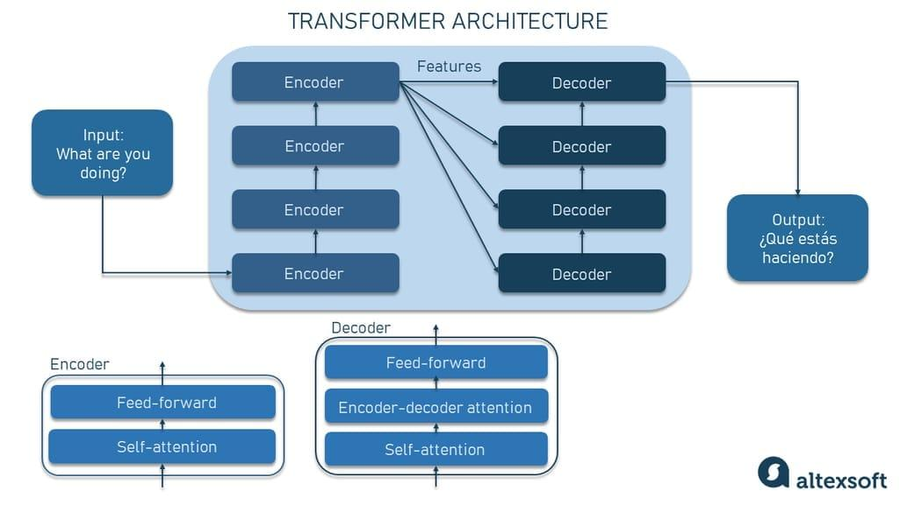

## Table of Contents

## What is a language model in machine learning?

A language model in machine learning is a type of artificial intelligence that understands and generates human language. It works by learning patterns from a lot of text data. Once trained, it can predict what words come next in a sentence or generate new sentences that sound like they were written by a human. For example, if you start a sentence with "The cat is," the model might predict that the next word could be "sleeping" or "playing."

Language models are used in many applications, like translating languages, writing emails, or even creating chatbots. They help computers understand and use language more like humans do. The more data a language model is trained on, the better it gets at understanding and generating language. This is why companies like Google and Microsoft use huge amounts of text to train their models, making them very good at tasks like search and voice recognition.

## What are the basic components of a language model?

A language model has a few key parts that help it work. The first part is the data it learns from. This is usually a lot of text, like books, websites, or conversations. The model looks at this text to find patterns and learn how words and sentences are used. The second part is the model's architecture, which is like its brain. It uses math to figure out how likely one word is to follow another. A common type of architecture is called a neural network, which can be very good at understanding language.

The third part is the training process. During training, the model keeps trying to guess the next word in a sentence and gets feedback on how well it did. It uses this feedback to get better over time. This is done using an algorithm that adjusts the model's internal settings, or parameters, to make its guesses more accurate. The formula for how likely a word is to come next can be written as $$P(w_i | w_1, w_2, ..., w_{i-1})$$, where $$w_i$$ is the word we're trying to predict and the other words are the context it's based on.

Once trained, the model can be used for different tasks. It can help with things like writing text, answering questions, or translating languages. The model uses what it learned during training to make these tasks easier and more accurate. For example, if you want to use the model to write a sentence, you could use code like this:

```python
from transformers import pipeline

# Load a pre-trained language model
generator = pipeline('text-generation', model='gpt2')

# Generate text
text = generator("The cat is", max_length=50, num_return_sequences=1)[0]['generated_text']
print(text)
```

This code uses a pre-trained model to finish the sentence "The cat is" in a way that sounds natural.

## How does a neural cache improve language model performance?

A neural cache improves language model performance by storing and quickly retrieving information that the model has recently used. Imagine you're writing a story about a cat and you keep mentioning the word "cat." Instead of the language model having to go through all its data to figure out what word should come next, the neural cache remembers that "cat" was used recently and can suggest words like "sleeps" or "plays" faster. This makes the model respond quicker and use less computing power because it doesn't have to redo all the calculations each time.

The neural cache works by keeping a short-term memory of recent inputs and outputs. When the model needs to predict a word, it first checks the cache to see if there's a match. If there is, it can use that information right away, which speeds up the process. For example, if the model needs to predict the next word after "The cat is," and it recently used "sleeping" in a similar context, the cache can suggest "sleeping" quickly. This not only makes the model faster but also helps it make more accurate predictions by using recent, relevant information.

## What is the role of a vocabulary in language models?

The vocabulary in a language model is like a list of all the words it knows. It's important because it helps the model understand and generate text. When the model reads or writes, it uses the vocabulary to figure out which words to use. If a word isn't in the vocabulary, the model might not know what to do with it. So, having a good vocabulary means the model can handle more words and understand language better.

The size of the vocabulary can affect how well the model works. A bigger vocabulary lets the model use more words, but it also makes the model bigger and slower. On the other hand, a smaller vocabulary makes the model faster but might miss out on some words. The model often uses something called a token, which can be a word or part of a word. For example, if the vocabulary has the word "running," the model might break it into "run" and "ning" to make things easier. This way, the model can handle new words by combining known parts.

## How do word embeddings contribute to language models?

Word embeddings help language models understand words better by turning them into numbers. Imagine each word as a point in a big space. Words that mean similar things, like "cat" and "kitten," are close to each other in this space. This helps the model see how words relate to each other. For example, if the model sees "cat," it can quickly find related words like "kitten" or "feline" because they are near each other in the space.

Using word embeddings makes language models smarter and faster. Instead of just looking at words as single units, the model can understand the meaning and context of words. This is important for tasks like translating languages or answering questions. For instance, if the model needs to predict the next word after "The cat is," it can use the embeddings to see that "sleeping" or "playing" are good choices because they are close to "cat" in the word space. This way, the model can make better and quicker guesses about what word comes next.

## What are the differences between n-gram models and neural language models?

N-gram models and neural language models are two different ways to predict what word comes next in a sentence. N-gram models look at groups of words, called n-grams, to make predictions. For example, if you have the phrase "The cat is," an n-gram model might look at the last two words "cat is" to predict the next word. It counts how often certain n-grams appear in the training data and uses that to guess the next word. This method is simple and fast but can miss out on understanding the broader context of the sentence because it only looks at a small window of words.

Neural language models, on the other hand, use a more complex method to understand and predict words. They use neural networks, which are like brains made of math, to learn patterns from a lot of text. Instead of just looking at a few words at a time, neural models can consider the whole sentence or even the entire document. They do this by turning words into numbers, called word embeddings, which help them understand the meaning and relationships between words. This makes neural models better at understanding context and generating more natural-sounding text, but they can be slower and need more computing power than n-gram models.

## How does context affect language model predictions?

Context is super important for language models because it helps them understand what words mean in different situations. Imagine you're reading a story about a cat. If the story says "The cat is on the roof," the word "roof" makes sense because it fits with the idea of a cat climbing. But if the story suddenly says "The cat is on the menu," the word "menu" changes the meaning a lot, suggesting the cat might be food. Language models use context to figure out which words fit best in a sentence, making their predictions more accurate and natural-sounding.

Language models look at the words that come before and after the word they're trying to predict. They use this information to guess what word should come next. For example, if the model sees "The cat is," it might predict "sleeping" or "playing" because those words often follow "is" in sentences about cats. The model uses a formula like $$P(w_i | w_1, w_2, ..., w_{i-1})$$ to calculate how likely a word is to come next based on the context. This helps the model make better guesses and create sentences that make sense.

## What is the significance of attention mechanisms in modern language models?

Attention mechanisms are a big deal in modern language models because they help the model focus on the most important parts of a sentence. Imagine you're reading a long story and you need to remember something important from earlier. Attention mechanisms help the model do that by giving more "attention" to certain words or phrases that are key to understanding the text. This makes the model better at understanding context and generating more accurate and natural-sounding sentences.

For example, if the model is trying to translate a sentence from English to French, attention mechanisms help it figure out which words in the English sentence are most important for the French translation. This way, the model can make sure the translation is correct and keeps the meaning of the original sentence. By using attention, the model can handle longer and more complex texts better than before, making it a crucial part of modern language models like those used in translation services or chatbots.

## How can language models be evaluated for performance?

Language models are evaluated using different ways to check how well they understand and make sentences. One common way is to use something called perplexity. Perplexity is a number that shows how surprised the model is by the text it sees. A lower perplexity means the model is better at guessing what word comes next. For example, if the model sees "The cat is," a lower perplexity means it's more likely to guess the next word right. The formula for perplexity is $$PPL = 2^{-\frac{1}{N} \sum_{i=1}^{N} \log_2 P(w_i | w_1, w_2, ..., w_{i-1})}$$, where $$N$$ is the number of words, and $$P(w_i | w_1, w_2, ..., w_{i-1})$$ is how likely the model thinks the next word is.

Another way to check the performance of language models is by using human evaluations. This means people read the sentences the model makes and say if they sound right and make sense. For example, if the model writes "The cat is sleeping," a person might say it sounds good. But if the model writes "The cat is refrigerator," a person would say it doesn't make sense. Human evaluations help make sure the model's sentences are not just technically correct but also sound natural to people.

## What are some advanced techniques used to optimize language models?

Advanced techniques to optimize language models include fine-tuning and transfer learning. Fine-tuning means taking a model that's already been trained on a lot of text and teaching it more with specific data. For example, if you have a model that's good at understanding English but you want it to be better at medical terms, you can fine-tune it with medical texts. This makes the model more accurate for the specific task you want it to do. Transfer learning is similar; it uses knowledge from one task to help with another. If a model is good at translating languages, you can use that knowledge to help it get better at summarizing texts. Both techniques help the model perform better without starting from scratch.

Another important technique is quantization, which makes the model smaller and faster. Quantization changes the numbers the model uses from big, precise ones to smaller, less precise ones. This means the model takes up less space on a computer and can run faster, which is really helpful for using the model on devices like phones or tablets. For example, if a model uses 32-bit numbers, quantization might change them to 8-bit numbers. This makes the model easier to use in real life without losing too much accuracy. The formula for quantization can be simplified as $$q(x) = round(\frac{x}{s})$$, where $$x$$ is the original number, $$s$$ is a scaling [factor](/wiki/factor-investing), and $$q(x)$$ is the quantized number.

## How do transformer models differ from traditional recurrent neural networks in language modeling?

Transformer models and traditional recurrent neural networks (RNNs) both help computers understand and make sentences, but they work in different ways. RNNs look at words one at a time, keeping track of what they've seen before to predict what comes next. They use something called a "hidden state" to remember past words, which helps them understand the order of words in a sentence. For example, if the sentence is "The cat is sleeping," an RNN would process "The," then "cat," then "is," and use the hidden state to remember these words and predict "sleeping."

Transformers, on the other hand, look at all the words in a sentence at the same time. They use something called attention mechanisms to figure out which words are most important for understanding the sentence. Instead of a hidden state, transformers use a concept called self-attention, which helps them see how each word relates to every other word. For example, if the sentence is "The cat is sleeping," a transformer would look at all the words together and use attention to understand that "cat" and "sleeping" are closely related. This makes transformers faster and better at handling long sentences than RNNs.

The main difference in how they work can be seen in their formulas. For RNNs, the next word prediction is based on the current word and the hidden state, often written as $$h_t = f(h_{t-1}, x_t)$$, where $$h_t$$ is the new hidden state, $$h_{t-1}$$ is the previous hidden state, and $$x_t$$ is the current input. In contrast, transformers use self-attention, which can be simplified as $$Attention(Q, K, V) = softmax(\frac{QK^T}{\sqrt{d_k}})V$$, where $$Q$$ are the queries, $$K$$ are the keys, $$V$$ are the values, and $$d_k$$ is the dimension of the keys. This formula helps transformers weigh the importance of different words in the sentence, making them more effective for tasks like translation and text generation.

## What are the current challenges and future directions in language model research?

One of the biggest challenges in language model research is making models that understand and generate text as well as humans do. Right now, models can sometimes make up facts or say things that don't make sense. This is called hallucination, and it's a big problem. Another challenge is that training these models takes a lot of time and computer power. Researchers are trying to find ways to make models smaller and faster without losing their ability to understand language. For example, they use techniques like quantization, which changes the numbers the model uses to make it smaller. The formula for quantization can be written as $$q(x) = round(\frac{x}{s})$$, where $$x$$ is the original number, $$s$$ is a scaling factor, and $$q(x)$$ is the quantized number.

In the future, researchers want to make language models even better at understanding context and meaning. They're working on models that can learn from less data and still perform well. One idea is to use more advanced attention mechanisms to help the model focus on the most important parts of a sentence. Another direction is to make models that can explain their decisions, so people can trust them more. For example, if a model suggests a word, it could explain why it chose that word based on the context. This would make the models more useful in real-life situations, like helping doctors understand medical texts or helping students learn new languages.

## References & Further Reading

[1]: Vaswani, A., Shazeer, N., Parmar, N., Uszkoreit, J., Jones, L., Gomez, A. N., ... & Polosukhin, I. (2017). ["Attention is All You Need."](https://arxiv.org/abs/1706.03762) Advances in Neural Information Processing Systems, 30.

[2]: Goldberg, Y. (2017). ["Neural Network Methods for Natural Language Processing."](https://link.springer.com/book/10.1007/978-3-031-02165-7) Morgan & Claypool Publishers.

[3]: Devlin, J., Chang, M. W., Lee, K., & Toutanova, K. (2019). ["BERT: Pre-training of Deep Bidirectional Transformers for Language Understanding."](https://arxiv.org/abs/1810.04805) arXiv preprint arXiv:1810.04805.

[4]: Brown, T., Mann, B., Ryder, N., Subbiah, M., Kaplan, J., Dhariwal, P., ... & Amodei, D. (2020). ["Language Models are Few-Shot Learners."](https://arxiv.org/abs/2005.14165) arXiv preprint arXiv:2005.14165.

[5]: Jurafsky, D., & Martin, J. H. (2019). ["Speech and Language Processing"](https://web.stanford.edu/~jurafsky/slp3/) (3rd ed.). Pearson.

[6]: Mikolov, T., Chen, K., Corrado, G., & Dean, J. (2013). ["Efficient Estimation of Word Representations in Vector Space."](https://arxiv.org/abs/1301.3781) arXiv preprint arXiv:1301.3781.