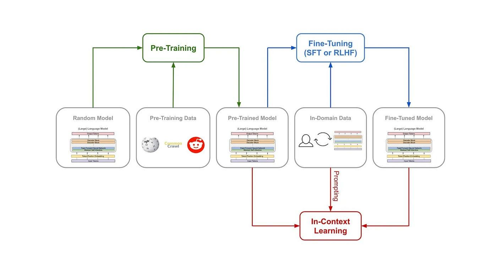

## Table of Contents

## What is language model pre-training in machine learning?

Language model pre-training in machine learning is a process where a model is trained on a large amount of text data before it is used for a specific task. This initial training helps the model learn general language patterns, grammar, and common phrases. By doing this, the model gets a good understanding of language, which can be useful for many different tasks later on. Think of it like learning the basics of a language before using it for something specific, like writing a report or having a conversation.

After pre-training, the model can be fine-tuned for a particular task, such as answering questions or translating languages. Fine-tuning involves training the model further on a smaller, task-specific dataset. This step helps the model adapt its general language knowledge to perform well on the specific task it needs to do. The combination of pre-training and fine-tuning makes the model more effective and efficient, as it can use its broad language understanding to quickly learn and excel at new tasks.

## Why is pre-training important for language models?

Pre-training is important for language models because it helps them learn a lot about language before they start working on a specific job. When a model is pre-trained, it gets to see and learn from a huge amount of text. This text can come from books, websites, and other places. By going through all this text, the model learns about words, how they are used, and how sentences are put together. This is like a student learning the basics of a language in school before using it in real life.

Once the model has this basic knowledge, it can be fine-tuned for a specific task much more easily. Fine-tuning is when the model learns to do something specific, like answering questions or translating languages. Because the model already knows a lot about language from pre-training, it can learn the new task quickly and do it well. This makes the model more useful and efficient, as it can use its broad language understanding to handle many different kinds of jobs.

## How does MPNet approach language model pre-training?

MPNet, which stands for Masked and Permuted Pre-training Network, is a way to train language models that tries to do better than older methods like BERT and XLNet. MPNet uses a special way to look at text called "masked and permuted language modeling." This means it can see words that are hidden and also see words in different orders. By doing this, MPNet can learn how words depend on each other in a sentence better than before. This helps the model understand language in a more complete way.

When MPNet is training, it does two things at once. First, it tries to guess hidden words in a sentence, which is like filling in the blanks. Second, it tries to predict words when they are mixed up in different orders. This helps the model learn not just what words come next, but also how words can be arranged in different ways. By doing both of these things, MPNet can get a good understanding of how language works and can be used for many different tasks.

## What are the key features of ERNIE-GEN in pre-training?

ERNIE-GEN is a special kind of language model that focuses on generating text. It uses something called "enhanced representation through knowledge integration" to learn from text. This means ERNIE-GEN not only looks at the words in a sentence but also tries to understand the meaning behind those words by using extra information. This extra information can come from different places, like encyclopedias or databases. By using this extra knowledge, ERNIE-GEN can create text that makes more sense and is more useful.

During pre-training, ERNIE-GEN does two main things. First, it tries to fill in missing words in sentences, which helps it understand how words fit together. Second, it learns to put words in the right order to make a complete sentence. This helps ERNIE-GEN not just understand language but also generate new text that sounds natural. By doing these two things, ERNIE-GEN can be used for tasks like writing stories, answering questions, or even helping with homework.

## Can you explain the unique aspects of ReasonBERT's pre-training methodology?

ReasonBERT has a special way of training that helps it understand and use logic better than other language models. It does this by adding something called "logic-guided masking" during pre-training. This means that when ReasonBERT is learning from text, it pays extra attention to words that are important for understanding logic and reasoning. For example, it might focus more on words like "if," "then," and "because." By doing this, ReasonBERT can learn how to follow and create logical arguments, which is useful for tasks that need thinking and reasoning.

During pre-training, ReasonBERT also uses a special kind of task called "logic-enhanced language modeling." This task helps the model learn how to predict words in a way that follows logical rules. For example, if the text says "If it rains, then the ground will be wet," ReasonBERT learns to understand that "wet" comes after "rains" because of the logical connection. This makes ReasonBERT good at tasks like answering questions that need logical thinking or understanding complex texts. By focusing on logic during pre-training, ReasonBERT becomes a powerful tool for tasks that need more than just understanding language.

## What is the significance of K3M in the context of language model pre-training?

K3M, which stands for Knowledge-enhanced, Keyword-driven, and Keyphrase-aware Masked Language Model, is a way to train language models that makes them better at understanding and using specific information. K3M does this by focusing on important words and phrases during training. When K3M is learning from text, it pays extra attention to keywords and keyphrases, which are the most important parts of a sentence. By doing this, K3M can learn more about specific topics and details, which helps it give better answers to questions and understand texts more deeply.

During pre-training, K3M uses a special technique called "knowledge-enhanced masking." This means that K3M not only looks at the words in a sentence but also uses extra information from other sources, like encyclopedias or databases. This helps K3M understand the meaning behind the words better. By combining this extra knowledge with a focus on keywords and keyphrases, K3M becomes a powerful tool for tasks that need a deep understanding of specific information, like answering questions about science or history.

## How do different pre-training strategies affect the performance of language models?

Different pre-training strategies can make a big difference in how well language models perform. When a model is pre-trained using a lot of text data, it learns about language in general, like words, grammar, and how sentences are put together. Some models, like BERT, use a method called "masked language modeling," where they try to guess missing words in a sentence. This helps them understand how words fit together. Other models, like XLNet, use "permuted language modeling," which looks at words in different orders to learn how they depend on each other. These different strategies can help the model learn different things about language, making it better at certain tasks.

For example, models like MPNet combine both masked and permuted language modeling, which can help them understand language even better. ERNIE-GEN focuses on using extra information to understand the meaning behind words, which is good for generating text that makes sense. ReasonBERT pays special attention to logical words and phrases, making it better at tasks that need reasoning. K3M focuses on important words and phrases and uses extra knowledge to understand specific topics better. Each of these strategies can make the model perform better at different kinds of tasks, depending on what the model needs to do.

## What are the common datasets used for pre-training language models?

Common datasets used for pre-training language models include large collections of text from various sources. One popular dataset is Wikipedia, which has a lot of information on many topics. Another common dataset is the BookCorpus, which contains text from thousands of [books](/wiki/algo-trading-books). These datasets are huge and help the model learn about language in general. Other datasets like Common Crawl, which is a collection of web pages, are also used because they have a lot of different kinds of text. By using these big datasets, the model can learn about words, grammar, and how sentences are put together.

Sometimes, models are pre-trained on more specific datasets to help them learn about certain topics. For example, the C4 dataset, which stands for Colossal Clean Crawled Corpus, is a cleaned version of web pages that can help models learn from high-quality text. Another dataset is the Pile, which is made up of many different types of text, including books, articles, and even code. These specialized datasets can help the model understand specific kinds of language or information better. By using a mix of general and specific datasets, language models can be trained to perform well on a wide range of tasks.

## How can one evaluate the effectiveness of a pre-trained language model?

To evaluate the effectiveness of a pre-trained language model, you can use different tests and tasks. One common way is to see how well the model does on tasks like answering questions, filling in missing words, or translating languages. These tasks help you see if the model understands language well. You can also use special tests like the GLUE benchmark, which has a bunch of different tasks to check the model's performance. By looking at how well the model does on these tests, you can tell if the pre-training was good and if the model can be used for real-world jobs.

Another way to evaluate the model is to look at how it performs compared to other models. You can use something called a leaderboard, where different models are ranked based on their scores on certain tasks. This helps you see if your model is better or worse than others. Also, you can check how the model does on specific kinds of text, like scientific articles or stories, to see if it understands those topics well. By using these different ways to evaluate the model, you can get a good idea of how effective the pre-training was and how the model can be used in the future.

## What are the challenges faced during the pre-training of large-scale language models?

Pre-training large-scale language models can be really hard because it needs a lot of computer power and time. These models have to go through huge amounts of text, like all of Wikipedia or thousands of books. This means they need strong computers with a lot of memory and fast processors. Sometimes, it can take weeks or even months to finish pre-training. Also, the more data the model looks at, the more it can learn, but it also makes the training process longer and more expensive. So, finding the right balance between how much data to use and how long to train the model is a big challenge.

Another challenge is making sure the model learns the right things from the text. Sometimes, the text can have mistakes or be biased, and the model might learn these wrong things. This can make the model give wrong answers or be unfair. Also, it's hard to know if the model is really understanding the language or just memorizing patterns. To check this, people use different tests and tasks, but it's still tricky to be sure. So, keeping the training data clean and making sure the model learns the right way are important challenges in pre-training large-scale language models.

## How do advancements in hardware and algorithms impact the pre-training process?

Advancements in hardware have made a big difference in pre-training language models. Newer computers with more memory and faster processors can handle the huge amounts of text needed for training. This means that models can be trained on more data in less time. For example, using special chips called GPUs and TPUs can speed up the training process a lot. These chips are good at doing the math needed for training models, so they make everything faster and easier. Because of these hardware improvements, people can now train even bigger and better models that learn more about language.

Improvements in algorithms also help with pre-training. New ways of training, like using better ways to guess missing words or understand the order of words, make the models learn faster and better. For example, algorithms like those used in MPNet or ERNIE-GEN help models understand language in new ways. These new algorithms can make the models more efficient, so they don't need as much data or time to learn well. By combining better hardware and smarter algorithms, people can train language models that are more powerful and useful for all kinds of tasks.

## What future directions are being explored in language model pre-training research?

Researchers are looking at new ways to make language models even better. One big idea is to use less data but still get good results. This is important because collecting and using huge amounts of data can be hard and expensive. So, they are trying to find ways to train models with smaller datasets but still make them understand language well. Another direction is to make models learn about different kinds of information, like pictures and sounds, along with text. This could help the models understand the world better and be more useful in real life.

Another area of research is making models more fair and less biased. Sometimes, models can learn wrong things from the data they see, which can make them give unfair answers. So, researchers are working on ways to check and fix these problems during pre-training. They also want to make models that can explain how they make decisions, so people can trust them more. By focusing on these areas, the hope is to create language models that are not only smart but also fair and helpful for everyone.

## References & Further Reading

[1]: Devlin, J., Chang, M. W., Lee, K., & Toutanova, K. (2018). ["BERT: Pre-training of Deep Bidirectional Transformers for Language Understanding."](https://arxiv.org/abs/1810.04805) arXiv preprint arXiv:1810.04805.

[2]: Yang, Z., Dai, Z., Yang, Y., Carbonell, J., Salakhutdinov, R., & Le, Q. V. (2019). ["XLNet: Generalized Autoregressive Pretraining for Language Understanding."](https://arxiv.org/abs/1906.08237) arXiv preprint arXiv:1906.08237.

[3]: Liu, Y., Cheng, H., Zhu, Y., Zhang, Y., Xu, Y., & Wei, S. (2020). ["MPNet: Masked and Permuted Pre-training for Language Understanding."](https://www.sciencedirect.com/org/science/article/pii/S2041652025000768) arXiv preprint arXiv:2004.09297.

[4]: Sun, Y., Wang, S., Li, Y., Feng, S., Tian, H., & Wu, H. (2020). ["ERNIE-GEN: An Enhanced Multi-Flow Pre-training and Fine-tuning Framework for Natural Language Generation."](https://arxiv.org/abs/1904.09223) arXiv preprint arXiv:2001.11314.

[5]: Wang, B., Gao, W., Xing, E., & Zhang, Y. (2021). ["ReasonBERT: Inductive Reasoning via Designated Model Units."](https://www.sciencedirect.com/science/article/pii/S138589472501633X) arXiv preprint arXiv:2104.07824.

[6]: Liu, H., Zou, X., He, W., & Shum, H. (2020). ["K-BERT: Enabling Language Representation with Knowledge Graph."](https://ojs.aaai.org/index.php/AAAI/article/view/5681) arXiv preprint arXiv:1909.05858.

[7]: Brown, T. B., Mann, B., Ryder, N., Subbiah, M., Kaplan, J., Dhariwal, P., ... & Amodei, D. (2020). ["Language Models are Few-Shot Learners."](https://arxiv.org/abs/2005.14165) arXiv preprint arXiv:2005.14165.

[8]: Ruder, S. (2019). ["Neural Language Models: An Overview."](https://www.ruder.io/state-of-transfer-learning-in-nlp/) Accessed online at ruder.io.

[9]: [BookCorpus Dataset.](https://huggingface.co/datasets/bookcorpus/bookcorpus) BookCorpus dataset, a large-scale dataset for language model pre-training.

[10]: [Common Crawl.](https://commoncrawl.org/) A repository of web-crawled data used for language model pre-training.