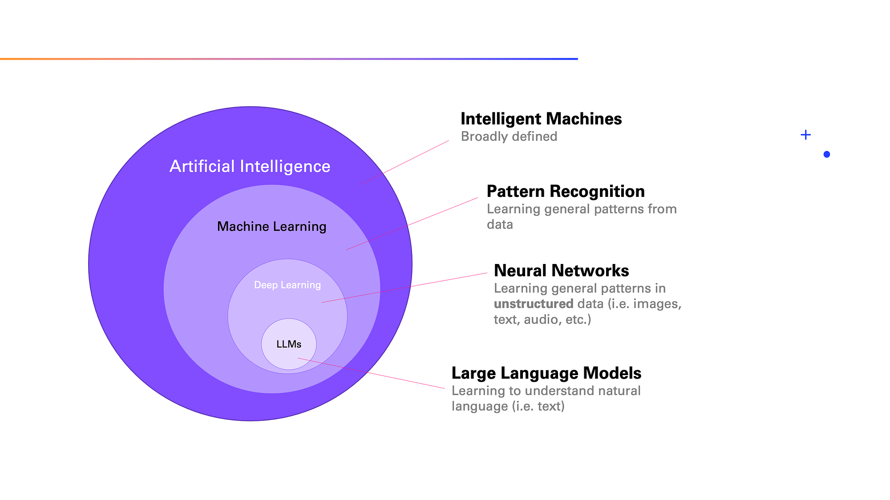

## Table of Contents

## What is a language model in machine learning?

A language model in machine learning is a type of artificial intelligence that understands and generates human language. It learns patterns from large amounts of text data, which helps it predict what words are likely to come next in a sentence. For example, if you start a sentence with "I like to," the model might predict that "eat" or "play" could follow, based on what it has learned from its training data.

These models are used in many applications, like auto-completing text on your phone or translating languages. They work by calculating the probability of different sequences of words. The more data the model is trained on, the better it gets at understanding and generating language that sounds natural to humans. This is why companies that develop these models, like those behind popular AI chatbots, constantly feed them new data to improve their performance.

## How do language models work?

Language models work by learning patterns from a lot of text. They look at how words are used together and figure out which words are likely to follow others. For example, after seeing the phrase "I like to" many times, the model learns that words like "eat" or "play" often come next. This is done using math to calculate the probability of word sequences. The model uses these probabilities to predict and generate text that sounds like it was written by a human.

To train a language model, you feed it a huge amount of text data. The model then adjusts its internal parameters to better match the patterns it sees in the data. This process is called training, and it's a bit like how a student learns from studying lots of examples. The more data the model sees, the better it gets at understanding and creating language. That's why big companies keep adding more data to their models to make them smarter and more useful for things like answering questions or translating languages.

## What are the main types of language models?

There are two main types of language models: statistical language models and neural language models. Statistical language models use math to predict the next word in a sentence. They look at how often words appear together in the training data and use that information to guess what word comes next. For example, if "I like to" is often followed by "eat" in the data, the model will predict "eat" as a likely next word. These models are good for tasks like autocomplete or spell-checking because they're quick and work well with smaller amounts of data.

Neural language models, on the other hand, use a type of artificial intelligence called neural networks to understand and generate language. They can learn more complex patterns in the data because they have many layers that can process information in different ways. This makes them better at understanding context and creating more natural-sounding text. For example, a neural model might understand that "I like to eat" could be followed by "pizza" or "sushi" based on the context of the conversation. These models are used in more advanced applications like chatbots and machine translation because they can handle bigger and more varied data sets.

Both types of models have their strengths and are used for different purposes. Statistical models are simpler and faster, making them useful for quick tasks. Neural models are more powerful and can understand more complex language, which makes them better for tasks that need a deeper understanding of context and meaning.

## What is the difference between a statistical language model and a neural language model?

A statistical language model uses math to predict the next word in a sentence. It looks at how often words appear together in the training data and uses that information to guess what word comes next. For example, if "I like to" is often followed by "eat" in the data, the model will predict "eat" as a likely next word. These models are good for tasks like autocomplete or spell-checking because they're quick and work well with smaller amounts of data. They use formulas like $$ P(w_n | w_1, w_2, ..., w_{n-1}) $$ to calculate the probability of a word given the previous words.

On the other hand, a neural language model uses a type of artificial intelligence called neural networks to understand and generate language. These models can learn more complex patterns in the data because they have many layers that can process information in different ways. This makes them better at understanding context and creating more natural-sounding text. For example, a neural model might understand that "I like to eat" could be followed by "pizza" or "sushi" based on the context of the conversation. These models are used in more advanced applications like chatbots and machine translation because they can handle bigger and more varied data sets.

In summary, statistical models are simpler and faster, making them useful for quick tasks. Neural models are more powerful and can understand more complex language, which makes them better for tasks that need a deeper understanding of context and meaning.

## How is a language model trained?

Training a language model involves feeding it a large amount of text data. The model looks at the patterns in this data to learn how words are used together. For example, if it sees "I like to" followed by "eat" a lot, it learns that "eat" is a likely next word. The model adjusts its internal settings, called parameters, to better match these patterns. This process, called training, is like how a student learns from studying lots of examples. The more data the model sees, the better it gets at understanding and creating language.

The training process uses math to calculate how well the model is doing. It compares the model's predictions to the actual text and adjusts the parameters to improve the predictions. This is often done using a method called gradient descent, which helps the model find the best settings for its parameters. The goal is to make the model's predictions as accurate as possible. For example, the model might use a formula like $$ P(w_n | w_1, w_2, ..., w_{n-1}) $$ to calculate the probability of a word given the previous words. Over time, as the model sees more and more data, it gets better at predicting what comes next in a sentence.

## What are common applications of language models?

Language models are used in many everyday tools. They help with things like auto-completing text on your phone or computer. When you start typing a message, the model suggests what you might want to say next. They also help with spell-checking, correcting your mistakes as you type. Another common use is in voice assistants like Siri or Alexa, which understand what you say and respond in a way that sounds natural.

Language models are also important in translation apps. They can take text or speech in one language and turn it into another language, making it easier for people to communicate across different languages. In customer service, chatbots use language models to answer questions and solve problems, making the experience more helpful and personal. These models learn from a lot of data to get better at understanding and creating language that sounds like it comes from a human.

## What is the role of context in language models?

Context is really important for language models. It helps them understand what words mean based on the words around them. For example, if you say "I like to eat," the model knows that "eat" is about food because of the words "like to" before it. Without context, the model might not understand that "eat" is related to food. It might think "eat" could mean something else in a different sentence. So, context helps the model make better guesses about what words mean and what words might come next.

Language models use context in different ways. Some models look at just a few words before and after the word they're trying to predict. Others, like more advanced neural models, can look at a whole sentence or even a whole conversation. This helps them understand the bigger picture and make more accurate predictions. For example, if someone asks, "What's your favorite food?" and you answer, "I like to eat pizza," the model can understand that "pizza" is a type of food because of the context of the question and answer. By using context, language models can create responses that sound more natural and are more helpful to people.

## How do language models handle different languages?

Language models can handle different languages by being trained on text from those languages. When a model is trained on a lot of text in different languages, it learns how words and sentences work in each language. For example, if a model is trained on both English and Spanish, it can understand and generate text in both languages. This is useful for things like translating from one language to another or helping people communicate in different languages.

To make the model work well with multiple languages, it uses the patterns it learns from the training data. The model calculates the probability of different word sequences in each language using formulas like $$ P(w_n | w_1, w_2, ..., w_{n-1}) $$. This helps the model predict what words come next, even if the language changes. By understanding the context and patterns in different languages, the model can create responses that sound natural and are helpful to people speaking different languages.

## What are the challenges faced in developing language models?

Developing language models comes with many challenges. One big challenge is getting enough good data to train the model. Language models need a lot of text to learn from, and it can be hard to find enough data that is both accurate and varied. If the data is not good, the model might learn wrong patterns or miss out on important ones. Another challenge is making the model work well with different languages. Each language has its own rules and patterns, so the model needs to learn a lot to handle them all correctly. This can be tricky because some languages have less data available for training.

Another challenge is understanding context. Language models need to understand the meaning of words based on the words around them. For example, the word "bank" can mean a place to keep money or the side of a river, and the model needs to know which one is right based on the context. This is hard because context can be complex and change from one conversation to another. Finally, there's the challenge of making the model's responses sound natural and helpful. People expect the model to talk like a human, so it needs to learn how to use language in a way that feels right. This is a big job and takes a lot of work to get right.

## What advancements have been made in language models with the introduction of transformer models?

The introduction of transformer models has brought big changes to language models. Before transformers, models like recurrent neural networks (RNNs) and long short-term memory (LSTM) networks were used. These models had to process words one at a time, which made them slow and less good at understanding long sentences. Transformers changed this by using a new way to look at all the words in a sentence at once. This is called "attention," and it helps the model understand how words relate to each other, no matter where they are in the sentence. This makes transformers faster and better at understanding context.

One famous transformer model is BERT, which stands for Bidirectional Encoder Representations from Transformers. BERT can look at words before and after the word it's trying to understand, which helps it get a better sense of context. Another important model is GPT, which stands for Generative Pre-trained Transformer. GPT is good at creating new text that sounds like it was written by a human. These models have made language models much better at tasks like answering questions, translating languages, and even writing stories. They have opened up new possibilities for how we can use language models to help people communicate and understand each other better.

## How do you evaluate the performance of a language model?

Evaluating the performance of a language model involves looking at how well it can predict and generate text that sounds like it was written by a human. One common way to do this is by using something called perplexity. Perplexity is a number that shows how surprised the model is by the text it's trying to predict. A lower perplexity means the model is doing a better job because it's less surprised by the text. For example, if a model is trained on a lot of English text, it should have a low perplexity when predicting new English sentences. The formula for perplexity is $$ \text{Perplexity} = 2^{-\frac{1}{N} \sum_{i=1}^{N} \log_2 p(w_i | w_1, w_2, ..., w_{i-1})} $$, where \( N \) is the number of words, and \( p(w_i | w_1, w_2, ..., w_{i-1}) \) is the probability of the next word given the previous words.

Another way to evaluate a language model is by using human judgments. This means asking people to read the text generated by the model and rate how natural and helpful it sounds. For example, if a model is used in a chatbot, people might be asked if the chatbot's responses are clear and make sense. This can be more time-consuming than using perplexity, but it gives a better idea of how well the model works in real life. Both methods are important because they help developers understand what the model is good at and what it needs to improve on. By using these evaluation techniques, developers can make language models better over time.

## What are the ethical considerations and potential biases in language models?

Language models can have ethical problems and biases. They learn from a lot of text, and if that text has unfair ideas or wrong information, the model can learn those too. For example, if the text used to train the model often talks about certain jobs as being for men or women, the model might think that's true and say the same thing. This can make the model treat people unfairly. Also, if the model learns from text that has wrong or harmful ideas, it might share those ideas with people who use it. This is why it's important to check the text used to train the model and make sure it's fair and correct.

Another big problem is privacy. Language models can sometimes remember and share personal information from the text they see. This can be a big problem if the model uses data from private messages or emails. To fix this, people who make language models need to be careful about what data they use and how they use it. They need to make sure they don't share private information and that they follow rules about data privacy. By thinking about these ethical issues and working to fix them, we can make language models that are fair and safe for everyone to use.