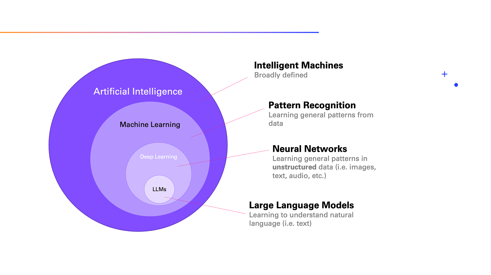

## Table of Contents

## What is a language model in the context of machine learning?

A language model in machine learning is a type of artificial intelligence that understands and generates human language. It learns patterns and structures from large amounts of text data, which allows it to predict what words or phrases are likely to come next in a sentence. For example, if you start a sentence with "The sky is," the language model might predict that the next word could be "blue" or "clear" because those words often follow that phrase in the data it has learned from.

These models are used in many applications, like auto-complete features in search engines or smartphones, and in more complex systems like chatbots and translation services. They work by calculating the probability of a sequence of words. This is often done using a formula like $$ P(w_1, w_2, ..., w_n) $$, where $$ w_1, w_2, ..., w_n $$ are the words in a sentence. The model tries to maximize this probability to generate the most likely text based on its training data.

## How do language models process and generate text?

Language models process and generate text by learning from large amounts of text data. They look at how words are used together in sentences and learn patterns from these examples. When you give a language model a starting piece of text, it uses what it has learned to guess what words should come next. It does this by calculating the probability of different word sequences. For example, if you start with "The cat is," the model might predict "sleeping" or "playing" as the next word because those words often follow "The cat is" in the data it has seen.

To generate text, the language model picks the word with the highest probability and adds it to the sentence. It then uses the new, longer sentence to predict the next word, and so on. This process continues until the model decides the sentence is complete or until it reaches a set limit. The formula it uses to calculate these probabilities is something like $$ P(w_1, w_2, ..., w_n) $$, where $$ w_1, w_2, ..., w_n $$ are the words in the sentence. By choosing words with the highest probabilities, the model creates sentences that sound natural and make sense based on its training data.

## What is the role of the Transformer architecture in modern language models?

The Transformer architecture is a big part of why modern language models work so well. It was first used in a model called BERT and has become very popular because it can handle a lot of data and learn from it quickly. The main idea behind the Transformer is that it looks at all the words in a sentence at the same time, not just one after the other. This helps it understand how words relate to each other better. For example, if you have the sentence "The cat is sleeping on the couch," the Transformer can see how "cat" and "couch" are connected without having to read the words in order.

One key part of the Transformer is something called "attention." Attention helps the model focus on the most important words in a sentence. It does this by giving more weight to certain words when it's trying to predict the next word. This makes the model's guesses more accurate. The attention mechanism uses a formula like $$ \text{Attention}(Q, K, V) = \text{softmax}\left(\frac{QK^T}{\sqrt{d_k}}\right)V $$, where $$ Q $$ is the query, $$ K $$ is the key, and $$ V $$ is the value. This formula helps the model decide which words to pay attention to when it's working on a sentence. Thanks to the Transformer and attention, language models can now understand and generate text that sounds a lot more like what a human would write.

## Can you explain the difference between autoregressive and non-autoregressive language models?

Autoregressive language models generate text one word at a time, using the words they have already generated to help decide what word comes next. They use a formula like $$ P(w_1, w_2, ..., w_n) $$ to predict the next word based on the previous words. This means they can create very detailed and coherent text, but it can take a long time because they have to make a new prediction for each word. For example, if you start with "The cat," the model might predict "is" next, then use "The cat is" to predict "sleeping," and so on.

Non-autoregressive language models, on the other hand, try to generate all the words in a sentence at once. They don't need to predict one word at a time, which can make them much faster. Instead of using the previous words to predict the next one, they look at the whole sentence and try to find the best fit for all the words together. This can be less accurate than autoregressive models because they don't use the context of already generated words as much, but they are faster and can still produce good results for many tasks.

## What are some common applications of language models?

Language models are used in many everyday tools that help us with writing and understanding text. One common use is in auto-complete features on smartphones and search engines. When you start typing a message or a search query, the language model suggests what you might want to say next. This makes typing faster and easier. Another use is in virtual assistants like Siri or Alexa, which use language models to understand what you're saying and respond in a helpful way. They can answer questions, set reminders, or even tell you a joke, all thanks to the language model's ability to process and generate text.

Language models also help with translating text from one language to another. Services like Google Translate use these models to understand the meaning of a sentence in one language and then generate a similar sentence in another language. This makes it easier for people to communicate across different languages. Additionally, language models are used in writing tools that can help you improve your writing. They can suggest better words or fix grammar mistakes, making your writing clearer and more professional. These are just a few ways language models make our lives easier by helping us with text.

## How does BERT differ from other language models like GPT?

BERT and GPT are both language models, but they work in different ways. BERT, which stands for Bidirectional Encoder Representations from Transformers, looks at the whole sentence at once. This means it can understand how words relate to each other no matter where they are in the sentence. For example, if you have the sentence "The cat is sleeping on the couch," BERT can see how "cat" and "couch" are connected without having to read the words in order. BERT uses something called "attention" to focus on the most important words in a sentence. The attention mechanism uses a formula like $$ \text{Attention}(Q, K, V) = \text{softmax}\left(\frac{QK^T}{\sqrt{d_k}}\right)V $$, where $$ Q $$ is the query, $$ K $$ is the key, and $$ V $$ is the value. This helps BERT decide which words to pay attention to when it's working on a sentence.

On the other hand, GPT, which stands for Generative Pre-trained Transformer, reads words one at a time from left to right. It predicts the next word based on the words it has already seen. For example, if you start with "The cat," GPT might predict "is" next, then use "The cat is" to predict "sleeping," and so on. This way of working is called autoregressive, and it's good for generating text that sounds natural. GPT doesn't use bidirectional context like BERT, which means it can't see how words at the end of a sentence might affect the meaning of words at the beginning. Both models are powerful, but they are good at different things. BERT is better at understanding the meaning of sentences, while GPT is better at generating new text.

## What advancements does GPT-3 bring over its predecessors?

GPT-3, or the third generation of the Generative Pre-trained Transformer, brings several big improvements over earlier versions like GPT-2. One of the biggest changes is that GPT-3 is much larger, with 175 billion parameters compared to GPT-2's 1.5 billion. This means GPT-3 can learn from a lot more data and understand language better. It can do things like writing stories, answering questions, and even translating languages more accurately than before. Another important advancement is that GPT-3 can do what's called "few-shot learning." This means it can learn new tasks with just a few examples, making it more flexible and easier to use for different kinds of jobs.

In addition to being bigger and more flexible, GPT-3 also works better at generating text that sounds like it was written by a human. It can understand the context of a conversation better and keep the style and tone consistent over long pieces of text. This makes it useful for things like writing articles, creating chatbots, and even helping with coding. For example, if you give GPT-3 a few lines of code and ask it to finish the program, it can do that because it has learned from a lot of code examples. These improvements make GPT-3 a powerful tool for many different applications, and it's a big step forward from what GPT-2 could do.

## What is the significance of fine-tuning in language models?

Fine-tuning is an important step in making language models better at specific tasks. When a language model is first trained, it learns from a huge amount of text to understand how language works in general. But this general knowledge might not be enough for certain jobs, like answering customer service questions or writing code. Fine-tuning helps by taking this general model and training it a bit more on a smaller set of data that's focused on the specific task. This makes the model's answers more accurate and useful for that particular job. For example, if you want the model to help with coding, you can fine-tune it on a lot of code examples, so it learns the patterns and rules of programming languages better.

The process of fine-tuning can make a big difference in how well a language model works. It's like giving the model a specialized [course](/wiki/best-algorithmic-trading-courses) after it has learned the basics. By adjusting the model's parameters to fit the new data, fine-tuning helps it understand the specific language or context it needs to work with. This can be done using a formula like $$ \text{loss} = -\sum_{i} y_i \log(\hat{y}_i) $$, where $$ y_i $$ is the true label and $$ \hat{y}_i $$ is the model's prediction. This formula helps the model learn from its mistakes and get better at the task. Overall, fine-tuning makes language models more versatile and effective, allowing them to be used in many different situations.

## How do models like T5 and BART approach text generation and comprehension?

T5, which stands for Text-to-Text Transfer Transformer, and BART, which stands for Bidirectional and Auto-Regressive Transformers, are both language models that work in special ways to understand and create text. T5 treats every language task as a text-to-text problem. This means it can take any kind of input and turn it into any kind of output. For example, if you want to translate a sentence, summarize a paragraph, or answer a question, T5 can do it all by changing the text from one form to another. It uses a formula like $$ \text{loss} = -\sum_{i} y_i \log(\hat{y}_i) $$ to learn from its mistakes and get better at these tasks. This makes T5 very flexible and good at many different jobs.

BART, on the other hand, uses a mix of two methods to understand and generate text. It first messes up the input text in different ways, like removing words or changing their order, and then tries to fix it back to the original text. This helps BART learn how to understand and create sentences better. Like T5, BART can also do many tasks, such as summarizing text or answering questions. It uses a similar formula to learn from its errors and improve its performance. Both T5 and BART are powerful because they can handle a wide range of language tasks, making them useful in many different situations.

## What are the challenges in scaling language models and how are they addressed?

Scaling language models to be bigger and better comes with some big challenges. One main problem is that bigger models need a lot more computer power and memory. This means you need special hardware like GPUs to train them, and even then, it can take a long time. Another challenge is that as models get bigger, they can start to "overfit," which means they learn the training data too well and don't work as well on new data. This can make them less useful for real-world tasks. Also, bigger models use more energy, which is bad for the environment.

To solve these problems, researchers have come up with some smart ideas. One way is to use better training methods, like "mixed precision training," which can make training faster and use less memory. Another way is to use "model parallelism," where different parts of the model are trained on different computers at the same time. This can help with the problem of needing a lot of computer power. To stop overfitting, researchers use techniques like "regularization," which helps the model learn in a way that works better on new data. These methods help make bigger language models more practical and useful.

## How do multilingual models like mBERT and XLM-R handle multiple languages?

Multilingual models like mBERT and XLM-R are designed to understand and work with many different languages at the same time. They do this by training on a huge amount of text from lots of different languages. For example, mBERT, which is a version of BERT made for multiple languages, learns from text in over 100 languages. This helps it understand how words and sentences work in different languages. XLM-R, or XLM-RoBERTa, is another model that also learns from many languages, but it uses even more data and a slightly different way of training to get even better at understanding different languages.

These models use something called "cross-lingual transfer" to help them work well across languages. This means they can use what they learn from one language to help them understand another language. For example, if mBERT learns that "cat" in English means "gato" in Spanish, it can use this knowledge to help understand sentences in both languages better. They do this by using a formula like $$ \text{Attention}(Q, K, V) = \text{softmax}\left(\frac{QK^T}{\sqrt{d_k}}\right)V $$, where $$ Q $$ is the query, $$ K $$ is the key, and $$ V $$ is the value. This helps the model focus on the most important words in a sentence, no matter what language it's in. By learning from many languages at once, these models can help with tasks like translating text or answering questions in different languages.

## What are the latest developments in language model research and their potential impacts?

The latest developments in language model research include the creation of even bigger and more powerful models like GPT-4 and PaLM. These models have many more parameters than their predecessors, which means they can understand and generate text even better. For example, GPT-4 can do things like create detailed stories, answer complex questions, and even help with coding tasks. Researchers are also working on making these models more efficient, so they can be used on regular computers without needing special hardware. This is important because it makes the technology more accessible to more people. Another big area of research is making language models safer and more ethical. This means teaching them to avoid giving harmful or biased answers, which is a big challenge as the models get bigger and more complex.

These developments could have a big impact on many parts of our lives. For example, better language models could make virtual assistants like Siri or Alexa much more helpful, able to understand and respond to our questions in a more natural way. They could also improve translation services, making it easier for people to communicate across different languages. In education, these models could help students learn by answering their questions and giving them personalized feedback. However, there are also concerns about the potential negative impacts. As language models get better at generating text that sounds like it was written by a human, there's a risk they could be used to spread false information or create fake content. It's important for researchers to keep working on making these models safer and more ethical as they continue to improve.