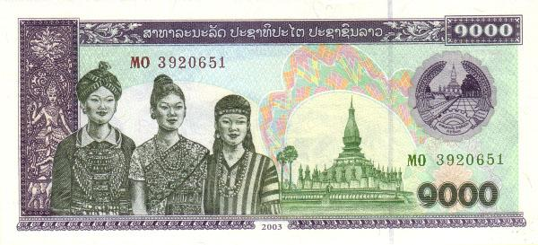

## Table of Contents

## What is the Lao Kip?

The Lao Kip is the official money used in Laos, a country in Southeast Asia. It is written as "₭" or "LAK." People in Laos use the Kip to buy things like food, clothes, and other stuff they need every day. The Kip comes in different forms, like coins and paper money. The smallest coin is 10 Kip, and the biggest paper money is 100,000 Kip.

The value of the Lao Kip can change compared to other countries' money. This means that sometimes you might need more or fewer Kip to buy things from other countries. The government of Laos is in charge of the Kip and decides how much it is worth. Tourists visiting Laos need to change their money into Kip to use it while they are there.

## What is the history of the Lao Kip?

The Lao Kip first started being used in 1952, after Laos became its own country. Before that, different kinds of money were used in the area, like the French Indochinese Piastre. The Kip was made to help Laos have its own money that people could use to buy things. At first, the Kip was worth a lot more than it is now. One Kip could buy more things back then than it can today.

Over the years, the Kip has changed a lot. There have been times when the Kip lost value very quickly, making things more expensive for people in Laos. This happened because of wars and changes in the country's economy. The government has tried to make the Kip stronger by changing how much it is worth compared to other countries' money. Today, the Kip is still used every day by people in Laos, and it comes in different sizes of coins and paper money.

## How is the Lao Kip abbreviated and symbolized?

The Lao Kip is abbreviated as "LAK." This is used when people write about the money in a short way, like in news or on the internet.

The symbol for the Lao Kip is "₭." You might see this symbol on money or when people talk about prices in Laos. It's a special sign that means Kip.

## What are the different denominations of the Lao Kip?

The Lao Kip comes in different sizes of coins and paper money. The coins start at 10 Kip and go up to 50 Kip. These are the smallest amounts of Kip you can have in coins. There used to be bigger coins like 100 Kip and 500 Kip, but they don't make them anymore.

The paper money, or banknotes, start at 1,000 Kip and go up to 100,000 Kip. The 1,000 Kip note is the smallest paper money you can get. As the numbers get bigger, the notes become worth more. The 100,000 Kip note is the biggest and most valuable one. These different sizes of Kip help people buy things of all prices in Laos.

## How does the Lao Kip compare to other currencies in Southeast Asia?

The Lao Kip is one of the currencies used in Southeast Asia, but it is not as strong as some other currencies in the region. For example, the Singapore Dollar (SGD) and the Malaysian Ringgit (MYR) are worth a lot more than the Kip. This means that if you have 1 SGD or 1 MYR, you can get a lot more Kip in exchange. The Thai Baht (THB) and the Vietnamese Dong (VND) are also stronger than the Kip, but not as strong as the SGD or MYR. This makes things more expensive for people in Laos when they want to buy things from other countries.

The value of the Lao Kip can change a lot compared to other currencies. Sometimes, the Kip can lose value quickly, which makes things from other countries even more expensive for people in Laos. This can happen because of changes in the economy or because of decisions made by the government. Other Southeast Asian currencies like the Indonesian Rupiah (IDR) and the Philippine Peso (PHP) also go through changes in value, but the Kip tends to be less stable than most of them. This means that people in Laos need to keep an eye on how much their money is worth compared to other currencies.

## What is the current exchange rate of the Lao Kip to major world currencies like the USD and EUR?

The Lao Kip's exchange rate to the US Dollar (USD) changes all the time, but as of now, 1 USD is worth about 21,000 LAK. This means if you have one US dollar, you can get around 21,000 Kip in Laos. The Kip is a lot less valuable than the USD, so you need a lot more Kip to buy things that cost dollars.

The exchange rate for the Euro (EUR) to the Lao Kip is also changing, but right now, 1 EUR is worth about 23,000 LAK. So, if you have one Euro, you can get about 23,000 Kip. Like with the USD, the Kip is much weaker than the Euro, meaning you need many more Kip to buy things that cost Euros.

## How stable is the Lao Kip and what factors influence its value?

The Lao Kip is not very stable. Its value can change a lot over time. This means that sometimes the Kip can lose value quickly, making things from other countries more expensive for people in Laos. The Kip is often seen as weaker compared to other currencies like the US Dollar or the Euro. This can make it hard for people in Laos to buy things from other places because they need a lot more Kip to get the same amount of foreign money.

Several things can affect the value of the Lao Kip. One big [factor](/wiki/factor-investing) is the economy of Laos. If the economy is doing well, the Kip might get stronger. But if there are problems, like high inflation or a lot of debt, the Kip can lose value fast. Another factor is the government's decisions. They can try to change the value of the Kip by making new rules or by changing how much Kip they have compared to other money. Also, what happens in other countries can affect the Kip. If other countries' economies are doing well or badly, it can make the Kip go up or down in value.

## What are the common uses of the Lao Kip in Laos?

People in Laos use the Lao Kip every day to buy things they need. They use it to buy food at the market, like rice, vegetables, and meat. They also use Kip to pay for things like clothes, school supplies, and medicine. When people go to restaurants or cafes, they use Kip to pay for their meals and drinks. Even small things like bus tickets or a bottle of water are bought with Kip. It's the money that helps people in Laos do their everyday shopping and take care of their needs.

The Lao Kip is also used for bigger things, like paying rent or buying a house. People use Kip to pay their bills, like electricity and water. When someone wants to start a business or buy something expensive, they need a lot of Kip. Sometimes, people save up Kip to go on trips or to buy special things they want. Even though the Kip can change in value, it's still the main money that everyone in Laos uses for all kinds of things, big and small.

## How can tourists and travelers obtain Lao Kip?

Tourists and travelers can get Lao Kip in a few ways. The easiest way is to change their money into Kip at a bank or a money changer. Many airports and big cities in Laos have places where you can do this. You can also change money at some hotels, but they might charge more. Another way to get Kip is to use an ATM. Most ATMs in Laos will give you Kip when you use your bank card. Just remember that your bank might charge you a fee for using an ATM in another country.

Sometimes, tourists can also get Kip by changing money with people they meet, like local guides or shop owners. But be careful, because the exchange rate might not be as good as at a bank or money changer. Also, some places in Laos, especially near the borders, might accept other currencies like Thai Baht or US Dollars. But it's still a good idea to have some Kip because not everywhere will take other money.

## What are the legal restrictions and regulations regarding the use and export of Lao Kip?

There are rules about taking Lao Kip out of Laos. You can take up to 100,000 Kip with you when you leave the country. If you want to take more, you need to ask for permission from the Bank of the Lao PDR. This is to help keep the Kip strong and to stop people from taking too much out of the country.

When you are in Laos, you can use Kip to buy things, but there are also rules about how you can use it. For example, you can't use Kip to buy things that are against the law, like illegal drugs. Also, if you are a business, you need to follow the rules about how you can change Kip into other money. These rules help make sure that the Kip stays useful for everyone in Laos.

## How does the Lao Kip function in digital and online transactions?

In Laos, the Lao Kip is used for digital and online transactions, but it's not as common as using cash. Some banks and businesses in Laos have started to let people use Kip for things like paying bills or buying things online. You can use online banking or mobile apps to send Kip to other people or to pay for services. But, not all places in Laos accept Kip for online payments, so you might need to use other money like US Dollars or Thai Baht for some things.

The use of Kip in digital transactions is growing, but it's still not as easy to use as in other countries. The government and banks are working to make it easier for people to use Kip online. They are making new rules and systems to help with this. But for now, many people in Laos still prefer to use cash because it's what they are used to and it works well for them.

## What are the future prospects and potential reforms for the Lao Kip?

The future of the Lao Kip depends a lot on what the government does. They might want to make the Kip stronger and more stable. One way they could do this is by making new rules about how much Kip can be changed into other money. They might also try to help the economy grow so that the Kip becomes worth more. Another thing they could do is to make it easier to use Kip for buying things online. This would help more people use Kip in new ways and make it more useful.

There could also be changes to the way Kip looks. The government might decide to make new coins or paper money with different designs or sizes. This could make it easier for people to use Kip and trust it more. But all these changes take time and need a lot of planning. The main goal is to make sure the Kip stays useful for everyone in Laos and helps the country's economy grow.

## References & Further Reading

[1]: Bergstra, J., Bardenet, R., Bengio, Y., & Kégl, B. (2011). ["Algorithms for Hyper-Parameter Optimization."](https://dl.acm.org/doi/10.5555/2986459.2986743) Advances in Neural Information Processing Systems 24.

[2]: ["Advances in Financial Machine Learning"](https://www.amazon.com/Advances-Financial-Machine-Learning-Marcos/dp/1119482089) by Marcos Lopez de Prado

[3]: ["Evidence-Based Technical Analysis: Applying the Scientific Method and Statistical Inference to Trading Signals"](https://www.amazon.com/Evidence-Based-Technical-Analysis-Scientific-Statistical/dp/0470008741) by David Aronson

[4]: ["Machine Learning for Algorithmic Trading"](https://github.com/stefan-jansen/machine-learning-for-trading) by Stefan Jansen

[5]: ["Quantitative Trading: How to Build Your Own Algorithmic Trading Business"](https://www.amazon.com/Quantitative-Trading-Build-Algorithmic-Business/dp/1119800064) by Ernest P. Chan